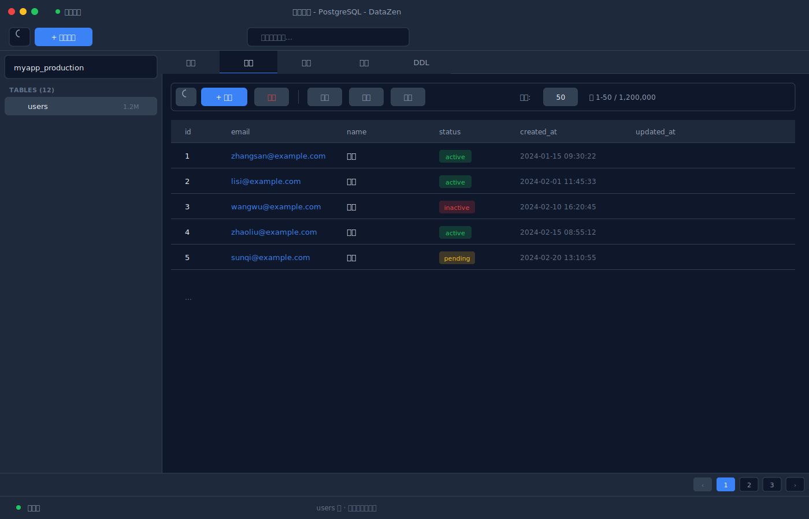
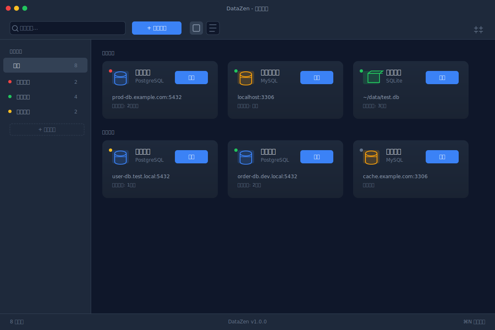
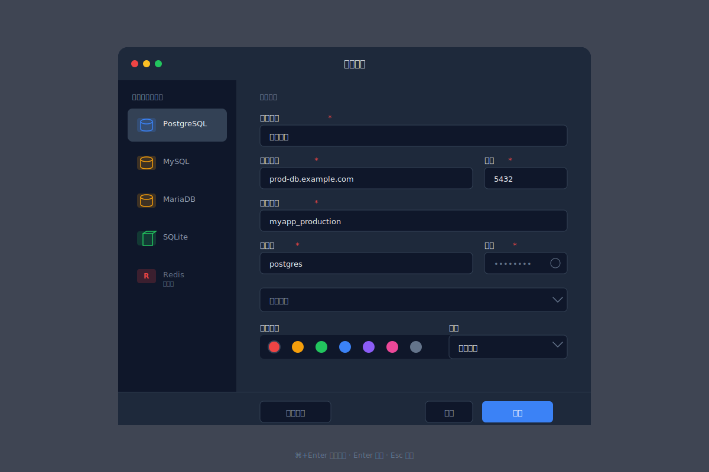
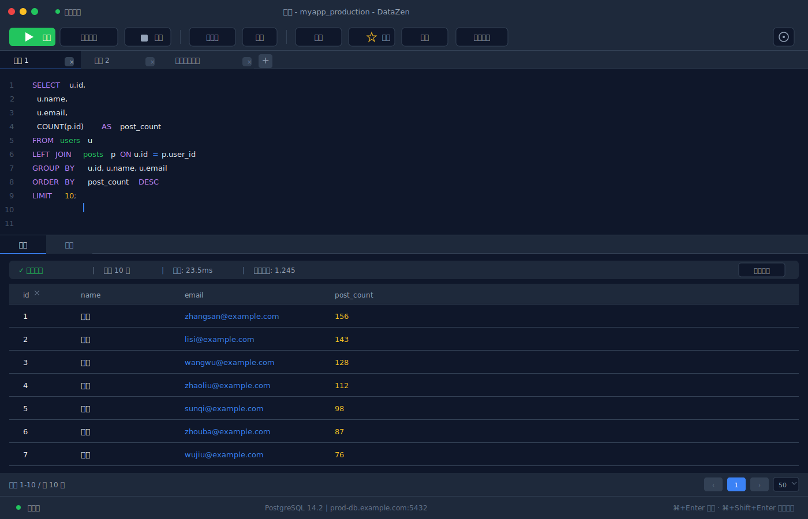
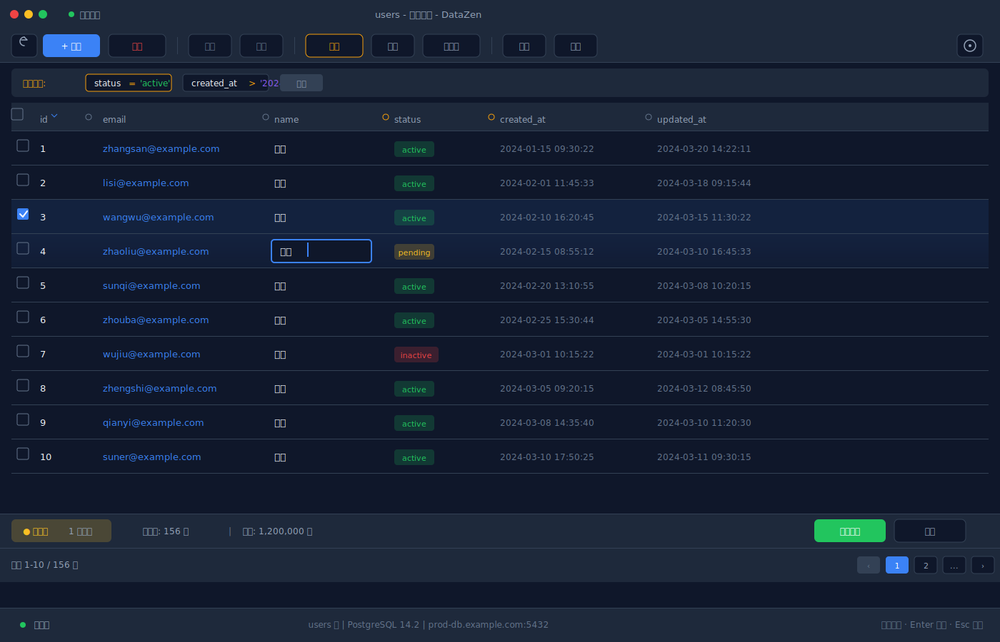

<p align="center">
  
</p>

<h1 align="center">DataZen</h1>

<p align="center">
  <strong>轻量、快速、跨平台的桌面数据库管理工具</strong>
</p>

<p align="center">
  <a href="https://github.com/flyxl/datazen/releases"></a>
  
  
</p>

<p align="center">
  
</p>

---

## 特性

- **多数据库支持** — PostgreSQL、MySQL / MariaDB、SQLite、Redis，统一管理
- **SSH 隧道** — 通过跳板机安全连接远程数据库，纯 Rust 实现，无需本地安装 SSH 客户端
- **智能 SQL 编辑器** — 语法高亮、自动补全（表名 + 列名）、多语句执行、执行计划可视化
- **数据浏览与编辑** — 虚拟滚动表格、行内编辑、排序/筛选、分页导航
- **Redis 专属视图** — 左侧 Database 列表 + 右侧 Key 浏览器，支持所有数据类型（String / Hash / List / Set / ZSet / Stream）
- **数据导入/导出** — CSV、JSON、SQL 格式互转
- **数据库备份** — 一键备份为 SQL 文件（支持 Schema-only、Data-only、Gzip 压缩）
- **数据同步** — 跨库/跨类型（PG ↔ MySQL）表结构对比 + 数据同步，支持断点续传
- **中英双语** — 界面语言自动跟随系统，支持手动切换
- **暗色主题** — 原生暗色 UI，护眼舒适

<p align="center">
  
  
</p>
<p align="center">
  
  
</p>

---

## 技术栈

| 层 | 技术 | 说明 |
|----|------|------|
| **桌面框架** | [Tauri v2](https://v2.tauri.app/) | Rust 后端 + Web 前端，安装包 < 10 MB |
| **前端** | React 18 + TypeScript + Vite | 组件化开发，HMR 热更新 |
| **状态管理** | Zustand | 轻量级，无样板代码 |
| **UI** | Tailwind CSS + Lucide Icons | 暗色主题，响应式布局 |
| **代码编辑器** | CodeMirror 6 | SQL 语法高亮 + 自动补全 |
| **虚拟化** | @tanstack/react-virtual | 十万行级数据流畅滚动 |
| **后端语言** | Rust | 内存安全，高性能异步 I/O |
| **数据库驱动** | sqlx (PG/MySQL/SQLite) + redis crate | 原生异步驱动，连接池管理 |
| **SSH** | russh | 纯 Rust SSH 客户端，无系统依赖 |
| **加密** | AES-256-GCM | 本地加密存储连接密码 |
| **E2E 测试** | WebdriverIO | 跨平台自动化测试 |
| **CI/CD** | GitHub Actions | 自动构建 macOS / Windows / Linux 安装包 |

---

## 安装

从 [Releases](https://github.com/flyxl/datazen/releases) 页面下载对应平台的安装包：

| 平台 | 格式 |
|------|------|
| macOS (Apple Silicon) | `.dmg` |
| macOS (Intel) | `.dmg` |
| Windows | `.exe` (NSIS) / `.msi` |
| Linux | `.deb` / `.rpm` / `.AppImage` |

---

## 开发

### 前置条件

- [Node.js](https://nodejs.org/) ≥ 20
- [pnpm](https://pnpm.io/) ≥ 9
- [Rust](https://rustup.rs/) ≥ 1.77
- Tauri v2 系统依赖：[参考文档](https://v2.tauri.app/start/prerequisites/)

### 启动开发模式

```bash
pnpm install
pnpm tauri dev
```

### 构建发行版

```bash
pnpm tauri build
```

### 运行 E2E 测试

```bash
# 先配置测试环境变量
cp e2e/.env.example e2e/.env
# 编辑 e2e/.env 填入数据库连接信息

pnpm e2e
```

---

## 添加新的数据库类型

DataZen 采用**注册表驱动**的架构，新增数据库类型只需修改少量文件：

### 1. 后端：实现 `DatabaseDriver` trait

在 `src-tauri/src/db/` 下新建驱动文件，实现 `DatabaseDriver` trait：

```rust
#[async_trait]
impl DatabaseDriver for MyNewDriver {
    async fn connect(&self, config: &ConnectionConfig) -> Result<ConnectionHandle, DriverError>;
    async fn disconnect(&self, handle: &ConnectionHandle) -> Result<(), DriverError>;
    async fn get_databases(&self, handle: &ConnectionHandle) -> Result<Vec<String>, DriverError>;
    async fn get_tables(&self, handle: &ConnectionHandle, database: &str) -> Result<Vec<TableInfo>, DriverError>;
    // ... 其他方法有默认实现，按需覆盖
}
```

在 `src-tauri/src/db/registry.rs` 的 `init_drivers()` 中注册新驱动。

### 2. 前端：注册数据库类型元数据

在 `src/lib/databaseTypes.ts` 的 `DB_REGISTRY` 中添加一条配置：

```typescript
mynewdb: {
  label: 'MyNewDB',
  shortLabel: 'ND',
  iconBg: 'bg-purple-500',
  iconColor: 'text-purple-500',
  defaultPort: 9999,
  defaultHost: 'localhost',
  defaultUser: 'admin',
  quoteChar: '"',
  connectionMode: 'server',
  supportsSSH: true,
  supportsBackup: false,
  supportsTables: true,
  isKeyValue: false,
  supportsSQL: true,
  category: 'sql',
},
```

### 3. 类型声明

在 `src/types/index.ts` 的 `DatabaseType` 联合类型中添加新类型名称。

### 4. （可选）自定义连接窗口

如果新数据库不是传统 SQL 类型（如 KV 或文档数据库），可以在 `src/windows/connection/` 下创建专属视图组件，并在 `ConnectionWindow.tsx` 中通过 `DB_REGISTRY` 的 `isKeyValue` / `category` 字段路由到对应视图。

---

## 项目结构

```
datazen/
├── src/                        # React 前端
│   ├── components/             # 通用 UI 组件
│   ├── windows/                # 各窗口页面
│   │   ├── main/               # 主窗口（连接列表）
│   │   ├── connection/         # 连接窗口（数据浏览）
│   │   └── ...
│   ├── stores/                 # Zustand 状态管理
│   ├── commands/               # Tauri IPC 命令封装
│   ├── lib/                    # 工具函数 + DB_REGISTRY
│   ├── locales/                # 国际化（中/英）
│   └── types/                  # TypeScript 类型定义
├── src-tauri/                  # Rust 后端
│   ├── src/
│   │   ├── db/                 # 数据库驱动（PG/MySQL/SQLite/Redis）
│   │   ├── services/           # 连接管理、查询执行
│   │   ├── commands/           # Tauri 命令处理
│   │   └── store/              # 本地持久化存储
│   └── icons/                  # 应用图标
├── e2e/                        # E2E 测试
└── .github/workflows/          # CI/CD
```

---

## License

[MIT](LICENSE)
