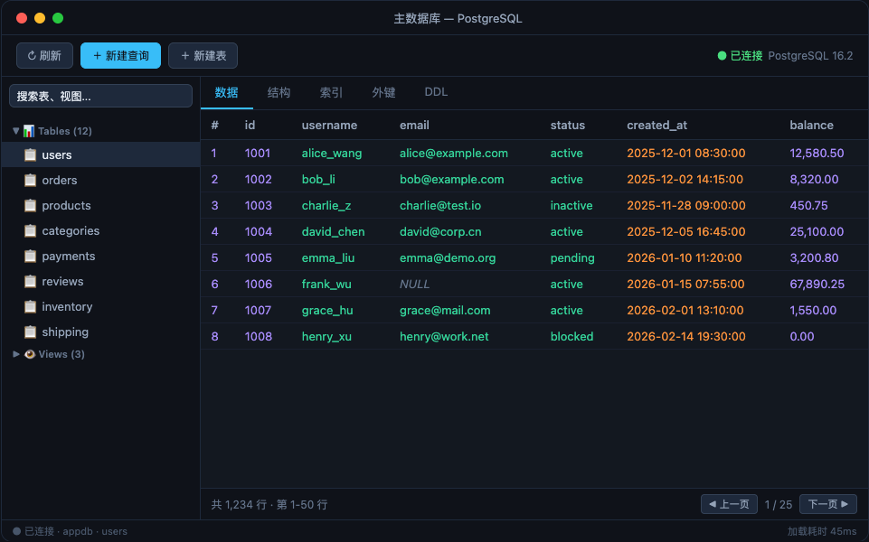
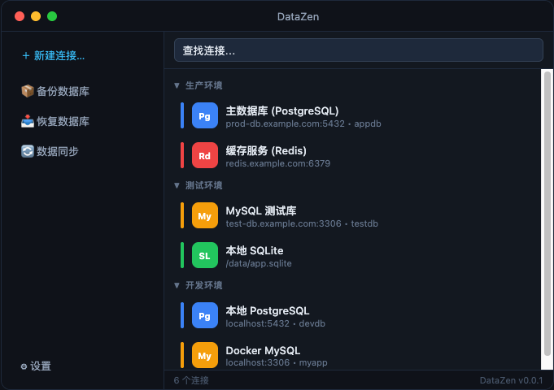
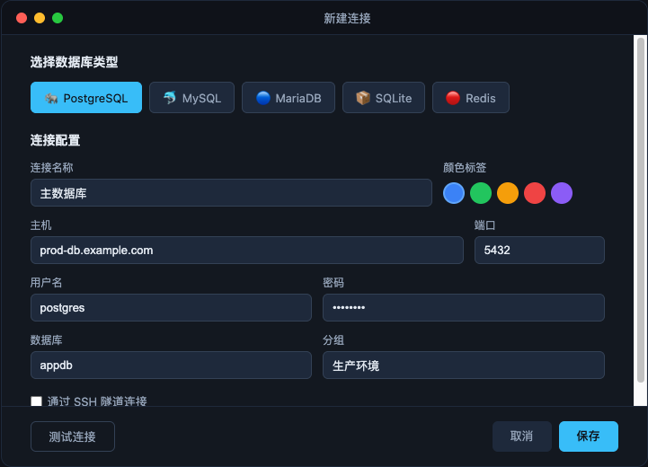
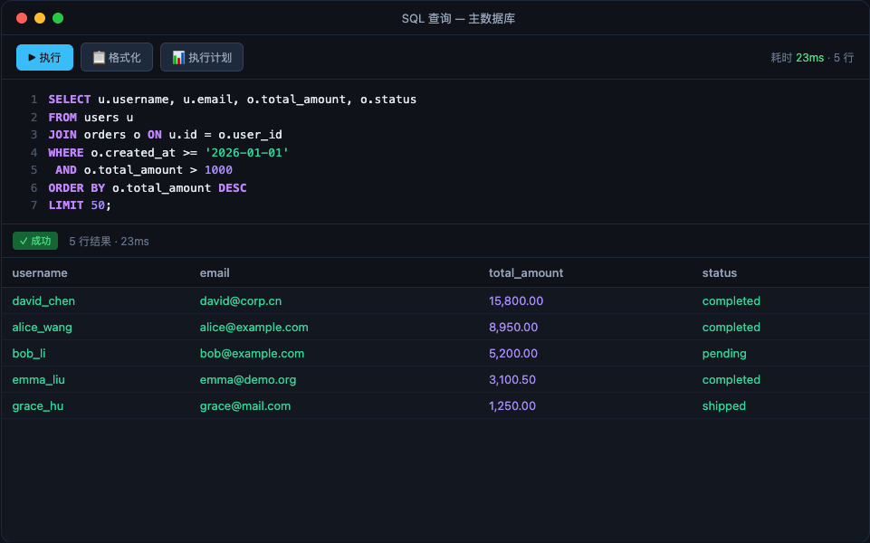
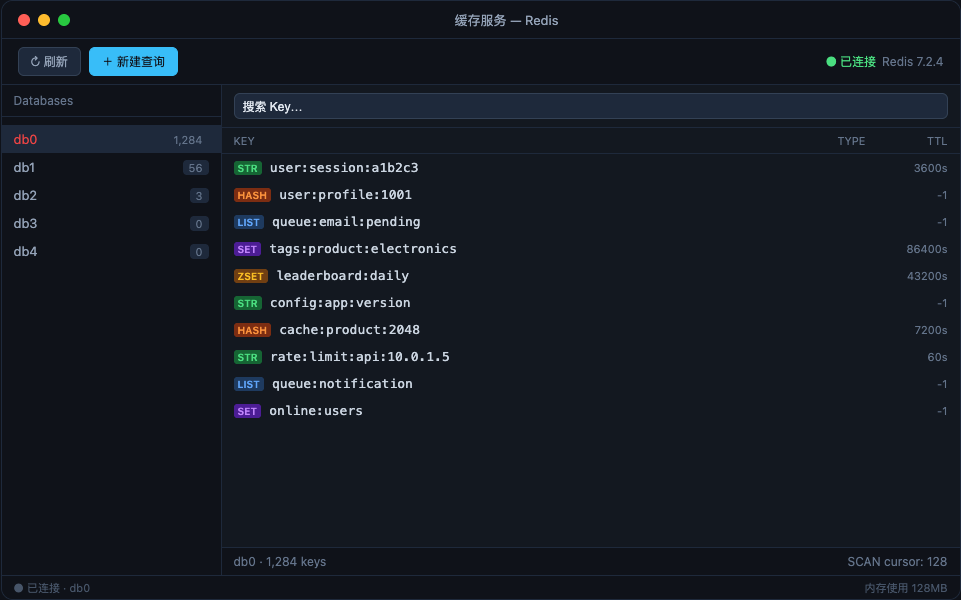

<p align="center">
  
</p>

<h1 align="center">DataZen</h1>

<p align="center">
  <strong>轻量、快速、跨平台的桌面数据库管理工具</strong><br />
  <strong>Lightweight, fast, cross-platform desktop database client</strong>
</p>

<p align="center">
  <a href="https://github.com/flyxl/datazen/releases"></a>
  
  
</p>

<p align="center">
  <a href="https://github.com/flyxl/datazen/releases"><strong>Download</strong></a>
  ·
  <a href="https://flyxl.github.io/datazen/">Website</a>
  ·
  <a href="mailto:wuxiaolongklws@gmail.com">Contact</a>
</p>

<p align="center">
  
</p>

<p align="center">
  
</p>

[English](#features) · [中文](#特性) · [Install](#install) · [macOS note](#macos-first-launch) · [Contact](#contact--feedback)

---

## About

**DataZen** is a free, [MIT-licensed](LICENSE) database GUI for developers. Built with **Tauri + Rust** (&lt;10 MB installer), it manages **PostgreSQL, MySQL, SQLite, and Redis** in one app—with multi-window workflow, built-in **SSH tunnels**, SQL editor with autocomplete, backups, and PG↔MySQL sync. Credentials stay on your machine (AES-256-GCM); no cloud account required. UI supports **English and Chinese**.

**DataZen** 是一款免费开源（MIT）的桌面数据库客户端，基于 **Tauri + Rust** 构建，安装包小于 10 MB。在一个应用中管理 **PostgreSQL、MySQL、SQLite、Redis**，支持多窗口、内置 **SSH 隧道**、SQL 自动补全、备份与 PG↔MySQL 同步。连接密码本地加密存储，无需云端账号，界面支持**中英文**。

---

<a id="features"></a>
## Features

- **Multi-database** — PostgreSQL, MySQL / MariaDB, SQLite, Redis in one app
- **SSH tunneling** — Connect via bastion; pure Rust, no local `ssh` client required
- **SQL editor** — Syntax highlighting, table/column autocomplete, multi-statement runs, EXPLAIN viz
- **Data browser** — Virtual scrolling, inline edit, sort/filter, pagination
- **Redis view** — Database list + key browser (String / Hash / List / Set / ZSet / Stream)
- **Import / export** — CSV, JSON, SQL
- **Backup** — One-click SQL dump (schema-only, data-only, gzip)
- **Cross-DB sync** — PG ↔ MySQL schema compare and data sync with resume
- **Bilingual UI** — English & Chinese
- **Dark theme** — Native dark UI

<a id="特性"></a>
## 特性

- **多数据库支持** — PostgreSQL、MySQL / MariaDB、SQLite、Redis，统一管理
- **SSH 隧道** — 通过跳板机安全连接远程数据库，纯 Rust 实现，无需本地安装 SSH 客户端
- **智能 SQL 编辑器** — 语法高亮、自动补全（表名 + 列名）、多语句执行、执行计划可视化
- **数据浏览与编辑** — 虚拟滚动表格、行内编辑、排序/筛选、分页导航
- **Redis 专属视图** — 左侧 Database 列表 + 右侧 Key 浏览器，支持所有数据类型
- **数据导入/导出** — CSV、JSON、SQL 格式互转
- **数据库备份** — 一键备份为 SQL 文件（Schema / Data / Gzip）
- **数据同步** — PG ↔ MySQL 表结构对比与数据同步，支持断点续传
- **中英双语** — 界面语言自动跟随系统，支持手动切换
- **暗色主题** — 原生暗色 UI，护眼舒适

<p align="center">
  
  
</p>
<p align="center">
  
  
</p>

---

## 技术栈

| 层 | 技术 | 说明 |
|----|------|------|
| **桌面框架** | [Tauri v2](https://v2.tauri.app/) | Rust 后端 + Web 前端，安装包 < 10 MB |
| **前端** | React 18 + TypeScript + Vite | 组件化开发，HMR 热更新 |
| **状态管理** | Zustand | 轻量级，无样板代码 |
| **UI** | Tailwind CSS + Lucide Icons | 暗色主题，响应式布局 |
| **代码编辑器** | CodeMirror 6 | SQL 语法高亮 + 自动补全 |
| **虚拟化** | @tanstack/react-virtual | 十万行级数据流畅滚动 |
| **后端语言** | Rust | 内存安全，高性能异步 I/O |
| **数据库驱动** | sqlx (PG/MySQL/SQLite) + redis crate | 原生异步驱动，连接池管理 |
| **SSH** | russh | 纯 Rust SSH 客户端，无系统依赖 |
| **加密** | AES-256-GCM | 本地加密存储连接密码 |
| **E2E 测试** | WebdriverIO | 跨平台自动化测试 |
| **CI/CD** | GitHub Actions | 自动构建 macOS / Windows / Linux 安装包 |

---

<a id="install"></a>
## Install / 安装

Download from [Releases](https://github.com/flyxl/datazen/releases) · 从 [Releases](https://github.com/flyxl/datazen/releases) 下载：

| 平台 | 格式 |
|------|------|
| macOS (Apple Silicon) | `.dmg` (文件名含 `macos-arm64`) |
| macOS (Intel) | `.dmg` (文件名含 `macos-x64`) |
| Windows | `.exe` / `.msi` (文件名含 `windows-x64`) |
| Linux | `.deb` / `.rpm` / `.AppImage` (文件名含 `linux-x64`) |

<a id="macos-first-launch"></a>
### macOS first launch / 首次打开

The app is **not Apple-notarized** (typical for free OSS). You may see “damaged” or “cannot verify” on first open.

应用**未经 Apple 公证**（开源项目常见情况），首次打开可能提示「已损坏」或「无法验证」。

**Fix / 解决方法** — run after installing:

```bash
xattr -cr /Applications/DataZen.app
```

Then open normally. Share this step in reviews if macOS blocks launch — it is expected, not corruption.

---

<a id="contact--feedback"></a>
## Contact & feedback / 联系与反馈

| Channel | Link |
|---------|------|
| **Email** | [wuxiaolongklws@gmail.com](mailto:wuxiaolongklws@gmail.com) |
| **Issues** | [github.com/flyxl/datazen/issues](https://github.com/flyxl/datazen/issues) |
| **Releases** | [github.com/flyxl/datazen/releases](https://github.com/flyxl/datazen/releases) |

We typically respond to issues and email within a few business days. Bug reports welcome via the issue templates (version + OS required).

Issue 与邮件反馈一般在几个工作日内回复；提交 Bug 请使用 Issue 模板并注明版本与系统。

---

## 开发

### 前置条件

- [Node.js](https://nodejs.org/) ≥ 20
- [pnpm](https://pnpm.io/) ≥ 9
- [Rust](https://rustup.rs/) ≥ 1.77
- Tauri v2 系统依赖：[参考文档](https://v2.tauri.app/start/prerequisites/)

### 启动开发模式

```bash
pnpm install
pnpm tauri dev
```

### 构建发行版

```bash
pnpm tauri build
```

### 运行 E2E 测试

```bash
# 先配置测试环境变量
cp e2e/.env.example e2e/.env
# 编辑 e2e/.env 填入数据库连接信息

pnpm e2e
```

---

## 添加新的数据库类型

DataZen 采用**注册表驱动 + 策略模式**的架构。设计原则：**if-else 只出现在路由/选择层**（选哪个组件、哪个策略），业务逻辑放在独立模块中。

### 后端

1. 在 `src-tauri/src/db/` 实现驱动：
   - **SQL 类**：实现 `DatabaseDriver` trait（`connect`、`query`、`get_tables` 等）
   - **KV 类**：额外实现 `KeyValueDriver` trait（`scan_keys_with_info`、`get_key_detail`）
2. 在 `src-tauri/src/db/registry.rs` 的 `init_drivers()` 注册；KV 驱动需在 `get_kv_driver()` 中映射
3. 按需覆盖 trait 默认方法：`skip_count_query()`、`format_sql_literal()`、`build_update_sql()`
4. 在 `DatabaseType` 枚举（Rust）添加变体

**Commands 层**按领域拆分（`commands/connection.rs`、`schema.rs`、`query.rs`、`kv.rs` 等），新增 IPC 命令放入对应子模块并在 `commands/mod.rs` re-export。

### 前端

1. 在 `src/types/index.ts` 的 `DatabaseType` 联合类型添加新名称
2. 在 `src/lib/databaseTypes.ts` 的 `DB_REGISTRY` 添加元数据条目：

```typescript
mynewdb: {
  label: 'MyNewDB',
  // ... icon、port、quoteChar 等
  connectionView: 'sql',           // 'sql' | 'keyvalue' | 'document'
  connectionForm: 'standard',      // 'standard' | 'kiwi' | 'file' | 'index'
  sqlDialect: 'postgresql',        // DDL/索引/备份方言（可选）
  hasMultiDatabase: false,         // 多库树（如 Kiwi）
  defaultPageSize: undefined,      // 固定分页（如 Kiwi 1000）
  supportsBackup: true,
  category: 'sql',
},
```

3. **（可选）连接表单**：在 `src/components/connection/` 添加 `*ConnectionFields.tsx`，在 `ConnectionFormBody.tsx` 按 `connectionForm` 路由
4. **（可选）连接视图**：在 `src/windows/connection/` 创建视图组件，注册到 `src/lib/connectionViews/index.ts` 的 `CONNECTION_VIEWS`
5. **（可选）Schema 树变体**：多库场景在 `schema-tree/` 添加变体组件，由 `SchemaTree.tsx` 按 `hasMultiDatabase` 路由
6. **（可选）SQL 方言**：在 `src/lib/sqlDialects/` 添加方言策略（DDL 查询、索引 SQL、备份选项）

### 验收清单

- [ ] 无 `databaseType === 'xxx'` 硬编码（行为差异由 `DB_REGISTRY` 标志驱动）
- [ ] 视图/表单组件内部无方言 if-else（使用 `sqlDialects/` 模块）
- [ ] `npx vitest run` + `cargo test` 通过
- [ ] 相关 e2e spec 覆盖新型连接的基本流程

---

## 项目结构

```
datazen/
├── src/                        # React 前端
│   ├── components/             # 通用 UI 组件
│   ├── windows/                # 各窗口页面
│   │   ├── main/               # 主窗口（连接列表）
│   │   ├── connection/         # 连接窗口（数据浏览）
│   │   └── ...
│   ├── stores/                 # Zustand 状态管理
│   ├── commands/               # Tauri IPC 命令封装
│   ├── lib/                    # DB_REGISTRY, sqlDialects, connectionViews
│   ├── components/connection/  # 共享连接表单（useConnectionForm + Fields）
│   ├── locales/                # 国际化（中/英）
│   └── types/                  # TypeScript 类型定义
├── src-tauri/                  # Rust 后端
│   ├── src/
│   │   ├── db/                 # 数据库驱动（PG/MySQL/SQLite/Redis）
│   │   ├── services/           # 连接管理、查询执行
│   │   ├── commands/           # Tauri IPC（按领域拆分子模块）
│   │   │   ├── connection.rs, schema.rs, query.rs, kv.rs, ...
│   │   └── store/              # 本地持久化存储
│   └── icons/                  # 应用图标
├── e2e/                        # E2E 测试
└── .github/workflows/          # CI/CD
```

---

## Marketing assets / 推广素材

Screenshots, OG image, Product Hunt copy, and launch posts: [`docs/marketing/`](docs/marketing/).

---

## License

[MIT](LICENSE)
