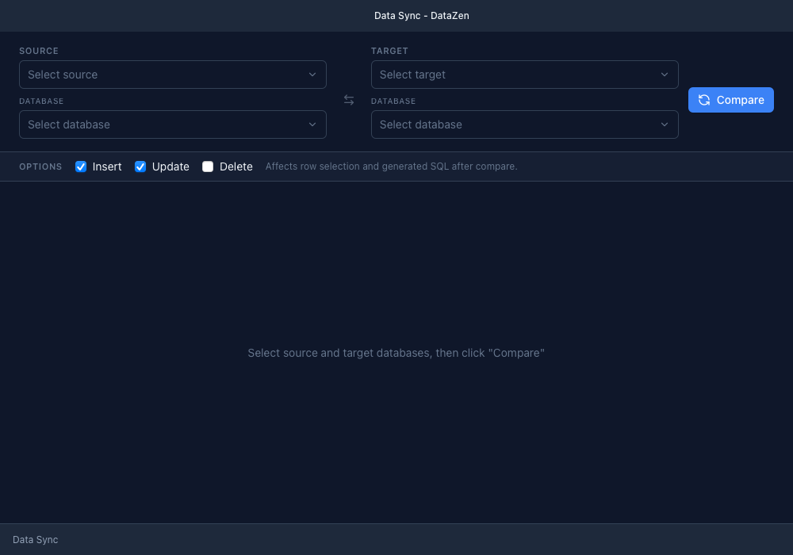

<div align="center">


# DataZen

### The database workspace for developers and AI agents

Query · Diagnose · Visualize · Migrate · Automate · MCP

[](https://github.com/flyxl/datazen/releases)
[](LICENSE)
[](#installation)

[Download](https://flyxl.github.io/datazen/download.html) · [Website](https://flyxl.github.io/datazen/) · [中文](README.zh-CN.md) · [Contributing](CONTRIBUTING.md)

</div>


## Why DataZen?

DataZen is a desktop database workspace built with **Tauri + Rust**. It keeps the everyday database loop in one place: connect, understand, change, and automate data.

- **Query** — write SQL, browse schemas, edit data, inspect ER diagrams, and work with Redis keys.
- **Diagnose** — generate SQL from natural language, explain errors, inspect EXPLAIN plans, and use safe read-only connections.
- **Visualize** — turn results into charts, export them, and build saved Ops Dashboards with refresh, history, and alerts.
- **Move data** — back up databases, sync same-family databases, transfer between different systems, or review and deploy schema changes.
- **Automate** — compose queries, AI steps, conditions, and loops in YAML Workflows; run the same capabilities from the UI, MCP, or headless mode.
- **Privacy-aware** — AI requests go only to the provider you configure.
- **Open source and extensible** — GPLv3 application, community Driver API, sandboxed Workspace Apps, and host extension points.

## Get started in three minutes

1. [Download DataZen](https://flyxl.github.io/datazen/download.html) — get the installer matched to your platform.
2. Open a local SQLite file or create a PostgreSQL, MySQL/MariaDB, or Redis connection.
3. Browse the schema, write a query or ask AI to generate one, then run it and switch the result to a chart.

No account is required. AI is optional: regular database browsing and querying work without an API key.

## One workspace, four database jobs

| Job | What DataZen brings together |
|---|---|
| **Understand** | SQL editor, schema browser, ER diagrams, query history, charts, and Redis tools |
| **Fix** | AI diagnosis, EXPLAIN analysis, read-only connections, SQL safety gates, and transaction-aware editing |
| **Move** | Backup, Data Sync, Data Transfer, and Schema Diff with reviewable plans |
| **Automate** | YAML Workflows, Ops Dashboards, MCP Server/Client, and headless `--mcp-stdio` mode |

## A database workspace built around real workflows

### SQL and data exploration

Write and run SQL in a modern editor, inspect results, browse tables, and move between query results and visualizations without leaving DataZen.


### AI-assisted database work

DataZen puts AI next to the database instead of making you copy schema and errors into another application.


**Natural language → SQL**

Describe what you need and DataZen uses the current database schema as context to generate executable SQL. Generated SQL can be executed immediately or inserted into the editor for further editing.


**SQL error diagnosis**

When a query fails, AI can combine the database error and schema context to explain the problem and propose corrected SQL.


**EXPLAIN analysis**

Visualize execution plans and use AI to identify bottlenecks, scan strategies, and optimization opportunities.


**Database-aware AI Chat**

The AI sidebar can work with the current connection's schema and turn SQL from the conversation into editor-ready code.

Supported AI integrations include OpenAI, Anthropic, DeepSeek, and compatible custom endpoints.

## Turn query results into charts

You should not need to export data to Excel just to understand it. DataZen can infer useful chart configurations from query results and switch between table and chart views.


Supported visualizations include line, bar, pie, scatter, and area charts, with aggregation, grouping, and PNG/SVG export.


## Move and monitor data safely

DataZen keeps data operations explicit and reviewable instead of hiding them behind a one-click promise.

- **Data Sync** compares and synchronizes rows between same-family databases when structure and primary keys match.
- **Data Transfer** moves structure and/or data between heterogeneous databases through a mapping and preview workflow.
- **Schema Diff** compares database structure and produces a controlled DDL deployment plan.
- **Ops Dashboards** refresh saved queries, retain run history, and surface threshold alerts.



## Automate database work with Workflows

DataZen Workflows describe reusable database operations in YAML. A workflow can combine queries, AI steps, conditions, and loops, with each step connected to the database it needs.


For example, one workflow can query orders from PostgreSQL, fetch logistics from MySQL, and let AI summarize the combined result.


Workflows can be started from the UI, the AI sidebar, MCP, or generated with AI.


## MCP: connect DataZen to the AI tool ecosystem

DataZen works both as an **MCP Server** and an **MCP Client**.

### MCP Server

Expose database operations, schema inspection, EXPLAIN, and workflows to external AI agents. DataZen also provides a headless stdio mode for automation and agent integrations.

### MCP Client

Connect external MCP servers to DataZen AI Chat and bring additional tools and context into database conversations.

DataZen is more than a GUI: it can also serve as a database tool inside larger AI-assisted development workflows.

## Extensible database drivers

DataZen separates the application from database-specific implementation through the **DataZen Driver API**.

```text
                         DataZen
                            │
              ┌─────────────┴─────────────┐
              │       DataZen Core        │
              │  UI · Query · AI · MCP   │
              └─────────────┬─────────────┘
                            │
                    DataZen Driver API
                            │
          ┌─────────────────┼─────────────────┐
          │                 │                 │
       PostgreSQL         MySQL          External drivers
                                           │
                              ┌────────────┼────────────┐
                              │            │            │
                           MongoDB      ClickHouse    OLAP...
```

Drivers are **compiled into DataZen** rather than loaded through an unstable Rust dynamic-library ABI. This allows a driver to provide both Rust database functionality and frontend UI while still remaining in its own repository.

### Independent driver development

A driver can be developed in an independent repository next to a local DataZen checkout:

```text
workspace/
├── datazen/
└── datazen-driver-mydb/
```

During development, DataZen's driver registry can point to the local repository with `source: "path"`. The DataZen application is then built with the selected driver, giving plugin developers a real host for both backend and frontend debugging.

The Driver API itself is maintained in `packages/driver-api` and published as the MIT-licensed `datazen-driver-api` crate. Independent drivers normally consume the published crate and do not need to clone DataZen just to obtain the API.

See the complete guides:

- **[Independent Driver Development — English](docs/development/independent-driver-development.en.md)**
- **[独立驱动开发指南 — 中文](docs/development/independent-driver-development.zh-CN.md)**
- **[Driver API crate README](packages/driver-api/README.md)**
- **[Driver API dependency boundary](docs/development/driver-api-dependency-boundary.md)**
- **[datazen-driver-api on crates.io](https://crates.io/crates/datazen-driver-api)**

## Supported databases

DataZen ships with a small default set and can be built with additional drivers.

| Database | Default / optional | Notes |
|---|---|---|
| PostgreSQL | Default | SQL, schema browser, EXPLAIN, AI context |
| MySQL / MariaDB | Default | SQL, schema browser, EXPLAIN |
| SQLite | Default | Embedded database workflow |
| Redis | Default | Key browser, command console, monitoring, Pub/Sub |
| MongoDB | Optional | Native driver |
| ClickHouse | Optional | Native driver |
| DuckDB | Optional | Native driver |
| SQL Server | Optional | Native driver |
| Presto / Trino and other OLAP engines | Plugin | External driver architecture |

The exact driver set is controlled at build time, so a distribution does not have to ship every database engine.

**More external drivers are being planned.** We are exploring support for database drivers implemented and integrated in languages such as Go, C++, Rust, and Java.

## Installation

Get the latest platform-matched installer from **[Download DataZen](https://flyxl.github.io/datazen/download.html)**. You can also browse **[GitHub Releases](https://github.com/flyxl/datazen/releases)** directly.

| Platform | Package |
|---|---|
| macOS Apple Silicon | `.dmg` |
| macOS Intel | `.dmg` |
| Windows | NSIS `.exe` / portable `.zip` |
| Linux x86_64 | `.deb` / `.rpm` / `.AppImage` |

DataZen is free and does not require an account.

**macOS Gatekeeper:** If the app is blocked as damaged or from an unidentified developer, clear quarantine: `xattr -cr /Applications/DataZen.app`, or right-click → Open once. See [packaging.md](docs/development/packaging.md) for details and the notarization checklist.

Optional drivers (MongoDB, ClickHouse, DuckDB, SQL Server, …) are compile-time selections — see [optional-drivers.md](docs/development/optional-drivers.md).

## Build from source

### Prerequisites

- Node.js >= 20
- pnpm >= 9
- Rust >= 1.77
- Tauri v2 system dependencies

```bash
pnpm install
pnpm tauri dev
```

Build only the drivers you need:

```bash
# Default driver set
pnpm tauri:build

# All supported path drivers
DATAZEN_DRIVERS=all pnpm tauri:build

# Custom driver set
DATAZEN_DRIVERS=postgres,mongodb pnpm tauri:build
```

## Security and privacy

DataZen is designed around database access:

- AI requests are sent to the provider configured by the user.
- SSH connections can be established directly from the application.

Always review the privacy and security policies of the AI provider and endpoint you configure.

## Documentation

- [Project website](https://flyxl.github.io/datazen/) · [User Manual (EN)](https://flyxl.github.io/datazen/manual.html) · [使用手册 (ZH)](https://flyxl.github.io/datazen/zh/manual.html)
- [Feature guides](docs/features/) · [Architecture docs](docs/architecture/README.md) · [Development & release docs](docs/development/)
- [Independent Driver Development](docs/development/independent-driver-development.en.md)
- [Chinese Driver Development Guide](docs/development/independent-driver-development.zh-CN.md)
- [Driver API crate](packages/driver-api/README.md)
- [Driver API dependency boundary](docs/development/driver-api-dependency-boundary.md)
- [datazen-driver-api on crates.io](https://crates.io/crates/datazen-driver-api)
- [Workflow Guide](docs/features/workflow-guide.en.md)
- [Contributing](CONTRIBUTING.md)

## Contributing

DataZen welcomes bug reports, feature requests, database drivers, documentation improvements, and code contributions.

Please read [CONTRIBUTING.md](CONTRIBUTING.md) before opening a pull request. Driver work should generally be developed in an independent driver repository and integrated through the DataZen driver registry.

## License

DataZen is licensed under the **GNU General Public License v3.0**. The `datazen-driver-api` crate under `packages/driver-api` is separately licensed under the **MIT License**. See [LICENSE](LICENSE) and [packages/driver-api/LICENSE-MIT](packages/driver-api/LICENSE-MIT).

<div align="center">

**DataZen — let AI handle the database work, and turn data into insight.**

</div>
