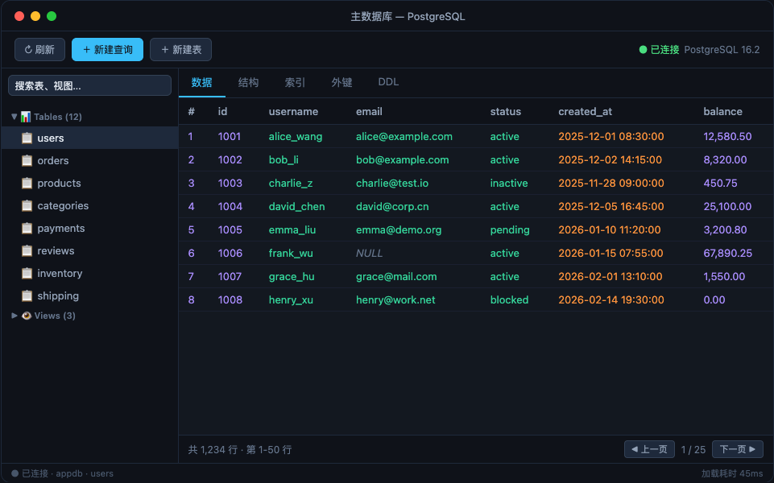
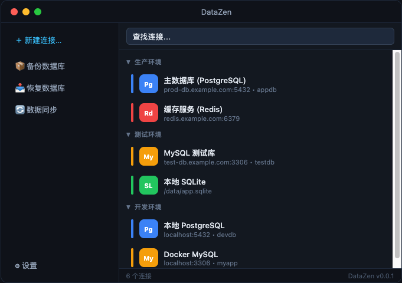
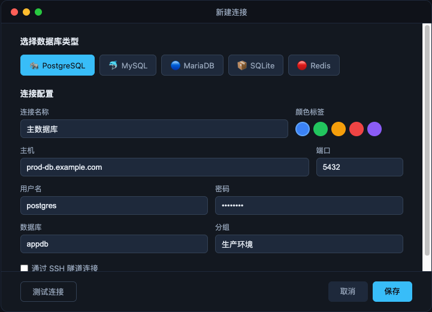
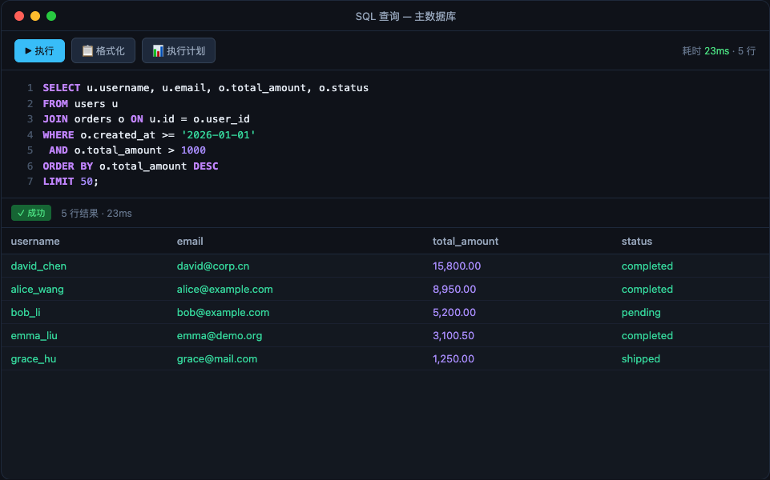
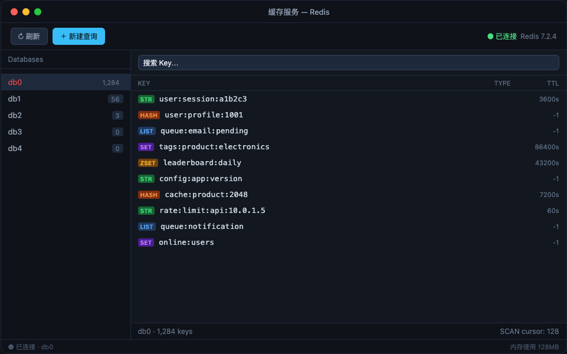

<p align="center">
  
</p>

<h1 align="center">DataZen</h1>

<p align="center">
  <strong>轻量、快速、跨平台的桌面数据库管理工具</strong><br />
  <strong>Lightweight, fast, cross-platform desktop database client</strong>
</p>

<p align="center">
  <a href="https://github.com/flyxl/datazen/releases"></a>
  
  
</p>

<p align="center">
  <a href="https://github.com/flyxl/datazen/releases"><strong>Download</strong></a>
  ·
  <a href="https://flyxl.github.io/datazen/">Website</a>
  ·
  <a href="CONTRIBUTING.md">Contributing</a>
  ·
  <a href="mailto:wuxiaolongklws@gmail.com">Contact</a>
</p>

<p align="center">
  
</p>

<p align="center">
  
</p>

[English](#features) · [中文](#特性) · [Install](#install) · [macOS note](#macos-first-launch) · [Linux note](#linux-install) · [Contributing](#contributing) · [Contact](#contact--feedback)

---

## About

**DataZen** is a free, [GPLv3-licensed](LICENSE) database GUI for developers. Built with **Tauri + Rust**, it ships **Basic** (PostgreSQL / MySQL / SQLite / Redis — small default) and **All** (extra native engines such as MongoDB, SQL Server, ClickHouse, DuckDB). Compile from source with only the drivers you need (`DATAZEN_DRIVERS=…`) — you never pay for bloat you will not use. Multi-window workflow, **SSH tunnels**, SQL editor, backups, and PG↔MySQL sync included. Credentials stay on your machine (AES-256-GCM).

**DataZen** 是一款免费开源（GPLv3）的桌面数据库客户端，基于 **Tauri + Rust**。发布提供 **Basic**（PostgreSQL / MySQL / SQLite / Redis，默认小包）与 **All**（额外原生引擎：MongoDB、SQL Server、ClickHouse、DuckDB 等）。源码构建可用 `DATAZEN_DRIVERS=…` **只编译需要的类型**，不为大而全买单。支持多窗口、**SSH 隧道**、SQL 编辑器、备份与 PG↔MySQL 同步；连接密码本地加密存储。

---

<a id="features"></a>
## Features

- **Pay only for what you use** — download **Basic** or **All**; or compile a custom driver set with `DATAZEN_DRIVERS`
- **Multi-database** — Basic: PostgreSQL, MySQL / MariaDB, SQLite, Redis; All adds MongoDB, SQL Server, ClickHouse, DuckDB, and more native engines
- **SSH tunneling** — Connect via bastion; pure Rust, no local `ssh` client required
- **SQL editor** — Syntax highlighting, table/column autocomplete, multi-statement runs, EXPLAIN viz
- **Data browser** — Virtual scrolling, inline edit, sort/filter, pagination
- **Redis deep ops** — Key browser (all types + batch + Size + gated Flush); command console; Monitor (Info / Memory / Slowlog / Stream); Standalone / Cluster / Sentinel + mTLS; Pub/Sub; RedisJSON (module probe); DUMP/RESTORE import/export
- **Import / export** — CSV, JSON, SQL, Markdown, XLSX
- **Backup** — One-click SQL dump (schema-only, data-only, gzip)
- **Cross-DB sync** — PG ↔ MySQL schema compare and data sync with resume
- **AI + MCP** — Multi-provider AI chat; MCP Server (`datazen --mcp`) with permission tiers + connection allowlist; MCP Client for external tools
- **YAML Workflows** — Cross-database automations (query / AI / condition / foreach), also exposed via MCP
- **Charts** — Query-result charts with smart recommendations
- **Bilingual UI** — 10 locales
- **Appearance** — Light / dark / system mode; install local **theme packs** (ZIP) from Settings for custom colors, fonts, and icons

<a id="特性"></a>
## 特性

- **按需选用，不为大而全买单** — 下载 **Basic** 或 **All**；源码可用 `DATAZEN_DRIVERS` 只编进需要的驱动
- **多数据库支持** — Basic：PostgreSQL、MySQL / MariaDB、SQLite、Redis；All 另含 MongoDB、SQL Server、ClickHouse、DuckDB 等原生引擎
- **SSH 隧道** — 通过跳板机安全连接远程数据库，纯 Rust 实现，无需本地安装 SSH 客户端
- **智能 SQL 编辑器** — 语法高亮、自动补全（表名 + 列名）、多语句执行、执行计划可视化
- **数据浏览与编辑** — 虚拟滚动表格、行内编辑、排序/筛选、分页导航
- **Redis 深度运维** — Key 浏览（全类型 + 批量 + Size + 门控 Flush）；命令台；Monitor（Info / Memory / Slowlog / Stream）；Standalone / Cluster / Sentinel + mTLS；Pub/Sub；RedisJSON（模块探测）；DUMP/RESTORE 导入导出
- **数据导入/导出** — CSV、JSON、SQL、Markdown、XLSX
- **数据库备份** — 一键备份为 SQL 文件（Schema / Data / Gzip）
- **数据同步** — PG ↔ MySQL 表结构对比与数据同步，支持断点续传
- **AI + MCP** — 多 Provider AI；MCP Server（`datazen --mcp`，权限分档 + 连接白名单）；MCP Client 接入外部工具
- **YAML Workflow** — 跨库自动化（query / AI / condition / foreach），并可通过 MCP 调用
- **图表** — 查询结果智能推荐图表
- **多语言** — 10 语系
- **外观主题** — 浅色 / 深色 / 跟随系统；可在设置中安装本地**主题包**（ZIP），定制配色、字体与图标

<p align="center">
  
  
</p>
<p align="center">
  
  
</p>

---

## 技术栈

| 层 | 技术 | 说明 |
|----|------|------|
| **桌面框架** | [Tauri v2](https://v2.tauri.app/) | Rust 后端 + Web 前端，安装包 < 10 MB |
| **前端** | React 18 + TypeScript + Vite | 组件化开发，HMR 热更新 |
| **状态管理** | Zustand | 轻量级，无样板代码 |
| **UI** | Tailwind CSS + Lucide Icons | 暗色主题，响应式布局 |
| **代码编辑器** | CodeMirror 6 | SQL 语法高亮 + 自动补全 |
| **虚拟化** | @tanstack/react-virtual | 十万行级数据流畅滚动 |
| **后端语言** | Rust | 内存安全，高性能异步 I/O |
| **数据库驱动** | `packages/drivers/*`（编译时选型） | Basic / All / 自定义列表，进程内原生驱动 |
| **SSH** | russh | 纯 Rust SSH 客户端，无系统依赖 |
| **加密** | AES-256-GCM | 本地加密存储连接密码 |
| **E2E 测试** | WebdriverIO | 跨平台自动化测试 |
| **CI/CD** | GitHub Actions | 自动构建 macOS / Windows / Linux 安装包 |

---

<a id="install"></a>
## Install / 安装

Download from [Releases](https://github.com/flyxl/datazen/releases) · 从 [Releases](https://github.com/flyxl/datazen/releases) 下载：

| 平台 | 格式 |
|------|------|
| macOS (Apple Silicon) | `.dmg` (文件名含 `macos-arm64`) |
| macOS (Intel) | `.dmg` (文件名含 `macos-x64`) |
| Windows | `.exe` / `.msi` (文件名含 `windows-x64`) |
| Linux (x86_64) | `.deb` / `.rpm` / `.AppImage` (文件名含 `linux-x64`) |

GitHub Release 为上述平台同时发布：

| 变体 | 文件名后缀 | 内容 |
|------|------------|------|
| **Basic** | （无） | PostgreSQL / MySQL / SQLite / Redis |
| **All** | `-all` | 全部 **path 原生驱动**（不含 Kiwi / Superset / OLAP） |
| **Akulaku** | `-akulaku` | Basic + MongoDB + Kiwi + Superset（特定部署） |

### Package managers / 包管理器

Homebrew (macOS Basic, tap template in `packaging/homebrew/datazen.rb`):

```bash
brew tap flyxl/datazen
brew install --cask datazen
# If macOS blocks launch: xattr -cr /Applications/DataZen.app
```

WinGet (Windows Basic x64, manifest template in `packaging/winget/`):

```powershell
winget install Flyxl.DataZen
```

Release checksums for packaging are appended to each GitHub release body (Basic assets only). See [docs/updater.md](docs/updater.md) for signed auto-update setup.

<a id="macos-first-launch"></a>
### macOS first launch / 首次打开

The app is **not Apple-notarized** (typical for free OSS). You may see “damaged” or “cannot verify” on first open.

应用**未经 Apple 公证**（开源项目常见情况），首次打开可能提示「已损坏」或「无法验证」。

**Fix / 解决方法** — run after installing:

```bash
xattr -cr /Applications/DataZen.app
```

Then open normally. Share this step in reviews if macOS blocks launch — it is expected, not corruption.

<a id="linux-install"></a>
### Linux install / Linux 安装

Official builds are **x86_64** (`.deb` / `.rpm` / `.AppImage`). Prefer AppImage for a quick try:

官方提供 **x86_64** 安装包（`.deb` / `.rpm` / `.AppImage`）。快速试用推荐 AppImage：

```bash
chmod +x DataZen-*-linux-x64.AppImage
./DataZen-*-linux-x64.AppImage
```

- Some distros need `libfuse2` for AppImage. / 部分发行版运行 AppImage 需安装 `libfuse2`
- Runtime needs WebKitGTK (e.g. `libwebkit2gtk-4.1-0` / `webkit2gtk4.1`). / 运行时依赖 WebKitGTK
- Debian/Ubuntu: `sudo apt install ./DataZen-*-linux-x64.deb`
- Fedora/RHEL: `sudo rpm -i ./DataZen-*-linux-x64.rpm`

---

<a id="contact--feedback"></a>
## Contact & feedback / 联系与反馈

| Channel | Link |
|---------|------|
| **Email** | [wuxiaolongklws@gmail.com](mailto:wuxiaolongklws@gmail.com) |
| **Issues** | [github.com/flyxl/datazen/issues](https://github.com/flyxl/datazen/issues) |
| **Releases** | [github.com/flyxl/datazen/releases](https://github.com/flyxl/datazen/releases) |
| **Discussions** | [github.com/flyxl/datazen/discussions](https://github.com/flyxl/datazen/discussions) |
| **Contributing** | [CONTRIBUTING.md](CONTRIBUTING.md) |
| **Security** | [SECURITY.md](SECURITY.md) |
| **Code of Conduct** | [CODE_OF_CONDUCT.md](CODE_OF_CONDUCT.md) |

We typically respond to issues and email within a few business days. Bug reports welcome via the issue templates (version + OS required).

Issue 与邮件反馈一般在几个工作日内回复；提交 Bug 请使用 Issue 模板并注明版本与系统。

---

<a id="contributing"></a>
## Contributing

See [CONTRIBUTING.md](CONTRIBUTING.md) for setup, tests, and PR expectations.
Please follow the [Code of Conduct](CODE_OF_CONDUCT.md). Security reports go to [SECURITY.md](SECURITY.md).

---

## 开发

### 前置条件

- [Node.js](https://nodejs.org/) ≥ 20
- [pnpm](https://pnpm.io/) ≥ 9
- [Rust](https://rustup.rs/) ≥ 1.77
- Tauri v2 系统依赖：[参考文档](https://v2.tauri.app/start/prerequisites/)

### 启动开发模式

```bash
pnpm install
pnpm tauri dev
```

### 构建发行版

```bash
# 默认 Basic 四核心（postgres/mysql/sqlite/redis）
pnpm tauri:build

# 全部 path 原生驱动（不含 kiwi/superset/olap）
DATAZEN_DRIVERS=all pnpm tauri:build

# 自定义：只编译需要的类型（不为大而全买单）
DATAZEN_DRIVERS=postgres,mongodb pnpm tauri:build
DATAZEN_DRIVERS=postgres,mysql,sqlite,redis,mongodb,kiwi,superset pnpm tauri:build
```

GitHub Release：**Basic** / **All**（path）/ **Akulaku**（CI 显式驱动列表，非脚本预设）。

### 运行 E2E 测试

```bash
# 先配置测试环境变量
cp e2e/.env.example e2e/.env
# 编辑 e2e/.env 填入数据库连接信息

pnpm e2e
```

---

## 独立插件开发

Datazen Plugin 可以放在独立 Git 仓库中开发。插件源码不需要放入 Datazen 仓库，也不需要通过运行时加载 `.so` / `.dylib` / `.dll`。Rust 插件会在 **Datazen 编译期**被编译并链接进 Datazen，插件的前端代码也会作为 Datazen 前端构建的一部分参与集成。

推荐使用两个同级 Git 仓库：

```text
~/workspace/
├── datazen/
└── datazen-driver-mydb/
```

### 开发步骤

1. Clone Datazen 和独立 Plugin 仓库，并保持两个仓库同级。
2. 在 `datazen/drivers-registry.json` 中增加或修改插件配置，开发阶段使用 `source: "path"`：

```json
{
  "mydb": {
    "source": "path",
    "path": "../datazen-driver-mydb",
    "feature": "plugin-mydb"
  }
}
```

3. 从 Datazen 仓库启动开发环境，并通过 `--drivers` 选择插件：

```bash
cd ~/workspace/datazen
pnpm tauri:dev --drivers=mydb
```

4. 在 `datazen-driver-mydb` 中继续修改 Rust 和前端代码，然后重新运行/构建 Datazen 验证集成。

### `--drivers` 的含义

`--drivers` 是**编译期 Driver 选择**，不是运行时动态插件加载。大致流程如下：

```text
--drivers=mydb
      │
      ▼
drivers-registry.json
      │
      ▼
resolve-drivers.mjs
      │
      ├── Cargo dependency / feature
      └── frontend plugin registry
      │
      ▼
Datazen build
      │
      ▼
Datazen binary
```

因此可以在真实 Datazen 应用中同时调试 Plugin 的 Rust 和前端代码，而不需要维护一个单独的 Mock Host。

### 开发与发布

开发阶段使用本地路径：

```text
source = path
path = ../datazen-driver-mydb
```

插件完成后，可以将 Datazen registry 中的配置切换为独立 Git 仓库，并固定到一个 commit：

```json
{
  "mydb": {
    "source": "git",
    "git": "https://github.com/example/datazen-driver-mydb.git",
    "ref": "<commit-sha>",
    "feature": "plugin-mydb"
  }
}
```

插件仓库和 Datazen 仓库保持独立。Datazen 的 registry 修改通过 Pull Request 提交，只有 PR 被合并后才会影响共享的 `main` 分支。

**Documentation / 文档：**

- [Independent Plugin Development — English](docs/independent-plugin-development.md)（默认）
- [独立插件开发指南 — 中文](docs/independent-plugin-development.zh-CN.md)

---

## 添加新的数据库类型

DataZen 支持两种方式添加新数据库驱动：

### 方式 1：作为外部插件（推荐）

在独立仓库中开发，构建时按需组合。详见 **[插件开发指南](docs/independent-plugin-development.md)**。

```bash
# 构建时指定包含的驱动（path 与/或 git）
DATAZEN_DRIVERS=kiwi,olap pnpm tauri build

# 预设：all = 全部 path... 
```

### 方式 2：内置 Driver

如果 Driver 需要随 DataZen 主仓库一起维护，可以放在 `packages/drivers/` 下，并在 registry 中注册。

---

## License

GPL-3.0