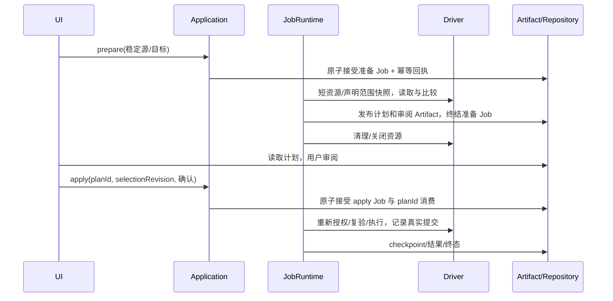

# 迁移三件套与 JobRuntime 平台化详细设计

> 状态：P5 目标设计，尚不代表当前行为。代码基线：2026-10-02，`d329539b9`。
> 本文按用户要求补齐平台演进设计。连接、错误与 CM 用例以 [连接管理](connection-management.md) 为权威，阶段门槛以 [开发计划](../../development/platform-development-plan.md) 为权威；持久化字段以 [持久化模型](persistence-model.md) 为权威。

## 1. 范围与代码迁移边界

本文定义 Schema Diff、Data Sync、Data Transfer 的准备、审阅、应用和恢复协议。三者共享 JobRuntime、预算、授权与 Artifact，不合并各自领域语义。

| 引擎 | 当前实现入口 | 目标领域包 | 保留在 host 的部分 |
| --- | --- | --- | --- |
| Schema Diff | `src-tauri/src/schema_diff/`、`commands/schema_diff.rs` | `packages/schema-diff/` | IPC、窗口与用户确认 |
| Data Sync | `src-tauri/src/data_sync/`、`commands/sync/` | `packages/data-sync/` | IPC、任务文件与窗口 |
| Data Transfer | `src-tauri/src/data_transfer/`、`src-tauri/src/transfer/`、`commands/data_transfer/` | `packages/data-transfer/` | IPC、文件选择、原生工具环境 |

以上目标包由 P5 创建；现有 [Schema Diff](../backend/schema-diff.md)、[Data Sync](../backend/data-sync.md)、[Data Transfer](../backend/data-transfer.md) 文档记录基线事实。Driver 方言、DDL renderer、类型适配和专属测试留在 driver 包。领域引擎不引用 Tauri、HTTP、窗口 Store 或 driver 实现库类型。

Runtime 承担接受/认领、预算、资源申请、子 execution、事件、取消和 cleanup；领域 handler 承担计划校验、分阶段算法及恢复核验。Application 服务校验授权、输入与计划消费；前端只提交稳定目标、审阅选择及幂等令牌，不提交执行 SQL、原始检查点或 live handle 作为恢复资格。

## 2. 公共执行模型

### 2.1 准备与应用分开受理

准备操作以 `schemaDiffPrepare` / `dataSyncPrepare` / `dataTransferPrepare` Job 执行。准备完成后 Job 终结、资源释放，输出私有计划 Artifact 与审阅数据。审阅不占用物理连接、快照、worker claim 或预算。

只有 complete 且摘要一致的私有计划 Artifact 可应用；接受时检查其组织、owner/ACL、有效期与选择版本。Job 接受后为其引用建立保留，计划及输入 Artifact 在 Job 终结和恢复保留窗口结束前不受普通 TTL 清理；ArtifactStore/仓储 adapter 以引用检查和删除 CAS 实现，不能只延长客户端缓存。

应用操作以 `schemaDiffApply` / `dataSyncApply` / `dataTransferApply` 创建新 Job。输入只包含 planId、计划摘要、selectionRevision、已审阅选择与必要确认。Application 从 Artifact 读取权威计划，不信任客户端返回的计划正文。适配器可以保持现有 inspect/preview/execute IPC 外观，但不可同时调用旧管理器和新 JobRuntime。

同一 planId 仅能被一个 apply Job 消费。接受事务将 Job、幂等 receipt 和 planId 消费约束一起提交；响应丢失后同一幂等键返回原 jobId，不重新执行。P5 在 `jobs.plan` 增加 apply 计划投影与唯一约束，见 [持久化模型 §3.6](persistence-model.md#36-jobs-与-job_checkpoints)。重新审阅后生成新的 planId，不能靠更换幂等键绕过已消费的计划。



### 2.2 冻结计划数据

以下是 P5 目标字段，不是现有 IPC DTO；Counter 使用十进制字符串。所有引用按组织限定，计划 Artifact 默认仅提交者可见，读取和应用各自重新授权。

| 字段 | 含义与约束 |
| --- | --- |
| planId / planVersion / handlerVersion / checkpointVersion | 不透明计划引用与精确格式版本；未知 major 拒绝 |
| kind / createdAt / expiresAt / selectionRevision | 引擎类型、有效期及审阅版本；过期或旧选择返回 PlanStale |
| source / target | 完整 CanonicalTarget；SQL 文件目标以输出规格代替数据库 target |
| endpointEvidence | 物理服务/命名空间/对象身份与观察时间；不能只按 connectionId 判自覆盖 |
| config/credential/capability 快照 | 源与目标各自保存版本，不保存秘密；执行前重新解析并比对 |
| schemaFingerprint / mappingFingerprint | 结构、PK、索引、参与对象、列映射和顺序的稳定摘要 |
| consistency | realTime / tableSnapshot / databaseSnapshot；driver 证明的能力与边界 |
| transactionScope | batch / table / task / nonAtomicDDL；超出 driver 证明范围拒绝 |
| recoveryPolicy | 禁止重放、目标幂等、同事务批次记录或只读核验；不能由用户任意宣称 |
| bodyArtifactIds / bodyDigests | 大型 ChangeSet、DDL/映射的私有不可变产物引用与摘要 |
| confirmedActions | 用户确认的破坏性操作范围；修改选择使确认失效 |

计划中的声明不提升能力；worker 根据已注册且当前可用的 driver 能力再校验。能力被降低、凭据/结构变化或输出摘要不符都停止派发，产生 PlanStale/SourceChanged/CapabilityUnsupported 等既有错误。计划只包含可持久化来源，runtimeBinding 保留内存。

### 2.3 JobHandler 与结果

Handler 以 kind + handlerVersion 注册，接口语义是 `validatePlan`、`runStage`、`verifyRecovery`。runStage 由 runtime 提供当前 claim、冻结输入、取消信号与受控资源访问；返回阶段结果、executionIds、已确认提交边界及 Artifact 引用。handler 不直接修改 Job 状态，不自行续租或在未知效果后自动重试。

JobState 与 effectOutcome 按 [连接 §10.1.1](connection-management.md#1011-p5-jobhandler-与阶段协议目标设计) 聚合。进度分别报告已读取、已转换、已尝试、已确认提交及未知范围；未确认 commit 的行不能计入 committed。一个对象失败后继续其他独立对象时，总 Job 为 failed，已生效部分保留 partiallyApplied；任何无法核验的副作用令总体 unknown，同时保留确认部分。

## 3. 多端预算、重叠与授权

1. 在取资源前规范化 source/target，逐端校验 read、execute/write 与产物权限；配置 enabled、readOnly 和 delegation 在派发前重新核验。
2. driver 提供物理服务及对象身份。不同 profile 可指向同一对象；同一 profile 也可指向不同库。写入与读取对象重叠的危险模式返回 EndpointOverlap；身份不可证明时不开放危险自覆盖。
3. 汇总整阶段所需的源、目标、控制 socket 与隧道额度。按服务 key 的稳定顺序提交一个资源申请集合；预算协调器要么预留全组，要么不持有任何部分并排队。不得拿着 A 等 B，失败释放已预留但未使用许可。
4. 同一服务上的两个不同资源仍占两个物理预算；角色分别为 source reader、target writer，禁止因为相同 connectionId 合并固定资源。
5. 资源申请失败发生在执行前时 effectOutcome 为 notStarted；一旦有外部写入，后续预算/权限失败不能覆盖已经确认的结果。

## 4. Schema Diff

### 4.1 准备

短 Lease 读取源和目标结构，记录观察时间与 snapshot 范围；跨服务器结构读取不宣称同一时刻。源结构是 desired state。领域包比较列、有效 PK、索引及支持的对象属性，产生 MigrationOperation DAG；driver renderer 输出语句与能力/事务边界，不由 host 拼方言。

计划包含每个 operation 的稳定 ID、依赖、参与对象、before/after fingerprint、风险、渲染摘要和 transaction group。未被 driver 支持的对象明确拒绝或在审阅中标 unsupported，不能静默省略后说整体同步成功。

审阅选择必须对依赖闭包合法。选中某 operation 却排除其先决项时拒绝；重新渲染后改变摘要则生成新计划并重新确认。破坏性确认绑定 operation IDs 与摘要，不是通用布尔开关。

### 4.2 应用

应用前重新读目标结构并比对 before fingerprint；不一致返回 PlanStale。按 DAG 拓扑次序执行，同一 transaction group 固定目标 Lease。driver 能证明整组事务 DDL 时允许 group 原子提交；隐式提交或 nonAtomicDDL 的 operation 单独记录确认边界。

每个 operation 执行后，driver 确认完成并必要时读取 after fingerprint。不能把 SQL 请求发送成功当作结构已生效；结果丢失进入 unknown，暂停依赖此 operation 的后续节点。

| 结果 | 后续行为 |
| --- | --- |
| 整组事务完整回滚 | 记录 rolledBack，可在重新授权/复验后显式重试 |
| 非事务 DDL 已执行，后续失败 | 保留已确认 operation IDs，partiallyApplied |
| DDL 响应丢失 | 只读比较 before/after 与实际依赖状态；能唯一证明时补边界，否则人工核验 |
| 用户取消 | 停止新 operation；在途语句按实际终态处理，不生成假 rollback |

反向 DDL 是补偿，需要新的计划/授权/审阅，不能视作撤销原 Job。重复出现同名对象不等于原 operation 完成，必须比对结构和上下文。

### 4.3 产物

准备产物为差异、风险、渲染计划及快照摘要；应用产物为每个 operation 的来源、executionId、确认边界和错误。它们使用 Artifact TTL，不在事件里发送无限 SQL 文本。renderer 输出不作为未经校验的客户端输入回传执行。

## 5. Data Sync

### 5.1 门闸与比较

normalized family、结构、列类型/nullability 与完整 PK 顺序必须一致。目标对象不重叠；缺 PK、跨族或结构不符返回拒绝并引导 Schema Diff/Data Transfer，不以部分列比较放宽门闸。

使用完整 PK 的稳定 keyset 读取，排序/比较由 driver 提供的语义保证；复合键按相同顺序且禁止 NULL key。一个源快照与一个目标快照不等于分布式一致快照。计划明确 realTime/tableSnapshot/databaseSnapshot，不能把多次短读取包装成全库快照。

ChangeSet 大数据以不可变块落 Artifact，块记录 relation identity、typed PK、before row/version evidence、after values 与 operation。数值/时间/二进制保留 driver-api 的类型精度，不经 JS Number 或字符串字面值往返。DELETE 默认不选，提交选择是原 ChangeSet 的子集，不允许客户端增加行或改写值。

### 5.2 审阅与冲突

准备结束释放源/目标快照。审阅期间数据库可变化，应用必须重验结构/PK、选中行的 before evidence 与权限。预览 SQL 仅用于展示；真正写入走 driver 参数化命令。

默认冲突政策是拒绝受影响批次：UPDATE/DELETE 使用 PK + 旧版本/旧值条件，影响行数不符返回 TargetConflictRows；INSERT 重新验证键不存在并依赖目标唯一约束。目标已变成期望值不能自动认定为本 Job 已提交，它只能成为显式恢复政策的核验证据。

首版不提供忽略冲突的静默覆盖。需要覆盖时重新读取、生成并审阅新的 ChangeSet，原 Job 的提交事实不改写。

### 5.3 批次事务

冻结 batchId、typed key 范围、operation 顺序、payload digest、行数与受影响对象。边界不得在恢复时依据新的 batchSize 重新切分。每批固定目标 Lease：检查取消/claim → begin → 验证 before → 参数化写入 → commit → 写确认边界/checkpoint。

提交前取消仅回滚当前批；此前确认提交批保留。session mode 的开启、写入、关闭使用同一 Lease，失败复原不得归池。无法证明批次事务支持则拒绝该应用计划；table/task 原子性只在 driver 校验整个范围后开放。

## 6. Data Transfer

### 6.1 领域模型与转换

数据库输出使用 source endpoint、target endpoint、TransferMode、WriteMode、对象/列映射和源 recordset。SQL 文件输出使用 source endpoint + 输出方言/编码/压缩/限定名规格，不建立目标数据库连接。

源类型经 driver source adapter 转换到 driver-api IR，再由 target adapter 渲染类型、DDL 与绑定值。列名映射、默认值、nullable、precision/scale、字符语义、时区、identity/generated 列及 PK/FK/index 分开验证。无法保真映射必须在准备期拒绝或要求具体损失确认，不能泛化为“兼容成功”。

| 内容 | 冻结决策 |
| --- | --- |
| 类型/列映射 | 每列源类型、IR、目标类型、转换策略、可空与溢出处理 |
| 记录集 | structured filter、完整稳定 key、start/end/limit；不是重启 offset |
| 写入模式 | append 或经过审阅的清空/重建范围；重复执行不默认幂等 |
| 结构阶段 | IR DAG、driver DDL 与不可原子操作边界；FK/index 构建时机 |
| 数据阶段 | 一致性范围、读取排序、batchId 切分与目标参数上限 |
| 恢复政策 | 可证明源未变化 + 可证明目标已提交范围；二者缺一禁止自动续写 |

原生任意 DDL override 作为单独受限步骤冻结并审阅；无法证明提交边界时标 nonAtomicDDL，不让它穿透原子任务承诺。结构阶段已生效后数据阶段失败，仍记录部分效果。

### 6.2 有界管道

```text
固定源 reader/snapshot
  → 有界 typed row batch
  → IR/value 转换
  → 有界参数批次
  → 固定目标 writer/transaction
  → commit 确认 → checkpoint
```

首版一个 reader/writer。每 pipeline 缓冲初值按连接设计 8 MiB，计入解码行、转换副本与待发送参数；不能只计 channel 条数。申请下一页前预留字节预算，目标慢则源暂停。单值超过上限时，只有 driver 支持分块值写入才允许；否则明确失败并清理，不扩张缓冲绕过限制。

批大小同时受行上限、字节上限与 driver 参数上限约束；参数过多时拆分，不把多个事务批次误标成一个原子批。错误和取消唤醒两端，停止新读取、终结游标/快照、等待在途写入实际结果后 cleanup。

### 6.3 源一致性与续写

有稳定完整 key 且 driver 能证明快照时，在固定 source Lease 上读取声明范围。跨重启不能恢复旧快照或游标：重新建立快照并验证源证据。仅结构摘要不证明源行未变化；首版恢复要求冻结记录集的完整 typed row 摘要/外部不可变版本或等价 driver 证明，成本在计划中展示。

没有稳定 key 时可运行一次性流式传输，但 recoveryPolicy 为禁止自动续写；恢复只能核验并重新制定计划。并行分片不在首版，未来必须证明分片覆盖、快照协调、约束顺序和预算；不能按 OFFSET 拆片。

### 6.4 SQL 文件

输出 writer 经 ArtifactStore 接受，方言 renderer 不建目标连接；文件选择返回的本地 token 只留 adapter 内存。准备冻结输出编码、压缩与限定名。产物使用冻结的输出规格，实际字节摘要由 writer 终结时计算；预览 SQL 不充当完整数据文件摘要，成功 finalize 才可按 complete 导出；取消/磁盘不足记 truncated，保留标记并由用户明确选择是否下载，不伪称可完整恢复。

Web 只能上传/下载授权 Artifact，不接收服务器路径；桌面导出走 PlatformServices 受控保存。Artifact 写入不绕过配额，文件句柄和密码不落检查点。

## 7. 提交边界与恢复核验

CommitBoundary 记录 stable target、stageId、batch/operation ID、payload digest、确认来源与发生时间；checkpoint 保存最后已确认连续边界及源/映射证据。字段扩展纳入 P5 版本，现有仅目标 fingerprint 的类型不能替代逐批证据。

目标批次记录仅在用户授权且 driver 支持时使用：记录 jobId、stageId、batchId、payload digest 和行数，与业务写入**同事务**提交，并对 batchId 唯一。目标业务写入与管理库 checkpoint 无分布式事务，commit 后故障通过读取目标标识补 checkpoint。

不能擅自在用户库创建辅助表。无目标记录时，仅允许经过计划证明的幂等写入或只读后置条件核验；普通 append 不能靠“行数大概相同”证明提交。恢复核验不得把 unknown 直接转成 notStarted。

| 故障窗口 | 可自动进行的动作 | 写入限制 |
| --- | --- | --- |
| 接受前失败 | 原键重试/查回执 | 没有受理则不执行 |
| 接受后未派发 | 证明旧执行未启动后认领 | 当前 claim 授权通过才派发 |
| commit 应答丢失 | 查目标批次/对象证据 | 核验前暂停该范围 |
| commit 确认但 checkpoint 缺失 | 补确认边界 | 不重发已提交批 |
| checkpoint 已写，Job 终态缺失 | 核验后补终态或运行未执行阶段 | 固定版本与授权不变才继续 |
| 源/映射/能力变化 | 生成核验结果 | SourceChanged/PlanStale，不自动续写 |
| cleanup/旧 worker 隔离不明 | 保留待核验与预算占用 | 不接管副作用范围 |

恢复状态是 Job 的附加投影，不扩展 JobState 枚举。失去 claim 的 worker 不再写仓储；其日志/证据只由当前 owner 核验后登记。P9 的代次校验不能自动阻止外部数据库中的旧 SQL。

## 8. 客户端与接口适配

BackendClient 的 startJob/getJob/cancelJob 为通用路径；准备/应用 kind 的 schema 由 JobHandler 注册并用于 IPC/HTTP 一致性检查。JobView 的阶段进度和 Artifact 引用在 P5 补充，事件只包含有界状态/引用。

任务窗口重新打开先查 Job，再读计划/结果；UI unmount 只退订。planId 过期、目标漂移或权限变化要求重新准备，不自动用旧 SQL 应用。apply 响应超时先查原幂等回执，未知提交不新建 Job。

桌面/浏览器只开放同 backend 两端迁移。后台服务无法访问客户端本地 profile；输入中出现其他 backend 的 ID 明确拒绝。个人/团队账号的真实执行身份分别派生，不能因使用同一业务数据库共享池或产物可见性。

## 9. 包抽取与旧路径删除

按类型/纯算法 → driver 能力访问 → Job handler → IPC/HTTP adapter → UI 顺序抽取。先保证新包能独立编译，再让一个 consumer 切换资源获取方式。同一请求从始至终只走一种管理器，不把旧 ConnectionHandle 伪装成新 Lease。

新路径的真实旅程通过后，在同一迁移 PR 删除该 consumer 的旧 session refs、job 标志与窗口释放逻辑；保留必要的载荷转换，不留双执行开关。当前 TransferPlanStore 的进程内 plan/resume token 不升级为持久化保证；格式转换只接受稳定定义，旧活 token 在重启后失效。

## 10. 验收与阶段门槛

| 用例 | 必须提交的证据 |
| --- | --- |
| CM-31 / CM-65 / CM-67 | AB/BA 原子多端预留、真实 source/target/control 数量、计划 capability/版本复验 |
| CM-40 / CM-54 | 关闭窗口继续、接受回执丢失不重复创建 apply Job |
| CM-41 | planId 一次消费、过期、不同 profile 同对象自覆盖拒绝 |
| CM-42 | 非事务 DDL 部分成功与未知 operation 的只读核验 |
| CM-43 / CM-44 / CM-45 | review 后行冲突、批次取消保留已提交范围、session mode 同 Lease 清理 |
| CM-46 | 慢 writer、超大单值、背压字节账与两端释放 |
| CM-47 / CM-48 | commit/checkpoint 各窗口、源变化、重启后不恢复旧快照 |
| CM-49 | SQL 文件无目标连接、产物完整性/受控导出/输出规格一致 |

H 层验证编排与会计，D 层验证真实数据库副作用和方言，F 层验证连续审阅/取消/重附着；P7 再加 W1。测试专属方言留在对应 driver 包。目标批次记录未授权、driver 不支持自动恢复或无真实环境时，报告适用范围与未验证项，不称恢复功能已验证。
