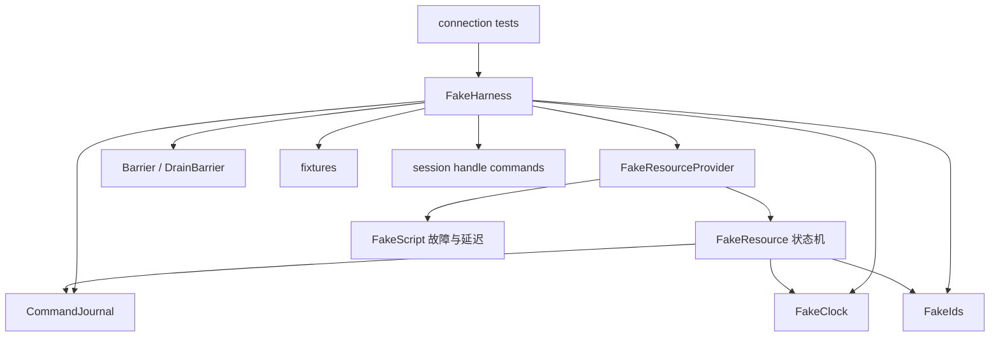
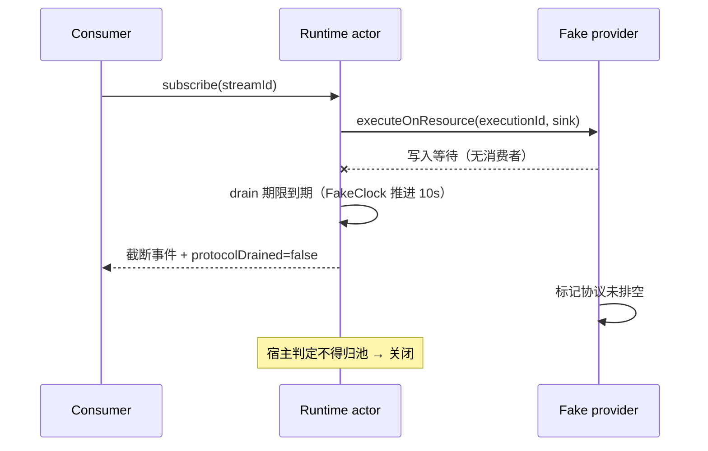

# DataZen P0 transport-neutral fake resource 夹具与基准 harness 详细设计

> 状态：目标设计，尚未实现。基线：2026-09-30，`8592b0fe1`。本文只交付夹具、故障注入、真实驱动契约夹具与基准 harness 的实现级设计，不代表连接管理重构已完成。
> 读者：负责 [连接管理详细设计](connection-management.md) §14 开发步骤第 2 项（`testing/fake_resource`）、§6.5 句柄登记与 §15.3 基准 harness 的实现者。
> 配套：[连接管理详细设计](connection-management.md)、[平台开发计划](../../development/platform-development-plan.md)、[系统概要](system-overview.md)、[测试架构](../testing.md)、[E2E 测试指南](../../development/e2e-testing.md)。

## 1. 范围与前置约定

| 本文覆盖 | 本文不覆盖 |
| --- | --- |
| transport-neutral fake resource provider 的接口、可编程状态与默认行为 | §4 的 DTO 定义（以 connection-management.md 为准，本文只引用） |
| 逐阶段故障与延迟注入点矩阵，以及「注入后无泄漏」的可验证断言 | 各阶段内部实现算法 |
| CommandJournal、Barrier、FakeClock 三件夹具 | 真实数据库协议实现 |
| 可返回会话级句柄的 fake 命令清单（服务 CM-73/CM-74） | 真实方言差异（严格落驱动 crate） |
| 真实驱动契约夹具模板与专用测试环境前置检查 | 驱动专属 Command 的语义测试 |
| CM-60 基准 harness 的可执行规格与产物 | 基准结果结论（门槛判定方式见 §11.6） |

三条前置约定，实现时不得偏离：

1. **fake 位于资源层，不位于驱动层。** fake provider 实现 connection-management.md §5.1 的资源级端口，一个 fake resource 等价于真实驱动的一个底层会话（池大小 1）。它不实现 `packages/driver-api` 的 `DatabaseDriver` trait，因此**不能**用它验证任何方言语义。
2. **§4 的 DTO 不在本文重定义。** `SessionView`、`ExecutionReceipt`、`SessionHandleRef`（§6.5）、`ExecutionState`、`ExecutionErrorCode` 等一律按 connection-management.md §4/§6.5 引用，本文只给夹具侧的构造与断言。
3. **fake 的可编程状态是唯一输入。** 任何行为差异只能来自 `FakeScript`（故障与延迟）与 `FakeClock`（时间），不得在夹具内部写随机数、真实 `Instant::now()` 或真实 socket。

**Rust 变体名与协议字面量的映射（全文只在此声明一次）**：本文为可读性混用 Rust 变体名与 connection-management.md §4 的协议字面量，两者指向同一取值，正文不再逐处重复标注。

| Rust 变体 | 协议字面量（connection-management.md §4） |
| --- | --- |
| `ExecutionErrorCode::SqlError` | `sqlError` |
| `ExecutionErrorCode::ProtocolError` | `protocolError` |
| `ExecutionErrorCode::Cancelled` | `cancelled` |
| `ExecutionErrorCode::Timeout` | `timeout` |
| `ExecutionErrorCode::ResourceLost` | `resourceLost` |
| `ExecutionErrorCode::PipelineAborted` | `pipelineAborted` |
| `ExecutionErrorCode::HostRejected` | `hostRejected` |
| `EffectOutcome::NotStarted` | `notStarted` |
| `EffectOutcome::Completed` | `completed` |
| `EffectOutcome::RolledBack` | `rolledBack` |
| `EffectOutcome::PartiallyApplied` | `partiallyApplied` |
| `EffectOutcome::Unknown` | `unknown` |
| `CancelReceipt` 的 `Disposition::Requested` / `Unsupported` / `AlreadyFinished` | `requested` / `unsupported` / `alreadyFinished` |

`errorCode` 与 `effectOutcome` 是两个独立字段，不得互塞；`ApiError.code`（connection-management.md §13：`UnsupportedPlan`、`CapabilityUnsupported`、`OutcomeUnknown`、`TransactionResolutionRequired`、`RollbackFailed` 等）是第三个命名空间，只在「请求被拒绝」处出现（含提交结果未知时的核验请求），其取值不得写进 `errorCode`/`effectOutcome`。派发前拒绝的路径（如 §4.2 的 F1）上不存在 execution 记录，因此也不存在 `ExecutionState`/`errorCode`/`effectOutcome`。

### 1.1 与现有 Host MockDriver 的边界

| 维度 | 现有 `MockDriver` | 本文 fake resource provider |
| --- | --- | --- |
| 落点 | `src-tauri/src/testing/mock_driver.rs`（已存在） | 拟 `packages/runtime/src/connection/testing/`（crate 尚未创建） |
| 抽象层 | `datazen_driver_api::DatabaseDriver` | connection-management.md §5.1 资源级端口 |
| 典型调用 | 测试直接 `driver.query(&handle, ...)` | runtime actor / 执行网关 |
| 能表达的句柄 | `ConnectionHandle` / `TransactionHandle`（`packages/driver-api/src/types.rs`） | `ResourceHandle` + §6.5 `SessionHandleRef` |
| 多进程/多 worker | 否 | 可配 `workerId`，可表达 epoch 碰撞 |
| 现状 | 已可运行 | 不存在 |

两者不合并、不互相替代：既有 Host 测试继续用 `MockDriver`；连接运行时的新测试一律用本文 fake。**禁止**把新 runtime 测试写进 `src-tauri/src/testing/`。

## 2. 落点与模块划分

拟建目录（全部位于尚未创建的 runtime crate 内，crate 包名以实际 `Cargo.toml` 为准）：

| 路径 | 职责 | 关键导出 |
| --- | --- | --- |
| `packages/runtime/src/connection/testing/mod.rs` | 模块入口与 `#[cfg(any(test, feature = "test-harness"))]` 门控 | `FakeHarness` |
| `.../testing/fake_resource.rs` | fake provider、fake resource 状态机、§5.1 九个操作 | `FakeResourceProvider`、`FakeResource`、`FakeScript` |
| `.../testing/journal.rs` | CommandJournal 与变化点断言 | `CommandJournal`、`JournalAssert` |
| `.../testing/barrier.rs` | 命令级 barrier、协议 drain barrier | `Barrier`、`DrainBarrier` |
| `.../testing/clock.rs` | FakeClock（单调 + UTC） | `FakeClock` |
| `.../testing/ids.rs` | 可预测 ID 生成与强制碰撞 | `FakeIds`、`FakeIdScope` |
| `.../testing/fixtures.rs` | 固定实体（组织/用户/profile/命名空间 A、B） | `fixtures()` 常量与 `install_fixtures` |
| `.../testing/commands.rs` | 会话级句柄 fake 命令定义 | `session_handle_command_definitions()` |
| `.../testing/bench.rs` | CM-60 基准 harness | `cm60_harness()`、`cm60_stress()` |

`cfg` 门控与 `src-tauri/src/testing/mod.rs` 现有写法保持一致（`app_state` 用 `#[cfg(any(test, feature = "test-harness"))]`，feature 名 `test-harness` 已在 `src-tauri/Cargo.toml` 定义）。



依赖方向单向向下。`journal.rs` 不依赖 `fake_resource.rs`（journal 记录由 provider 写入，断言由测试调用），`clock.rs` 不依赖任何其他夹具模块。

隔离规则：

- 夹具代码不得被生产路径引用；`src-tauri` 的 `datazen` crate 不依赖 runtime 夹具。
- runtime crate 现有门禁 `pnpm test:layers`（`scripts/check-module-layers.mjs`）只扫描 JS/TS 源码，不覆盖 Rust；runtime crate 创建后必须把层/边界检查接入 CI 门禁，命令同步写入 CI 与开发计划 §15.1 的命令表，不把未创建命令列为现有脚本。
- 夹具内禁止出现 `.env` / `.env.test` 的任何读取路径（见 §13）。

## 3. transport-neutral fake resource 契约

### 3.1 夹具对象

```rust
pub struct FakeResourceProvider {
    script: FakeScript,                 // 故障与延迟注入，跨资源共享
    clock: FakeClock,                   // 与 runtime 共享同一时钟源
    ids: FakeIds,
    resources: Mutex<IndexMap<String, FakeResource>>, // resourceId -> 资源
    journal: CommandJournal,
    id_counter: AtomicU64,              // leaseId / 执行序号
    worker_id: Option<WorkerId>,        // None = 本地单进程；Some = 表达多 worker
}

pub struct FakeResource {
    pub resource_id: String,            // API 定义的不可伪造 opaque ID
    pub resource_key: String,           // 来自 describeResource 的 driverResourceKey
    pub pool_key: PoolKeyFingerprint,   // 字段名（叙述层统一写作 poolKeyFingerprint）；connectionId/identity/policy/driver 维度等值
    pub owner: Option<OwnerRef>,        // dbSessionId + runtimeEpoch
    pub target: CanonicalTarget,        // §4.3 规范化结果
    pub state: FakeResourceState,       // Opening / Ready / Executing / Cleaning / ...
    pub capabilities: CapabilitySnapshot,
    pub handles: IndexMap<String, FakeSessionHandle>,  // driver 内部持有
    pub protocol_drained: bool,
    pub health: ResourceHealth,
    pub execution_seq: u64,
}
```

关键点：`ResourceHandle` 只能由 provider 签发，provider 在每次操作上校验 `resourceId` + `runtimeEpoch` + owner 归属；**携带旧 `runtimeEpoch` 或他人 owner 的句柄必须被拒绝**（这是 CM-71、CM-74 的可测基础）。

### 3.2 §5.1 九个操作的 fake 行为

| 操作 | fake 默认行为 | 可编程状态 | 故障注入点 |
| --- | --- | --- | --- |
| `describeResource` | 纯函数：不建连、不计预算，按 `(connectionId, target, 身份范围)` 归一化出 `resourceKey`；`sessionContinuity=fixed`，`connectionCostPolicy=perPhysicalConnection` | 按 `poolKeyFingerprint` 覆盖 `resourceKey`、`initializationRequirements` | 返回 `UnsupportedPlan` / `TargetUnsupported` |
| `acquireResource` | 向 `BudgetPort` 申请 1 个物理许可 → 建 fake resource → 执行初始化脚本 → `state=Ready`；每次建连写 journal | 每物理连接计 1；`poolKeyFingerprint` 相同则可复用既有 Ready 资源 | 预算不足 `ResourceBusy`、超时、初始化脚本失败 |
| `executeOnResource` | 从脚本表取 `StatementResult`；若脚本声明 `sessionHandles` 则写入 `ExecutionCompletion.sessionHandles`；写 `protocolDrained` | 固定返回时延、结果集大小、是否流式、是否返回句柄 | 语句失败、协议写失败、背压（sink 写入等待） |
| `observeSession` | 在同一 fake resource 上读 `context` / `transactionState` / `handleCount` | 可置任一字段为 `unknown` | 返回 `unknown`（**禁止**回填 `initialTarget` 假充确认） |
| `changeContext` | 校验 `expectedContextRevision`；`namespaceSwitch=inPlace` 时原地改 target 并 `contextRevision+1` | 可置 `requiresReplacement` / `unsupported` | `ContextConflict`、`ResourceBusy` |
| `begin` / `commit` / `rollback` | `begin` 建 `FakeSessionHandle{kind:transaction}` 并**必须**随 completion 交出；`commit`/`rollback` 在**同一 resource** 上终结并置 `closed=true` | commit 可返回 `Ok` 或 `Unknown`；rollback 可失败 | `RollbackFailed`、`CleanupFailed`、commit `OutcomeUnknown` |
| `requestCancel` | 精确 `cancelHandle` 命中未完成执行时返回 `Requested`；无命中返回 `AlreadyFinished` | `preciseCancel` 可置 `unsupported`（返回 `Unsupported`，**不得**退化为 session-wide cancel） | cancel 不支持/未命中/目标已完成 |
| `resetResource` | 仅当 `handles` 为空且无未结束执行时返回 `Clean`；否则 `Discard` | 可置 `resetForReuse=unsupported`、可超时 | 协议基线未清、临时对象残留、reset 失败/超时 |
| `closeResource` | 幂等：首次 `Closed`，重复调用仍 `Closed` | 可置 `CloseUnconfirmed` | 关闭未确认、关闭途中资源丢失 |

两处不可让步的 fake 语义：

- **`resetResource` 的 `Clean` 不等于事务终结。** fake 对已交出的句柄**没有可见性**（句柄由宿主 actor 持有，connection-management.md §6.5），因此 `FakeResource.handles` 只反映 driver 侧协议状态。测试必须能构造「driver 返回 `Clean` 但宿主侧仍有已登记句柄」的场景，这正是 connection-management.md §9.4「driver 的 Clean 不构成事务终结证据」的可测点。
- **`commit` 返回 `Unknown` 时 `effectOutcome` 必须是 `unknown`。** fake 不允许在 `Unknown` 分支返回成功态（`completed`），否则 CM-47、CM-52 的断言会假绿。

### 3.3 能力快照默认值

按 connection-management.md §5.2 的十项能力给出 fake 默认值；每项都可按 `driver_id` 覆盖，用于验证「能力 Unsupported 时宿主必须正确拒绝」：

| 能力 | fake 默认 | 覆盖后用于验证 |
| --- | --- | --- |
| `statefulSession` | `supported` | 置 `unknown` 时不得开启固定会话保证 |
| `namespaceSwitch` | `inPlace` | 置 `requiresReplacement` 时走两阶段替换，UI 原子换绑 |
| `contextObservation` | `full` | 置 `partial`/`unsupported` 时 `observedContext` 保持 `unknown` |
| `transactionObservation` | `full` | 置 `partial` 时 `TransactionResolutionRequired` 路径 |
| `sessionScopedHandles` | `supported` | 置 `unsupported` 时句柄类用例必须断言「正确拒绝」而非静默 skip |
| `resetForReuse` | `verified` | 置 `unsupported` 时一切复用路径必须走关闭 |
| `preciseCancel` | `supported` | 置 `unsupported` 时取消返回 `Unsupported`，不得降级 |
| `snapshots` | `perDatabase` | 置 `unsupported` 时三件套快照计划必须报 `UnsupportedPlan` |
| `transactions` | 读已提交/可重复读 + savepoint | 置受限级别时计划必须按能力重算 |
| `ddlAtomicity` | 事务 DDL 原子，含可声明的非事务步骤 | 声明含非事务步骤时迁移计划必须显式告警并在提交后复核 |

### 3.4 ExecutionCompletion 的组装

fake 的 `ExecutionCompletion` 必须逐字段给出，宿主断言才有意义：

| 字段 | fake 默认 | 关键注入 |
| --- | --- | --- |
| `completionStatus` | `Ok` | 语句失败 → `Error` |
| `effectOutcome` | 成功写入 → `completed` | 提交不确定 → `unknown`；部分批次 → `partiallyApplied` |
| `statementResults` | 脚本指定的列/行 | 决定是否触发 `protocolDrained=false` |
| `contextBefore` / `contextAfter` | 当前 target 投影 | 可置 `unknown` |
| `transactionObservation` | `None` / `InTransaction` | 提交后置 `Unknown` |
| `sessionHandles` | 脚本声明的句柄数组 | 可置为空（模拟未交出，见 §9） |
| `protocolDrained` | `true` | 置 `false` 时宿主禁止归池（connection-management.md §9.4 前置之一） |
| `resourceHealth` | `Healthy` | 置 `Degraded`/`Lost` 时进入 `Lost` 状态机分支 |

## 4. 故障与延迟注入点矩阵

### 4.1 注入点目录

`FakeScript` 按阶段寻址，键为 `(driver_id, command_id 或 `*`, occurrence)`，`occurrence` 支持 `always` / `first_n(k)` / `after(n)`，使「第二次及以后失败」可精确复现。

| 编号 | 阶段 | 注入类型 |
| --- | --- | --- |
| F1 | 描述（`describeResource`） | 失败 / `UnsupportedPlan` |
| F2 | 预算申请（`acquireResource` 前） | 拒绝 `ResourceBusy` / acquire 超时 10 秒 |
| F3 | 建连与初始化 | 失败 / 延迟 / 初始化脚本残留临时对象 |
| F4 | 语句派发 | 失败 / 延迟 / 取消命中 |
| F5 | 结果传输（`ResultSink` 写入） | 背压（写入等待）/ 写失败 |
| F6 | 观察（`observeSession`） | 返回 `unknown` 各字段 |
| F7 | 上下文切换 | `ContextConflict` / `requiresReplacement` |
| F8 | 事务 | `begin` 成功；`commit` 返回 `Unknown`；`rollback` 失败 `RollbackFailed` |
| F9 | 取消 | `Unsupported` / 未命中 `AlreadyFinished`（该注入类型由 §14 的 `CM-21~CM-29` 范围覆盖，无单独矩阵行）/ 取消后执行仍完成 |
| F10 | 重置归池 | 返回 `Clean` 但宿主前置不满足 / `Discard` / reset 超时 |
| F11 | 关闭 | `CloseUnconfirmed` / 关闭期间资源丢失 |
| F12 | 句柄登记 | 交出句柄但不返回（模拟未登记反例）/ 跨 epoch 复用句柄 |

### 4.2 阶段 × 故障 × 期望可观察结果

| 注入 | 期望宿主可观察结果 | 关联 CM |
| --- | --- | --- |
| F1 `UnsupportedPlan` | 派发前拒绝 → 直接返回 `ApiError.code=UnsupportedPlan`，**不产生 execution 记录**、不建物理连接；`ExecutionState`/`errorCode` 在此路径上不存在 | CM-19、CM-52 |
| F2 `ResourceBusy` | 返回 `ResourceBusy`，等待可被取消；不得额外建连 | CM-29、CM-60 |
| F2 acquire 超时 | 10 秒期限由 FakeClock 判定，资源占用清零，journal 记录 permit 归还 | CM-29、CM-60 |
| F3 建连失败（未执行 SQL） | session 回到 `New` 可重试，预算归零 | CM-27 |
| F3 建连成功但初始化后协议损坏 | 进入 `Lost`，禁止后续执行，终结相关执行 | CM-27、CM-64 |
| F4 语句失败 | `errorCode` 为版本化枚举值；`effectOutcome` 独立表达（可能是 `unknown`） | CM-52、CM-72 |
| F5 背压 | `ResultSink` 写入等待；触发 8 MiB/执行上限后必须截断或按字节背压 | CM-46、CM-64 |
| F6 observe 返回 `unknown` | `observedContext` 保持 `unknown`，**不得**回填 `initialTarget` | CM-14、CM-18 |
| F7 `ContextConflict` | 返回 `ContextConflict`，要求重读后由用户操作重发 | CM-11、CM-21 |
| F8 commit `Unknown` | `effectOutcome=unknown`，`errorCode` 取实际成因（`protocolError`/`timeout`），要求核验、不自动重试；**不**返回 `TransactionResolutionRequired`（该码只用于「事务阻止切换/关闭」） | CM-47、CM-52 |
| F8 rollback 失败 | `RollbackFailed`，资源隔离 `Quarantined`，不归还 | CM-26、CM-64 |
| F9 cancel `Unsupported` | `CancelReceipt.disposition=unsupported`（正常返回值，不是异常） | CM-24、CM-72 |
| F9 取消后执行仍完成 | `executionState` 仍 `cancelled`（取消请求已送达），但 `errorCode` 报告执行真实终态 | CM-22、CM-72 |
| F10 driver `Clean` 但句柄非空 | 宿主判定事务未终结 → **关闭**而非归池 | CM-69、CM-73、CM-74 |
| F10 `resetForReuse=unsupported` | 直接关闭，预算在确认后核销 | CM-26、CM-69 |
| F11 `CloseUnconfirmed` | 保留预算占用或转待核验占用，不立即归零 | CM-26、CM-27、CM-28 |
| F12 句柄未返回 | runtime 拒绝把它交给宿主；该句柄在 fake 侧标记为 `orphaned` | CM-73、CM-74 |

### 4.3 「注入后无泄漏」的可验证性

每个注入点必须配套一个不变量断言，测试在 fixture teardown 前统一执行：

```
I1  permits_returned == permits_requested          // 预算 permit 收支平衡
I2  live_resources.is_empty()                       // 无残留 fake resource
I3  live_leases.is_empty()                          // 无残留 ResourceLease
I4  session_registry.active_sessions.is_empty()     // 无残留逻辑 session
I5  journal.handle_registry.is_empty()              // §6.5 已登记句柄全部注销
I6  journal.permit_ledger.balanced()                // 与 I1 交叉验证
I7  journal.orphan_handles.is_empty()               // F12 反例留下的孤儿句柄
I8  events.stream_sequence.is_contiguous()          // 事件序号无缺口
```

断言入口固定为 `FakeHarness::assert_no_leak()`，在每个故障注入用例的结尾以 `Drop` 之外的方式显式调用（不使用 `Drop` 隐式断言，失败信息必须出现在测试输出中）。`I1`~`I8` 全部来自 journal 与 registry 的内存状态，不需要 sleep。

## 5. CommandJournal

### 5.1 记录内容

journal 记录**资源与执行的全部可观察变化**，是「每次建连/关闭/permit 变化时断言额度，无随机采样盲区」的实现载体（connection-management.md §15.3）。

| 类别 | 记录字段 |
| --- | --- |
| 建连/关闭序列 | `seq`、`resourceId`、`event`（`Created`/`OpeningReady`/`Closed`/`CloseUnconfirmed`/`Lost`）、`owner`、`poolKeyFingerprint`、`budgetClass` |
| 执行序列 | `seq`、`resourceId`、`executionId`、`commandId`、`startedAtMono`、`endedAtMono`、`effectOutcome`、`protocolDrained` |
| permit 申请/归还 | `seq`、`permitId`、`delta`（`+1`/`-1`）、`reason`（`acquire`/`close`/`quarantine`/`writeoff`）、`budgetClass` |
| 句柄登记/注销 | `seq`、`handleId`、`kind`、`resourceId`、`runtimeEpoch`、`action`（`registered`/`closed`/`rejected`/`orphaned`）、`reason` |

### 5.2 数据结构

```rust
pub struct CommandJournal {
    entries: Vec<JournalEntry>,          // append-only，单调 seq
    permits: Vec<PermitEvent>,           // 独立账本，便于快速收支对账
    handles: IndexMap<String, HandleRecord>,
    clock: Arc<FakeClock>,
}

pub struct PermitEvent { pub seq: u64, pub permit_id: String, pub delta: i32, pub reason: PermitReason }
```

`seq` 由单一原子计数器分配，因此任何两条并发写入的相对顺序都是确定的；这是「用 journal 断言顺序而不是靠 sleep 猜顺序」的基础。

### 5.3 变化点强制断言

断言挂在**变化点**上，不挂在采样上：

| 变化点 | 断言 | 失败含义 |
| --- | --- | --- |
| 每次 `resourceId` 创建 | `permit 余额 = +1`，`live_resources` 同步 +1 | 建连未计预算 |
| 每次 `Closed` | `permit 余额 = -1`（仅在 `Closed` 而非 `CloseUnconfirmed` 时） | 未确认关闭被伪称回收 |
| 每次 `CloseUnconfirmed` / `Quarantined` | 余额**不变** | 预算被提前归零 |
| 每次 permit 变化 | `Σ delta == live_resources.len() + idle_pools + control_sockets` | 漏记或多记 |
| 每次句柄 `registered` | `handles[handleId].resourceId == execution.resourceId` 且 `runtimeEpoch` 匹配 | 句柄跨资源/epoch 登记 |
| 每次句柄 `closed` | 从 `handles` 移除并写 `closed` 事件 | 关闭无证据 |
| 每次执行终态 | `protocolDrained` 已记录或显式置 `false` | 归池前置缺失 |
| 每次 `Unknown` 提交 | `effectOutcome == unknown` | 未知被当成成功 |

### 5.4 断言写法示例

```rust
#[test]
fn commit_unknown_never_reports_completed() {
    let h = FakeHarness::new();
    h.script().fail_commit_with_unknown();
    let receipt = h.execute_in_session("fixture-P", "commit_probe");
    assert_eq!(receipt.execution.error_code, Some(ExecutionErrorCode::ProtocolError));
    assert_eq!(receipt.execution.effect_outcome, EffectOutcome::Unknown);
    h.journal().assert_permits_balanced();
    h.assert_no_leak();
}
```

`FakeHarness` 提供 `journal().assert_permits_balanced()`、`assert_handle_closed(id)`、`assert_no_return_to_pool_without_drain()` 等专用断言，失败信息直接包含相关 `seq`，避免手工翻日志。

## 6. Barrier 机制

### 6.1 命令级 barrier

```rust
pub struct Barrier { seq: AtomicU64, arrivals: Mutex<IndexMap<u64, Vec<Arrival>>>, ... }
impl Barrier {
    pub fn arrive(&self, tag: &str) -> BarrierToken;      // 到达并注册后续期望
    pub fn wait_for(&self, tag: &str);                    // 阻塞直到该 tag 到达
    pub fn release(&self, tag: &str);                     // 放行后续步骤
}
```

barrier 作用在**命令执行槽位**上：把 fake 命令的「到达」和「放行」拆开，测试可以在两条命令精确交错的位置上观察中间状态。典型用法：

```
T1: 打开事务（barrier.arrive("after_begin")）
T2: 关闭会话（barrier.wait_for("after_begin") → 在 T1 尚未终结时进入关闭）
断言：关闭先在原 resource 上回滚并注销句柄，确认后才释放资源
```

### 6.2 协议 drain barrier

`DrainBarrier` 与命令级 barrier 分离，服务 CM-64（无消费者、有界 drain、截断）：

- 订阅建立后置 `no_consumer=true`，`executeOnResource` 的 `ResultSink` 写入必须等待；
- 推进到每订阅 256 事件 / 1 MiB、每执行 8 MiB 上限时，journal 记录 `truncated=true` 与 `truncationReason`；
- 无消费者等待 30 秒、drain 期限 10 秒均由 FakeClock 判定；
- 桌面 256 MiB 产物上限以「已产出字节计数」断言，不以内存占用断言。



### 6.3 竞态用例编排

| 用例 | 编排 | 断言 |
| --- | --- | --- |
| CM-64 无消费者 | drain 期限到期 | 事件被截断、`protocolDrained=false`、资源被关闭 |
| CM-73 淘汰中途发起 commit | idle 淘汰启动后（barrier 停住）发起 `begin`→`commit` | 句柄在**原 resource** 上终结后才释放资源；不得在新 resource 上复用旧句柄 |
| CM-74 释放顺序 | 淘汰 + 句柄登记并存 | journal 顺序必须是 `handle closed` → `resource Closed` → `permit -1` |
| CM-22 取消与完成竞态 | 取消到达后让执行继续完成 | `executionState=cancelled` 且 `errorCode` 为执行真实终态 |
| CM-69 归池竞态 | 宿主前置全部满足但 driver 返回 `Discard` | 走关闭分支，permit 只在 `Closed` 后归还 |

### 6.4 禁止用 sleep 猜顺序

- 所有顺序断言基于 journal `seq` 或 `Barrier`，不基于真实时间；
- 任何 `tokio::time::sleep` 只允许用于「让推进逻辑自己跑完」的推进步，且必须配合 FakeClock 的虚拟时间或显式 `yield_now`，不得作为断言前提；
- 夹具 lint：测试代码中出现「裸 `sleep(...)` 后直接断言顺序」的模式应被 review 拒绝。仓库已有规则要求生产路径禁止裸 `unwrap()`/`expect()`（见 `AGENTS.md`），夹具属于测试代码但同样要求断言信息可读。

## 7. FakeClock

### 7.1 单调时钟与 UTC 的分工

| 时钟 | 用途 | 夹具实现 |
| --- | --- | --- |
| 单调（`MonoTime`） | 所有**持续时间**判定：acquire timeout 10 秒、队列上限等待、掉线 grace 60 秒、无事务 idle 30 分钟、空闲事务 5 分钟、cancel/cleanup 10 秒、pool idle TTL 60 秒、幂等令牌 24 小时 | 显式 `advance(Duration)`，基准固定为常量 `T0`，不读系统时钟 |
| UTC | 对外 `expiresAt` 投影 | 固定起点常量 + 单调推进量；只用于生成 `expiresAt` 字段 |

两者必须分离：把 `expiresAt` 当成持续时间判定依据，或用 UTC 差值判断期限，都会在跨时区/时钟回拨下失真。夹具的 `FakeClock` 因此提供两个只读视图：

```rust
impl FakeClock {
    pub fn monotonic(&self) -> MonoTime;    // 持续时间判定
    pub fn utc(&self) -> FixedUtc;          // expiresAt 投影
    pub fn advance(&self, d: Duration);     // 同时推进两者
}
```

### 7.2 期限表与夹具默认值

| 期限 | 设计值（connection-management.md §9.2） | 夹具默认值 | 备注 |
| --- | --- | --- | --- |
| acquire timeout | 10 秒 | 同设计值 | 超时返回 `ResourceBusy` |
| session 普通队列 | 32 请求 | 同设计值 | 超过返回 `QueueFull` |
| 每用户 / 每组织逻辑 session | 100 / 1000 | 测试可下调到 4 / 8 | 用于额度用例，避免造 1000 个 session |
| client 掉线保留 | 60 秒 | 同设计值 | 与 idle 取最早 |
| 无事务会话业务空闲 | 30 分钟 | 同设计值 | attach/心跳不刷新 |
| 空闲事务 | 5 分钟 | 同设计值 | 存在未结束事务/游标时适用 |
| cancel/cleanup deadline | 10 秒 | 同设计值 | 超时隔离并记录真实 `effectOutcome` |
| 数据缓冲 | 每 pipeline 8 MiB | 测试下调到 64 KiB | 便于触发截断 |
| 幂等提交令牌 | 默认 24 小时 | 同设计值 | 过期重提交 `IdempotencyExpired` |

### 7.3 推进与断言

```rust
h.clock().advance(Duration::from_secs(30 * 60));   // 触发 30 分钟 idle 关闭
h.clock().advance(Duration::from_secs(5 * 60));    // 在空闲事务上触发 5 分钟规则
h.clock().advance(Duration::from_secs(10));        // 触发 drain / cleanup 期限
h.clock().advance(Duration::from_secs(24 * 3600));  // 触发 IdempotencyExpired
```

`advance` 是同步的：推进后所有已注册该期限的 timer 立即到期，测试在同一线程内即可断言，不需要异步等待。跨期限（如「detached 60 秒与 idle 30 分钟取最早」）必须断言实际选用的是最早者，而不是两个都触发。

## 8. 固定夹具命名与实体

### 8.1 实体常量

| 常量 | 语义 | 取值 |
| --- | --- | --- |
| `ORG_A` / `ORG_B` | 两个组织 O1 / O2 | `org-alpha` / `org-beta` |
| `USER_A1` | O1 下用户 U1 | `user-alpha-1` |
| `USER_A2` | O1 下用户 U2（与 U1 共享 DB 账号、策略不同） | `user-alpha-2` |
| `USER_B1` | O2 下用户（验证跨组织不可见） | `user-beta-1` |
| `PROFILE_P` | 固定连接配置 | `connectionId = conn-fixture-p`，`configRevision = 7` |
| `PROFILE_P_V2` | 配置变更后版本（验证 `poolKeyFingerprint` 换 key） | `configRevision = 8` |
| `IDENTITY_SHARED` | U1/U2 共享的 DB 登录身份 | `exec-identity-shared` |
| `IDENTITY_PERSONAL` | 个人执行身份 | `exec-identity-<userId>` |
| `NS_A` / `NS_B` | 同一 profile 下的两个命名空间 | database `dz_ns_a` / `dz_ns_b` |
| `MARKER_TABLE` | 目标标记表 | `dz_target_marker` |
| `MARKER_A` / `MARKER_B` | A/B 库同名表的不同标记值 | `dz-marker-alpha` / `dz-marker-beta` |

`USER_A1` 与 `USER_A2` 共享 `IDENTITY_SHARED`（同一 DB 账号）但 `policyIsolationKey` 必须不同——这是 connection-management.md §9.6「policyIsolationKey 在共享 DB 账号但权限不同的用户之间必须不同」的可测点。夹具在 `fixtures.rs` 中以数据表形式提供，测试不得各自硬编码。

### 8.2 ID 生成约定

| ID | 格式 | 计数器域 | 说明 |
| --- | --- | --- | --- |
| `resourceId` | `res_<workerId>_<seq:04>` | 每 provider | 不透明，仅 provider 校验 |
| `leaseId` | `lse_<resourceId>#<n>` | 每 resource | 每次 acquire 一条 |
| `dbSessionId` | `dbs_<workerId>_<seq:04>` | 每 provider | 内存态，**永不落盘** |
| `runtimeEpoch` | `<ownerHash>.<counter>` | 每 dbSessionId，从 1 递增 | 换 owner 必增 |
| `executionId` | `exe_<dbSessionId>_<seq:04>` | 每 dbSessionId | |
| `jobId` / stage | `job_<orgId>_<seq:04>` / `job:<jobId>/stage:<n>` | 每 provider | 资源 owner 是 jobId/stageId |
| `streamId` | `str_<seq:04>` | 每 provider | 事件序号连续 |

`FakeIds` 提供 `force_collision(FakeIdScope::RuntimeEpoch, k)` 与 `force_collision(FakeIdScope::DbSessionId, k)`，用来在 CM-71 中**确定性**地制造 `dbSessionId` 或 `runtimeEpoch` 冲突，而不是靠概率。

**唯一不可预测的例外**：`attachmentToken` 与幂等令牌 nonce 使用真实随机源，且不写入 journal、不打印。夹具不为了「可预测」而牺牲这两项的安全性；测试需要断言的只是「同键同 receipt / 不同键不匹配」，不是令牌字面量。

## 9. 可返回会话级句柄的 fake 命令清单

服务 CM-73 / CM-74（淘汰、替换、隔离时必须先在**原 resource** 上回滚/关闭句柄并注销，确认后才释放资源）。

### 9.1 命令清单

| 命令 id | 访问级别 | 输入 | 返回句柄 kind | 语义 |
| --- | --- | --- | --- | --- |
| `begin_session_transaction` | Write | `{}` | `transaction` | 开启事务并把句柄随 completion 交出 |
| `begin_session_transaction_hold` | Write | `holdMs: u64` | `transaction` | 开启后不自动终结，用于驱动关闭/淘汰竞态 |
| `open_session_cursor` | Read | `rows: u32` | `cursor` | 游标句柄，需显式关闭；存在游标时适用 5 分钟空闲事务规则 |
| `prepare_server_statement` | Write | `name: string` | `serverPrepared` | 服务端预处理对象 |
| `commit_session_transaction` | Write | `handleId` | — | 在同一 resource 上提交；可注入 `Unknown` |
| `rollback_session_transaction` | Write | `handleId` | — | 回滚；可注入 `RollbackFailed` |
| `close_session_cursor` | Write | `handleId` | — | 关闭游标并注销 |
| `begin_session_transaction_unregistered` | Write | `{}` | — | **反例**：在 fake 侧建事务句柄但不写入 `sessionHandles` |
| `commit_with_stale_handle` | Write | `handleId`, `runtimeEpoch` | — | **反例**：携带旧 epoch 的句柄，必须被拒绝 |
| `handle_from_other_resource` | Write | `resourceId` | — | **反例**：跨 resource 句柄复用，必须被拒绝 |

每条命令都给出 `DriverCommandDefinition`（`packages/driver-api/src/command.rs`：`id`/`name`/`description`/`input_schema`/`output_schema`/`permissions`/`metadata`），`metadata.requires_connection = true`，`metadata.category` 按读写设置，`metadata.risk` 对写操作显式声明 `CommandAccessLevel::Write`。command 通过 driver-api 的 `command_definitions()` / `execute_command()` 通道执行，fake driver 侧仍返回标准 `CommandResult { data }`。

### 9.2 登记与注销断言

| 命令 | 断言 |
| --- | --- |
| `begin_session_transaction` | completion 携带 `sessionHandles[0]`；在 execution 终态前 actor 已登记；`journal` 有 `registered`；idle 规则切到 5 分钟分支 |
| `begin_session_transaction_hold` | 淘汰/关闭触发时，journal 顺序为 `handle closed` → `resource Closed` → `permit -1` |
| `open_session_cursor` | 游标存在期间归池前置不成立；关闭游标后 `handles` 为空才允许 `Clean` 归池 |
| `prepare_server_statement` | 与事务句柄同等登记与注销；不得因「driver 内部映射」而免登记 |
| `commit_session_transaction` | 成功 → `effectOutcome=completed`；`Unknown` 注入 → `effectOutcome=unknown`，`errorCode` 取实际成因（`protocolError`/`timeout`），不自动再执行，不返回 `TransactionResolutionRequired` |
| `rollback_session_transaction` | 成功 → 句柄注销；`RollbackFailed` → 资源 `Quarantined`，预算占用保留 |
| `close_session_cursor` | 注销后 `journal.handle_registry` 为空 |
| `begin_session_transaction_unregistered` | runtime 拒绝交给宿主；`journal` 记 `orphaned`；`I7` 断言其在关闭路径上被回收 |
| `commit_with_stale_handle` | 拒绝并返回 `RuntimeEpochMismatch`，不改变原句柄状态 |
| `handle_from_other_resource` | 拒绝并返回 `SessionLost`（旧 resource 失效语义） |

### 9.3 淘汰中途发起提交（CM-73）

`FakeHarness::script_hold_for_eviction_then_begin_commit()` 固定编排：

```
1. 建立 session + 固定 Lease（resource R1，runtimeEpoch=1）
2. 通过 idle 扫描触发淘汰，在 close 前置检查处用 barrier 停住
3. 在停住点发起 begin_session_transaction（落在 R1 上）
4. 放行淘汰：必须先在 R1 上回滚/注销，再释放 R1
5. 若宿主为省事而重建 R2 并复用句柄 → journal 出现 handle registered 于 R2，断言失败
```

断言集合：`R2` 上不存在任何 `registered` 事件；`I1`~`I8` 全部成立；恢复流程若被触发，必须以**新 dbSessionId** 出现，旧句柄不被重建（connection-management.md §6.5）。

CM-73/CM-74 的断言只依赖行为（不淘汰仍持有已登记活动句柄的资源、不以同一 dbSessionId 重建），**不依赖遗留管理器中任何函数名**；遗留 `ConnectionManager` 删除后这两条用例必须继续成立。

## 10. 真实驱动契约夹具模板

### 10.1 适用范围与落点

真实方言测试**严格**落在 `packages/drivers/<id>/tests/`（AGENTS.md「驱动测试落点」）。Host 只运行 transport-neutral 的统一 contract（用 §3 的 fake resource provider）。fake driver 模拟一般会话语义，不包含任何 MySQL/PostgreSQL 等方言实现。

### 10.2 专用测试环境与 A/B 目标

每个真实驱动契约测试文件必须满足：

1. **开始前证明目标是专用测试环境**：`测试库/命名空间名` 必须匹配夹具前缀（如 `dz_fixture_`），且连接账号必须带只读之外的删除权限；不满足时**跳过并报告未验证范围**，不得连接生产/共享库。
2. **A/B 两个库/命名空间**：同一 profile 下建两个目标，各自建**同名** `dz_target_marker` 表，写入**不同**标记值。`executeOnResource` 跨目标解析必须读到与请求目标一致的标记值——这是「无 `use_database` 的跨库解析」类缺陷（connection-management.md CM-13）的回归护栏。
3. **临时对象与事务探测**：每个用例创建自己命名的临时对象，结束时显式删除；事务用例用独立 session，禁止复用编辑器 session。
4. **结束后删除夹具**：无论成功、失败还是跳过，都在 teardown 中 `DROP`/`delete` 夹具对象；teardown 失败必须让测试失败而不是静默通过。
5. **凭据只从进程环境或 CI secret 注入**，由 §13 纪律约束。

```sql
-- 关系库通用形态，方言由驱动测试自行改写
CREATE TABLE dz_target_marker (
  id       INTEGER PRIMARY KEY,
  marker   TEXT NOT NULL,
  written_at TIMESTAMP NOT NULL
);
INSERT INTO dz_target_marker (id, marker, written_at) VALUES (1, :marker, :now);
```

### 10.3 每类驱动的差异维度

`packages/drivers/` 下现有目录：clickhouse、duckdb、elasticsearch、hbase、http-support、influxdb、kiwi、mongodb、mysql、postgres、redis、rqlite、sqlite、sqlserver、superset、turso、vector、victoriametrics（其中 kiwi、superset 不在 Cargo workspace 成员内，olap 被 workspace `exclude`）。**各驱动的具体能力本文不预设结论**，必须由各驱动自己的能力声明与测试确认；夹具模板只要求每个驱动回答同一组问题并在测试中固化：

| 维度 | 驱动需声明 | 测试形态 |
| --- | --- | --- |
| 目标命名空间 | 数据库 / schema / index / db index / 集合 各自叫什么 | A/B 同名标记对象，跨目标解析断言 |
| 多目标 | 是否支持一连接多目标；`namespaceSwitch` 取值 | 两阶段替换用例（`requiresReplacement` 时） |
| 事务 | 隔离级别、savepoint、非事务 DDL | 提交/回滚/`Unknown` 三态断言 |
| 会话级句柄 | 事务、游标、服务端预处理对象是否可交出 | 与 §9 同构的 contract，用真实句柄替换 fake 句柄 |
| 精确取消 | 是否有 execution 级 cancel | 支持则断言精确命中；不支持则断言 `Unsupported`（**正确拒绝**） |
| 快照 | perTable / perDatabase / coordinated / unsupported | 三件套计划按声明取舍 |
| 重置归池 | `resetForReuse` 是否 verified | verified 才跑复用用例，否则走关闭路径 |

### 10.4 断言纪律

- 能力 `Unsupported` 的用例断言「**正确拒绝**」，不能静默 `skip`；若因环境缺失无法运行，必须在报告中写明未验证范围。
- 真实测试环境不可用时，**不得用 fake 代替真实协议结论**：fake 只能证明网关/运行时行为，不能证明驱动语义。
- 现有可运行示例：`cargo test -p datazen-driver-postgres --test postgres_cross_database`（该测试在无 Postgres 时干净跳过）。它是本文模板的起点，但**它通过自带的 `load_dotenv_file()` 读取 `packages/drivers/.env` 获取 `TEST_PG_*` 凭据**（路径由 `CARGO_MANIFEST_DIR` 的父目录拼出，不是仓库根），与 §13 纪律冲突；新夹具必须改为只从进程环境/CI secret 注入，不复制该写法。

## 11. 基准 harness（CM-60）

### 11.1 可执行参数

| 参数 | 值 |
| --- | --- |
| 构建 | release（`cargo build --release`），与发布 profile 一致 |
| 环境 | 4 vCPU / 8 GiB；单进程；**无数据库网络**（fake provider 全本地，禁止任何出站 socket） |
| 被测命令 | 固定 fake 命令，耗时 10 毫秒（虚拟时间驱动，见 §11.2） |
| 并发 | 8 |
| 预热 | 1000 次请求 |
| 每轮样本 | 10000 个**已获准且未排队**的请求 |
| 轮数 | 5 |
| 门槛 | 每轮 p95 ≤ 10 毫秒（nearest-rank） |

### 11.2 两段单调时间的起止点

| 段 | 起点 | 终点 |
| --- | --- | --- |
| 网关段 | 鉴权与参数校验完成、即将派发 driver 的时刻 | driver 收到调用并开始执行的时刻 |
| 登记段 | driver 返回完成通知 | `ExecutionReceipt` 与事件状态登记完成的时刻 |

两段都用 `std::time::Instant` 采样，**不受 FakeClock 虚拟时间影响**；fake 命令的 10 毫秒由 `tokio::time::pause()` + auto-advance 的虚拟时间消费，因此不进入测量窗口，但调度与分配开销仍然是真实的。

### 11.3 统计口径

- p95 = 把该段全部样本升序排序后，取第 `ceil(0.95 * N)` 项（1-based），`N` 为该轮样本数；要求**每一轮**都 ≤ 10 毫秒。
- **排队请求单独报告**：被 `QueueFull` 拒绝或排队等待的请求不进入 p95 样本，单独给出其等待时长分位数与计数。
- **不删除失败样本**：失败、超时、被取消的样本数与占比必须与分位数一起输出，禁止只统计成功样本。
- 每轮输出：`N`、p50、p90、p95、p99、最大值、失败数、排队数。

### 11.4 压力部分另跑

压力用例（长连接占用、慢消费者、drain 期限）**单独运行**，其数据不与 p95 门槛混算。CM-60 的压力变体参数：总额度 20（其中 control 预留 2）、100 个逻辑 session、队列上限 32、1000 次操作加取消、2 个 worker；配额按 connection-management.md §9.5 的保留规则分配。

### 11.5 采集落点与产物

| 产物 | 内容 | 落点 |
| --- | --- | --- |
| 原始计时 | 每请求两段纳秒值、轮次、并发度 | `target/bench/cm60-raw-<ts>.json`（由 `bench.rs` 输出） |
| 环境记录 | CPU 核数、内存、OS、编译器版本 | 同上文件 `environment` 段 |
| 构建参数 | profile、features、依赖锁文件摘要 | 同上文件 `build` 段 |
| journal | 资源/permit/句柄全量 journal 摘要 | 同上文件 `journal` 段 |
| 汇总报告 | 分位数、判定结论 | `target/bench/cm60-summary-<ts>.json` |

所有产物作为 CI artifact 保留（connection-management.md §15.3）。journal 摘要必须包含 permit 收支对账结果（§5.3），使基准同时充当泄漏检测。

### 11.6 判定与复现

- 判定式：`all(round.p95_ms <= 10.0 for round in rounds)` 且 `failures == 0`；任一不成立即 CM-60 不通过。
- 复现要求：仅凭 artifact 中的 `environment` + `build` + `raw` 三段即可重跑，无需重新猜测环境。
- 基准不得与功能测试共用同一二进制入口，单独入口便于 CI 区分超时原因。

## 12. 落点与运行命令

**已存在、可立即运行**（核对自 `package.json` 与 Cargo workspace）：

```bash
pnpm typecheck                # 前端类型检查（含测试文件）
pnpm test:unit                # Host 前端单测
pnpm test:unit:drivers        # 驱动 UI 单测
pnpm test:layers              # 源码层边界
pnpm test:boundaries          # 驱动导入边界
pnpm test:ids                 # ID 术语一致性
cargo test -p datazen --lib                    # Host Rust 单测
cargo test -p datazen-driver-api               # 驱动 API 契约
cargo test -p datazen-driver-postgres          # 示例：某个驱动 crate
pnpm tauri:build:webdriver    # WDIO 构建（禁止裸 cargo build）
pnpm e2e:skip-build           # 复用已编译 debug 二进制
pnpm e2e:contract:matrix      # Host 契约 × 驱动矩阵
```

**crate/package 创建后才存在**（当前**不可**运行，不得在文档或 CI 中当作现有脚本）：

| 预期命令 | 前置条件 |
| --- | --- |
| `cargo test -p <runtime-package> --lib` | runtime crate 创建并加入 workspace `members` |
| `cargo test -p <runtime-package> --test contract` | 同上，且 `src-tauri/Cargo.toml` 注入依赖 |
| `cargo test -p <runtime-package> --features test-harness` | `test-harness` feature 定义 |
| `cargo run --release -p <runtime-package> --bin cm60-bench` | 基准入口创建 |

创建后必须同步更新平台开发计划 §15.1 的命令表与 CI 门禁，不把未创建命令列为现有脚本。

`src-tauri/Cargo.toml` 已有 `test-harness` feature（用于 `datazen::test_harness` 与 `src-tauri/tests/` 的 IPC 迁移集成测试），runtime 夹具如需跨 crate 暴露，命名沿用该 feature，避免同一概念两个名字。

## 13. 安全纪律

| 规则 | 说明 |
| --- | --- |
| 禁止读取受保护 env 文件 | 任何 Agent 或程序都不得打开、读取、解析、`source` 或打印仓库及 worktree 中 `.env` / `.env.test` 的内容；只允许检查文件是否存在与 Git 忽略状态 |
| 禁止运行隐式加载它们的程序 | 不得执行会加载上述文件的命令或程序；`load_dotenv` 类调用在夹具中禁止出现 |
| 真实凭据注入方式 | 由 CI secret 或已获授权的进程环境变量注入；不写入提示、日志、报告或测试输出 |
| 既有实现不作为范本 | `packages/drivers/postgres/tests/postgres_cross_database.rs` 现有 `load_dotenv_file()` 读取 `packages/drivers/.env`（由 `CARGO_MANIFEST_DIR` 父目录拼出）；新夹具**不复制**该写法，改造时改为只认进程环境 |
| 启动器检查 | 开发前检查测试启动器不加载受保护文件；Host E2E 必须经 `pnpm tauri:build:webdriver` 或 `pnpm e2e` 触发，不得裸 `cargo build` |
| 日志脱敏 | 夹具的 journal 不得记录凭据、附件令牌与幂等令牌 nonce；故障注入的脚本 id 可记录，字面量不可记录 |
| 夹具不产生真实外部连接 | fake provider 禁止任何出站 socket；真实驱动测试的连接目标必须是已证明的专用测试环境 |
| 「无 env 文件读取」结论的边界 | 该结论来自对**绑定本契约模板的 crate 源码**的静态扫描（`real_driver_contract.rs` 的 `test_sources_never_read_env_files`）。带 `tests/` 却从不绑定模板的 crate 不在其中，其名单由 `UNGUARDED_DRIVER_CRATES` 机器渲染进范围报告的「免检驱动 crate」一节，并由 `the_report_names_every_crate_this_guard_does_not_scan` 的 golden 逐字钉住。golden 只拦下**未经复核的**新增文字，拦不住与 golden 同一次提交里一起改掉的措辞；报告其余部分的散文不在该钉的范围内，由 §10.4 的结论纪律负责 |
| 拒答层对 trait 方法的覆盖面 | `WithheldPreciseCancel<D>` 包装的 25 个 trait 方法里，13 个**不需要服务器**的方法由 `RefusalSnapshot` 逐字段比对（每方法一个字段）；其余 12 个需要活连接的方法，拒答层不开连接，其返回值**在本层无人比对**，这是设计如此而非遗漏。`the_wrapper_trait_surface_is_fully_classified_as_checked_or_named_as_unchecked` 保证这 25 个方法全部落入上述两类之一，没有第三类 |
| availability 报告行的双向绑定 | 范围报告里「live 层前置条件齐备 / live 层未启用」那一行，与 `Contract::availability()` 的返回值逐行比对（`partial_obligations_are_never_reported_as_passed`），两个分支各自持有：任一分支的措辞被换成另一分支的，两条断言都会转红 |

## 14. 验收映射

| 夹具能力 | 服务的 CM / 门槛 | 断言落点 |
| --- | --- | --- |
| 九操作 fake provider + 能力覆盖 | P0 类型/身份/目标门槛 CM-01、CM-04、CM-07 | §3.2、§3.3 |
| 固定实体与 `policyIsolationKey` 隔离 | CM-05、CM-67 | §8.1、§9.2 |
| 故障注入 F1~F12 | CM-11、CM-14、CM-18、CM-19、CM-21~CM-29、CM-46、CM-47、CM-52、CM-60、CM-64、CM-69、CM-72~CM-74 | §4.2 |
| CommandJournal + 变化点断言 | P0 基线与 CM-26、CM-29、CM-30、CM-60（permit 账本与预算核销） | §5.3 |
| Barrier / DrainBarrier | CM-22、CM-64、CM-69、CM-73、CM-74 | §6.2、§6.3 |
| FakeClock | CM-26、CM-29、CM-56、CM-60、CM-63、CM-64、CM-70、CM-73 | §7.2、§7.3 |
| 幂等令牌过期推进与 ID 生成 | CM-70、CM-71 | §7.2、§8.2 |
| 会话级句柄 fake 命令 | CM-73、CM-74 | §9.2、§9.3 |
| 无泄漏不变量 I1~I8 | 全部资源生命周期用例的收尾断言 | §4.3 |
| 基准 harness | CM-60 | §11.1、§11.3、§11.6 |
| 真实驱动契约模板 | CM-08~CM-19、CM-22~CM-24、CM-26、CM-48、CM-69 的「能力支持 vs 缺失」区分（本文 §10.3 的**夹具覆盖集**，比下方复述的 §17 P0 门槛多出精确取消 / 快照与源变化 / 重置与归池前置检查三个维度） | §10.2、§10.3 |

P0 退出门槛要求的三项能力——CM-01/04/07 基线、可复现的 CM-73 证据、真实驱动的 CM-08~19 能力验证（区分「支持」与「缺失」）——分别由 fake provider、§9.3 编排与 §10 模板承担。回滚路径只涉及夹具与测试代码，不触及生产路径。

## 15. 与既有设计的关系

- [连接管理详细设计](connection-management.md) 是本文的上位契约：§5.1 提供九个资源操作与其强制语义，§5.2 提供十项能力，§6.5 定义会话级句柄登记，§9.2/§9.3/§9.4 定义期限、预算与归池前置，§14 把 `testing/fake_resource` 定为开发顺序第 2 步，§15.1~§15.3 给出 fake 与真实夹具的分工、测试层次与基准参数，§16 给出 CM-01~CM-74 用例。本文只把这些条款落成可实现的夹具接口、断言与产物，不新增也不修改上位契约。
- [平台开发计划](../../development/platform-development-plan.md) §4 的 P0 交付项（transport-neutral fake resource、真实固定会话/事务/目标/清理契约测试、测试环境注入方式与启动器检查）在本文分别对应 §2~§9、§10、§13；§15.1 的已存在命令表与 §15.2 的 CI 门禁对应 §12。
- [测试架构](../testing.md) 的分层与运行命令对应 §10.1 的落点纪律与 §12 的命令分区：运行时单测/集成属于新 runtime crate，Host 集成留在 `src-tauri`，驱动 Rust 集成严格留在 `packages/drivers/<id>/tests/`。
- [系统概要](system-overview.md) 描述平台整体形态，本文不重复其内容。
- [E2E 测试指南](../../development/e2e-testing.md) 的构建纪律对应 §13；本文不设计 WDIO 场景。

## 16. 本文不覆盖什么

- 连接管理运行时本身（actor、注册表、预算会计、执行网关）的内部设计——见 connection-management.md §6~§9。
- §4 的 DTO 定义、字段语义与版本化枚举取值——本文只引用。
- 任何真实数据库方言的行为：真实方言测试严格落在对应驱动 crate。
- 驱动 Command API 的完整目录与前端 Command SDK 语义——见 `packages/driver-api` 与 `packages/driver-sdk`。
- 前端 UI 绑定、Zustand store 与 i18n 文案。
- 基准结果的结论与性能调优方案；本文只定义如何测量与判定。
- 遗留 `ConnectionManager` 的迁移步骤与删除计划；CM-73/CM-74 需在其删除后继续成立，这由断言的行为依赖保证，不由本文保证迁移进度。
- 排期、进度台账与缺陷清单（按仓库文档纪律不产出此类文档）。
