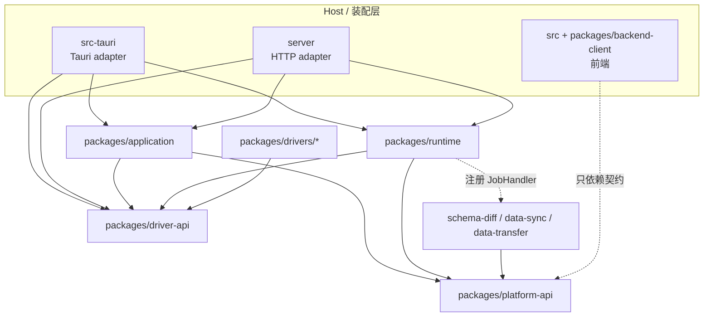
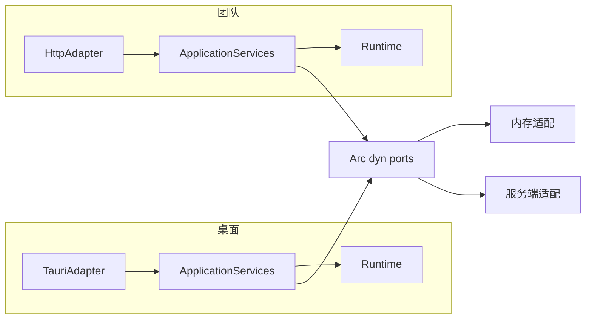
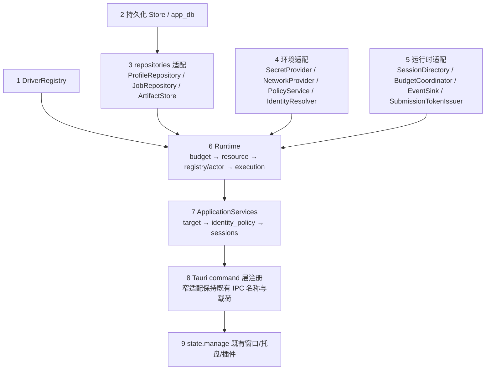
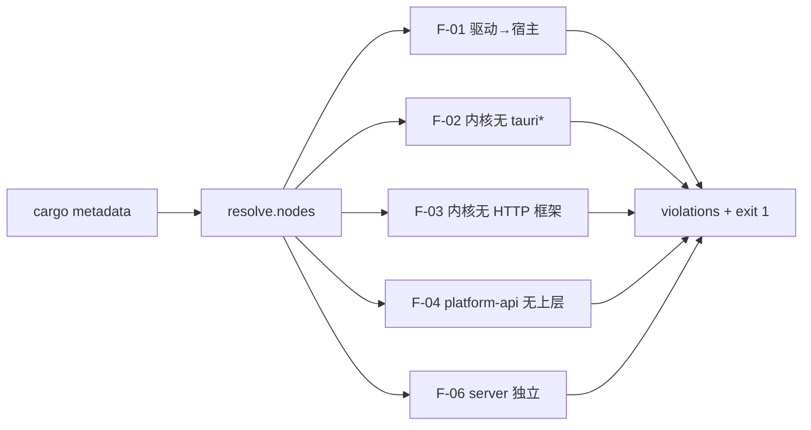

# DataZen 共享应用边界与端口详细设计

> 状态：目标设计，尚未实现。基线：2026-09-30，代码提交 `8592b0fe1`。本文交付的是开发契约，不代表已完成重构。
> 代码核对时的工作区 HEAD 为 `e544e0699`（2026-09-30 21:08）。`8592b0fe1` 是 HEAD 的祖先，两者相差 4 个提交（改动仅限 `AGENTS.md`、`docs/`、`src/components/connection/navigator/`）；`git diff --stat 8592b0fe1..HEAD -- Cargo.toml pnpm-workspace.yaml pnpm-lock.yaml tsconfig.json vite.config.ts package.json scripts src-tauri packages .github` 输出为空，因此本文关于 workspace 成员、前端三处接线与门禁脚本的事实对两个基线一致。
> 读者：负责 P1「抽取共享应用边界和前端传输契约」的实现者。本文只定义包边界、端口签名、组装方式和护栏；DTO 语义、会话状态机、资源预算算法以既有文档为权威，本文不重复定义。
> 配套：[系统概要](system-overview.md)、[连接管理详细设计](connection-management.md)、[分阶段开发计划](../../development/platform-development-plan.md)。

## 1. 本文定位与配套契约

| 本文负责 | 权威文档（不重复定义） |
| --- | --- |
| 新增包的职责、依赖方向、模块树 | [概要 §4 模块职责与边界](system-overview.md#4-模块职责与边界)、[§4.1 目标代码组织](system-overview.md#41-目标代码组织) |
| `RequestContext` 的字段来源与构造位置 | [概要 §6.1 应用上下文](system-overview.md#61-应用上下文)、[连接 §3 INV-01](connection-management.md#3-不可破坏的不变量) |
| 所有连接 DTO / 回执 / 事件形状 | [连接 §4 DTO 与字段定义](connection-management.md#4-dto-与字段定义)、[§4.1 服务接口与补充响应](connection-management.md#41-服务接口与补充响应)、[§4.2 内部记录](connection-management.md#42-内部记录) |
| 端口 trait 的 Rust 签名、错误与装配差异 | 本文 §4 |
| 会话/资源/预算的行为契约 | [连接 §6 状态机与并发](connection-management.md#6-状态机与并发)、[§9 连接池、预算与清理](connection-management.md#9-连接池预算与清理) |
| 错误码取值 | [连接 §13 错误、重试和事件](connection-management.md#13-错误重试和事件) |
| 阶段顺序与交付门槛 | [开发计划 §5 P1](../../development/platform-development-plan.md#5-p1抽取共享应用边界和前端传输契约)、[§17 补充契约的阶段归属](../../development/platform-development-plan.md#17-补充契约的阶段归属) |

本文所有 crate 路径（`packages/application`、`packages/runtime`、`packages/platform-api`、`packages/backend-client`、`server/`）在基线提交上**均不存在**；仓库当前的 workspace 成员只有 `src-tauri`、`packages/driver-api`、`packages/ai-api`、`packages/drivers/*`（见根 [`Cargo.toml`](../../../Cargo.toml)）。下文提到这些路径时一律为目标设计。

## 2. 包边界与依赖矩阵

### 2.1 四个新包的职责

| 包 | 一句话职责 | 拥有的概念 | 明确不拥有 |
| --- | --- | --- | --- |
| `packages/platform-api` | 无平台依赖的最底层契约：ID newtype、`RequestContext`、全部 port trait、port 错误 | ID 类型、身份上下文、端口签名 | 任何用例逻辑、任何具体实现、任何 I/O |
| `packages/application` | 用例编排：目标解析、授权顺序、DTO 校验、错误归一 | 请求/响应 DTO 的应用侧视图、`ApiError`、用例服务 | 会话状态、物理资源、驱动类型分支 |
| `packages/runtime` | 连接运行时：session actor、资源与 lease、预算记账、execution 登记、事件 | `DbSession`、`ResourceLease`、`Execution`、Job 阶段 runtime 状态 | 权限判定来源、持久化介质、网络出口 |
| `packages/backend-client` | TypeScript 侧传输无关契约：DTO 镜像、client 接口、transport 接口 | `Id`/`Counter`/`Timestamp` 镜像、`BackendClient` 接口、`PlatformServices` 接口 | Tauri/HTTP/fetch 任何具体实现 |

### 2.2 模块树

```text
packages/platform-api/src/
├── id.rs                     # ID newtype（含宏）、Counter、Timestamp
├── context.rs                # RequestContext、OwnerRef、DelegationRef
├── error.rs                  # PortError
├── ports/
│   ├── profile.rs            # ProfileRepository
│   ├── policy.rs             # PolicyService
│   ├── secret.rs             # SecretProvider
│   ├── job.rs                # JobRepository
│   ├── session_directory.rs  # SessionDirectory
│   ├── token.rs              # SubmissionTokenIssuer
│   ├── artifact.rs           # ArtifactStore
│   ├── event.rs              # EventSink
│   ├── network.rs            # NetworkProvider
│   ├── budget.rs             # BudgetCoordinator
│   └── identity.rs           # IdentityResolver
└── lib.rs

packages/application/src/
├── dto/                      # re-export 连接 §4 的形状，不新增字段语义
├── error.rs                  # ApiError + code 常量
├── target.rs                 # CanonicalTarget 计算与 targetRequirements 校验
├── identity_policy.rs        # INV-01..INV-03 的判定顺序编排
├── sessions.rs               # openSession/executeInSession/executeAtTarget/...
└── lib.rs

packages/runtime/src/
├── connection/               # 见 §3
├── budget.rs                 # 本机多维许可（port 之后的本地实现）
├── execution.rs
├── events.rs
├── job.rs
└── lib.rs

packages/backend-client/src/
├── types/                    # Id、Counter、Timestamp、SessionView、ExecutionView...
├── client.ts                 # BackendClient 接口
├── transport.ts              # BackendTransport 绑定接口、PlatformServices 接口（§7.1）
├── streams.ts                # AsyncIterable 事件流抽象
├── errors.ts                 # ApiError 反序列化
└── index.ts
```

### 2.3 依赖方向



### 2.4 禁止的反向依赖（可被门禁直接检查的断言）

| 编号 | 断言 | 违背后果 |
| --- | --- | --- |
| F-01 | `packages/drivers/*` 的 crate 依赖闭包不含 `datazen`、`datazen-runtime`、`datazen-application`、`datazen-platform-api`、`datazen-ai-api` | 驱动反向引用宿主，Web 端与宿主无关的构建被拖垮 |
| F-02 | `packages/application`、`packages/runtime`、`packages/platform-api` 的 normal + build 依赖闭包不含任何 `tauri*` crate，且不含 `datazen` 宿主 crate | 内核无法在没有 Tauri 的进程（测试、server worker）中编译 |
| F-03 | `packages/application`、`packages/runtime` 不含 `axum`、`actix-web`、`warp`、`tonic` 等 HTTP/传输框架 | 传输策略渗入业务内核 |
| F-04 | `packages/platform-api` 不依赖 `application` / `runtime` / 领域包 / `src-tauri` | ports 与用例循环依赖 |
| F-05 | `packages/application`、`packages/runtime`、`packages/platform-api` 不出现 `react`、`@tauri-apps/api` 等前端标识（Rust 侧通过 crate 名与 `build.rs` 依赖检查，前端侧由 §7 的字符串扫描补齐） | UI 运行时进入后端依赖图 |
| F-06 | `server` 的 normal + build 依赖闭包不含 `tauri*` 与 `datazen` 宿主 crate | server 无法独立构建 |
| F-07 | `packages/backend-client` 不含 `@tauri-apps/` 前缀、`fetch(`、`XMLHttpRequest` 字面量 | 传输无关契约被具体传输污染 |

### 2.5 workspace 成员的目标写法

按根 `Cargo.toml` 现有风格（`members` 数组 + `[workspace.dependencies]` 只放被多处引用的 crate），P1 落地时新增条目形如：

```toml
[workspace]
members = [
    "src-tauri",
    "server",
    "packages/ai-api",
    "packages/application",
    "packages/driver-api",
    "packages/drivers/*",
    "packages/platform-api",
    "packages/runtime",
]
```

约束：`packages/backend-client` 是 TypeScript 包，**不得**加入 Cargo `members`（上一代码块中不出现该行即为此故）。`packages/drivers/*` 的通配与三个 `exclude`（kiwi / olap / superset）保持原样，驱动注入仍由 `scripts/resolve-drivers.mjs` 写入占位段。`[workspace.dependencies]` 中 `datazen-driver-api` 现有写法 `{ path = "packages/driver-api" }` 保持不变，新增 `datazen-application` / `datazen-runtime` / `datazen-platform-api` 同风格追加。

前端侧要接线的不是 pnpm workspace：当前 `pnpm-workspace.yaml` 只有 `allowBuilds:`、**没有 `packages:` 通配**，`pnpm-lock.yaml` 也只有根一个 importer，因此 `packages/*` 下的前端包并不通过 pnpm 链接进 `node_modules`（`node_modules/@datazen/*` 不存在）。既有 `packages/driver-sdk`、`packages/ui`、`packages/wapp-sdk`、`packages/extension-points` 靠三处显式配置生效，`packages/backend-client` 必须同样补齐三处：

1. `tsconfig.json` 的 `compilerOptions.paths` 增加 `@datazen/backend-client` → `./packages/backend-client/src/index.ts`；
2. 同一文件的 `include` 数组显式加入 `packages/backend-client`（该数组当前逐个列出包目录，新增包不会自动纳入 `pnpm typecheck`）；
3. `vite.config.ts` 的 `resolve.alias` 增加同一条别名（应用运行期解析与 `typecheck` 解析分开，只配 paths 会在 Vite 构建时解析不到）。

## 3. runtime 包内部模块

### 3.1 目录约定

拟新增模块全部落在 `packages/runtime/src/connection/`，与[连接管理 §14](connection-management.md#14-开发步骤与文件职责)的模块划分一一对应；runtime 的非连接职责（job 阶段调度、事件分发）留在 `packages/runtime/src/` 顶层，不进入 `connection/`。

```text
packages/runtime/src/connection/
├── mod.rs
├── types.rs          # 1 types/error
├── error.rs          # 1 types/error
├── testing.rs        # 2 testing/fake_resource
├── fake_resource.rs  # 2 testing/fake_resource
├── budget.rs         # 3 budget
├── resource.rs       # 4 resource
├── registry.rs       # 5 registry/actor
├── session_actor.rs  # 5 registry/actor
├── execution.rs      # 6 execution
├── adapters.rs       # 7 adapters
├── consumers.rs      # 8 consumers
└── routing.rs        # 9 routing
```

### 3.2 九个模块

| # | 模块 | 职责 | 公开类型（`pub`） | 内部状态（不 `pub`） | 明确不导出 |
| --- | --- | --- | --- | --- | --- |
| 1 | `types` / `error` | newtype、DTO 镜像、枚举、schema 校验 | `DbSessionId`、`SessionHandle`、`CanonicalTarget`、`ResourceLease`、`ExecutionErrorCode`、`RuntimeError` | `NAMESPACE_FIELDS` 校验表 | 不导出任何驱动专属类型；不导出序列化格式决策（属 adapters） |
| 2 | `testing` / `fake_resource` | 假资源、状态、屏障、故障注入；可返回事务/游标句柄的假命令 | `FakeResource`、`FakeClock`、`FailureInjector`、`FakeResourceJournal` | journal 计数、屏障等待队列 | 仅在 `#[cfg(any(test, feature = "test-harness"))]` 下编译；不导出 `FakeResource` 的内部句柄结构 |
| 3 | `budget` | 本机多维许可、可取消等待、幂等核销 | `BudgetRequest`、`BudgetPermit`、`BudgetSnapshot` | 分类队列与保留额、permit 账本 | 不导出全局连接额度常量（由 `BudgetCoordinator` 提供者决定） |
| 4 | `resource` | acquire / cleanup / quarantine、隧道引用、归池前宿主检查 | `ResourceManager`、`LeaseRequest`、`CleanupReport` | 物理连接表、poolKey 索引 | 不导出驱动 `Clean` 判定；不导出物理连接句柄 |
| 5 | `registry` / `actor` | session 生命周期、串行队列、`RuntimeEpoch`、会话级句柄登记 | `SessionRegistry`、`SessionActorHandle`、`SessionView` | actor 邮箱、句柄登记表 | 不导出 `dbSessionId` 生成器（由 `SessionDirectory` 决定） |
| 6 | `execution` | 幂等、授权重校验、来源、事件发布、取消 | `ExecutionGateway`、`ExecutionReceipt`、`CancelReceipt`、`ResultProvenance` | 幂等键账本、取消句柄表 | 不导出 `policyIsolationKey` 计算（属 `PolicyService`） |
| 7 | `adapters` | IPC / BackendClient 窄适配、旧接口过渡 | `ConnectionServiceImpl`（实现[连接 §4.1](connection-management.md#41-服务接口与补充响应)的服务接口） | 旧 manager 的句柄映射表 | 不导出第二套执行逻辑；同一请求不同时经过新旧管理器 |
| 8 | `consumers` | Query / Table / metadata、三件套、Workflow 的资源消费策略 | `ResourceConsumerProfile`、各 consumer 的声明式策略 | consumer → 资源类别映射 | 不持有 UI 生命周期；不把 tab 关闭当会话关闭 |
| 9 | `routing` | worker 目录入口、全局预算入口、drain | `RuntimeRouter`、`DrainPlan` | 节点心跳、drain 中的 worker 集合 | 不把旧 session 绑定到替代 worker；不做 sticky 路由决策以外的持久化 |

### 3.3 文件规模与拆分规则

- 单文件推荐不超过 800 行（[AGENTS.md](../../../AGENTS.md) 约定）。`session_actor.rs`、`resource.rs`、`execution.rs` 是最可能触顶的三个文件。
- 拆分单位是职责而非行数：状态机与它的转移表同文件，序列化与协议映射进 `adapters.rs`，两者不得互相内联。
- 生产路径禁止裸 `unwrap()` / `expect()`；错误一律 `thiserror` + `tracing`，对外统一 `CommandError` 映射（`CommandError` 定义在 `src-tauri/src/commands/error.rs`，Tauri adapter 侧职责见 [概要 §4](system-overview.md#4-模块职责与边界)）。

## 4. 端口 trait 草案

### 4.1 通用约定

- 所有 ID 参数使用 `platform-api` 的 newtype（`OrganizationId`、`PrincipalId`、`ConnectionId`、`DbSessionId`、`JobId`、`ExecutionId`、`ArtifactId`、`StreamId`、`RuntimeEpoch`…），**不使用裸 `String` 标识语义**。`connectionId` = 持久化配置 ID，`dbSessionId` = 运行时会话 ID，两者永不混用（[ID 术语规范](../../../AGENTS.md#id-术语规范)）。
- **`RequestContext` 与全部 ID newtype 定义在 `platform-api`**，无行为、无平台依赖；`application` 与 `runtime` 用 `pub use` 再导出。这样端口签名（`platform-api`）与用例签名（`application`）共用同一份类型定义而不产生依赖倒置（否则 `platform-api` 必须反向依赖 `application`，与 F-04 冲突）。
- 端口 trait 一律 `#[async_trait] pub trait X: Send + Sync + 'static`，对象安全，通过 `Arc<dyn X>` 注入。
- 端口错误统一 `PortError`；**业务拒绝不在端口层抛出**，由用例层转 `ApiError`（码表见[连接 §13](connection-management.md#13-错误重试和事件)）；执行终态错误走 `ExecutionErrorCode`，与 `ApiError.code` 是两个独立命名空间。
- 端口不做重试、不做权限判定、不做缓存。缓存与版本计算由 port 的提供方负责（例如 `SecretProvider` 负责 `credentialRevision`）。

**类型名的来源声明（本文集中说明一次）**：§4.3–§4.6 签名里出现的类型分两类，不得混为一谈。

- **复用既有文档的既有类型，形状不在本文重定义**：`RequestContext`（[概要 §6.1](system-overview.md#61-应用上下文)）、`OwnerRef`、`ExecutionTarget`、`SessionHandle`、`ConnectionEvent`、`IdempotentOperation`、`SubmissionToken`、`EventEnvelope`、`ExecutionErrorCode`（[连接 §4](connection-management.md#4-dto-与字段定义) 与 [§4.1](connection-management.md#41-服务接口与补充响应)）、`ProfileDraft`、`ProfilePatch`、`JobState`、`ArtifactChunk`（[概要 §6.2 BackendClient 与领域客户端](system-overview.md#62-backendclient-与领域客户端)）、`ApiError`（[概要 §6.3 首版 HTTP 映射](system-overview.md#63-首版-http-映射)、[连接 §13](connection-management.md#13-错误重试和事件)）。其中 `SubmissionToken.idempotencyKey` 的标量类型在本文记作 `IdempotencyKey`，指的就是该字段本身，不是新概念。
- **本文新定义的类型**（这些名字在既有文档中或只被引用而无形体定义（如 `AuthorizationDecision`、`PortError`），或只以字段名/裸 `Counter` 出现（`delegationId`、`afterSequence`、`secretRef`、`credentialRevision`、`policyIsolationKey`、`executionIdentityKey`、`networkRouteRef`）；类型定义随 P1 一起在本包建立，语义仍以既有文档为权威）：§4.1 的 `PortError`；§4.3 的 `ProfileScope`/`ProfileRecord`/`ConfigRevision`/`JobDefinition`/`JobRecord`/`StageRecord`/`JobStateVersion`/`JobFilter`/`RecoveryFilter`/`Checkpoint`（形状即[连接 §4.2](connection-management.md#42-内部记录) 的 `JobCheckpoint`，端口层另起本名）/`CommitBoundary`/`JobClaim`/`WorkerId`/`AuthorizationSubject`/`AuthorizationAction`/`AuthorizationDecision`/`DelegationRef`/`DelegationGrant`/`PolicyIsolationKey`/`PolicyChangeStream`/`ExecutionIdentity`；§4.4 的 `SecretRef`/`SecretPurpose`/`ResolvedCredential`/`CredentialRevision`/`NetworkRouteRef`/`NetworkRouteRevision`/`RoutePlan`/`TunnelSpec`/`TunnelBinding`；§4.5 的 `SessionOwner`/`ReplacementCommit`/`ReplacementOutcome`/`InvalidationReason`/`CloseDisposition`/`BudgetRequest`/`BudgetPermit`/`BudgetPermitSet`/`NodeLease`/`DrainScope`/`DrainStatus`/`ReleaseOutcome`/`BudgetSnapshot`/`SubmissionPresentation`/`VerifiedSubmission`/`KeyVersion`；§4.6 的 `ArtifactSpec`/`ArtifactWriter`/`ChunkPayload`/`ChunkIndex`/`ByteRange`/`ExportSink`/`ExportReceipt`/`RevokeReason`/`EventSubscription`/`EventSequence`。它们是端口契约的私有词汇表，落盘与序列化规则各自写在其方法注释里。

```rust
// packages/platform-api/src/error.rs（目标设计）
#[derive(Debug, thiserror::Error)]
pub enum PortError {
    #[error("backend unavailable: {0}")]           BackendUnavailable(String),
    #[error("compare-and-set conflict on {entity} {id}")]
    CasConflict { entity: &'static str, id: String },
    #[error("not found: {0}")]                     NotFound(String),
    #[error("token verification failed")]          TokenInvalid,
    #[error("provider timeout: {0}")]               ProviderTimeout(String),
    #[error("artifact expired")]                    ArtifactExpired,
    #[error("quota exceeded: {0}")]                QuotaExceeded(String),
}
```

### 4.2 端口方法语义的对齐来源

[概要 §6.4 repositories 与环境 ports](system-overview.md#64-repositories-与环境-ports) 已给出 10 个端口的**方法语义**（谁提供什么、什么不得序列化、什么禁止落盘）。本节的 Rust 签名是那张表的类型化草案，共 11 个 trait = §6.4 的 10 行 + 本文新增的 `IdentityResolver`（§4.3 末）：§6.4 只有 10 行、最后一行是 `BudgetCoordinator`，`IdentityResolver` 不在其中（名字已见于[连接 §9.6](connection-management.md#96-poolkey版本与缓存的生产者) 的 PoolKey 维度表中 `executionIdentityKey` 一行，但 §6.4 的端口表没有它）；它与 §6.4 的 `SecretProvider` 行还有一处职责再划分，见下方第三条。

- 签名**不得收窄** [§6.4](system-overview.md#64-repositories-与环境-ports) 列出的语义；该表没写的方法名以本文为准。
- 端口之间允许协作（如 `ProfileRepository::disable` 后由 `PolicyService` 感知），但**不合并 trait**，以免实现方被迫实现不相关方法。
- 执行身份解析的归属已**收口**：§6.4 曾把「resolve execution identity」写在 `SecretProvider` 行，本文改判给 `IdentityResolver`（§4.3 末），`SecretProvider` 只提供版本化材料读取与轮换。现行[概要 §6.4](system-overview.md#64-repositories-与环境-ports) 的 `SecretProvider` 行与[概要 §4](system-overview.md#4-模块职责与边界) 的 `SecretProvider` 行均已移除「执行身份解析」，并在该表后新增一行说明「本表 10 行不含 `IdentityResolver`：执行身份解析由 `IdentityResolver` 承担」；**§6.4 仍是 10 行**，没有把 `IdentityResolver` 补成第 11 行——它由本文 §4.3 末新增，与 §4.2「§6.4 的 10 行 + 本文新增的 `IdentityResolver`」的口径一致。本文的判读与[连接 §9.6](connection-management.md#96-poolkey版本与缓存的生产者)（`executionIdentityKey` → `IdentityResolver`）和 [persistence-model §4.3](persistence-model.md#43-只存在于服务端的字段) 的生产者表三方同口径。

### 4.3 持久化与授权端口

```rust
#[async_trait]
pub trait ProfileRepository: Send + Sync + 'static {
    /// 以组织限定查询；越组织访问返回 NotFound 而不是 Empty（CM-05）。
    async fn list(&self, ctx: &RequestContext, scope: ProfileScope)
        -> Result<Vec<ProfileRecord>, PortError>;
    async fn get(&self, ctx: &RequestContext, connection_id: ConnectionId)
        -> Result<Option<ProfileRecord>, PortError>;
    async fn create(&self, ctx: &RequestContext, draft: ProfileDraft, idem: &IdempotencyKey)
        -> Result<ProfileRecord, PortError>;
    /// 按 expectedRevision 保存：版本不匹配返回 CasConflict，端口只承诺这一取值；它落到哪个 ApiError.code 由 server host 决定：[连接 §13](connection-management.md#13-错误重试和事件) code 表里的 TargetConflict 指命名空间**目标**冲突，与 CAS 失败无关；configRevision CAS 失败由 server host（[团队服务 §9.2](team-server-and-auth.md#92-apierror--http-映射表)）映射 409 ConfigRevisionMismatch，该 code 已由 §13 正式登记（触发列即本方法的 expectedRevision CAS 失败）。
    async fn compare_and_set(&self, ctx: &RequestContext, connection_id: ConnectionId,
        expected: ConfigRevision, patch: ProfilePatch) -> Result<ProfileRecord, PortError>;
    /// 禁用后不再出现在默认列表；物理会话按[连接 §7.5](connection-management.md#75-closesession)关闭，不由本端口触发。
    async fn disable(&self, ctx: &RequestContext, connection_id: ConnectionId)
        -> Result<ProfileRecord, PortError>;
    async fn advance_credential_revision(&self, ctx: &RequestContext, connection_id: ConnectionId)
        -> Result<CredentialRevision, PortError>;
}

#[async_trait]
pub trait JobRepository: Send + Sync + 'static {
    /// 先持久化后取资源（[连接 §10.1](connection-management.md#101-公共处理)）。成功返回即代表 Job 已受理。
    async fn accept(&self, ctx: &RequestContext, definition: JobDefinition, idem: &IdempotencyKey)
        -> Result<JobRecord, PortError>;
    async fn get(&self, ctx: &RequestContext, job_id: JobId) -> Result<JobRecord, PortError>;
    async fn list(&self, ctx: &RequestContext, filter: JobFilter)
        -> Result<Vec<JobRecord>, PortError>;
    async fn record_stage(&self, ctx: &RequestContext, job_id: JobId, stage: StageRecord)
        -> Result<(), PortError>;
    async fn record_commit_boundary(&self, ctx: &RequestContext, job_id: JobId, boundary: CommitBoundary)
        -> Result<(), PortError>;
    /// 状态 CAS；并发推进同一 Job 时由版本不匹配拒绝，不做覆盖写。
    async fn compare_and_set_state(&self, ctx: &RequestContext, job_id: JobId,
        expected: JobStateVersion, next: JobState) -> Result<JobRecord, PortError>;
    /// claim/renew：多 worker 抢占与续约；续约失败即视为失联（Job 停止新增资源）。
    async fn claim(&self, ctx: &RequestContext, job_id: JobId, worker: WorkerId)
        -> Result<JobClaim, PortError>;
    async fn renew(&self, claim: &JobClaim) -> Result<JobClaim, PortError>;
    /// 检查点写入与恢复候选查询：只返回需要人工/计划核验的待办，不自动重放副作用阶段。
    async fn save_checkpoint(&self, ctx: &RequestContext, job_id: JobId, cp: Checkpoint)
        -> Result<(), PortError>;
    async fn list_recoverable(&self, ctx: &RequestContext, filter: RecoveryFilter)
        -> Result<Vec<JobRecord>, PortError>;
}

#[async_trait]
pub trait PolicyService: Send + Sync + 'static {
    async fn authorize(&self, ctx: &RequestContext, subject: AuthorizationSubject,
        action: AuthorizationAction) -> Result<AuthorizationDecision, PortError>;
    /// 委托校验：被委托主体、作用域与有效期三者均需匹配，失败不得降级为调用者权限（CM-06）。
    async fn verify_delegation(&self, ctx: &RequestContext, delegation: DelegationRef)
        -> Result<DelegationGrant, PortError>;
    /// 参与 PoolKey 的策略隔离键；权限撤销必须使键立即变化。
    fn isolation_key(&self, ctx: &RequestContext) -> Result<PolicyIsolationKey, PortError>;
    /// 权限版本变更通知：订阅者据此淘汰缓存键，不得轮询。
    fn subscribe_version_changes(&self) -> PolicyChangeStream;
}

#[async_trait]
pub trait IdentityResolver: Send + Sync + 'static {
    /// 产出不可伪造的 executionIdentityKey；PoolKey 只用该键，不用客户端传入用户名。
    async fn resolve(&self, ctx: &RequestContext, target: &ExecutionTarget)
        -> Result<ExecutionIdentity, PortError>;
    async fn resolve_delegation(&self, ctx: &RequestContext, delegation: DelegationRef)
        -> Result<ExecutionIdentity, PortError>;
}
```

**端口命名来源（已统一）**：全仓统一用 `PolicyService`（[概要 §4](system-overview.md#4-模块职责与边界)、[概要 §6.4](system-overview.md#64-repositories-与环境-ports)）。此前只有[连接 §9.6](connection-management.md#96-poolkey版本与缓存的生产者) 把 `policyIsolationKey` 的生产者写作 `AuthorizationService`，与本节 `PolicyService::isolation_key` 是**同一职责的两种叫法**（组织/用户/策略版本与只读限制），不是两个服务——`authorize`/`verify_delegation` 也落在本节同一 trait。该处**已改写为 `PolicyService`**，`AuthorizationService` 在文档与代码中归零，也没有拆分出新服务；[persistence-model §4.3](persistence-model.md#43-只存在于服务端的字段) 的生产者表本就记在 `PolicyService` 名下，三方现为同一名字。

`JobRepository` 的落库白名单必须排除 `dbSessionId`、SessionHandle、lease/cursor、取消句柄与 attachment token（[连接 §4.4](connection-management.md#44-可落盘来源与运行时绑定)）；`ExecutionView` 的持久化投影按[连接 §4](connection-management.md#4-dto-与字段定义)的两层来源规则拆分，实时 `runtimeBinding` 只留在 runtime 内存。

### 4.4 秘密、网络与执行材料端口

```rust
#[async_trait]
pub trait SecretProvider: Send + Sync + 'static {
    /// 只供建连/轮换等执行路径；ResolvedCredential 不得进入任何普通查询响应，也不入日志。
    async fn resolve(&self, ctx: &RequestContext, secret_ref: SecretRef, purpose: SecretPurpose)
        -> Result<ResolvedCredential, PortError>;
    /// 读取指定版本的历史材料（回滚用），不改变当前版本。
    async fn read_versioned(&self, ctx: &RequestContext, secret_ref: SecretRef,
        revision: CredentialRevision) -> Result<ResolvedCredential, PortError>;
    async fn rotate(&self, ctx: &RequestContext, secret_ref: SecretRef,
        expected: CredentialRevision) -> Result<CredentialRevision, PortError>;
    /// 不透明版本号；禁止用密码散列充当 PoolKey 组件。
    fn revision(&self, secret_ref: SecretRef) -> Result<CredentialRevision, PortError>;
}

#[async_trait]
pub trait NetworkProvider: Send + Sync + 'static {
    /// 端点校验：出站策略检查含 DNS 解析后地址、重定向与隧道目标（[概要 §10](system-overview.md#10-安全和环境差异)）。
    async fn resolve_route(&self, ctx: &RequestContext, route_ref: NetworkRouteRef)
        -> Result<RoutePlan, PortError>;
    fn revision(&self, route_ref: NetworkRouteRef) -> Result<NetworkRouteRevision, PortError>;
    /// 共享引用：同一路由/隧道被多处使用时返回同一 binding 的引用计数句柄。
    async fn ensure_tunnel(&self, ctx: &RequestContext, spec: TunnelSpec)
        -> Result<TunnelBinding, PortError>;
    async fn release_tunnel(&self, binding: &TunnelBinding) -> Result<(), PortError>;
}
```

`SecretProvider` 只认 `SecretRef`，不认 `connectionId`；`connectionId` → `SecretRef` 的映射由 `ProfileRecord` 持有（[连接 §4.1](connection-management.md#41-服务接口与补充响应) 的内部 `ConnectionProfile` 同列 `connectionId` 与 `secretRef`）。因此[团队服务 §10.2 `SecretProvider`](team-server-and-auth.md#102-secretprovider) 的「按 `connectionId` + `credentialRevision` 解析执行身份」在端口层拆成三步：`ProfileRepository::get` 由 `connectionId` 取 `secretRef` 与 `configRevision`，`SecretProvider::resolve(ctx, secret_ref, purpose)` 配 `revision(secret_ref)` 取材料与 `CredentialRevision`，执行身份本身由 `IdentityResolver::resolve` 产出（§4.3）。

### 4.5 会话目录、预算与令牌端口

```rust
#[async_trait]
pub trait SessionDirectory: Send + Sync + 'static {
    /// dbSessionId 为随机 128 位以上；登记 owner/epoch 原子完成，碰撞重生成。
    async fn register(&self, owner: SessionOwner) -> Result<SessionHandle, PortError>;
    async fn lookup(&self, db_session_id: DbSessionId)
        -> Result<Option<SessionOwner>, PortError>;
    /// 只更新业务活动时间，且只在已接受的实际业务操作开始与终结时更新；登录心跳、读取状态、订阅与 attach 均不得刷新（[连接 §6.4](connection-management.md#64-attachment-与超期处理)、[§9.2](connection-management.md#92-可调初始值)）。
    async fn touch(&self, handle: &SessionHandle, business_activity: Timestamp)
        -> Result<(), PortError>;
    /// old/new/operation 状态必须原子提交：prepared 候选不可路由，committed 后旧条目改关闭路由。
    async fn commit_replacement(&self, commit: ReplacementCommit)
        -> Result<ReplacementOutcome, PortError>;
    /// worker 失联/资源丢失时作废条目；调用方必须让后续请求得到 SessionLost，不得透明重建。
    async fn invalidate(&self, db_session_id: DbSessionId, reason: InvalidationReason)
        -> Result<(), PortError>;
    async fn release(&self, handle: &SessionHandle, disposition: CloseDisposition)
        -> Result<(), PortError>;
    async fn sweep_expired(&self, now: Timestamp) -> Result<Vec<SessionOwner>, PortError>;
}

#[async_trait]
pub trait BudgetCoordinator: Send + Sync + 'static {
    /// 可取消等待，acquire timeout 默认 10 秒（取值来源：[连接 §9.2 可调初始值](connection-management.md#92-可调初始值)，首版配置起点而非硬编码），超时由用例转 ApiError ResourceBusy。
    async fn acquire(&self, request: BudgetRequest) -> Result<BudgetPermit, PortError>;
    async fn try_acquire(&self, request: BudgetRequest)
        -> Result<Option<BudgetPermit>, PortError>;
    /// Job 多端申请：一次预留全部许可或整体失败释放，不持有半边无限等待。
    async fn reserve_many(&self, requests: &[BudgetRequest])
        -> Result<BudgetPermitSet, PortError>;
    /// 节点额度续期；续约失败即视为失联，停止发放新资源，已有 permit 走各自正常归还。
    async fn renew_node_lease(&self, lease: &NodeLease) -> Result<NodeLease, PortError>;
    /// drain：进入排空后不再发放新 permit，等待已有 permit 归还。
    async fn drain(&self, scope: DrainScope) -> Result<DrainStatus, PortError>;
    /// 幂等核销：同一 permit 重复归还不重复释放额度（[连接 §9.3](connection-management.md#93-预算会计) / INV-10）。
    async fn release(&self, permit: &BudgetPermit, outcome: ReleaseOutcome)
        -> Result<(), PortError>;
    async fn snapshot(&self) -> Result<BudgetSnapshot, PortError>;
}

#[async_trait]
pub trait SubmissionTokenIssuer: Send + Sync + 'static {
    /// createProfile 不绑定会话；其余运行时会话操作绑定 owner runtimeEpoch。
    async fn issue(&self, ctx: &RequestContext, operation: IdempotentOperation,
        handle: Option<&SessionHandle>) -> Result<SubmissionToken, PortError>;
    async fn verify(&self, presented: &SubmissionPresentation)
        -> Result<VerifiedSubmission, PortError>;
    fn key_version(&self) -> Result<KeyVersion, PortError>;
}
```

`SessionDirectory` **禁止**磁盘持久化、快照与 append-only 日志；丢失目录必须使相关会话明确失效，不得据此恢复物理会话（[连接 §12](connection-management.md#12-web多实例权限与结果)）。`SubmissionTokenIssuer` 的签名载荷按[连接 §4.1](connection-management.md#41-服务接口与补充响应)的 `IdempotentOperation` 覆盖，默认有效期 24 小时，过期语义见[连接 §13.1](connection-management.md#131-幂等键期限与响应分类)。

### 4.6 结果与事件端口

```rust
#[async_trait]
pub trait ArtifactStore: Send + Sync + 'static {
    /// create writer：返回可写 artifact 与 writer 句柄；ACL 在 create 时绑定组织/owner。
    async fn create(&self, ctx: &RequestContext, spec: ArtifactSpec)
        -> Result<(ArtifactId, ArtifactWriter), PortError>;
    async fn append_chunk(&self, writer: &mut ArtifactWriter, chunk: ChunkPayload)
        -> Result<ChunkIndex, PortError>;
    /// finalize 后才可读；未 finalize 的 artifact 不可枚举也不可导出。
    async fn finalize(&self, writer: ArtifactWriter) -> Result<ArtifactId, PortError>;
    async fn read_chunk(&self, ctx: &RequestContext, artifact_id: ArtifactId, chunk_index: ChunkIndex)
        -> Result<ArtifactChunk, PortError>;
    async fn read_range(&self, ctx: &RequestContext, artifact_id: ArtifactId, range: ByteRange)
        -> Result<ArtifactChunk, PortError>;
    /// sink 是受控导出目标（对话框返回的句柄、服务端授权存储路径）；不接受任意服务器绝对路径。
    async fn export(&self, ctx: &RequestContext, artifact_id: ArtifactId, sink: ExportSink)
        -> Result<ExportReceipt, PortError>;
    /// TTL 删除：过期后读取返回 ArtifactExpired，不得以缓存副本继续服务。
    async fn delete_expired(&self, now: Timestamp) -> Result<Vec<ArtifactId>, PortError>;
    async fn revoke(&self, ctx: &RequestContext, artifact_id: ArtifactId, reason: RevokeReason)
        -> Result<(), PortError>;
}

#[async_trait]
pub trait EventSink: Send + Sync + 'static {
    async fn publish(&self, ctx: &RequestContext, envelope: EventEnvelope<ConnectionEvent>)
        -> Result<EventSequence, PortError>;
    /// 服务端一半；前端一半见 §7 的 AsyncIterable 抽象。
    async fn subscribe(&self, ctx: &RequestContext, stream_id: StreamId,
        after_sequence: Option<EventSequence>) -> Result<EventSubscription, PortError>;
}
```

`PortError::ArtifactExpired` 是端口层取值，**HTTP 状态码映射由 server host 决定**，不构成端口契约：team-server 出于防 ID 枚举把 `ArtifactExpired` 与 `NotFound` 统一映射为 404（不返回 410，见[团队服务 §9.2](team-server-and-auth.md#92-apierror--http-映射表)）。

### 4.7 三种交付形态的适配差异

| 端口 | 桌面本地 | server 单进程 | 多 worker |
| --- | --- | --- | --- |
| `ProfileRepository` | 现有 SQLite + AES-256-GCM 存储（`src-tauri/src/store/`） | 同一实现，服务端数据库 | 同一实现，服务端数据库 |
| `JobRepository` | 本地库；窗口关闭即停止任务 | 服务端库，任务独立于连接存活 | 同上 |
| `PolicyService` | 固定本地组织，全部放行 + `readOnly` 配置 | OIDC 登录会话 + membership | 同单进程 |
| `IdentityResolver` | 当前桌面登录用户 + 配置中的连接账号 | 数据库侧服务身份 + 委托 | 同单进程 |
| `SecretProvider` | 本机钥匙串主密钥（开发/`DATAZEN_KEYRING=file` 走 `{appData}/.key`） | 服务端密钥管理 | 同单进程 |
| `NetworkProvider` | 允许 `localhost`/本机出口 + SSH/代理隧道 | 出站网络策略白名单 | 按 worker 节点策略 |
| `SessionDirectory` | 进程内 `HashMap` + TTL | 同一 port 的单进程实现 | 共享内存目录 + CAS |
| `BudgetCoordinator` | 进程内许可表，总额 16（[连接 §9.2](connection-management.md#92-可调初始值) 的「桌面总目标连接」，首版配置起点） | 节点额度 + 全局 permit | 全局 permit；失去续约停止新建连接 |
| `SubmissionTokenIssuer` | 进程内 HMAC 密钥 | 服务端签名密钥 + `keyVersion` 轮换 | 同单进程 |
| `ArtifactStore` | 本机目录 + 授权对话框 sink | 服务端存储 + 授权导出 | 同单进程 |
| `EventSink` | Tauri 事件推送 | SSE | SSE + worker 转发 |

### 4.8 装配形态



`ApplicationServices` 与 `Runtime` 的构造函数签名对两种形态相同，只有传入的 `Arc<dyn …>` 实现不同；不允许为团队形态另写一套用例。

## 5. RequestContext 的三个构造来源

`RequestContext` 由 **adapter** 构造并向下传递，**任何请求体字段都不得覆盖身份**（[连接 §3 INV-01](connection-management.md#3-不可破坏的不变量)、[概要 §6.1](system-overview.md#61-应用上下文)）。

| 字段 | Tauri adapter（桌面本地） | HTTP adapter（团队） | 后台 Job / 子执行 |
| --- | --- | --- | --- |
| `organizationId` | 固定本地组织 ID（进程常量） | 认证会话解析出的组织，交叉 membership 校验 | 发起 Job 的组织，逐阶段继承 |
| `principalId` | 当前桌面登录用户 | OIDC `sub` 映射的应用用户 | 服务身份；委托子执行取被委托主体 |
| `authenticationSessionId` | `null`（本地模式无登录会话） | 服务端登录会话 ID | 服务身份时为 `null`；用户委托时为父登录会话 ID |
| `clientInstanceId` | 每次应用启动生成的实例 ID | 前端实例注册 ID，绑定到认证身份 | `null`（无客户端） |
| `requestId` | 每个 IPC 调用生成 | 每个 HTTP 请求生成（回写响应头） | Job/阶段 ID 派生的稳定 ID，便于日志串联 |
| `delegationId` | `null` | 请求显式携带且经 `PolicyService` 校验 | 父执行/Job 的委托记录 ID |

### 5.1 三条硬约束

1. **身份只来自 adapter**：application/runtime 的用例函数签名以 `&RequestContext` 为第一参数，不提供任何「从 body 读 organizationId/principalId」的入口。
2. **后台执行不依赖 GUI 上下文**：Job 阶段构造的 `RequestContext` 不携带 `clientInstanceId`，`clientInstanceId` 不是授权依据（[概要 §6.1](system-overview.md#61-应用上下文)）。
3. **OwnerRef 与身份绑定**：`owner: editor` 必须在 adapter 层校验归属当前 client；`owner: job | workflowBlock` 必须校验属于已授权 Job。允许用户声称任意 job owner 违反[连接 §4 的 OwnerRef 规则](connection-management.md#4-dto-与字段定义)；组织与用户绑定存于服务端记录，前端不提供覆盖入口。

```rust
// 目标签名：身份是前置参数，不是可覆盖字段
pub struct OpenSessionUseCase;
impl OpenSessionUseCase {
    pub async fn handle(&self, ctx: &RequestContext, req: OpenSessionRequest)
        -> Result<OpenSessionReceipt, ApiError>;
    // req 中不含 organizationId / principalId / owner 的自由文本字段；
    // owner 只能取 OwnerRef::Editor 或 OwnerRef::Job { job_id }，并由 adapter 预校验。
}
```

## 6. Tauri adapter 组装根

### 6.1 AppState 的职责拆分

当前 `AppState`（[`src-tauri/src/commands/mod.rs`](../../../src-tauri/src/commands/mod.rs)）集中持有 18 个字段。P1 后按「是否属于平台适配」二分：

| 保留在 Tauri adapter（桌面专属） | 迁入 `packages/application` / `packages/runtime` |
| --- | --- |
| `driver_registry`（组装入口，运行时经 port 间接使用） | 连接用例（open / execute / setContext / close / attach / detach） |
| `store`、`schema_cache`、`sync_adapters`（`store` 作为 `ProfileRepository` 的桌面实现；后两者的端口 §4 未定义，暂不外移） | `ConnectionManager` 的会话生命周期与资源管理 |
| `schema_context_builder`、`prompt_resolver`（AI 组装） | `QueryExecutionRegistry` → `ExecutionGateway` 的 executionId ↔ 绑定登记 |
| `ai_registry`、`cancel_registry`（AI 组装） | `session_transactions` 的登记语义 → `SessionRegistry` 的会话级句柄登记 |
| `wapps`、`mcp_client_manager`、`workflow_scheduler`、`workflow_registry`、`workflow_history`、`monitor_*`（各自消费连接端口） | 连接配置写入（create/update/disable） |

拆分后 `AppState` 只保留「adapter 自己的状态 + 组装好的 `Arc<ApplicationServices>`」，不再直接持有会话/资源数据结构。

### 6.2 组装顺序



顺序不可交换的约束：`Runtime` 先于 `ApplicationServices` 构造（后者依赖前者）；`PolicyService`/`IdentityResolver` 必须先于 `Runtime`，因为池键计算依赖它们；`EventSink` 必须先于 `execution`，否则事件发布点会缺失。

### 6.3 保持不动的现有服务与窄适配

| 现有组件 | P1 处理方式 |
| --- | --- |
| `services/connection_manager.rs`（`ActiveSession`、`ConnectionManager`、`ConnectionError`） | 不删除；由 `connection/adapters.rs` 包裹为过渡实现，逐 consumer 迁移后删除旧路径 |
| `services/connection_manager/sessions.rs`、`tunnels.rs` | 同上；隧道生命周期通过 `NetworkProvider::ensure_tunnel` 的桌面实现承接 |
| `services/transaction.rs`（`TransactionHandle`） | 保持数据结构；登记语义改为写入 `SessionRegistry` 的会话级句柄表（[连接 §6.5](connection-management.md#65-会话级资源句柄登记)） |
| AI（`ai_registry`、`prompt_resolver`、`schema_context_builder`、`cancel_registry`） | 不动；只把「需要连接执行」的部分改为调用 application 用例 |
| Workflow（`workflow_registry`、`workflow_history`、`workflow_scheduler`、`command_runtime.rs`） | 不动；目标解析改为调用 application 的目标解析 |
| `store/`、`cache/`（`SchemaCache`） | 不动；`store` 作为 `ProfileRepository` 的桌面实现接入，`SchemaCache` 的端口尚不在 §4 范围内 |

## 7. BackendClient 与 PlatformServices 注入

### 7.1 传输无关契约

```typescript
// packages/backend-client/src/transport.ts（目标设计）
export interface BackendTransport {
  call<K extends keyof MethodMap>(method: K, payload: MethodMap[K]['request']):
    Promise<MethodMap[K]['response']>;
  /** 流传输适配为 AsyncIterable；结束迭代只取消订阅。 */
  subscribe?(method: 'subscribeEvents', payload: SubscribeEventsRequest):
    AsyncIterable<EventEnvelope<ConnectionEvent>>;
  cancel?(opaque: string, reason: string): Promise<void>;
}

export interface PlatformServices {
  saveTextWithDialog(input: SaveTextInput): Promise<boolean>;
  saveBinaryWithDialog(input: SaveBinaryInput): Promise<boolean>;
  openTextWithDialog(input: OpenTextInput): Promise<OpenedTextFile | null>;
  openDirectoryWithDialog(input: OpenDirectoryInput): Promise<OpenedDirectory | null>;
  writeClipboard(text: string): Promise<void>;
  readClipboard(): Promise<string>;
}
```

契约只声明方法与载荷形状，不含 `@tauri-apps/` 前缀、`fetch`、`XMLHttpRequest` 任何字面量（门禁 F-07）。业务方法清单与输入输出以 [概要 §6.2 BackendClient 与领域客户端](system-overview.md#62-backendclient-与领域客户端) 的表为权威，本文不重复列举；`backendId` 只用于选择门面，不作为业务方法参数，也不进入 `ExecutionTarget`。`PlatformServices` 沿用[概要 §4 模块职责与边界](system-overview.md#4-模块职责与边界)的能力划分口径（文件选择/上传/下载、窗口、剪贴板），名称与 §2.1 保持一致，不另立 `PlatformBridge` 之类的别名。

### 7.2 替换 invoke / Channel 的范围

基线上直接引用 Tauri 传输的 SDK 文件（[`packages/driver-sdk/src/ipc/driverCommands.ts`](../../../packages/driver-sdk/src/ipc/driverCommands.ts) 首行 `import { Channel, invoke } from '@tauri-apps/api/core';`；同目录 `schemaClient.ts`、`fileCommands.ts` 同形）：

| 现状 | P1 目标 |
| --- | --- |
| `driverCommands.executeStream` 用 `new Channel<QueryStreamEvent>()` + `invoke('execute_driver_command_stream', { onEvent })` | 改为调用已注入 transport 的 `executeDriverCommandStream`，`onEvent` 回调由 AsyncIterable 适配层提供 |
| `driverCommands.execute` / `schemaClient.*` 直接 `invoke` | 改为 transport `call`；签名与返回 `{ data }` 解包保持不变 |
| `fileCommands.*` 直接 `invoke` | 改由 `PlatformServices` 提供，桌面实现委托 `tauri-plugin-dialog` |
| `confirmDialogBridge` 的 `bindConfirmDialog` 绑定模式 | 保留该模式并扩展为 `PlatformServices` 的同类绑定，作为未注入时报错的样板 |

薄再导出过渡：`src/commands/*.ts` 现有 Tauri IPC 封装继续导出同名同签名函数，内部改为转发到已注入 transport；调用方不改 import，后续阶段再逐步改为直接依赖 `backend-client`。

### 7.3 backend 选择与注入时机

- backend 面板在应用启动阶段决定 backend 集合（桌面本地 / 团队远端），每个 backend 生成一个 `BackendClient` 门面实例。
- 注入时机：应用入口在首屏渲染前完成 `setBackendClient(backendId, client)` 与 `setPlatformServices(services)`；之后 `backendId` 变更只切换门面引用，不重建注入。
- 事件流：门面内部持有各自的订阅句柄，切换 backend 时对旧门面 `return()` 结束迭代；结束迭代只取消订阅，**不触发 `cancelExecution`**。

### 7.4 未注入时的显式错误

未注入即调用必须抛出可定位错误，不允许静默回退到 Tauri 直连。样板（沿用 [`packages/driver-sdk/src/confirmDialogBridge.ts`](../../../packages/driver-sdk/src/confirmDialogBridge.ts) 现有 `throw new Error('ConfirmDialog has not been bound to driver-sdk yet.')` 的形状）：

```typescript
export function useBackendClient(): BackendClient {
  const client = boundClient;
  if (!client) {
    throw new Error('BackendClient has not been bound; check that the platform adapter ran.');
  }
  return client;
}
```

## 8. 依赖护栏与 CI 门禁

### 8.1 前端侧：复用现有护栏的字符串扫描

`scripts/check-module-layers.mjs` 的 `LAYER_RULES`（`{name, from, forbidden[], forbiddenPackages[]}`，对已解析路径与裸包名同时做 `String.prototype.startsWith` 前缀匹配，无通配语义，配合 `scripts/lib/scanSourceCode.mjs` 与 `scripts/lib/scanTargets.mjs` 的 `SCAN_EXTENSIONS`/`SKIP_DIR_NAMES`/`isSkippedPath`/`readScannedIfPresent`）直接承载两条新规则：

| 规则名 | from | forbiddenPackages |
| --- | --- | --- |
| `backend-client-transport-agnostic` | `packages/backend-client/src` | `@tauri-apps/` |
| `driver-sdk-no-direct-tauri` | `packages/driver-sdk/src` | `@tauri-apps/` |

`forbiddenPackages` 必须写成 `@tauri-apps/` 而非 `@tauri-apps/*`：脚本只做前缀匹配，写成带星号的值将永远匹配不到 `@tauri-apps/api/core`。现有 `packages/ui` 规则使用的正是 `'@tauri-apps/'`，此处沿用同一写法，新增官方插件子包时也无需再改脚本。

driver-sdk 现有 3 个 `ipc/*.ts` 文件会命中第二条，因此该规则在 P1 落地时必须与 `packages/driver-sdk` 的迁移在同一 PR 内完成，或按 `check-driver-import-boundaries.mjs` 的 `ALLOWLIST` 精确三元组（规则 + 文件 + 说明符，带原因与到期报告）临时挂起——**禁止目录级或通配级豁免**。

### 8.2 Rust 侧：新增依赖闭包检查（目标设计，脚本尚未创建）

Rust 依赖不能用字符串扫描判定，必须解析依赖图。新脚本 `scripts/check-rust-dependency-boundaries.mjs`（**拟新增，基线提交上不存在**）读取 `cargo metadata --format-version 1` 的 `resolve.nodes`，对 §2.4 的 F-01～F-06 做 normal + build 双向闭包判定：



与既有脚本的复用关系：

| 维度 | 与 `check-*.mjs` 现有护栏 |
| --- | --- |
| 数据来源 | **不同**：本次解析 `cargo metadata` 的依赖图，不扫描源码字符串 |
| CLI 形态 | 相同：`--root=<dir>` 选项、违规打印 `rule: file/dep`、exit 1 |
| 白名单 | 相同思路：`ALLOWLIST` 精确三元组 + 到期报告，禁止目录级豁免 |
| 规则分级 | 相同：blocking 与 advisory 分开，advisory 不阻断 |
| 单测 | 相同落点：`scripts/__tests__/check-rust-dependency-boundaries.test.mjs`，用内联虚拟 `cargo metadata` JSON 夹具，不在单测里真跑 cargo |

### 8.3 CI 阻断方式

`.github/workflows/ci.yml` 当前把 8 条严格守卫合并在 frontend job 的一步里（`check-managed-stubs` / `check-structure-editor-guardrails` / `pnpm test:ids` / `pnpm test:layers` / `pnpm test:ci-docs` / `pnpm test:version` / `pnpm test:boundaries` / `pnpm test:i18n-keys`），任一失败即 fail-fast；聚合 job `ci` 是 `needs: [frontend, rust]` 的唯一 required status check。新门禁按数据来源分两处接入：

| 门禁 | 接入位置 | 理由 |
| --- | --- | --- |
| `test:layers`（**在既有 `pnpm test:layers` 脚本内新增两条规则**，脚本本身已存在） | frontend job | 纯 Node 字符串扫描，无需 cargo |
| `test:deps`（**拟新增**：`package.json` 当前没有 `test:deps`，P1 落地时新增该 script 指向 `scripts/check-rust-dependency-boundaries.mjs`） | rust job，**在 "Resolve drivers (basic)" 之后** | 驱动 crate 由 `scripts/resolve-drivers.mjs` 注入为 feature，注入前跑会漏掉驱动依赖边 |
| `cargo build -p datazen-server`（**目标 crate**，`server/` 目录在基线上不存在） | rust job，紧随 `test:deps` | 依赖图干净不等于能构建 |

任一失败 → 对应 job 失败 → 聚合 job `ci` 失败 → 分支保护的 required check 阻断合并。`scripts/run-regression.sh` 的本地全量门禁同步追加同一条命令，位置与现有 ① 边界护栏之后一致。

## 9. P1 退出标准与回退边界

### 9.1 退出标准（与[开发计划 §5 P1](../../development/platform-development-plan.md#5-p1抽取共享应用边界和前端传输契约)一致）

下表「可验证方式」列中的 `datazen-platform-api` / `datazen-application` / `datazen-runtime` / `datazen-server` 四个 crate 与 `pnpm test:deps` 脚本在基线提交上均不存在，属 P1 随包创建的目标产物（与[开发计划 §15.1](../../development/platform-development-plan.md#151-当前已有命令)「不把未创建命令列为现有脚本」一致）；`pnpm test:layers`、`pnpm test:unit`、`npx vitest run`、`cargo test -p datazen --lib` 为基线已有命令。

| 编号 | 验收项 | 可验证方式 |
| --- | --- | --- |
| E-1 | CM-01（ID 类型与序列化）、CM-03 会话创建幂等、CM-04 禁止配置 ID 回退、CM-05 跨用户/组织访问、CM-06 前端伪造 owner、CM-07 目标缺失与冲突的类型与 schema 断言 | `cargo test -p datazen-platform-api`、`cargo test -p datazen-application`；断言位置按[连接 §17 的类型/身份/目标组](connection-management.md#17-验收标准与证据) |
| E-2 | DTO 往返：`SessionView`、`ExecutionView`、`ContextChangeReceipt`、`CloseReceipt`、`CancelReceipt`、`OpenSessionReceipt` 经 adapter 序列化后反序列化字段等价 | 双向 round-trip 单测，含 64 位 Counter 以十进制字符串往返 |
| E-3 | 内核无 Tauri 编译：`packages/application`/`runtime`/`platform-api` 在没有 Tauri 的测试进程中可用 | `cargo test -p datazen-runtime --lib` 通过，且 F-02 门禁全绿 |
| E-4 | CI 依赖图检查通过 | `pnpm test:deps`（拟新增）与 `pnpm test:layers` 在 CI 中 exit 0 |
| E-5 | 旧桌面基本连接/查询流程保持可用 | 现有 `cargo test -p datazen --lib` 与 `npx vitest run` 不回归；基本连接 + 查询的人工旅程可用 |
| E-6 | RequestContext 三来源可验证 | 用例签名不接受身份字段的编译期断言 + 三来源字段装配单测 |
| E-7 | 未注入即调用报明确错误 | 前端单测覆盖 `backend-client` 与 `PlatformServices` 两条未绑定路径 |

### 9.2 回退条件与回退方式

| 触发条件 | 回退动作 | 禁止动作 |
| --- | --- | --- |
| E-5 回归且无法在 P1 窗口内修复 | Tauri adapter 回退为直接调用原用例实现，旧 `ConnectionManager` 继续承担全部连接路径 | 不得把新 owner 语义伪映射为旧的共享 session |
| 新 `BackendClient` 注入导致既有前端链路不可用 | 还原 `src/commands/*.ts` 的 Tauri 直连实现，`backend-client` 包保留但不注入 | 不得保留「部分调用点走新桥、部分走旧 IPC」的混合态 |
| `test:deps` 误报真实违规（例如 `tauri-plugin-dialog` 经 `src-tauri` 传递进入 runtime 闭包） | 以 `ALLOWLIST` 精确三元组记录原因与归属里程碑，**并在同一 PR 修正依赖方向** | 不得用 advisory 降级掩盖实际违规 |
| 依赖图门禁在 CI 中不稳定（metadata 解析随注入变化而漂移） | 固定检查时机（resolve-drivers 之后）并把期望快照纳入脚本夹具 | 不得把门禁改成永不失败的空转 |

## 与既有设计的关系

- **补充系统概要**：本文把 [概要 §4.1 目标代码组织](system-overview.md#41-目标代码组织) 列出的新建目录中属于本文边界的四个包（`platform-api` / `application` / `runtime` / `backend-client`）落到「谁拥有哪个类型、哪些反向依赖被禁止、workspace 成员怎么写」；把 §6.1 的 `RequestContext` 六字段落到三种 adapter 的逐字段取值来源；把 §6.2 的 BackendClient 落到 TS 传输无关接口与注入时机。§4.1 同时列出的 `schema-diff` / `data-sync` / `data-transfer` / `themes` / `server` 不在本文范围内。概要未涉及的端口 trait 签名、装配顺序、文件规模拆分规则由本文新增。
- **补充连接管理**：本文不重复 [连接 §4](connection-management.md#4-dto-与字段定义) 的任何 DTO 字段与 [§13](connection-management.md#13-错误重试和事件) 的任何错误码，只说明这些形状被哪些端口消费；把 §12 的 SessionDirectory 与 §9 的 BudgetCoordinator 从「行为描述」落成「Rust trait 签名与装配差异」；把 §14 的九个 runtime 模块补上公开类型、内部状态与不导出项。
- **不重叠的边界**：连接管理不规定 crate 依赖方向与 CI 脚本形态；系统概要不规定端口签名；开发计划只规定阶段与门槛，不规定包内文件划分。三者本文均不复述。

## 本文不覆盖什么

- 驱动固定资源契约、namespaceShape 与操作级 targetRequirements 的具体字段（P2）。
- 会话与 Lease 的状态机转移、资源清理判定、PoolKey 各字段的生产者细则（[连接管理 §6](connection-management.md#6-状态机与并发)、[§9.4](connection-management.md#94-归池前检查)、[§9.6](connection-management.md#96-poolkey版本与缓存的生产者)）。
- 多 worker 路由、原子 owner 登记、分区与全局预算的验收（[连接管理 §12](connection-management.md#12-web多实例权限与结果)，阶段归属 P9）。
- HTTP 路由、认证协议、CSRF、SSE 重连细节（[概要 §10](system-overview.md#10-安全和环境差异)给出要求，细则在 P7）。
- 迁移三件套、Workflow、AI、MCP、Wapp 的内部重构计划。
- 任何阶段排期、人员安排或进度记录。
