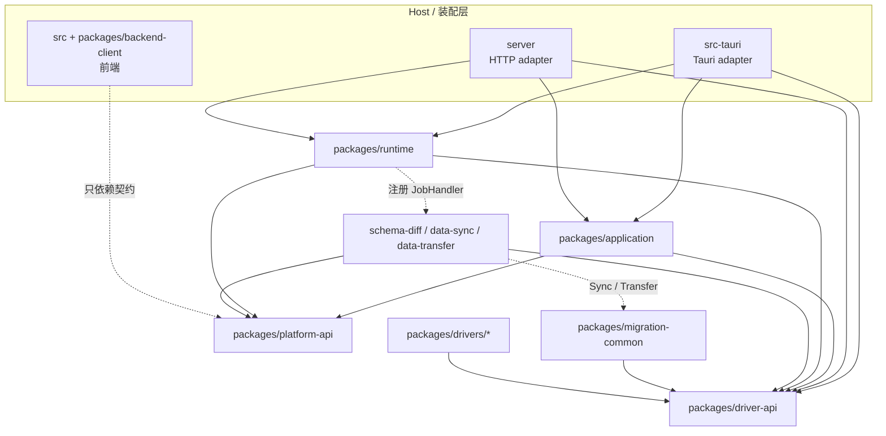
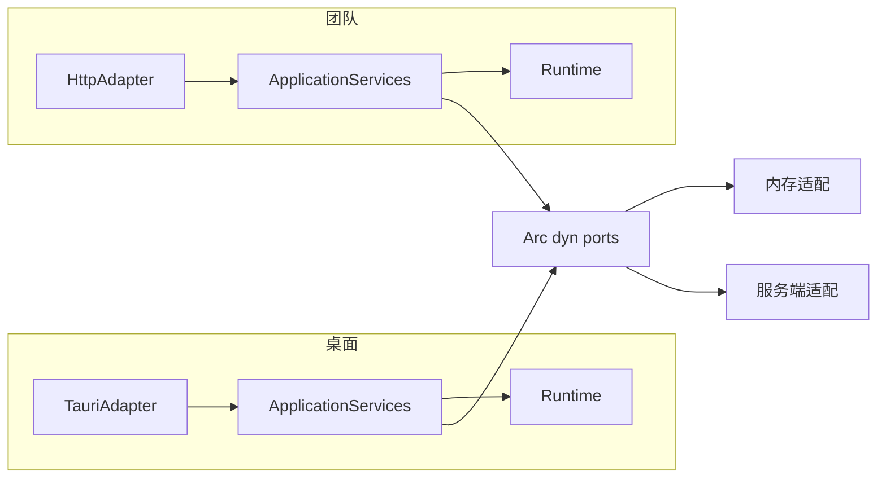
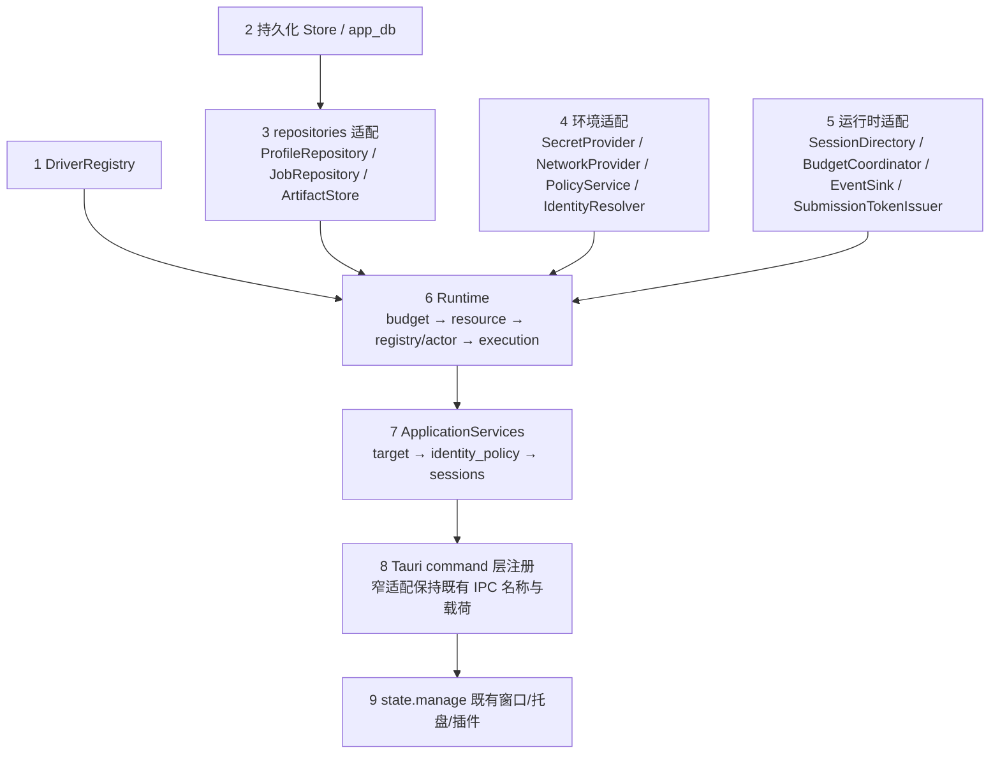
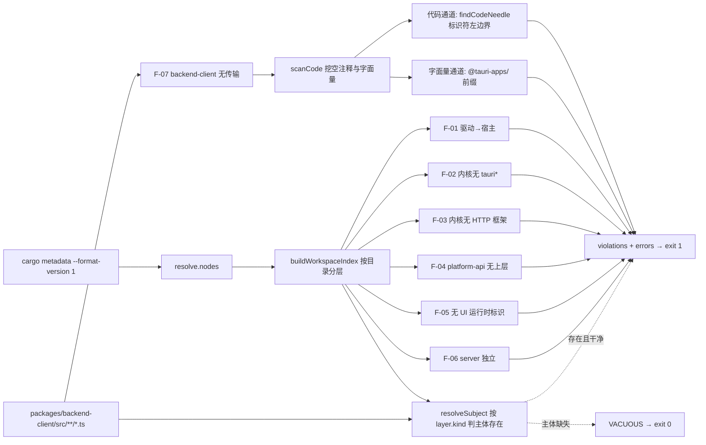

# DataZen 共享应用边界与端口详细设计

> 状态：平台 DTO / ports / facade 已实现；P5 已把 `DesktopJobHost` 与 AppDb SQLite v2 接入 AppState，并接通 Schema Diff、Data Sync、Data Transfer 三件套的桌面 Job 生命周期。团队 server 与完整 Profile/ConnectionUseCases 仍未全部接线，不能把本机 Job adapter 当成团队服务仓储。
>
> **尚未完整接线的准确含义**：运行期 `DesktopJobHost` 已承载三件套的桌面 Job；Profile/ConnectionUseCases 仍不能从真实连接配置完整构造所需的 revision/credential 字段。`src-tauri/src/platform/adapter.rs` 的连接用例不能为缺失字段伪造值。
>
> 仍待实现：团队 `server` crate、完整 Profile/ConnectionUseCases adapter，以及各节明确标为目标设计的 HTTP/多 worker 行为。P5 桌面迁移三件套独立测试与冒烟测试已通过；本机 Job host 不提供服务端或多 worker 语义。
> 读者：本文只定义包边界、端口签名、组装方式和护栏；DTO 语义、会话状态机、资源预算算法以既有文档为权威，本文不重复定义。标为「目标设计」的段落仍是契约，未随 P1 实现。
> 配套：[系统概要](system-overview.md)、[连接管理详细设计](connection-management.md)、[分阶段开发计划](../../development/platform-development-plan.md)。

## 1. 本文定位与配套契约

| 本文负责 | 权威文档（不重复定义） |
| --- | --- |
| 新增包的职责、依赖方向、模块树 | [概要 §4 模块职责与边界](system-overview.md#4-模块职责与边界)、[§4.1 目标代码组织](system-overview.md#41-目标代码组织) |
| `RequestContext` 的字段来源与构造位置 | [概要 §6.1 应用上下文](system-overview.md#61-应用上下文)、[连接 §3 INV-01](connection-management.md#3-不可破坏的不变量) |
| 所有连接 DTO / 回执 / 事件形状 | [连接 §4 DTO 与字段定义](connection-management.md#4-dto-与字段定义)、[§4.1 服务接口与补充响应](connection-management.md#41-服务接口与补充响应)、[§4.2 内部记录](connection-management.md#42-内部记录) |
| 端口 trait 的 Rust 签名、错误与装配差异 | 本文 §4 |
| 会话/资源/预算的行为契约 | [连接 §6 状态机与并发](connection-management.md#6-状态机与并发)、[§9 连接池、预算与清理](connection-management.md#9-连接池预算与清理) |
| 错误码取值 | [连接 §13 错误、重试和事件](connection-management.md#13-错误重试和事件) |
| 阶段顺序与交付门槛 | [开发计划 §5 P1](../../development/platform-development-plan.md#5-p1抽取共享应用边界和前端传输契约)、[§17 补充契约的阶段归属](../../development/platform-development-plan.md#17-补充契约的阶段归属) |

本文涉及的 crate 路径落地情况（按 `feat/platform-p1-core` 复核）：

| 路径 | 状态 |
| --- | --- |
| `packages/platform-api` | **已实现**，`datazen-platform-api`，Cargo 成员 |
| `packages/application` | **已实现**，`datazen-application`，Cargo 成员 |
| `packages/backend-client` | **已实现**，TS 包，**不是** Cargo 成员，接线三处已补齐（§2.5） |
| `packages/runtime` | 已存在于基线，但**其 ID / DTO 类型尚未迁移**到 `platform-api`（见 §2.6「待办：runtime 去重」） |
| `server/` | **不存在**，目标设计 |

`datazen-application` 的 normal + build 依赖闭包为 32 个 crate，`datazen-platform-api` 为 31 个；两者都不含 `tauri*`、不含宿主 crate `datazen`、不含 `axum`/`actix-web`/`warp`/`tonic`（`cargo metadata --format-version 1` 解析 `resolve.nodes` 闭包，见 F-02 / F-03 / F-04）。

## 2. 包边界与依赖矩阵

### 2.1 四个新包的职责

| 包 | 一句话职责 | 拥有的概念 | 明确不拥有 |
| --- | --- | --- | --- |
| `packages/platform-api` | 无平台依赖的最底层契约：ID newtype、`RequestContext`、全部 port trait、port 错误 | ID 类型、身份上下文、端口签名 | 任何用例逻辑、任何具体实现、任何 I/O |
| `packages/application` | 用例编排：目标解析、授权顺序、DTO 校验、错误归一 | 请求/响应 DTO 的应用侧视图、`ApiError`、用例服务 | 会话状态、物理资源、驱动类型分支 |
| `packages/runtime` | 连接运行时：session actor、资源与 lease、预算记账、execution 登记、事件 | `DbSession`、`ResourceLease`、`Execution`、Job 阶段 runtime 状态 | 权限判定来源、持久化介质、网络出口 |
| `packages/backend-client` | TypeScript 侧传输无关契约：DTO 镜像、client 接口、transport 接口 | `Id`/`Counter`/`Timestamp` 镜像、`BackendClient` 接口、`PlatformServices` 接口 | Tauri/HTTP/fetch 任何具体实现 |

### 2.2 模块树

```text
packages/platform-api/src/
├── id.rs                     # ID newtype（含宏）、Counter、Timestamp
├── context.rs                # RequestContext、OwnerRef、DelegationRef
├── error.rs                  # PortError
├── target.rs                 # NamespaceTarget/ObjectTarget/CanonicalTarget、namespaceShape 与 targetRequirements
├── ports/
│   ├── profile.rs            # ProfileRepository
│   ├── policy.rs             # PolicyService
│   ├── secret.rs             # SecretProvider
│   ├── job.rs                # JobRepository
│   ├── session_directory.rs  # SessionDirectory
│   ├── token.rs              # SubmissionTokenIssuer
│   ├── artifact.rs           # ArtifactStore
│   ├── event.rs              # EventSink
│   ├── network.rs            # NetworkProvider
│   ├── budget.rs             # BudgetCoordinator
│   └── identity.rs           # IdentityResolver
├── dto/                      # 连接 §4 的契约词表：session / execution / job / artifact / profile / event / idempotency
└── lib.rs

packages/application/src/
├── dto/
│   ├── mod.rs                # re-export platform-api 的契约 DTO（不新增字段语义）
│   ├── requests.rs           # 用例入参与纯校验函数
│   ├── execution.rs          # DurableExecutionRecord（不可表示运行时绑定）
│   └── accept.rs             # IdempotencyAcceptRecord、AcceptedSubject、接受记录保留期
├── error.rs                  # ApiError + ApiErrorCode(31) + RetryDisposition
├── target.rs                 # CanonicalTarget 计算与 targetRequirements 校验（§4.3 六步纯函数）
├── identity_policy.rs        # INV-01..INV-03 的判定顺序编排
├── sessions.rs               # ConnectionUseCases：连接 §4.1 的 13 个方法签名
└── lib.rs                    # ApplicationServices（§6.2 装配顺序第 7 步）

packages/runtime/src/
├── connection/               # 见 §3（尚未迁移到 platform-api 类型，见 §2.6）
├── budget.rs                 # 本机多维许可（port 之后的本地实现）
├── execution.rs
├── events.rs
├── job.rs
└── lib.rs

packages/backend-client/src/
├── types/                    # ids、target、context、session、execution、job、profile、artifact、event、idempotency、requests
├── client.ts                 # BackendClient 接口（21 个方法）+ backendId 注入登记
├── transport.ts              # BackendTransport 绑定接口、PlatformServices 接口（§7.1）、MethodMap
├── streams.ts                # AsyncIterable 事件流抽象
├── errors.ts                 # ApiError 反序列化
├── __tests__/                # 契约自检、门面载荷、流与错误
└── index.ts
```

### 2.3 依赖方向



### 2.4 禁止的反向依赖（可被门禁直接检查的断言）

| 编号 | 断言 | 违背后果 |
| --- | --- | --- |
| F-01 | `packages/drivers/*` 的 crate 依赖闭包不含 `datazen`、`datazen-runtime`、`datazen-application`、`datazen-platform-api`、`datazen-ai-api`，且不含任何 `tauri*` crate | 驱动反向引用宿主或宿主框架，Web 端与宿主无关的构建被拖垮 |
| F-02 | `packages/application`、`packages/runtime`、`packages/platform-api` 的 normal + build 依赖闭包不含任何 `tauri*` crate，且不含 `datazen` 宿主 crate | 内核无法在没有 Tauri 的进程（测试、server worker）中编译 |
| F-03 | `packages/application`、`packages/runtime` 不含 `axum`、`actix-web`、`warp`、`tonic` 等 HTTP/传输框架 | 传输策略渗入业务内核 |
| F-04 | `packages/platform-api` 不依赖 `application` / `runtime` / 领域包 / `src-tauri` | ports 与用例循环依赖 |
| F-05 | `packages/application`、`packages/runtime`、`packages/platform-api` 不出现 `react`、`@tauri-apps/api` 等前端标识（Rust 侧通过 crate 名与 `build.rs` 依赖检查，前端侧由 §7 的字符串扫描补齐） | UI 运行时进入后端依赖图 |
| F-06 | `server` 的 normal + build 依赖闭包不含 `tauri*` 与 `datazen` 宿主 crate | server 无法独立构建 |
| F-07 | `packages/backend-client` 不含 `@tauri-apps/` 前缀、`fetch(`、`XMLHttpRequest` 字面量 | 传输无关契约被具体传输污染 |
| F-08 | `packages/migration-common` 的 normal + build 工作区依赖只允许自身与 driver-api；不含 `tauri`、`axum`、`actix-web`、`warp`、`tonic`、`react` | 公共算法反向依赖领域引擎、runtime 或平台传输，重新形成耦合 |

**F-01 的作用域同时覆盖两侧：manifest 声明边与解析闭包。** 上面"crate 依赖闭包"若按字面只理解为 `cargo metadata` 的 `resolve` 图，是**不够的**：那个图是 **feature-resolved 的**，只含当前 feature 解析下真正被链接的边。无人启用的 feature 背后的 optional 依赖根本不在 `resolve.nodes[].deps[]` 里，任何闭包遍历都看不见它。因此 F-01 也约束 `Cargo.toml` 的**声明边**——声明了、但当前 feature 解析不链接的边，同样算违反。两侧任一出现即违规。

这条不是修辞上的严谨，是实测出来的盲点：`packages/drivers/redis/Cargo.toml:27` 的 `tauri = { version = "2", optional = true }` 与 `src-tauri/Cargo.toml:45` 的 `tauri-plugin-webdriver = { version = "0.2", optional = true }` 都不在解析图里，只读闭包的守卫对它们完全失明。判定方式与告警含义见 §8.2 注 3。

### 2.5 workspace 成员与前端接线（已实现）

根 `Cargo.toml` 的 `members` 实际新增 `packages/platform-api` 与 `packages/application` 两条，`[workspace.dependencies]` 同风格追加两条 path 依赖：

```toml
[workspace]
members = [
    "src-tauri",
    "packages/driver-api",
    "packages/ai-api",
    "packages/platform-api",
    "packages/application",
    "packages/runtime",
    "packages/drivers/*",
]
# exclude 与 [workspace.dependencies] 中的 datazen-driver-api 写法保持原样

[workspace.dependencies]
datazen-platform-api = { path = "packages/platform-api" }
datazen-application = { path = "packages/application" }
```

与本文早期草案的差异：`server` **没有**加进 `members`——`server/` 在仓库中不存在，该 crate 属更晚阶段；`packages/runtime` 本就已在基线的 `members` 中，本次未改动这一行，只补 `platform-api` 与 `application` 两条。`packages/backend-client` 是 TypeScript 包，**不得**加入 Cargo `members`（`packages/backend-client/src/__tests__/contracts.test.ts` 有一条断言守住这点）。`packages/drivers/*` 的通配与三个 `exclude`（kiwi / olap / superset）保持原样，驱动注入仍由 `scripts/resolve-drivers.mjs` 写入占位段。

前端侧接线的不是 pnpm workspace：`pnpm-workspace.yaml` 只有 `allowBuilds:`、**没有 `packages:` 通配**，`pnpm-lock.yaml` 也只有根一个 importer，因此 `packages/*` 下的前端包并不通过 pnpm 链接进 `node_modules`。既有 `packages/driver-sdk`、`packages/ui`、`packages/wapp-sdk`、`packages/extension-points` 靠三处显式配置生效，`packages/backend-client` 已同样补齐三处：

1. `tsconfig.json` 的 `compilerOptions.paths` 增加 `@datazen/backend-client` → `./packages/backend-client/src/index.ts`；
2. 同一文件的 `include` 数组加入 `packages/backend-client`（该数组逐个列出包目录，新增包不会自动纳入 `pnpm typecheck`）；
3. `vite.config.ts` 的 `resolve.alias` 增加同一条别名（应用运行期解析与 `typecheck` 解析分开，只配 paths 会在 Vite 构建时解析不到）。

这三处由 `contracts.test.ts` 的「TS 别名恰好接在三处」用例守住。

> **尚未实现**：仓库 `vitest.config.ts` 的 `include` 通配与 `resolve.alias` 未覆盖 `packages/backend-client`（两者都在 CI 轨道的改动范围）。P1 的 40 条前端单测用临时 vitest 配置在本地跑通，合并后需把该包的测试纳入默认 `npx vitest run`。

### 2.6 待办：runtime 去重（超出 P1 交付范围）

`packages/runtime` 在基线上已自带 `connection/types.rs` 的 ID newtype、`ExecutionTarget`、`ApiError` / `ApiErrorCode`、`CapabilitySnapshot`，与 `platform-api` 的同名类型**是两份互不相同的类型**。F-04 要求 `platform-api` 不反向依赖 runtime，因此去重方向只能是 runtime 改为 `pub use datazen_platform_api::{…}`——这需要改动 `packages/runtime/**`，不在 P1 写范围内。相关形状差异已在本文各节按「以 platform-api 为准」记录（runtime 的 `NamespaceTarget` 四个非 `Option` 字段、`path: String`、`ConfigRevision(pub u64)` 等在迁移时必须丢弃）。

## 3. runtime 包内部模块（目标设计，未随 P1 实现）

### 3.1 目录约定

拟新增模块全部落在 `packages/runtime/src/connection/`，与[连接管理 §14](connection-management.md#14-开发步骤与文件职责)的模块划分一一对应；runtime 的非连接职责（job 阶段调度、事件分发）留在 `packages/runtime/src/` 顶层，不进入 `connection/`。

```text
packages/runtime/src/connection/
├── mod.rs
├── types.rs          # 1 types/error
├── error.rs          # 1 types/error
├── testing.rs        # 2 testing/fake_resource
├── fake_resource.rs  # 2 testing/fake_resource
├── budget.rs         # 3 budget
├── resource.rs       # 4 resource
├── registry.rs       # 5 registry/actor
├── session_actor.rs  # 5 registry/actor
├── execution.rs      # 6 execution
├── adapters.rs       # 7 adapters
├── consumers.rs      # 8 consumers
└── routing.rs        # 9 routing
```

### 3.2 九个模块

| # | 模块 | 职责 | 公开类型（`pub`） | 内部状态（不 `pub`） | 明确不导出 |
| --- | --- | --- | --- | --- | --- |
| 1 | `types` / `error` | newtype、DTO 镜像、枚举、schema 校验 | `DbSessionId`、`SessionHandle`、`CanonicalTarget`、`ResourceLease`、`ExecutionErrorCode`、`RuntimeError` | `NAMESPACE_FIELDS` 校验表 | 不导出任何驱动专属类型；不导出序列化格式决策（属 adapters） |
| 2 | `testing` / `fake_resource` | 假资源、状态、屏障、故障注入；可返回事务/游标句柄的假命令 | `FakeResource`、`FakeClock`、`FailureInjector`、`FakeResourceJournal` | journal 计数、屏障等待队列 | 仅在 `#[cfg(any(test, feature = "test-harness"))]` 下编译；不导出 `FakeResource` 的内部句柄结构 |
| 3 | `budget` | 本机多维许可、可取消等待、幂等核销 | `BudgetRequest`、`BudgetPermit`、`BudgetSnapshot` | 分类队列与保留额、permit 账本 | 不导出全局连接额度常量（由 `BudgetCoordinator` 提供者决定） |
| 4 | `resource` | acquire / cleanup / quarantine、隧道引用、归池前宿主检查 | `ResourceManager`、`LeaseRequest`、`CleanupReport` | 物理连接表、poolKey 索引 | 不导出驱动 `Clean` 判定；不导出物理连接句柄 |
| 5 | `registry` / `actor` | session 生命周期、串行队列、`RuntimeEpoch`、会话级句柄登记 | `SessionRegistry`、`SessionActorHandle`、`SessionView` | actor 邮箱、句柄登记表 | 不导出 `dbSessionId` 生成器（由 `SessionDirectory` 决定） |
| 6 | `execution` | 幂等、授权重校验、来源、事件发布、取消 | `ExecutionGateway`、`ExecutionReceipt`、`CancelReceipt`、`ResultProvenance` | 幂等键账本、取消句柄表 | 不导出 `policyIsolationKey` 计算（属 `PolicyService`） |
| 7 | `adapters` | IPC / BackendClient 窄适配、旧接口过渡 | `ConnectionServiceImpl`（实现[连接 §4.1](connection-management.md#41-服务接口与补充响应)的服务接口） | 旧 manager 的句柄映射表 | 不导出第二套执行逻辑；同一请求不同时经过新旧管理器 |
| 8 | `consumers` | Query / Table / metadata、三件套、Workflow 的资源消费策略 | `ResourceConsumerProfile`、各 consumer 的声明式策略 | consumer → 资源类别映射 | 不持有 UI 生命周期；不把 tab 关闭当会话关闭 |
| 9 | `routing` | worker 目录入口、全局预算入口、drain | `RuntimeRouter`、`DrainPlan` | 节点心跳、drain 中的 worker 集合 | 不把旧 session 绑定到替代 worker；不做 sticky 路由决策以外的持久化 |

### 3.3 文件规模与拆分规则

- 单文件推荐不超过 800 行（[AGENTS.md](../../../AGENTS.md) 约定）。`session_actor.rs`、`resource.rs`、`execution.rs` 是最可能触顶的三个文件。
- 拆分单位是职责而非行数：状态机与它的转移表同文件，序列化与协议映射进 `adapters.rs`，两者不得互相内联。
- 生产路径禁止裸 `unwrap()` / `expect()`；错误一律 `thiserror` + `tracing`，对外统一 `CommandError` 映射（`CommandError` 定义在 `src-tauri/src/commands/error.rs`，Tauri adapter 侧职责见 [概要 §4](system-overview.md#4-模块职责与边界)）。

## 4. 端口 trait（已实现于 `packages/platform-api`）

> 落地形态：11 个 trait 全部按 §4.1 约定建在 `packages/platform-api/src/ports/`，`#[async_trait]` + `Send + Sync + 'static` + `Arc<dyn X>` 注入，`PortError` 七个变体只派生 `Debug` 与 `thiserror::Error`（刻意不实现 `Serialize`，用例测试 `the_port_error_has_no_wire_shape_of_its_own` 守住）。`application` 与 `runtime` 通过 `pub use datazen_platform_api::…` 再导出，不重复定义。**端口 trait 本身只定义签名，不含任何实现**——实现由端口的提供方 crate 各自承担，不得回填进 `platform-api`（否则契约与实现耦合，`platform-api` 的平台中立性即被破坏），也不得让两个提供方为同一端口各写一份。

- 所有 ID 参数使用 `platform-api` 的 newtype（`OrganizationId`、`PrincipalId`、`ConnectionId`、`DbSessionId`、`JobId`、`ExecutionId`、`ArtifactId`、`StreamId`、`RuntimeEpoch`…），**不使用裸 `String` 标识语义**。`connectionId` = 持久化配置 ID，`dbSessionId` = 运行时会话 ID，两者永不混用（[ID 术语规范](../../../AGENTS.md#id-术语规范)）。
- **`RequestContext` 与全部 ID newtype 定义在 `platform-api`**，无行为、无平台依赖；`application` 与 `runtime` 用 `pub use` 再导出。这样端口签名（`platform-api`）与用例签名（`application`）共用同一份类型定义而不产生依赖倒置（否则 `platform-api` 必须反向依赖 `application`，与 F-04 冲突）。
- 端口 trait 一律 `#[async_trait] pub trait X: Send + Sync + 'static`，对象安全，通过 `Arc<dyn X>` 注入。
- 端口错误统一 `PortError`；**业务拒绝不在端口层抛出**，由用例层转 `ApiError`（码表见[连接 §13](connection-management.md#13-错误重试和事件)）；执行终态错误走 `ExecutionErrorCode`，与 `ApiError.code` 是两个独立命名空间。
- 端口不做重试、不做权限判定、不做缓存。缓存与版本计算由 port 的提供方负责（例如 `SecretProvider` 负责 `credentialRevision`）。

**类型名的来源声明（本文集中说明一次）**：§4.3–§4.6 签名里出现的类型分两类，不得混为一谈。

- **复用既有文档的既有类型，形状不在本文重定义**：`RequestContext`（[概要 §6.1](system-overview.md#61-应用上下文)）、`OwnerRef`、`ExecutionTarget`、`SessionHandle`、`ConnectionEvent`、`IdempotentOperation`、`SubmissionToken`、`EventEnvelope`、`ExecutionErrorCode`（[连接 §4](connection-management.md#4-dto-与字段定义) 与 [§4.1](connection-management.md#41-服务接口与补充响应)）、`ProfileDraft`、`ProfilePatch`、`JobState`、`ArtifactChunk`（[概要 §6.2 BackendClient 与领域客户端](system-overview.md#62-backendclient-与领域客户端)）、`ApiError`（[概要 §6.3 首版 HTTP 映射](system-overview.md#63-首版-http-映射)、[连接 §13](connection-management.md#13-错误重试和事件)）。其中 `SubmissionToken.idempotencyKey` 的标量类型在本文记作 `IdempotencyKey`，指的就是该字段本身，不是新概念。
- **本文新定义的类型**（这些名字在既有文档中或只被引用而无形体定义（如 `AuthorizationDecision`、`PortError`），或只以字段名/裸 `Counter` 出现（`delegationId`、`afterSequence`、`secretRef`、`credentialRevision`、`policyIsolationKey`、`executionIdentityKey`、`networkRouteRef`）；类型定义随 P1 一起在本包建立，语义仍以既有文档为权威）：§4.1 的 `PortError`；§4.3 的 `ProfileScope`/`ProfileRecord`/`ConfigRevision`/`JobDefinition`/`JobRecord`/`StageRecord`/`JobStateVersion`/`JobFilter`/`RecoveryFilter`/`Checkpoint`（形状即[连接 §4.2](connection-management.md#42-内部记录) 的 `JobCheckpoint`，端口层另起本名）/`CommitBoundary`/`JobClaim`/`WorkerId`/`AuthorizationSubject`/`AuthorizationAction`/`AuthorizationDecision`/`DelegationRef`/`DelegationGrant`/`PolicyIsolationKey`/`PolicyChangeStream`/`ExecutionIdentity`；§4.4 的 `SecretRef`/`SecretPurpose`/`ResolvedCredential`/`CredentialRevision`/`NetworkRouteRef`/`NetworkRouteRevision`/`RoutePlan`/`TunnelSpec`/`TunnelBinding`；§4.5 的 `SessionOwner`/`ReplacementCommit`/`ReplacementOutcome`/`InvalidationReason`/`CloseDisposition`/`BudgetRequest`/`BudgetPermit`/`BudgetPermitSet`/`NodeLease`/`DrainScope`/`DrainStatus`/`ReleaseOutcome`/`BudgetSnapshot`/`SubmissionPresentation`/`VerifiedSubmission`/`KeyVersion`；§4.6 的 `ArtifactSpec`/`ArtifactWriter`/`ChunkPayload`/`ChunkIndex`/`ByteRange`/`ExportSink`/`ExportReceipt`/`RevokeReason`/`EventSubscription`/`EventSequence`。它们是端口契约的私有词汇表，落盘与序列化规则各自写在其方法注释里。

```rust
// packages/platform-api/src/error.rs（已实现）
#[derive(Debug, thiserror::Error)]
pub enum PortError {
    #[error("backend unavailable: {0}")]           BackendUnavailable(String),
    #[error("compare-and-set conflict on {entity} {id}")]
    CasConflict { entity: &'static str, id: String },
    #[error("not found: {0}")]                     NotFound(String),
    #[error("token verification failed")]          TokenInvalid,
    #[error("provider timeout: {0}")]               ProviderTimeout(String),
    #[error("artifact expired")]                    ArtifactExpired,
    #[error("quota exceeded: {0}")]                QuotaExceeded(String),
}
```

### 4.2 端口方法语义的对齐来源

[概要 §6.4 repositories 与环境 ports](system-overview.md#64-repositories-与环境-ports) 已给出 10 个端口的**方法语义**（谁提供什么、什么不得序列化、什么禁止落盘）。本节的 Rust 签名是那张表的类型化结果，共 11 个 trait = §6.4 的 10 行 + 本文新增的 `IdentityResolver`（§4.3 末）：§6.4 只有 10 行、最后一行是 `BudgetCoordinator`，`IdentityResolver` 不在其中（名字已见于[连接 §9.6](connection-management.md#96-poolkey版本与缓存的生产者) 的 PoolKey 维度表中 `executionIdentityKey` 一行，但 §6.4 的端口表没有它）；它与 §6.4 的 `SecretProvider` 行还有一处职责再划分，见下方第三条。

- 签名**不得收窄** [§6.4](system-overview.md#64-repositories-与环境-ports) 列出的语义；该表没写的方法名以本文为准。
- 端口之间允许协作（如 `ProfileRepository::disable` 后由 `PolicyService` 感知），但**不合并 trait**，以免实现方被迫实现不相关方法。
- 执行身份解析的归属已**收口**：§6.4 曾把「resolve execution identity」写在 `SecretProvider` 行，本文改判给 `IdentityResolver`（§4.3 末），`SecretProvider` 只提供版本化材料读取与轮换。现行[概要 §6.4](system-overview.md#64-repositories-与环境-ports) 的 `SecretProvider` 行与[概要 §4](system-overview.md#4-模块职责与边界) 的 `SecretProvider` 行均已移除「执行身份解析」，并在该表后新增一行说明「本表 10 行不含 `IdentityResolver`：执行身份解析由 `IdentityResolver` 承担」；**§6.4 仍是 10 行**，没有把 `IdentityResolver` 补成第 11 行——它由本文 §4.3 末新增，与 §4.2「§6.4 的 10 行 + 本文新增的 `IdentityResolver`」的口径一致。本文的判读与[连接 §9.6](connection-management.md#96-poolkey版本与缓存的生产者)（`executionIdentityKey` → `IdentityResolver`）和 [persistence-model §4.3](persistence-model.md#43-只存在于服务端的字段) 的生产者表三方同口径。

### 4.3 持久化与授权端口

```rust
#[async_trait]
pub trait ProfileRepository: Send + Sync + 'static {
    /// 以组织限定查询；越组织访问返回 NotFound 而不是 Empty（CM-05）。
    async fn list(&self, ctx: &RequestContext, scope: ProfileScope)
        -> Result<Vec<ProfileRecord>, PortError>;
    async fn get(&self, ctx: &RequestContext, connection_id: ConnectionId)
        -> Result<Option<ProfileRecord>, PortError>;
    async fn create(&self, ctx: &RequestContext, draft: ProfileDraft, idem: &IdempotencyKey)
        -> Result<ProfileRecord, PortError>;
    /// 按 expectedRevision 保存：版本不匹配返回 CasConflict，端口只承诺这一取值；它落到哪个 ApiError.code 由 server host 决定：[连接 §13](connection-management.md#13-错误重试和事件) code 表里的 TargetConflict 指命名空间**目标**冲突，与 CAS 失败无关；configRevision CAS 失败由 server host（[团队服务 §9.2](team-server-and-auth.md#92-apierror--http-映射表)）映射 409 ConfigRevisionMismatch，该 code 已由 §13 正式登记（触发列即本方法的 expectedRevision CAS 失败）。
    async fn compare_and_set(&self, ctx: &RequestContext, connection_id: ConnectionId,
        expected: ConfigRevision, patch: ProfilePatch) -> Result<ProfileRecord, PortError>;
    /// 禁用后不再出现在默认列表；物理会话按[连接 §7.5](connection-management.md#75-closesession)关闭，不由本端口触发。
    async fn disable(&self, ctx: &RequestContext, connection_id: ConnectionId)
        -> Result<ProfileRecord, PortError>;
    async fn advance_credential_revision(&self, ctx: &RequestContext, connection_id: ConnectionId)
        -> Result<CredentialRevision, PortError>;
}

#[async_trait]
pub trait JobRepository: Send + Sync + 'static {
    /// 先持久化后取资源（[连接 §10.1](connection-management.md#101-公共处理)）。成功返回即代表 Job 已受理。
    async fn accept(&self, ctx: &RequestContext, definition: JobDefinition, idem: &IdempotencyKey)
        -> Result<JobRecord, PortError>;
    async fn get(&self, ctx: &RequestContext, job_id: JobId) -> Result<JobRecord, PortError>;
    async fn list(&self, ctx: &RequestContext, filter: JobFilter)
        -> Result<Vec<JobRecord>, PortError>;
    async fn record_stage(&self, ctx: &RequestContext, claim: &JobClaim, stage: StageRecord)
        -> Result<(), PortError>;
    async fn record_commit_boundary(&self, ctx: &RequestContext, claim: &JobClaim, boundary: CommitBoundary)
        -> Result<(), PortError>;
    /// 状态 CAS；并发推进同一 Job 时由版本不匹配拒绝，不做覆盖写。
    async fn compare_and_set_state(&self, ctx: &RequestContext, claim: &JobClaim,
        expected: JobStateVersion, next: JobState) -> Result<JobRecord, PortError>;
    /// claim/renew：多 worker 抢占与续约；续约失败即视为失联（Job 停止新增资源）。
    async fn claim(&self, ctx: &RequestContext, job_id: JobId, worker: WorkerId)
        -> Result<JobClaim, PortError>;
    async fn renew(&self, claim: &JobClaim) -> Result<JobClaim, PortError>;
    /// 检查点写入与恢复候选查询：只返回需要人工/计划核验的待办，不自动重放副作用阶段。
    async fn save_checkpoint(&self, ctx: &RequestContext, claim: &JobClaim, cp: Checkpoint)
        -> Result<(), PortError>;
    async fn list_recoverable(&self, ctx: &RequestContext, filter: RecoveryFilter)
        -> Result<Vec<JobRecord>, PortError>;
}

```

P5 落地：上述 worker 写入端口携带 `JobClaim`；claim 含 jobId、stageId、workerId、claimGeneration 与期限。`InMemoryJobRepository` 以锁原子校验，桌面 `SqliteJobRepository` 以 SQLite 事务校验 claim generation、worker、期限及状态版本。`DesktopJobHost` 和 `JobRuntimeRepository` 还提供 cancel polling、未启动失败、pending verification、progress、artifact refs、bounded domain results 与 async recovery receipt 写入。AppDb v2 是当前桌面 adapter，已供迁移三件套共用；P9 才增加跨 worker 协调。

```rust
#[async_trait]
pub trait PolicyService: Send + Sync + 'static {
    async fn authorize(&self, ctx: &RequestContext, subject: AuthorizationSubject,
        action: AuthorizationAction) -> Result<AuthorizationDecision, PortError>;
    /// 委托校验：被委托主体、作用域与有效期三者均需匹配，失败不得降级为调用者权限（CM-06）。
    async fn verify_delegation(&self, ctx: &RequestContext, delegation: DelegationRef)
        -> Result<DelegationGrant, PortError>;
    /// 参与 PoolKey 的策略隔离键；权限撤销必须使键立即变化。
    fn isolation_key(&self, ctx: &RequestContext) -> Result<PolicyIsolationKey, PortError>;
    /// 权限版本变更通知：订阅者据此淘汰缓存键，不得轮询。
    fn subscribe_version_changes(&self) -> PolicyChangeStream;
}

#[async_trait]
pub trait IdentityResolver: Send + Sync + 'static {
    /// 产出不可伪造的 executionIdentityKey；PoolKey 只用该键，不用客户端传入用户名。
    async fn resolve(&self, ctx: &RequestContext, target: &ExecutionTarget)
        -> Result<ExecutionIdentity, PortError>;
    async fn resolve_delegation(&self, ctx: &RequestContext, delegation: DelegationRef)
        -> Result<ExecutionIdentity, PortError>;
}
```

**端口命名来源（已统一）**：全仓统一用 `PolicyService`（[概要 §4](system-overview.md#4-模块职责与边界)、[概要 §6.4](system-overview.md#64-repositories-与环境-ports)）。此前只有[连接 §9.6](connection-management.md#96-poolkey版本与缓存的生产者) 把 `policyIsolationKey` 的生产者写作 `AuthorizationService`，与本节 `PolicyService::isolation_key` 是**同一职责的两种叫法**（组织/用户/策略版本与只读限制），不是两个服务——`authorize`/`verify_delegation` 也落在本节同一 trait。该处**已改写为 `PolicyService`**，`AuthorizationService` 在文档与代码中归零，也没有拆分出新服务；[persistence-model §4.3](persistence-model.md#43-只存在于服务端的字段) 的生产者表本就记在 `PolicyService` 名下，三方现为同一名字。

`JobRepository` 的落库白名单必须排除 `dbSessionId`、SessionHandle、lease/cursor、取消句柄与 attachment token（[连接 §4.4](connection-management.md#44-可落盘来源与运行时绑定)）；`ExecutionView` 的持久化投影按[连接 §4](connection-management.md#4-dto-与字段定义)的两层来源规则拆分，实时 `runtimeBinding` 只留在 runtime 内存。

P5 本机 Core 的 `CommitBoundary` 已包含 stageId、operationId/batchId、stable target fingerprint、payload digest、evidence 与 verifiedAt，并与 checkpoint 写入 SQLite；accept 同事务写 Job、幂等 receipt、consumed plan ID 和初始详情。`JobDetails` 额外读取 progress、recovery verdict、bounded domain results、artifact IDs 与安全 recovery target projection。领域 verifier 仍负责外部事实核验，不允许只凭目标指纹宣称某批写入已生效。团队服务仓储仍是目标设计。详见[迁移任务设计](data-migration-jobs.md)。

### 4.4 秘密、网络与执行材料端口

```rust
#[async_trait]
pub trait SecretProvider: Send + Sync + 'static {
    /// 只供建连/轮换等执行路径；ResolvedCredential 不得进入任何普通查询响应，也不入日志。
    async fn resolve(&self, ctx: &RequestContext, secret_ref: SecretRef, purpose: SecretPurpose)
        -> Result<ResolvedCredential, PortError>;
    /// 读取指定版本的历史材料（回滚用），不改变当前版本。
    async fn read_versioned(&self, ctx: &RequestContext, secret_ref: SecretRef,
        revision: CredentialRevision) -> Result<ResolvedCredential, PortError>;
    async fn rotate(&self, ctx: &RequestContext, secret_ref: SecretRef,
        expected: CredentialRevision) -> Result<CredentialRevision, PortError>;
    /// 不透明版本号；禁止用密码散列充当 PoolKey 组件。
    fn revision(&self, secret_ref: SecretRef) -> Result<CredentialRevision, PortError>;
}

#[async_trait]
pub trait NetworkProvider: Send + Sync + 'static {
    /// 端点校验：出站策略检查含 DNS 解析后地址、重定向与隧道目标（[概要 §10](system-overview.md#10-安全和环境差异)）。
    async fn resolve_route(&self, ctx: &RequestContext, route_ref: NetworkRouteRef)
        -> Result<RoutePlan, PortError>;
    fn revision(&self, route_ref: NetworkRouteRef) -> Result<NetworkRouteRevision, PortError>;
    /// 共享引用：同一路由/隧道被多处使用时返回同一 binding 的引用计数句柄。
    async fn ensure_tunnel(&self, ctx: &RequestContext, spec: TunnelSpec)
        -> Result<TunnelBinding, PortError>;
    async fn release_tunnel(&self, binding: &TunnelBinding) -> Result<(), PortError>;
}
```

`SecretProvider` 只认 `SecretRef`，不认 `connectionId`；`connectionId` → `SecretRef` 的映射由 `ProfileRecord` 持有（[连接 §4.1](connection-management.md#41-服务接口与补充响应) 的内部 `ConnectionProfile` 同列 `connectionId` 与 `secretRef`）。因此[团队服务 §10.2 `SecretProvider`](team-server-and-auth.md#102-secretprovider) 的「按 `connectionId` + `credentialRevision` 解析执行身份」在端口层拆成三步：`ProfileRepository::get` 由 `connectionId` 取 `secretRef` 与 `configRevision`，`SecretProvider::resolve(ctx, secret_ref, purpose)` 配 `revision(secret_ref)` 取材料与 `CredentialRevision`，执行身份本身由 `IdentityResolver::resolve` 产出（§4.3）。

### 4.5 会话目录、预算与令牌端口

```rust
#[async_trait]
pub trait SessionDirectory: Send + Sync + 'static {
    /// dbSessionId 为随机 128 位以上；登记 owner/epoch 原子完成，碰撞重生成。
    async fn register(&self, owner: SessionOwner) -> Result<SessionHandle, PortError>;
    async fn lookup(&self, db_session_id: DbSessionId)
        -> Result<Option<SessionOwner>, PortError>;
    /// 只更新业务活动时间，且只在已接受的实际业务操作开始与终结时更新；登录心跳、读取状态、订阅与 attach 均不得刷新（[连接 §6.4](connection-management.md#64-attachment-与超期处理)、[§9.2](connection-management.md#92-可调初始值)）。
    async fn touch(&self, handle: &SessionHandle, business_activity: Timestamp)
        -> Result<(), PortError>;
    /// old/new/operation 状态必须原子提交：prepared 候选不可路由，committed 后旧条目改关闭路由。
    async fn commit_replacement(&self, commit: ReplacementCommit)
        -> Result<ReplacementOutcome, PortError>;
    /// worker 失联/资源丢失时作废条目；调用方必须让后续请求得到 SessionLost，不得透明重建。
    async fn invalidate(&self, db_session_id: DbSessionId, reason: InvalidationReason)
        -> Result<(), PortError>;
    async fn release(&self, handle: &SessionHandle, disposition: CloseDisposition)
        -> Result<(), PortError>;
    async fn sweep_expired(&self, now: Timestamp) -> Result<Vec<SessionOwner>, PortError>;
}

#[async_trait]
pub trait BudgetCoordinator: Send + Sync + 'static {
    /// 可取消等待，acquire timeout 默认 10 秒（取值来源：[连接 §9.2 可调初始值](connection-management.md#92-可调初始值)，首版配置起点而非硬编码），超时由用例转 ApiError ResourceBusy。
    async fn acquire(&self, request: BudgetRequest) -> Result<BudgetPermit, PortError>;
    async fn try_acquire(&self, request: BudgetRequest)
        -> Result<Option<BudgetPermit>, PortError>;
    /// Job 多端申请：一次预留全部许可或整体失败释放，不持有半边无限等待。
    async fn reserve_many(&self, requests: &[BudgetRequest])
        -> Result<BudgetPermitSet, PortError>;
    /// 节点额度续期；续约失败即视为失联，停止发放新资源，已有 permit 走各自正常归还。
    async fn renew_node_lease(&self, lease: &NodeLease) -> Result<NodeLease, PortError>;
    /// drain：进入排空后不再发放新 permit，等待已有 permit 归还。
    async fn drain(&self, scope: DrainScope) -> Result<DrainStatus, PortError>;
    /// 幂等核销：同一 permit 重复归还不重复释放额度（[连接 §9.3](connection-management.md#93-预算会计) / INV-10）。
    async fn release(&self, permit: &BudgetPermit, outcome: ReleaseOutcome)
        -> Result<(), PortError>;
    async fn snapshot(&self) -> Result<BudgetSnapshot, PortError>;
}

#[async_trait]
pub trait SubmissionTokenIssuer: Send + Sync + 'static {
    /// createProfile 不绑定会话；其余运行时会话操作绑定 owner runtimeEpoch。
    async fn issue(&self, ctx: &RequestContext, operation: IdempotentOperation,
        handle: Option<&SessionHandle>) -> Result<SubmissionToken, PortError>;
    async fn verify(&self, presented: &SubmissionPresentation)
        -> Result<VerifiedSubmission, PortError>;
    fn key_version(&self) -> Result<KeyVersion, PortError>;
}
```

`SessionDirectory` **禁止**磁盘持久化、快照与 append-only 日志；丢失目录必须使相关会话明确失效，不得据此恢复物理会话（[连接 §12](connection-management.md#12-web多实例权限与结果)）。`SubmissionTokenIssuer` 的签名载荷按[连接 §4.1](connection-management.md#41-服务接口与补充响应)的 `IdempotentOperation` 覆盖，默认有效期 24 小时，过期语义见[连接 §13.1](connection-management.md#131-幂等键期限与响应分类)。

P9 adapter 的目录 CAS、路由信封、预算 generation 与 expiredHeld 核销按 [多 worker 协议](multi-worker-coordination.md) 实现。现有 port 是 P1 基础签名；跨节点 operationId/查询与 fencing 字段在 P9 以版本化 DTO 补齐，并同步 fake，不能将当前签名标成完整集群协议。节点分配账允许持久化，物理 ResourceLease 和目录仍只在内存。

### 4.6 结果与事件端口

```rust
#[async_trait]
pub trait ArtifactStore: Send + Sync + 'static {
    /// create writer：返回可写 artifact 与 writer 句柄；ACL 在 create 时绑定组织/owner。
    async fn create(&self, ctx: &RequestContext, spec: ArtifactSpec)
        -> Result<(ArtifactId, ArtifactWriter), PortError>;
    async fn append_chunk(&self, writer: &mut ArtifactWriter, chunk: ChunkPayload)
        -> Result<ChunkIndex, PortError>;
    /// P3 目标接口；当前代码需同步升级，不代表已实现。
    async fn describe(&self, ctx: &RequestContext, artifact_id: ArtifactId)
        -> Result<ArtifactMetadata, PortError>;
    /// finalize 固化完整性与总块数；abort 保留已发布块并标记 truncated。
    async fn finalize(&self, writer: ArtifactWriter) -> Result<ArtifactId, PortError>;
    async fn abort(&self, writer: ArtifactWriter, reason: AbortReason)
        -> Result<ArtifactId, PortError>;
    async fn read_chunk(&self, ctx: &RequestContext, artifact_id: ArtifactId, chunk_index: ChunkIndex)
        -> Result<ArtifactChunk, PortError>;
    async fn read_range(&self, ctx: &RequestContext, artifact_id: ArtifactId, range: ByteRange)
        -> Result<ArtifactChunk, PortError>;
    /// sink 是受控导出目标（对话框返回的句柄、服务端授权存储路径）；不接受任意服务器绝对路径。
    async fn export(&self, ctx: &RequestContext, artifact_id: ArtifactId, sink: ExportSink)
        -> Result<ExportReceipt, PortError>;
    /// TTL 删除：过期后读取返回 ArtifactExpired，不得以缓存副本继续服务。
    async fn delete_expired(&self, now: Timestamp) -> Result<Vec<ArtifactId>, PortError>;
    async fn revoke(&self, ctx: &RequestContext, artifact_id: ArtifactId, reason: RevokeReason)
        -> Result<(), PortError>;
}

#[async_trait]
pub trait EventSink: Send + Sync + 'static {
    async fn publish(&self, ctx: &RequestContext, envelope: EventEnvelope<ConnectionEvent>)
        -> Result<EventSequence, PortError>;
    /// 服务端一半；前端一半见 §7 的 AsyncIterable 抽象。
    async fn subscribe(&self, ctx: &RequestContext, stream_id: StreamId,
        after_sequence: Option<EventSequence>) -> Result<EventSubscription, PortError>;
}
```

P3 目标修订：Artifact 生命周期为 `writing → complete | truncated`，另有 `revoked/expired` 不可读终态。`append_chunk` 顺序分配 index，字节和块元数据提交后才返回并发布 `resultChunk`；已发布块不可覆盖。`read_chunk` 在 writing 期间只读取已发布 index，`read_range` 只读已发布连续前缀，不等待未来字节。未发布索引/越界返回参数错误，客户端依据事件重读，不把它当空块。`totalChunks=null` 只表示尚未终结，不禁止读取已发布块。

finalize 固化块数、完整性和截断原因；正常完成记 complete，取消/失败/消费超限走显式 abort/截断终结并清理未发布字节。受控导出仅允许 complete，truncated 需用户明确确认并保留截断标记。进程异常退出的 writer 由恢复扫描标记 truncated，不宣称完整；无人引用且未发布的上传按 TTL 清理。目标端口补 describe/abort，现有实现签名在 P3 同步修订。ArtifactMetadata 含 artifactId、lifecycle、publishedChunkCount、publishedByteSize、totalChunks、resultCompleteness、truncationReason；Counter 使用十进制字符串，writing 时 totalChunks 为 null。BackendClient 增加 getArtifactMetadata，HTTP 使用 GET artifacts/{id}?metadata=1，与 chunkIndex/offset 参数互斥；每次查询先授权。上传重传是单独协议：相同 index 只允许相同摘要，不同字节拒绝，不能覆盖已发布查询结果。

`PortError::ArtifactExpired` 是端口层取值，**HTTP 状态码映射由 server host 决定**，不构成端口契约：team-server 出于防 ID 枚举把 `ArtifactExpired` 与 `NotFound` 统一映射为 404（不返回 410，见[团队服务 §9.2](team-server-and-auth.md#92-apierror--http-映射表)）。

`abort` 的原因类型命名为 `AbortReason` 而**不是** `TruncationReason`：`connection::TruncationReason` 是**执行事件流**的截断原因（drain 期限、单订阅/单执行上限、生产者写失败），`AbortReason` 是**产物落盘**的中止原因（writer 丢失、执行失败、执行取消、消费超限）。二者语义层次不同——前者是「流被切短的额度原因」，后者是「产物为何没能走到 complete 的直接原因」，取值存在交集但不可互换；用同一名称会让调用方误以为可以直接互传。

### 4.7 三种交付形态的适配差异

| 端口 | 桌面本地 | server 单进程 | 多 worker |
| --- | --- | --- | --- |
| `ProfileRepository` | 现有 SQLite + AES-256-GCM 存储（`src-tauri/src/store/`） | 同一实现，服务端数据库 | 同一实现，服务端数据库 |
| `JobRepository` | AppDb SQLite 已用于 P5 桌面迁移三件套；窗口关闭后任务继续，进程重启只标记恢复状态，不重放 handler | 服务端库，任务独立于连接存活 | 同上 |
| `PolicyService` | 固定本地组织，全部放行 + `readOnly` 配置 | OIDC 登录会话 + membership | 同单进程 |
| `IdentityResolver` | 当前桌面登录用户 + 配置中的连接账号 | 数据库侧服务身份 + 委托 | 同单进程 |
| `SecretProvider` | 本机钥匙串主密钥（开发/`DATAZEN_KEYRING=file` 走 `{appData}/.key`） | 服务端密钥管理 | 同单进程 |
| `NetworkProvider` | 允许 `localhost`/本机出口 + SSH/代理隧道 | 出站网络策略白名单 | 按 worker 节点策略 |
| `SessionDirectory` | 进程内 `HashMap` + TTL | 同一 port 的单进程实现 | 共享内存目录 + CAS |
| `BudgetCoordinator` | 进程内许可表，总额 16（[连接 §9.2](connection-management.md#92-可调初始值) 的「桌面总目标连接」，首版配置起点） | 节点额度 + 全局 permit | 全局 permit；失去续约停止新建连接 |
| `SubmissionTokenIssuer` | 进程内 HMAC 密钥 | 服务端签名密钥 + `keyVersion` 轮换 | 同单进程 |
| `ArtifactStore` | 文件字节经本机路径与授权对话框；Job Core 仅存 Artifact ID 引用（30 天 TTL），不持有字节或保证内容留存 | 服务端存储 + 授权导出 | 同单进程 |
| `EventSink` | Tauri 事件推送 | SSE | SSE + worker 转发 |

### 4.8 装配形态



`ApplicationServices` 与 `Runtime` 的构造函数签名对两种形态相同，只有传入的 `Arc<dyn …>` 实现不同；不允许为团队形态另写一套用例。

## 5. RequestContext 的三个构造来源

`RequestContext` 由 **adapter** 构造并向下传递，**任何请求体字段都不得覆盖身份**（[连接 §3 INV-01](connection-management.md#3-不可破坏的不变量)、[概要 §6.1](system-overview.md#61-应用上下文)）。

| 字段 | Tauri adapter（桌面本地） | HTTP adapter（团队） | 后台 Job / 子执行 |
| --- | --- | --- | --- |
| `organizationId` | 固定本地组织 ID（进程常量） | 认证会话解析出的组织，交叉 membership 校验 | 发起 Job 的组织，逐阶段继承 |
| `principalId` | 当前桌面登录用户 | OIDC `sub` 映射的应用用户 | 服务身份；委托子执行取被委托主体 |
| `authenticationSessionId` | `null`（本地模式无登录会话） | 服务端登录会话 ID | 服务身份时为 `null`；用户委托时为父登录会话 ID |
| `clientInstanceId` | 每次应用启动生成的实例 ID | 前端实例注册 ID，绑定到认证身份 | `null`（无客户端） |
| `requestId` | 每个 IPC 调用生成 | 每个 HTTP 请求生成（回写响应头） | Job/阶段 ID 派生的稳定 ID，便于日志串联 |
| `delegationId` | `null` | 请求显式携带且经 `PolicyService` 校验 | 父执行/Job 的委托记录 ID |

### 5.1 三条硬约束

1. **身份只来自 adapter**：application/runtime 的用例函数签名以 `&RequestContext` 为第一参数，不提供任何「从 body 读 organizationId/principalId」的入口。
2. **后台执行不依赖 GUI 上下文**：Job 阶段构造的 `RequestContext` 不携带 `clientInstanceId`，`clientInstanceId` 不是授权依据（[概要 §6.1](system-overview.md#61-应用上下文)）。
3. **OwnerRef 与身份绑定**：`owner: editor` 必须在 adapter 层校验归属当前 client；`owner: job | workflowBlock` 必须校验属于已授权 Job。允许用户声称任意 job owner 违反[连接 §4 的 OwnerRef 规则](connection-management.md#4-dto-与字段定义)；组织与用户绑定存于服务端记录，前端不提供覆盖入口。

```rust
// 目标签名：身份是前置参数，不是可覆盖字段
pub struct OpenSessionUseCase;
impl OpenSessionUseCase {
    pub async fn handle(&self, ctx: &RequestContext, req: OpenSessionRequest)
        -> Result<OpenSessionReceipt, ApiError>;
    // req 中不含 organizationId / principalId / owner 的自由文本字段；
    // owner 只能取 OwnerRef::Editor 或 OwnerRef::Job { job_id }，并由 adapter 预校验。
}
```

## 6. Tauri adapter 组装根（目标设计，未随 P1 实现）

### 6.1 AppState 的职责拆分

当前 `AppState`（[`src-tauri/src/commands/mod.rs`](../../../src-tauri/src/commands/mod.rs)）集中持有 18 个字段。P1 后按「是否属于平台适配」二分：

| 保留在 Tauri adapter（桌面专属） | 迁入 `packages/application` / `packages/runtime` |
| --- | --- |
| `driver_registry`（组装入口，运行时经 port 间接使用） | 连接用例（open / execute / setContext / close / attach / detach） |
| `store`、`schema_cache`、`sync_adapters`（`store` 作为 `ProfileRepository` 的桌面实现；后两者的端口 §4 未定义，暂不外移） | `ConnectionManager` 的会话生命周期与资源管理 |
| `schema_context_builder`、`prompt_resolver`（AI 组装） | `QueryExecutionRegistry` → `ExecutionGateway` 的 executionId ↔ 绑定登记 |
| `ai_registry`、`cancel_registry`（AI 组装） | `session_transactions` 的登记语义 → `SessionRegistry` 的会话级句柄登记 |
| `wapps`、`mcp_client_manager`、`workflow_scheduler`、`workflow_registry`、`workflow_history`、`monitor_*`（各自消费连接端口） | 连接配置写入（create/update/disable） |

拆分后 `AppState` 只保留「adapter 自己的状态 + 组装好的 `Arc<ApplicationServices>`」，不再直接持有会话/资源数据结构。

### 6.2 组装顺序



顺序不可交换的约束：`Runtime` 先于 `ApplicationServices` 构造（后者依赖前者）；`PolicyService`/`IdentityResolver` 必须先于 `Runtime`，因为池键计算依赖它们；`EventSink` 必须先于 `execution`，否则事件发布点会缺失。

### 6.3 保持不动的现有服务与窄适配

| 现有组件 | P1 处理方式 |
| --- | --- |
| `services/connection_manager.rs`（`ActiveSession`、`ConnectionManager`、`ConnectionError`） | 不删除；由 `connection/adapters.rs` 包裹为过渡实现，逐 consumer 迁移后删除旧路径 |
| `services/connection_manager/sessions.rs`、`tunnels.rs` | 同上；隧道生命周期通过 `NetworkProvider::ensure_tunnel` 的桌面实现承接 |
| `services/transaction.rs`（`TransactionHandle`） | 保持数据结构；登记语义改为写入 `SessionRegistry` 的会话级句柄表（[连接 §6.5](connection-management.md#65-会话级资源句柄登记)） |
| AI（`ai_registry`、`prompt_resolver`、`schema_context_builder`、`cancel_registry`） | 不动；只把「需要连接执行」的部分改为调用 application 用例 |
| Workflow（`workflow_registry`、`workflow_history`、`workflow_scheduler`、`command_runtime.rs`） | 不动；目标解析改为调用 application 的目标解析 |
| `store/`、`cache/`（`SchemaCache`） | 不动；`store` 作为 `ProfileRepository` 的桌面实现接入，`SchemaCache` 的端口尚不在 §4 范围内 |

## 7. BackendClient 与 PlatformServices 注入

> 落地形态：`packages/backend-client` 已交付类型与门面（`types/` 镜像、`BackendClient` 21 个方法、`MethodMap` 21 条、`createBackendClient` 与 backendId 登记器），**零传输实现**——`BackendTransport` / `PlatformServices` 的具体实现（桌面 Tauri、Server HTTP）由 P2 起的 adapter 提供。`BackendClient` 与 `keyof MethodMap` 之间有编译期双向对齐断言，方法集合改动会直接编译失败。

### 7.1 传输无关契约

```typescript
// packages/backend-client/src/transport.ts（已实现，两个接口签名与本文逐字一致）
export interface BackendTransport {
  call<K extends keyof MethodMap>(method: K, payload: MethodMap[K]['request']):
    Promise<MethodMap[K]['response']>;
  /** 流传输适配为 AsyncIterable；结束迭代只取消订阅。 */
  subscribe?(method: 'subscribeEvents', payload: SubscribeEventsRequest):
    AsyncIterable<EventEnvelope<ConnectionEvent>>;
  cancel?(opaque: string, reason: string): Promise<void>;
}

export interface PlatformServices {
  saveTextWithDialog(input: SaveTextInput): Promise<boolean>;
  saveBinaryWithDialog(input: SaveBinaryInput): Promise<boolean>;
  openTextWithDialog(input: OpenTextInput): Promise<OpenedTextFile | null>;
  openDirectoryWithDialog(input: OpenDirectoryInput): Promise<OpenedDirectory | null>;
  writeClipboard(text: string): Promise<void>;
  readClipboard(): Promise<string>;
}
```

契约只声明方法与载荷形状，不含 `@tauri-apps/` 前缀、`fetch`、`XMLHttpRequest` 任何字面量（门禁 F-07）。业务方法清单与输入输出以 [概要 §6.2 BackendClient 与领域客户端](system-overview.md#62-backendclient-与领域客户端) 的表为权威，本文不重复列举；`backendId` 只用于选择门面，不作为业务方法参数，也不进入 `ExecutionTarget`。`PlatformServices` 沿用[概要 §4 模块职责与边界](system-overview.md#4-模块职责与边界)的能力划分口径（文件选择/上传/下载、窗口、剪贴板），名称与 §2.1 保持一致，不另立 `PlatformBridge` 之类的别名。

### 7.2 替换 invoke / Channel 的范围

基线上直接引用 Tauri 传输的 SDK 文件（[`packages/driver-sdk/src/ipc/driverCommands.ts`](../../../packages/driver-sdk/src/ipc/driverCommands.ts) 首行 `import { Channel, invoke } from '@tauri-apps/api/core';`；同目录 `schemaClient.ts`、`fileCommands.ts` 同形）：

| 现状 | P1 目标 |
| --- | --- |
| `driverCommands.executeStream` 用 `new Channel<QueryStreamEvent>()` + `invoke('execute_driver_command_stream', { onEvent })` | 改为调用已注入 transport 的 `executeDriverCommandStream`，`onEvent` 回调由 AsyncIterable 适配层提供 |
| `driverCommands.execute` / `schemaClient.*` 直接 `invoke` | 改为 transport `call`；签名与返回 `{ data }` 解包保持不变 |
| `fileCommands.*` 直接 `invoke` | 改由 `PlatformServices` 提供，桌面实现委托 `tauri-plugin-dialog` |
| `confirmDialogBridge` 的 `bindConfirmDialog` 绑定模式 | 保留该模式并扩展为 `PlatformServices` 的同类绑定，作为未注入时报错的样板 |

薄再导出过渡：`src/commands/*.ts` 现有 Tauri IPC 封装继续导出同名同签名函数，内部改为转发到已注入 transport；调用方不改 import，后续阶段再逐步改为直接依赖 `backend-client`。

### 7.3 backend 选择与注入时机

- backend 面板在应用启动阶段决定 backend 集合（桌面本地 / 团队远端），每个 backend 生成一个 `BackendClient` 门面实例。
- 注入时机：应用入口在首屏渲染前完成 `setBackendClient(backendId, client)` 与 `setPlatformServices(services)`；之后 `backendId` 变更只切换门面引用，不重建注入。
- 事件流：门面内部持有各自的订阅句柄，切换 backend 时对旧门面 `return()` 结束迭代；结束迭代只取消订阅，**不触发 `cancelExecution`**。

### 7.4 未注入时的显式错误

未注入即调用必须抛出可定位错误，不允许静默回退到 Tauri 直连。样板（沿用 [`packages/driver-sdk/src/confirmDialogBridge.ts`](../../../packages/driver-sdk/src/confirmDialogBridge.ts) 现有 `throw new Error('ConfirmDialog has not been bound to driver-sdk yet.')` 的形状）：

```typescript
export function useBackendClient(): BackendClient {
  const client = boundClient;
  if (!client) {
    throw new Error('BackendClient has not been bound; check that the platform adapter ran.');
  }
  return client;
}
```

> **已实现的形态**：门禁 F-05 禁止本包依赖 React，因此包内没有 `useBackendClient`，实际导出的是等价的纯函数 `requireBackendClient(backendId?)`（`backend-client/src/client.ts`），抛同一句固定文案；React 侧的 hook 是 P2 调用方的事，**必须建在包外**。

## 8. 依赖护栏与 CI 门禁

### 8.1 前端侧：复用现有护栏的字符串扫描

`scripts/check-module-layers.mjs` 的 `LAYER_RULES`（`{name, from, forbidden[], forbiddenPackages[]}`，对已解析路径与裸包名同时做 `String.prototype.startsWith` 前缀匹配，无通配语义，配合 `scripts/lib/scanSourceCode.mjs` 与 `scripts/lib/scanTargets.mjs` 的 `SCAN_EXTENSIONS`/`SKIP_DIR_NAMES`/`isSkippedPath`/`readScannedIfPresent`）直接承载两条新规则：

| 规则名 | from | forbiddenPackages |
| --- | --- | --- |
| `backend-client-transport-agnostic` | `packages/backend-client/src` | `@tauri-apps/` |
| `driver-sdk-no-direct-tauri` | `packages/driver-sdk/src` | `@tauri-apps/` |

`forbiddenPackages` 必须写成 `@tauri-apps/` 而非 `@tauri-apps/*`：脚本只做前缀匹配，写成带星号的值将永远匹配不到 `@tauri-apps/api/core`。现有 `packages/ui` 规则使用的正是 `'@tauri-apps/'`，此处沿用同一写法，新增官方插件子包时也无需再改脚本。

driver-sdk 现有 3 个 `ipc/*.ts` 文件会命中第二条，因此该规则在 P1 落地时必须与 `packages/driver-sdk` 的迁移在同一 PR 内完成，或按 `check-driver-import-boundaries.mjs` 的 `ALLOWLIST` 精确三元组（规则 + 文件 + 说明符，带原因与到期报告）临时挂起——**禁止目录级或通配级豁免**。

> **实施注意（对 `backend-client-transport-agnostic` 规则设计的要求）**：`scanSourceCode` 扫的是 `packages/backend-client/src` 下的**全部文本**，不区分 import 与注释。若模块文档里写出「本包不含 `@tauri-apps/` 前缀、`fetch(`、`XMLHttpRequest`」这句话，规则会把这行注释本身判为违规。该要求**已由 `check-platform-crate-boundaries.mjs` 的 `checkTsLayer` 满足**：先对去注释后的源码找禁用 token，找不到再对字符串字面量单独找，两条通路都必须落空才判定干净。

### 8.2 Rust 侧：依赖闭包检查（已实现）

F-01..F-07 由 **`scripts/check-platform-crate-boundaries.mjs`（686 行）** 执行，`pnpm test:platform-arch` 调用它，53 个单测在 `scripts/__tests__/check-platform-crate-boundaries.test.ts`。本节此前写的 `scripts/check-rust-dependency-boundaries.mjs` 是目标设计，**该脚本从未创建，也不需要创建**：`cargo metadata` 闭包判定本来就在上面这个脚本里。数据流：



F-07 是唯一不经过 `cargo metadata` 的规则：它的主体没有 `Cargo.toml`，因此上图中只有它从文件系统方向进来。图 8.2 的 `C5`、`C7` 两个节点是本次补齐的——原图漏画了这两条已生效的规则。

判定基座（`scripts/lib/cargoWorkspace.mjs` + 守卫本体）：

| 环节 | 实现位置 |
| --- | --- |
| 读 `cargo metadata --format-version 1` | `cargoWorkspace.mjs:140` `runCargoMetadata` |
| 只用 `resolve.nodes`（feature-resolved 图），`packages[].dependencies` 不参与判定 | `cargoWorkspace.mjs:179` `buildWorkspaceIndex` |
| 层归属按**目录路径**而非 crate 名：`src-tauri`=host、`packages/drivers/*`=driver、`server`=server、`packages/backend-client` 是 `kind:'ts'` | `cargoWorkspace.mjs:66-76` `LAYERS`、`:97` `classifyMemberDir` |
| 闭包 = normal + build，`dev` 边不计（`#[cfg(test)]` 依赖不算出货依赖） | `cargoWorkspace.mjs:227` `normalBuildClosure`，只跟随 `dep_kinds` 为 `null` 或 `"build"` 的边 |
| 列不出层的 workspace member 是 error 不是 pass | `check-platform-crate-boundaries.mjs:431-433` |
| violations / errors → exit 1；advisory 只打印，不计入失败 | `:625`、`:621-623` |
| 规则主体是否"存在"由 `resolveSubject` 按**层种类**分别判定：`kind:'ts'` 看 workspace 目录在不在磁盘上，其余看 `membersByLayer` | `:387-395` `resolveSubject`；这是 `packages/backend-client`（无 `Cargo.toml`，永不是 Cargo member）能被判定为存在的原因 |
| 主体缺失 → `VACUOUS`（`reason:'absent'`）+ exit 0；目录在但扫不到源文件 → `VACUOUS`（`reason:'empty'`）；存在且干净 → `evaluated`（PASS） | `:448-461`、`:470-486`；`--require-layers=`（`:567-570`）或 `ARCH_GUARD_REQUIRED_LAYERS`（`:576`）把前两者升级为 error |
| §2.4 文档表与规则表双向一致（`specTokens`、主体路径、crate 家族） | `:243` `checkSpecConsistency` |
| F-07 走源码扫描分支，不进 Cargo 闭包 | `:470-486` 调度，`:297` `checkTsLayer` |
| 禁用 token 按**标识符左边界**匹配，不是裸子串 | `:findForbiddenLine` → `scripts/lib/scanSourceCode.mjs` 的 `findCodeNeedle` / `lineAtOffset` |

逐条核对（第一列是**本节自定义的标题**，不是 §2.4 的行首形状）：`checkSpecConsistency` 的 `findSpecRow` 按 `^\|\s*F-0N\s*\|` 取**第一条**匹配行（`:229-238`），所以本表刻意不用 `| F-01 |` 开头，避免被守卫误认成 §2.4 的规则行。

| 本节条目 | 实现位置 | 判定方式 | 状态 |
| --- | --- | --- | --- |
| F-01 · 驱动依赖闭包不含宿主 / platform crate，且不含 `tauri*` | `:98-114` | `allowedLayers: ['driver','driver-api']` **反向白名单**：`LAYERS` 里新增任何一层，当天即对驱动禁用，放行必须是一次显式编辑（`:486-492`）。`forbiddenCrates: []`，故 `tauri*` 侧不产 violation，改由两个 advisory 块覆盖：闭包 `:522-546`、声明 `:548-600` | ✅ 宿主 / platform crate 侧已强制，`packages/drivers/*` 全部纳入；⚠️ `tauri*` 侧仅 advisory（见下注 3） |
| F-02 · 内核 normal+build 闭包无 `tauri*`、无 `datazen` | `:115-124` | `forbiddenLayers:['host']` + `forbiddenCrates:['tauri']`，`specSubsetOnly` 表示文档多写的 `datazen` 由 host 层覆盖 | ⚠️ 已武装，部分真空（见下） |
| F-03 · 内核无 HTTP / 传输框架 | `:126-136` | `forbiddenCrates:'spec'` 从 §2.4 行里取 crate token 双向核对，`specCrates` 预置 `axum`/`actix-web`/`warp`/`tonic`，新增 token 无需改脚本 | ⚠️ 已武装，部分真空 |
| F-04 · platform-api 只依赖 port 层 | `:138-146` | 同 F-01 的反向白名单形态：`['platform-api','driver-api','ai-api']` | ⚠️ 已武装，真空 |
| F-05 · 无 UI 运行时标识 | `:148-158` | Rust 侧按 crate 名（`react`）；`@tauri-apps/api` 被 `parseSpecRow` 归为**前端 token**（`:215`），不由本门禁判定 | 🔶 半覆盖，前端半边在 §7 与 §8.1 |
| F-06 · `server` 闭包无 `tauri*`、无 `datazen` | `:160-168` | 同 F-02 | ⚠️ 已武装，真空 |
| F-07 · `packages/backend-client` 不含 `@tauri-apps/`、`fetch(`、`XMLHttpRequest` | `:170-178`、`:297-336` | 源码扫描：注释与字符串字面量先被 `scripts/lib/scanSourceCode.mjs` 挖空，代码通道按**标识符左边界**查 `fetch(` / `XMLHttpRequest`（`q.refetch()`、`cache.prefetch()` 不误伤），字面量通道查 `@tauri-apps/` | ✅ 已强制（该包已落地），且 `DEFAULT_REQUIRED_LAYERS` 已武装 |

仍然真空或刻意不判的部分（不要读成 pass）：

1. **F-06 的主体 `server/` 尚未落地**：`datazen-server` crate 与目录都不存在。守卫输出 `VACUOUS F-06: no \`server\` yet — rule armed, nothing to check` 并 exit 0；这是"布防但无主体"，不是"检查通过"。`server/` 落地后用 `--require-layers=server`（或把它加进 `DEFAULT_REQUIRED_LAYERS`）把它变成硬失败。
   > 此前本条还写着 `packages/application`、`packages/platform-api` 也不存在。**已过时**：两个目录与其 `Cargo.toml` 现已进 workspace member，F-02/F-03/F-04/F-05 在实测输出里都是 `ok`，不是 `VACUOUS`。整条门禁现在只剩 F-06 一处真空。
   >
   > `packages/backend-client` 是第三种情况：目录存在但**没有 `Cargo.toml`**，因此永不是 Cargo member。它的"存在"只能按目录判定（见上表 `resolveSubject`），不能按 cargo 索引判定。
2. **F-05 的 `@tauri-apps/api` 前端半边不由本门禁判**，它归 §7 的源码扫描与 §8.1 的 `backend-client-transport-agnostic` / `driver-sdk-no-direct-tauri`。
3. **驱动与宿主的 `tauri*` 声明边已进入 §2.4 的 F-01 禁止列；门禁侧目前仍以 advisory 报告。** `check-platform-crate-boundaries.mjs` 的第二个 advisory 块（`:548-600`）直接读 `Cargo.toml` 的**声明边**，报告"声明了但解析图不包含"的边，与只走闭包的第一个块（`:522-546`）互为补充。实测当前 3 条：`datazen-driver-redis` 闭包侧 `tauri-plugin`、`tauri-utils`，声明侧 `tauri`；`datazen` 声明侧 `tauri-plugin-webdriver`。F-01 的 `forbiddenCrates` 仍为 `[]`，所以这些不产 violation——**武装的前置条件是 redis 去掉 `tauri` 与 `[build-dependencies] tauri-plugin` 两条声明边**；在那之前武装会让 CI 当场转红，而修驱动 manifest 超出本门禁的写权限。
4. **`tauri-plugin-webdriver` 是同一个盲点，且长在宿主自己身上。** `src-tauri/Cargo.toml:45` `tauri-plugin-webdriver = { version = "0.2", optional = true }`，由 `:96` 的 `webdriver = ["tauri-plugin-webdriver", "dep:objc2", "dep:objc2-app-kit"]` 门控，不在 `resolve.deps[]` 里。宿主 manifest 一直"看起来干净"，只是因为里面没有任何 tauri 边可达，不代表它干净。
5. **怎么读 declared-minus-resolved 这类告警（别只记"共 3 条"）。** 对某个成员，令 D = manifest 声明的 tauri 家族集合，R = normal+build 闭包解析到的 tauri 家族集合：
   - `D∖R`（声明了但当前 feature 解析不链接的**休眠边**）**才是信号**，且只有 manifest 扫描看得见；
   - `R∖D`（解析到了但未声明 = **传递依赖**）**不是信号**——任何有传递依赖的 crate 都成立，拿它告警会天天误报。

   实测 `datazen-driver-redis`：`D = {tauri, tauri-plugin}`、`R = {tauri-plugin, tauri-utils}`，`D∖R = {tauri}`、`R∖D = {tauri-utils}`。两集合互不包含：只走闭包会漏掉 `tauri`，只走声明会漏掉 `tauri-utils`，两个扫描各有一半视野，谁也替代不了谁。这也是报告 `D∖R` 而非 `D` 全集的原因——已被闭包报过的声明边不报第二次，计数才不会看起来像两个发现。
6. **本门禁没有 `ALLOWLIST`**：白名单形态是上面那两条 `allowedLayers` 反转规则，`ALLOWLIST` 精确三元组（规则 + 文件 + 说明符 + 到期报告）只存在于前端字符串护栏 `check-driver-import-boundaries.mjs`。
7. **53 个单测用内联 `cargo metadata` 夹具**（`fixture()`，依赖经 `metadata` 注入），不在单测里真跑 cargo。所以"单测全绿"证明的是判定逻辑，不是真实 workspace 图；真实图由 CI 的 `pnpm test:platform-arch` 与 `pnpm test:platform-arch:mutations` 的 8 个变异自证覆盖。
   > 主体"存在/缺失"的用例外壳说明：`subject presence` 那组刻意**不给** `backend-client` 建 Cargo member（`fixture(CORE, …)`），因为那才是真实 workspace 的形状。若测试顺手把它加成 member，这组断言会在修复被回退后继续绿。

8. **第二个 advisory 块读不到 manifest 时是 fail-open（`read?`），但触发面比"manifest 有问题"窄得多。** `:573-583` 用 `try { readFileSync(member.manifestPath) } catch` 包住声明边扫描，catch 分支只 `advisories.push` 后 `continue`。退出码只数 `violations + errors`（`:680`），advisory 单独打印（`:675`），所以这一跳是 fail-open：读不到 = 该成员的 `D∖R` 休眠边不报，闸门仍报干净。

   关键前提是这个 `catch` 在正常路径上**几乎不可达**。`member.manifestPath` 就是 `cargo metadata` 自己的 `pkg.manifest_path`（`cargoWorkspace.mjs:206`），而 `runCargoMetadata` 是 fail-closed 的：cargo 报错、非零退出、JSON 不可解析、或 `packages`/`resolve` 缺失，一律 `throw`（`:140-163`，其中 `:163` 明写 "refusing to guard an unknown graph"）。也就是说，manifest 本身坏掉的情况在到达 `:573` **之前**就已经把闸门打成硬失败了。

   | 触发 | 能否到达 `:577` 的 catch | 现状 | 翻转成 fail-closed 后 |
   | --- | --- | --- | --- |
   | manifest 缺失 / 路径写错 | ❌ `cargo metadata` 非零退出（实测 101） | 更早的硬失败，消息指向 cargo | 无变化 |
   | manifest TOML 语法坏 | ❌ 同上（实测 101） | 同上 | 无变化 |
   | 权限 `EACCES` / 路径非目录 `ENOTDIR` / 目标是目录 `EISDIR` | ❌ 同进程同用户，cargo 读不到就整体失败 | 同上 | 无变化 |
   | `ELOOP` / `ENAMETOOLONG` | ❌ cargo 已用同一路径成功读过 | 同上 | 无变化 |
   | 瞬时资源耗尽 `EMFILE`/`ENFILE` | ✅ 唯一现实可触发类 | 静默跳过该成员的休眠边扫描，exit 0 | 闸门变红 |
   | 瞬时 I/O `EIO` | ✅ | 同上 | 闸门变红 |
   | TOCTOU：`cargo metadata` 之后、循环之前 manifest 被删/被换 | ✅ | 同上 | 闸门变红 |

   两条同文件内的对照说明这是**局部**选择而非门禁风格：F-07 的 TS 源码扫描（`checkTsLayer`）把读失败推进 `errors`（`:334`），计入失败，是 fail-closed；`runCargoMetadata` 同样 fail-closed。`:573-583` 是例外。

   **翻转的前置条件不是武装 F-01。** 阻塞判定（F-01..F-07）完全走 `cargo metadata` 索引：`forbiddenNames` 由 `LAYERS` + `index.members` 推出（`:486-492`），`families` 匹配的是 `index.byId.get(pkgId)`（`:505-511`），`normalBuildClosure` 也只走 `resolve.deps[]`。整条阻塞路径**一次都不重读 manifest 文本**；`declaredDependencies` 在全文件只有一个调用点（`:588`），就在这个 advisory 块里。所以即使把 F-01 的 `forbiddenCrates` 从 `[]` 武装起来，这条 `read?` 仍然不承载任何 F-row 判定。

   那么翻转的真实代价与收益是不对称的：**丢的是一条 advisory，代价是整条闸门转红。** 现存可达触发全是瞬时类（资源耗尽 / I/O / TOCTOU），翻转会把它们从"静默少报一条"变成"CI 偶发变红"。因此翻转的正确动机是"声明边扫描将来要升级成阻塞判定"，而不是"补上坏 manifest 的漏报"——后者早被 `runCargoMetadata` 的 fail-closed 挡住了。若将来要让 `D∖R` 进入 F-01 的 violation，则必须**在同一个提交里**同时把这里的 catch 改成 fail-closed：那才是漏报开始伤人的那一刻。

### 8.2.1 不同 driver 不共享实现库类型（T-01..T-03）

`scripts/check-driver-type-isolation.mjs`（`pnpm test:driver-types`）单独守计划 `:99` 的中间那一句。它与 F-01..F-07 没有重叠，也不是它们的加强版：**F-01 在设计上就放行 driver→driver 边**（`allowedLayers: ['driver','driver-api']`），而 `check-driver-import-boundaries.mjs` 的 R1..R4 只走 `SCAN_EXTENSIONS`（不含 `.rs`）且只看模块说明符字符串，**一次 `.rs` 都不读**。所以在本守卫之前，"postgres 直接 `use` 了 redis 的类型"既不过 F-01，也不过 R1..R4。

三条通道各自独立判定，单独违规各自报：

| 通道 | 判据 | 逃逸方式 |
| --- | --- | --- |
| T-01 · Cargo 边 | `cargo metadata` 的 `resolve` 图，`dep_kinds ∈ {null,normal,build,dev}` 全含；深度 0 记"直接"，更深的 path member 记"transitive reach (depth N)" | 自建一个非 driver 的桥接 crate，走 A→bridge→B |
| T-02 · 源码 use | driver 自己的 `.rs` 里出现**另一个 driver 的 Rust 标识符**（左右边界都验） | 取一个与别的 driver 前缀相同但更长的 crate 名；写在注释/字符串里（会被挖空） |
| T-03 · `#[path]` 收录 | 源码里 `#[path = …]` / `include!(…)` 的目标落在**另一个 driver 的目录**内 | ——（这是本仓库真实存在的形状：Cargo 图里没有这条边，只有文件系统知道） |

driver 集合**不是手写名单**：由每个 crate 自己的源码里有没有 `impl … DatabaseDriver for` 决定，据此把 `packages/drivers/http-support` 这类共享支持库剔到 advisory（实测它 0 处契约标记，被 10 个 crate 依赖）。若把 `packages/drivers/*` 全当 driver，干净树会被 10 条合法 `→ http-support` 边打红，守卫反而不可用。

互校的部分：cargo 的 member 清单、各 member 自己的 `manifest_path`（扫描路径）、`drivers-registry.json` 的 path 条目（选型清单）两两比对，分歧一律进 `errors` 而非静默跳过（注册表说它是 driver 但源码没有契约标记 / 说它在但 cargo 看不到它 / 源码是 driver 但没注册）。**驱动集合缩到 1 个时直接报错退出**：此时任何一条规则都在算术上无法触发，exit 0 不携带任何信息。

真空态与 §8.2 同形：`reason:'absent'`（目录不在）与 `reason:'empty'`（目录在但没有可读的 `.rs`）分开报。两者本身不改写退出码，由上面那轮注册表互校把"注册了却读不到"提升成 error。

已知盲区：**git driver 不覆盖**。它们由 `resolve-drivers.mjs` 克隆到 `packages/drivers/<id>/`、不是 Cargo member，cargo 侧无从枚举；要守得换成一条以 `drivers-registry.json` 的 `git` 条目为起点的扫描，那是另一个守卫的事。本守卫对它们只做到"不误伤"：实测 3 个 git driver（kiwi / olap / superset）连 `src-tauri/src/driver_init.rs` 都不注入，不构成 driver→driver 边。

变异自证（每次都先 `grep` 确认注入生效再跑，回退后再跑一次确认恢复绿）：注入 `use datazen_driver_redis::…` → EXIT=1；注入 `datazen-driver-redis = { path = … }` → EXIT=1 且**只有 T-01 报**；注入 `#[path = "../../redis/src/…"]` → EXIT=1 且**只有 T-03 报**。三种"必须保持绿"的合法形态实测 EXIT=0：`use datazen_driver_api::…`、`use datazen_driver_http_support::…`、名字更长的前缀相似 crate、`#[path]` 指向自己 crate、raw string 里写着自己的 crate 名。

Rust 不能复用 `scripts/lib/scanSourceCode.mjs` 的 `scanCode`：它是 JS/TS 分词器，会把 Rust 生命周期 `'a` 当成开引号，抹掉第一个 `'` 到第二个 `'` 之间的全部内容。实测 `scanCode` 对
`fn borrow<'a>(x: &datazen_driver_redis::Conn, y: &'a str)` 报 **`keeps the violation: false`**——违规证据被自己的分词器删掉。因此本守卫自带 Rust 分词器：嵌套块注释、行/字节/原始字符串、`\` 转义、char 字面量与生命周期的区分，且挖空时保留换行以维持行号。

接入点：rust job，紧随 `pnpm test:platform-arch` 之后，且在会临时改写 `Cargo.toml` 的 `test:platform-arch:mutations` **之前**（`ci.yml` 中 step 名 `Driver type isolation (T-01..T-03)`，无 `continue-on-error`）。§8.3 里"两处都是既有步骤、本次没有新增任何 CI step"那句的范围是 F-01..F-07，不含本守卫。

### 8.3 CI 阻断方式

`.github/workflows/ci.yml` 把 **9** 条严格守卫合并在 frontend job 的一步里（step `All strict guards (stubs, caps, IDs, layers, ci-docs, version, driver-protocol, boundaries, i18n keys)` 在 `ci.yml:60`，命令体 `ci.yml:62-70`：`check-managed-stubs` / `check-structure-editor-guardrails` / `pnpm test:ids` / `pnpm test:layers` / `pnpm test:ci-docs` / `pnpm test:version` / **`pnpm test:driver-protocol`** / `pnpm test:boundaries` / `pnpm test:i18n-keys`），任一失败即 fail-fast；聚合 job `ci`（顶层键 `ci:`）是 `needs: [frontend, rust]` 的唯一 required status check。这两处按 job 键引用而非行号：聚合段在 rust job 之后，rust job 每加一个 step（如 `cdef53606` 插入的 fmt 硬门禁，+36 行）整段行号就平移，而 `ci:` / `needs:` 这两个键本身不会变。

F-01..F-07 分两处接入，**两处都是既有步骤，本次没有新增任何 CI step**：

| 门禁 | 接入位置 | 理由 |
| --- | --- | --- |
| §8.1 的 `backend-client-transport-agnostic` 与 `driver-sdk-no-direct-tauri` | frontend job 的 `pnpm test:layers`（`ci.yml:65`，9 条守卫中的第 4 条） | 纯 Node 字符串扫描，无需 cargo。两条规则写在 `scripts/check-module-layers.mjs` 的 `LAYER_RULES` 表里，脚本已存在，因此**不需要新 script、不需要新 step** |
| F-01..F-07 | rust job 的 `pnpm test:platform-arch`（step `Platform crate dependency boundaries (F-01..F-07)`），紧接 `Resolve drivers (basic)` 之后 | 驱动 crate 由 `scripts/resolve-drivers.mjs` 注入为 Cargo feature，注入前读 `cargo metadata` 会漏掉驱动依赖边 |
| F-01..F-07 的鉴别力自证 | rust job 末步 `pnpm test:platform-arch:mutations`（step `Platform arch guard self-proof (8 mutations)`），共 8 个变异 | 门禁自身会临时改写 manifest 再还原，所以必须排在 job 最后 |
| 内核 crate 单测 | rust job 的 `pnpm test:platform-crates`（step `Rust unit tests (platform core crates)`），crate 集由脚本发现 | 新增 core crate 无需改 CI |

上表中 frontend job 的位置用行号锚定、rust job 的三处用 step 名锚定，是因为两者稳定性不同：frontend job 的守卫块在文件前段，rust job 的步骤在文件后段，向其中任一段插入新步骤都会让该段之后的行号整体平移，而 step 名是 `ci.yml` 里的稳定字符串。若日后统一为行号，需在改动 rust job 步骤后一并复核。

`pnpm test:platform-arch` 这一行**不带任何参数**，硬门禁来自脚本内的 `DEFAULT_REQUIRED_LAYERS = ['backend-client']`（`check-platform-crate-boundaries.mjs:196`）。因此 F-07 已进入 CI 阻断面，**而 CI 文件与 `package.json` 一个字都没改**。若把某个层加进 `DEFAULT_REQUIRED_LAYERS`，同一条 CI step 立即对它变硬，不需要新增 step——这是选这个常量而不是改 `ci.yml` 的原因。

关于本节此前列出的三项，逐一核对代码后更正：

- **`pnpm test:deps` 不存在**，`package.json` 里没有这个 script，`scripts/check-rust-dependency-boundaries.mjs` 也不存在 —— 原表把它列为「拟新增」是错的：同一个判定已经由 `pnpm test:platform-arch` 承担（见 §8.2）。
- **`datazen-server` crate 与 `server/` 目录在基线上不存在**，所以 `cargo build -p datazen-server` 无法作为验收步骤。F-06 目前是布防但真空（§8.2 末第 1 条）。
- **`scripts/run-regression.sh` 目前不含本门禁**：该脚本只跑 `check-driver-import-boundaries.mjs`（`:163-164`）与 `check-id-terminology.mjs`（`:229-230`）两条护栏，不跑 `check-platform-crate-boundaries.mjs`，也不跑 `check-module-layers.mjs`。原句「本地全量门禁同步追加同一条命令」是目标而非现状；补进去需要改 `run-regression.sh`，不在本节范围内。

任一失败 → 对应 job 失败 → 聚合 job `ci` 失败 → 分支保护的 required check 阻断合并。

#### 8.3.1 F-07 的主体存在性判定与硬门禁开关（实测，非推测）

本小节此前记录的是"主体未落地、只能 advisory"的旧状态，该结论**已随 `packages/backend-client` 落地而作废**。但它不能简单删掉——它记录的是一个真实陷阱：`--require-layers` 曾经对 F-07 硬开就会让**每个 PR 都红**。根因不是"包没落地"，而是**主体存在性的判定方式**。

`packages/backend-client` 没有 `Cargo.toml`，因此它**永远不会出现在 `cargo metadata` 的 `resolve.nodes` 里**。而规则主体"是否存在"原先一律按 `membersByLayer` 查 cargo 索引。于是对一个确实存在、确实干净、确实被扫了 13 个文件的包，守卫给出了自相矛盾的两句：

```
[check-platform-arch] VACUOUS  F-07: no `packages/backend-client` yet — rule armed, nothing to check
[check-platform-arch] ok       F-07: packages/backend-client/ (13 file(s))
```

`--require-layers=backend-client` 更是直接把现状判成 **exit 1**（`ERROR F-07: required layer 'packages/backend-client' has no workspace member`）。**先有的开关、后有的包，中间这段只能靠"`--require-layers` 还没开"兜着**；一旦有人照着本文档把开关打开，CI 当场长期红。

修正分两步，顺序不可交换：先让 `resolveSubject`（`check-platform-crate-boundaries.mjs:387-395`）按 `layer.kind` 分流——`kind:'ts'` 看 workspace 目录在不在磁盘上，其余仍查 cargo 索引——再武装 `DEFAULT_REQUIRED_LAYERS`。**顺序颠倒的话，一个干净且存在的包会被永久报成缺失。**

当前实测退出码：

| 命令 | 实测退出码 | 结论 |
| --- | --- | --- |
| `node scripts/check-platform-crate-boundaries.mjs` | 0 | F-07 已接硬门禁，不再真空 |
| `node scripts/check-platform-crate-boundaries.mjs --require-layers=backend-client` | 0 | 显式要求一个已存在且干净的层，正确放行 |
| `node scripts/check-platform-crate-boundaries.mjs --require-layers=server` | **1**（`ERROR F-06: required layer 'server' has no workspace member`） | 真正缺失的 Rust 层仍被拒，证明上面那条 0 不是开关失效 |
| `ARCH_GUARD_REQUIRED_LAYERS=server node scripts/check-platform-crate-boundaries.mjs` | **1** | 环境变量入口同样有效 |

`DEFAULT_REQUIRED_LAYERS` 现为 `['backend-client']`（`:196`）。`server` 刻意不武装：它还没落地，而"门禁不得因尚未开始的工作阻塞无关 PR"这条设计依然有效（`:181-195`）。它落地时把 `'server'` 加进去即可，无需改 CI。

反向验证（每条都只改一侧，确认红→还原确认绿）：

| 变异 | 变异后 | 还原后 |
| --- | --- | --- |
| `findForbiddenLine` 退回裸 `code.indexOf` | 单测 `does not read \`refetch()\` as a transport call` + `blames the call, not an earlier line…` 失败 | 41 全绿 |
| `resolveSubject` 退回只看 cargo 索引 | 11 个单测失败 | 41 全绿 |
| 去掉 `reason:'empty'` 分支 | `tells an empty directory apart from a missing one` 失败 | 41 全绿 |
| 向 `packages/backend-client/src/` 注入 `await fetch(u)` | **exit 1**，`VIOLATION F-07 packages/backend-client/src:2 contains \`fetch(\`` | **exit 0** |

前端护栏 `check-module-layers.mjs` 是独立实现，不受上述修正影响。它已不再空转：`pnpm test:layers` 现在实际读完 4 条规则的全部主体文件（实测 84 个），exit 0 且不再打印 `VACUOUS`，`--require-layers=backend-client-transport-agnostic` 同样 exit 0。护栏现在区分「读到了且干净」（0）、「读到了且违规」（1）与「没读到」（2）三种结果——主体目录缺失、存在但没有可扫描源文件、或声明的 needle 一次都没被比较，都记为 error 而不是 `VACUOUS` + exit 0。退出条件见 §8.1。

**结论**：F-07 现在是**已阻断**而非 advisory——`pnpm test:platform-arch` 在 `packages/backend-client` 被删除或引入直接 `fetch(` 时都会变红，且默认参数即如此，不需要 CI 侧任何改动。`server` 一侧仍是真空（advisory），这是事实记录，不是遗漏。

## 9. P1 退出标准与回退边界

### 9.1 退出标准（与[开发计划 §5 P1](../../development/platform-development-plan.md#5-p1抽取共享应用边界和前端传输契约)一致）

下表中 `datazen-platform-api` 与 `datazen-application` 两个 crate 已随 P1 创建并可跑单测；`pnpm test:deps` 与 `cargo build -p datazen-server` 仍未落地（脚本 / 目录不存在，属[开发计划 §15.1](../../development/platform-development-plan.md#151-当前已有命令)「不把未创建命令列为现有脚本」）。`datazen-runtime` 不在此列：它已存在、已是 workspace member（`Cargo.toml:9`），ID newtype 的类型迁移也已落地（见 §9.1 E-3）。

| 编号 | 验收项 | 可验证方式 | P1 实测 |
| --- | --- | --- | --- |
| E-1 | CM-01（ID 类型与序列化）、CM-03 会话创建幂等、CM-04 禁止配置 ID 回退、CM-05 跨用户/组织访问、CM-06 前端伪造 owner、CM-07 目标缺失与冲突的类型与 schema 断言 | `cargo test -p datazen-platform-api`、`cargo test -p datazen-application` | 已覆盖：ID newtype 无交叉 `From`、幂等键与接受记录、`OwnerRef::Editor` 绑定校验、§4.3 六步目标解析的必填/冲突/不适用断言 |
| E-2 | DTO 往返：`SessionView`、`ExecutionView`、`ContextChangeReceipt`、`CloseReceipt`、`CancelReceipt`、`OpenSessionReceipt` 经 adapter 序列化后反序列化字段等价 | 双向 round-trip 单测，含 64 位 Counter 以十进制字符串往返 | 已覆盖，见 §9.3 往返测试清单 |
| E-3 | 内核无 Tauri 编译：`packages/application`/`runtime`/`platform-api` 在没有 Tauri 的测试进程中可用 | `cargo test -p datazen-application --lib` 通过，且 F-02 门禁全绿 | 部分：两个新 crate 闭包无 `tauri*`（32 / 31 个 crate）；`datazen-runtime` 已依赖 `platform-api`（`packages/runtime/Cargo.toml`），其 `connection/types.rs:40` 起改为 re-export `platform-api::id` 的 15 个 newtype，不再自带 `string_id!` / `Counter` 实现；该 crate 闭包是否无 `tauri*` **待 P0 验证** |
| E-4 | CI 依赖图检查通过 | `pnpm test:deps`（拟新增）与 `pnpm test:layers` 在 CI 中 exit 0 | **未实现**：脚本不存在，属 CI 轨道 |
| E-5 | 旧桌面基本连接/查询流程保持可用 | 现有 `cargo test -p datazen --lib` 与 `npx vitest run` 不回归；基本连接 + 查询的人工旅程可用 | 未验证：P1 未触碰既有链路，也未运行全量回归 |
| E-6 | RequestContext 三来源可验证 | 用例签名不接受身份字段的编译期断言 + 三来源字段装配单测 | 已覆盖：`ConnectionUseCases` 每个方法首个参数是 `&RequestContext`，无身份字段入参；结构扫描用例守签名形状 |
| E-7 | 未注入即调用报明确错误 | 前端单测覆盖 `backend-client` 与 `PlatformServices` 两条未绑定路径 | 已覆盖：`requireBackendClient()` 抛出固定文案 `BackendClient has not been bound; check that the platform adapter ran.` |

### 9.2 回退条件与回退方式

| 触发条件 | 回退动作 | 禁止动作 |
| --- | --- | --- |
| E-5 回归且无法在 P1 窗口内修复 | Tauri adapter 回退为直接调用原用例实现，旧 `ConnectionManager` 继续承担全部连接路径 | 不得把新 owner 语义伪映射为旧的共享 session |
| 新 `BackendClient` 注入导致既有前端链路不可用 | 还原 `src/commands/*.ts` 的 Tauri 直连实现，`backend-client` 包保留但不注入 | 不得保留「部分调用点走新桥、部分走旧 IPC」的混合态 |
| 依赖图门禁（`pnpm test:platform-arch` / `pnpm test:layers`）误报真实违规（例如 `tauri-plugin-dialog` 经 `src-tauri` 传递进入 runtime 闭包） | 先核到具体规则再决定记在哪：**`check-platform-crate-boundaries.mjs` 没有 `ALLOWLIST`**，它的白名单形态是 `check-module-layers.mjs` 里两条 `allowedLayers` 反转规则；精确三元组 `ALLOWLIST` 只属于前端字符串护栏 `check-driver-import-boundaries.mjs`。记下原因与归属里程碑，并**在同一 PR 修正依赖方向** | 不得用 advisory 降级掩盖实际违规 |
| 依赖图门禁在 CI 中不稳定（metadata 解析随注入变化而漂移） | 固定检查时机（resolve-drivers 之后）并把期望快照纳入脚本夹具 | 不得把门禁改成永不失败的空转 |

### 9.3 DTO 往返测试清单（E-2 证据）

`datazen-platform-api`（`cargo test -p datazen-platform-api --lib` → `137 passed`）：

| DTO 族 | 测试 |
| --- | --- |
| 会话 | `session_view_round_trips_with_decimal_string_counters`、`open_session_receipt_round_trips`、`context_change_receipt_round_trips_with_optional_attachment_token` |
| 执行 | `execution_view_round_trips_with_and_without_provenance`、`execution_receipt_round_trips` |
| Job | `job_view_round_trips`、`job_record_and_stage_record_round_trip`、`filters_and_claims_round_trip` |
| 制品 | `artifact_chunk_round_trips_with_decimal_string_indices`、`artifact_summary_round_trips` |
| 事件 | `event_envelope_round_trips_with_decimal_string_sequence`、`result_chunk_event_round_trips` |
| 配置档 | `profile_view_round_trips_without_any_secret_field`、`profile_draft_round_trips_with_initial_namespace` |
| 幂等 | `submission_token_round_trips_and_stays_opaque`、`an_accepted_record_round_trips_across_the_boundary` |
| 上下文 | `request_context_round_trips_with_camel_case_keys`、`editor_owner_round_trips_camel_case_fields` |
| 目标 | `namespace_target_round_trips_camel_case_with_null_layers`、`execution_target_round_trips_with_and_without_object` |
| 标识 | `counter_round_trips_without_precision_loss`、`string_ids_are_serde_transparent` |

`datazen-application`（`cargo test -p datazen-application --lib` → `67 passed`）：`durable_record_round_trips_through_serde`、`accept_record_round_trips_and_redacts_its_key_in_debug`、`requests_round_trip_through_serde`、`delegated_context_and_job_owner_round_trip`、`api_error_round_trips_through_serde`、`serialized_shape_has_camel_case_keys`、`the_canonical_target_round_trips_and_carries_no_display_name`。

64 位 `Counter` 在两个 crate 里都按**十进制字符串**往返（TS 侧 `Counter = string`，附 `isCounter` 运行时守卫——TypeScript 无法复刻 Rust 的编译期 ID 不可互换性）。
## 与既有设计的关系

- **补充系统概要**：本文把 [概要 §4.1 目标代码组织](system-overview.md#41-目标代码组织) 列出的新建目录中属于本文边界的四个包（`platform-api` / `application` / `runtime` / `backend-client`）落到「谁拥有哪个类型、哪些反向依赖被禁止、workspace 成员怎么写」；把 §6.1 的 `RequestContext` 六字段落到三种 adapter 的逐字段取值来源；把 §6.2 的 BackendClient 落到 TS 传输无关接口与注入时机。§4.1 同时列出的 `schema-diff` / `data-sync` / `data-transfer` / `themes` / `server` 不在本文范围内。概要未涉及的端口 trait 签名、装配顺序、文件规模拆分规则由本文新增。
- **补充连接管理**：本文不重复 [连接 §4](connection-management.md#4-dto-与字段定义) 的任何 DTO 字段与 [§13](connection-management.md#13-错误重试和事件) 的任何错误码，只说明这些形状被哪些端口消费；把 §12 的 SessionDirectory 与 §9 的 BudgetCoordinator 从「行为描述」落成「Rust trait 签名与装配差异」；把 §14 的九个 runtime 模块补上公开类型、内部状态与不导出项。
- **不重叠的边界**：连接管理不规定 crate 依赖方向与 CI 脚本形态；系统概要不规定端口签名；开发计划只规定阶段与门槛，不规定包内文件划分。三者本文均不复述。

## 本文不覆盖什么

- 驱动固定资源契约、namespaceShape 与操作级 targetRequirements 的具体字段（P2）。
- 会话与 Lease 的状态机转移、资源清理判定、PoolKey 各字段的生产者细则（[连接管理 §6](connection-management.md#6-状态机与并发)、[§9.4](connection-management.md#94-归池前检查)、[§9.6](connection-management.md#96-poolkey版本与缓存的生产者)）。
- 多 worker 路由、原子 owner 登记、分区与全局预算的验收（[连接管理 §12](connection-management.md#12-web多实例权限与结果)，阶段归属 P9）。
- HTTP 路由、认证协议、CSRF、SSE 重连细节（[概要 §10](system-overview.md#10-安全和环境差异)给出要求，细则在 P7）。
- 迁移三件套、Workflow、AI、MCP、Wapp 的内部重构计划。
- 任何阶段排期、人员安排或进度记录。
