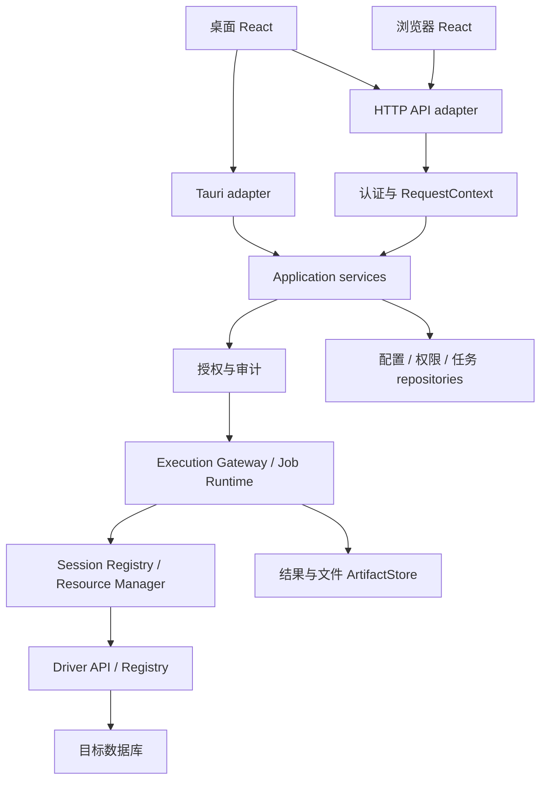
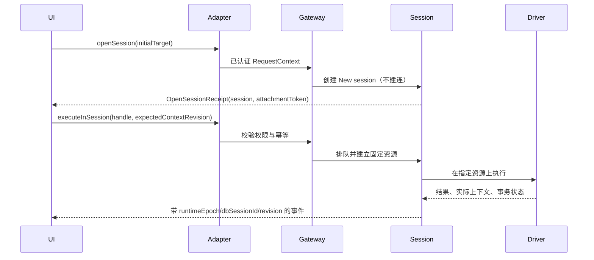

# DataZen 桌面与团队 Web 系统概要设计

> 状态：目标设计，尚未整体实现。基线：2026-09-30，代码提交 `8592b0fe1`。
> 本文按用户明确要求保存设计文档，不把规划表述为当前功能。实现后逐节改写为事实，删除已失效的过渡约定。基线复核：§2 引用文件的连接/调用语义变化、`PROTOCOL_VERSION` 变化、任一阶段开始落地时，必须重新核对相关事实与跨文档契约。
> 配套：[连接管理详细设计](connection-management.md)、[分阶段开发计划](../../development/platform-development-plan.md)。

## 1. 目标与范围

同一套 React 产品和 Rust 业务内核支持三种方式：

| 方式 | 前端到后端 | 执行位置 | 凭据位置 |
| --- | --- | --- | --- |
| 桌面本地 | Tauri IPC | 用户电脑的本地 Runtime | 本地 SecretProvider |
| 浏览器团队 | HTTPS API + SSE | 团队服务 Runtime | 服务端 SecretProvider |
| 桌面团队 | HTTPS API + SSE | 团队服务 Runtime | 服务端 SecretProvider |

共享范围包括 Driver Command、元数据、SQL 执行、连接资源、事务、Schema Diff、Data Sync、Data Transfer、Workflow、AI、MCP 和任务生命周期。平台差异集中于传输、身份、持久化、文件、窗口和网络部署。

首个团队版本采用模块化单体：HTTP API、管理服务和执行 worker 可以运行在同一进程。逻辑边界允许后续拆为多个 worker，不提前引入微服务、分布式事务或原生驱动热加载。

首版不支持：任意 SQL 会话无损故障转移、跨服务器原子事务、浏览器代理数据库流量、不同 backend 之间直接迁移、团队成员任意上传不可信原生驱动。私网部署通过把 Runtime 放入可达网络解决；远程 agent 是后续扩展。

## 2. 当前实现与改造入口

以下路径已在基线代码核对，新增包和接口则属于目标设计。

| 当前入口 | 已确认事实 | 目标改造 |
| --- | --- | --- |
| [AppState](../../../src-tauri/src/commands/mod.rs) | 聚合连接、事务、任务、AI、Workflow 等服务 | 组装留在 host，应用服务只接收必要依赖 |
| [ConnectionManager](../../../src-tauri/src/services/connection_manager.rs) | 管理 handle、配置、隧道、引用计数 | 拆分 Profile、Session、Lease、Budget |
| [session 实现](../../../src-tauri/src/services/connection_manager/sessions.rs) | 按 connectionId 复用 session；物理连接缺失时 `get_session` 会以同一 `dbSessionId` 重连。空闲清理保留 owner 映射；它没有同步清理 `AppState.session_transactions`，可能留下指向已关闭物理会话的事务句柄，详见 [tunnels.rs](../../../src-tauri/src/services/connection_manager/tunnels.rs)、[query.rs](../../../src-tauri/src/commands/query.rs) 与 [AppState](../../../src-tauri/src/commands/mod.rs)。 | 按明确生命周期使失效会话返回 `SessionLost`，禁止透明重建；活动事务回收须先回滚并清理事务状态，结果不确定时报告 `OutcomeUnknown`。用 CM-73 覆盖该连续旅程 |
| [Driver API](../../../packages/driver-api/src/traits.rs) | 提供 DatabaseDriver、Command、迁移等能力 | 增加固定执行资源契约、可选能力接口 |
| [Factory](../../../packages/driver-api/src/factory.rs) | inventory 编译期注册 | 桌面与 server 使用同一注册入口 |
| [前端 Command SDK](../../../packages/driver-sdk/src/ipc/driverCommands.ts) | 直接导入 Tauri invoke/Channel | 注入传输无关 BackendClient |
| [Workflow Command runtime](../../../src-tauri/src/workflow/command_runtime.rs) | 解析 connectionId，传递目标 database/schema | 明确 step/session/transaction 三种资源范围 |
| [dedicatedDbSession](../../../src/lib/dedicatedDbSession.ts) | 三件套准备会话由前端创建、释放 | 执行资源由后端 Job 持有 |

Driver 公共类型继续遵守[驱动依赖边界](../../development/driver-api-dependency-boundary.md)。基线 `packages/driver-api/src/lib.rs` 的 `PROTOCOL_VERSION` 为 4、最低版本为 1；实现时重新核对，不能从旧架构说明复制版本数字。

## 3. 系统架构



部署拆分后，API 负责入口和路由；worker 持有真实连接、事务、游标和驱动实例。SessionDirectory 记录 owner worker；JobRepository 保存任务状态。共享存储不保存可迁移的数据库连接。

## 4. 模块职责与边界

| 模块 | 职责和拥有的数据 | 输入/输出 | 禁止依赖或行为 |
| --- | --- | --- | --- |
| Product UI / Stores | tab、编辑草稿、浏览位置、已确认状态投影 | BackendClient、PlatformServices | 不决定物理连接、不保存团队密码、不自行确认事务状态 |
| BackendClient | 类型化业务调用、流订阅、backend 路由 | DTO、事件、ApiError | 不包含业务 SQL 或数据库类型分支 |
| PlatformServices | 文件选择/上传/下载、窗口、剪贴板 | artifactId、用户操作 | 不执行数据库业务 |
| Tauri adapter | IPC 反序列化、本地身份、事件映射 | 应用服务请求 | 不持有第二份执行逻辑 |
| HTTP adapter | 认证、CSRF、请求限制、响应映射 | RequestContext、DTO | 不直接调用具体驱动 |
| Application services | 用例、目标解析、策略编排 | 业务请求、Execution/Job 引用 | 不引用 Tauri、HTTP 框架或 React |
| PolicyService | connection/session/job/result 授权 | AuthorizationDecision | 不通过前端角色标记授予权限 |
| ProfileRepository | 连接配置、版本、共享范围 | ConnectionProfile | 不保存 runtime dbSessionId |
| SecretProvider | 解密/取凭据、轮换、短期执行材料 | secretRef | 不把密码返回到普通查询响应 |
| IdentityResolver | 解析并签发执行身份（`executionIdentityKey`） | 组织/用户、连接上下文 | 不读取或产出凭据本身 |
| DriverRegistry | 描述、协议检查、factory 注册 | descriptor、provider | 不按数据库名称拼 SQL |
| ExecutionGateway | 参数/能力/权限校验、执行登记、取消、来源 | ExecutionReceipt、事件 | 不创建隐式共享会话 |
| SessionRegistry | owner、状态机、串行队列、上下文 revision、会话级句柄登记 | SessionView | 不用 connectionId 代替 session 身份 |
| ResourceManager | pool、lease、预算、隧道引用、清理 | ResourceLease | 不把清理失败资源归池 |
| MetadataService | 明确对象身份、批量读取、缓存失效 | 元数据、revision | 不改变编辑器当前库 |
| JobRuntime | 长任务、阶段、子执行、提交边界、恢复 | JobView、检查点 | 不把 UI 生命周期当任务生命周期 |
| 迁移领域引擎 | 结构 IR、ChangeSet、转换与计划；由对应领域包拥有 | 计划、执行需求、结果 | 不自行绕过预算建连接、不依赖桌面窗口 |
| MCP adapters | Tool/Resource/Prompt、MCP client identity 与授权委托 | Job/Execution DTO、MCP 协议 | 不向 MCP client 暴露数据库凭据或 runtime handle |
| Wapp host bridge | 桌面/Web iframe 沙箱、能力声明、来源与消息校验 | 受限 BackendClient Command、Artifact | 不让 Wapp 直连 Driver/HTTP API，不传 session/secret |
| EP host | 桌面进程内受信特权扩展与版本校验 | extension-points 契约 | Web server 不加载桌面 native EP；同等团队能力走服务端授权 API |
| Theme delivery | 校验并分发静态主题资源 | manifest、静态 assets | 无可执行脚本能力，不访问数据库或服务端密钥 |
| Workflow Runtime | 目标继承、step/block、DAG、重试 | run、子任务 | 不继承 GUI 当前数据库 |
| Driver capabilities | 协议、方言、实际会话语义、能力探测 | opaque resource、CommandResult | 不 import host、不弹原生对话框 |
| RuntimeRouter | 会话路由、能力/网络匹配、worker drain | owner worker、执行响应 | 不把旧 session 绑定到替代 worker |
| ArtifactStore | 结果分块、上传、导出、TTL、访问授权 | artifactId、受控数据 | 不接受任意服务器绝对路径 |

### 4.1 目标代码组织

以下目录尚未创建；实施阶段才加入 workspace/build 配置。

```text
packages/application/        Rust 用例、DTO、错误、授权编排
packages/runtime/            Rust session、lease、资源调度、execution、job
packages/platform-api/       Rust SessionDirectory/BudgetCoordinator 等 ports 与环境适配
packages/schema-diff/        共享 Schema Diff 领域引擎（从 src-tauri 分阶段抽取）
packages/data-sync/          共享 Data Sync 领域引擎（从 src-tauri 分阶段抽取）
packages/data-transfer/      共享 Data Transfer 领域引擎（从 src-tauri 分阶段抽取）
packages/driver-api/         现有 Driver API 与可选能力
packages/driver-sdk/         现有驱动前端元数据/方言/Command SDK
packages/ai-api/             现有 AI Provider trait、工厂与调用协议
packages/drivers/            现有驱动 crate 与驱动 UI 源码（随驱动选型注入）
packages/backend-client/     TypeScript DTO/client/transport 契约
packages/wapp-sdk/           现有 Wapp 受控桥 SDK
packages/extension-points/   现有桌面特权 EP 契约
packages/ui/                 现有 @datazen/ui 基础视图组件
packages/themes/             目标静态主题资源与 schema
server/                      Rust HTTP host 与服务端 composition root
src-tauri/                   桌面 host、IPC/文件/窗口 adapter 与遗留命令
src/                         共享 React 产品与平台桥
```

标“现有”的包不在本次新建范围，按现有构建与注入方式复用；`packages/themes` 当前目录仍是旧 v1 ThemePack 存档，目标主题资源与其并存，迁移前不改旧目录。

依赖方向：host → application/runtime/领域包；application/runtime → platform-api/driver-api；driver → driver-api。`SessionDirectory` 与 `BudgetCoordinator` 的接口归 `platform-api`，SessionRegistry/ResourceManager 只依赖这些 port；桌面/单进程先用内存适配，多 worker 再替换目录和全局预算适配。领域引擎归 `packages/schema-diff`、`packages/data-sync`、`packages/data-transfer`；Tauri 命令、窗口与文件选择留在 `src-tauri` adapter。领域包不得反向 import host。JobRuntime 通过注册的 JobHandler 调用领域引擎，避免 runtime 与领域 crate 循环依赖。

## 5. 统一领域对象

| 对象 | ID/归属 | 持久化 | 核心含义 |
| --- | --- | --- | --- |
| ConnectionProfile | organizationId + connectionId | 是 | 配置、初始目标、secretRef、configRevision |
| ExecutionTarget | connectionId + NamespaceTarget + 可选对象；请求包装携带 backendId | 是，持久化目标字段；backendId 单独保存为调用/工作区绑定，不属于数据库目标 DTO | 明确执行目标；执行前 backend 绑定必须匹配且重新鉴权 |
| DbSession | dbSessionId + owner + worker | 否 | 连续会话状态，不等于 pool；含 SessionContext 与 contextRevision |
| Transaction state | Session actor 内的事务观察与句柄 | 否 | 不分配独立业务 ID；关闭/失效时与 Lease 同步回滚、核验和清理 |
| ResourceLease | leaseId + owner + scope | 否 | 物理资源占用、清理与预算 |
| Execution | executionId + owner | 是 | 一次执行及实际来源；持久化投影排除运行时绑定与 session 句柄 |
| Job | jobId + organizationId + principal | 是 | 长任务、阶段、提交结果、恢复契约 |
| Artifact | artifactId + ACL | 是 | 结果或文件，不等于服务器路径 |

登录会话、数据库会话、编辑器视图和共享 SQL 文件各有独立 ID。共享 SQL 文件不共享事务；知道 ID 不构成授权。

## 6. 接口定义

### 6.1 应用上下文

`RequestContext` 由 adapter 构造，不允许请求体覆盖：

| 字段 | 类型 | 规则 |
| --- | --- | --- |
| organizationId | string | 本地模式为固定本地组织；团队模式来自认证与 membership |
| principalId | string | 用户、服务账号或委托身份 |
| authenticationSessionId | string/null | 后台任务使用服务身份，不永久复用浏览器登录 |
| clientInstanceId | string | 已绑定到认证身份的客户端实例；不是授权依据 |
| requestId | string | 日志关联，不包含凭据 |
| delegationId | string/null | 子任务的显式权限委托 |

应用服务在执行前检查当前权限；权限快照只用于审计。权限撤销使排队请求失效，已执行操作按取消能力停止并记录实际结果，不能假设已经回滚。

### 6.2 BackendClient 与领域客户端

BackendClient 是绑定单个 backend 的传输门面；`backendId` 用于选择门面，不作为每个业务方法的参数，也不放入 ExecutionTarget。连接资源方法及其 DTO 以[连接管理详细设计 §4.1](connection-management.md#41-服务接口与补充响应)为权威；本表同时标明配置、Job 与 Artifact 方法的归属。

| 服务 | 方法 | 输入 | 输出 | 语义 |
| --- | --- | --- | --- | --- |
| ConnectionClient | listConnections | 无 | ProfileView[] | 当前 backend 下列出授权配置；分页另行版本化，本版不传分页参数 |
| ProfileClient | createConnection | ProfileDraft、write-only credentials、`createProfile` 签名令牌给出的 idempotencyKey | ProfileView | 创建配置；凭据仅交 SecretProvider，不回显 |
| ProfileClient | updateConnection | connectionId、expectedRevision、patch | ProfileView | CAS 更新；不改变已建会话 |
| ProfileClient | disableConnection | connectionId、expectedRevision | ProfileView | 禁止新执行，已有资源按 drain/force 政策处理 |
| ConnectionClient | openSession | OpenSessionRequest | OpenSessionReceipt | 懒建逻辑会话，返回仅 owner 持有的 attachmentToken |
| ConnectionClient | getSession | SessionHandle | SessionView | 读取当前 owner 的会话状态 |
| ConnectionClient | executeInSession / executeAtTarget | 对应请求与签名 SubmissionToken | ExecutionReceipt | 返回接受回执，不表示 SQL 已成功 |
| ConnectionClient | setSessionContext | SetSessionContextRequest 与签名 token | ContextChangeReceipt | 原地确认或返回新 session |
| ConnectionClient | attachSession / detachSession | AttachmentRequest | SessionView | 原 owner 身份与 token 校验；不延长业务空闲期 |
| ConnectionClient | closeSession | handle、`mode: CloseMode` | CloseReceipt | 幂等关闭，不默认提交事务 |
| ConnectionClient | getExecution / cancelExecution | executionId、取消操作 token | ExecutionView / CancelReceipt | 查询终态或请求精确取消 |
| ConnectionClient | subscribeEvents | streamId、afterSequence | EventEnvelope 流 | 授权后续订；断开订阅不直接取消 SQL |
| JobClient | startJob / listJobs / getJob / cancelJob | 定义、计划、jobId 与签名 token | JobView / CancelReceipt | 持久化接受；listJobs 只返回当前 principal 授权的 Job；Job 生命周期独立于窗口 |
| ArtifactClient | readArtifact | artifactId、chunkIndex 或字节范围 offset/limit | ArtifactChunk | 每次授权、限大小并服从产物 TTL；越界报错，不返回服务器路径 |
| SubmissionTokenClient | issueSubmissionToken | operation、可选 SessionHandle | SubmissionToken | 签名限定调用身份、操作和有效期 |

Profile、Job、Artifact 的 DTO 和服务归属在本系统概要中定义；它们不属于连接管理 `ConnectionService`。IPC 与 HTTP adapter 都实现这些接口并共享 ApiError。连接资源 DTO（`ProfileView`、`SessionView`、`ExecutionView` 等）以[详细设计 §4.1](connection-management.md#41-服务接口与补充响应)为权威；写模型与产物 DTO 在此定义，`Id`/`Counter`/`Timestamp`/`NamespaceTarget` 沿用同一套基础类型：

```typescript
interface ProfileDraft {
  name: string;
  driverId: string;
  initialNamespace: NamespaceTarget;
  publicOptions: Readonly<Record<string, unknown>>;
  credentials?: Readonly<Record<string, string>>;  // write-only，只交 SecretProvider
}

type ProfilePatch = Partial<Omit<ProfileDraft, 'driverId'>>;

type JobState = 'queued' | 'running' | 'succeeded' | 'failed' | 'cancelled';

interface JobView {
  jobId: Id;
  kind: string;
  state: JobState;
  stage: string | null;
  executionIds: readonly Id[];
  artifactIds: readonly Id[];
  createdAt: Timestamp;
  updatedAt: Timestamp;
}

interface ArtifactChunk {
  artifactId: Id;
  chunkIndex: Counter;
  totalChunks: Counter | null;  // 流式结果未收齐时为 null
  offset: Counter;
  bytes: Uint8Array;             // 只含结果字节，不含服务器路径与凭据
  resultCompleteness: 'pending' | 'complete' | 'truncated';
}
```

`credentials` 只出现在请求侧，`ProfileView` 只回 `credentialConfigured`；`driverId` 属目标身份，变更走新建配置而非 patch。`JobView` 由 JobRuntime 拥有，`ArtifactChunk` 由 ArtifactStore 拥有，二者都不承载 connectionId 以外的授权信息，授权仍以 PolicyService 判定为准。

`ContextChangeReceipt` 包含 `session: SessionView`、`replacedSessionId: string | null` 和 `attachmentToken: string | null`；替换时 token 只返回原 owner，原地切换为 null。客户端原子切换到返回 session；失效旧句柄不得继续执行。

### 6.3 首版 HTTP 映射

以下为待实现路由，不能当作当前可调用 API。

| 路由 | 用例 |
| --- | --- |
| GET `/api/v1/connections` | listConnections |
| POST `/api/v1/connections` | ProfileClient.createConnection |
| PATCH `/api/v1/connections/{id}` | expectedRevision 更新或设置 `enabled=false`；分别对应 updateConnection / disableConnection |
| POST `/api/v1/submission-tokens` | 获取签名幂等令牌 |
| POST `/api/v1/sessions` | openSession |
| POST `/api/v1/sessions/{id}/attach` | 认证原 attachment |
| POST `/api/v1/sessions/{id}/detach` | 显式取消 attachment |
| GET `/api/v1/sessions/{id}` | 状态读取 |
| POST `/api/v1/sessions/{id}/executions` | executeInSession |
| PUT `/api/v1/sessions/{id}/context` | setSessionContext |
| POST `/api/v1/sessions/{id}/close` | closeSession |
| POST `/api/v1/executions` | executeAtTarget |
| GET `/api/v1/executions/{id}` | 执行状态 |
| POST `/api/v1/executions/{id}/cancel` | 精确取消 |
| POST/GET `/api/v1/jobs` | 创建 / 授权列表（listJobs） |
| GET `/api/v1/jobs/{id}` | 任务状态 |
| POST `/api/v1/jobs/{id}/cancel` | 任务取消 |
| GET `/api/v1/events/{streamId}` | SSE，支持 Last-Event-ID |
| POST `/api/v1/artifacts/uploads` | 配额内上传 |
| GET `/api/v1/artifacts/{id}` | 受控结果/下载；`metadata=1` 描述已发布前缀，或 `chunkIndex` / `offset`+`limit` 取块（互斥） |

异步接受返回 202 + ID；参数错误 400、未认证 401、无权限 403、不可见资源 404、版本/运行时冲突 409、预算或速率超限 429、暂时无可用 worker 503。无法区分“无权限”和“不存在”的资源统一 404，避免 ID 枚举。

`ApiError` 包含 `code`、脱敏 `message`、`requestId`、`retryDisposition`；它是机器可读的重试政策，详细设计错误表里的 UI 动作是用户指引。映射规则：`never` 用于权限、参数、能力和上下文冲突（先修复或刷新）；`safeRead` 仅用于确认无副作用的读取；`checkExecution` 用于已接受但结果未知的提交，先 getExecution/核验，不盲目重发。

### 6.4 repositories 与环境 ports

| 接口 | 必须提供的方法语义 |
| --- | --- |
| ProfileRepository | get/list、按 expectedRevision 保存、禁用；以组织限定查询 |
| PolicyService | authorize action/resource、委托校验、权限版本变更通知 |
| SecretProvider | 读取版本化秘密材料（`resolve(SecretRef, SecretPurpose)`）与轮换（`revision(SecretRef)`）；材料不序列化到 API |
| JobRepository | create、状态 CAS、claim/renew、检查点、恢复待核验任务 |
| SessionDirectory | 内存 register/get、owner epoch CAS、原子替换提交、invalidate；禁止落盘 |
| SubmissionTokenIssuer | 签名、验证作用域/有效期/owner epoch；未知版本拒绝 |
| ArtifactStore | create writer、按块读取、finalize、TTL 删除、ACL 校验 |
| EventSink | 发布带 sequence 的事件、受控订阅；终态可从 repository 重建 |
| NetworkProvider | 按路由策略建立直连/隧道、端点校验、共享引用 |
| BudgetCoordinator | 申请节点额度、续期、drain；失联时停止新增资源 |

本表 10 行不含 `IdentityResolver`（它已在 §4 模块职责表中引入）：执行身份解析（`executionIdentityKey` 的生产者）由 `IdentityResolver` 承担，`SecretProvider` 只负责版本化秘密材料的读取与轮换；边界见共享边界详细设计。

Desktop adapters 使用现有 Store/keychain/file 管理能力逐步适配；Server adapters 使用服务端元数据数据库、SecretProvider 与 ArtifactStore。第一版推荐 PostgreSQL 管理组织、配置版本、任务、审计和额度，不与用户业务数据库混用。SSE 用于单向状态通知，取消走 HTTP；有双向交互需要时再引入 WebSocket。

## 7. 核心交互

### 7.1 QueryPanel



SQL 解析用于提示，不提前修改已生效上下文。会话操作串行；取消通过独立控制路径进入，不能排在待取消查询之后。`attachmentToken` 只属于原 owner 且不落盘，handoff 必须走 attach/detach；图中的“事务状态”若指向会话级句柄（事务/游标），必须按[§6.5](connection-management.md#65-会话级资源句柄登记)在终态前登记到 session actor。

### 7.2 TablePanel 与元数据

UI 发送完整对象目标 → 应用服务授权 → 网关获取短租约 → driver 在明确目标执行 → 完成并清理 → 返回结果来源。元数据缓存按组织、权限范围、配置版本与对象身份隔离，临时对象仅绑定原 runtime handle。

### 7.3 三件套与 Workflow

JobRuntime 保存计划、目标、版本和 owner → 执行前验证 → 申请源/目标阶段资源 → 调用领域 handler → 记录已确认提交边界 → 清理 → 发布终态。窗口关闭不释放 Job 资源；审阅等待不长期持有快照。Workflow 显式定义独立 step、共享 session block、transaction block。

## 8. 驱动扩展与开闭原则

DriverFactory 注册 descriptor、配置 schema、Command schema、资源 provider 和可选能力。能力描述与实际能力接口必须对应；运行时探测可降低静态声明，不能无依据提升权限。

稳定底座负责 factory、opaque resource、Command、结果、错误与协议。可选能力包括 namespace/session/transaction/catalog/migration/snapshot/data-read/data-write/backup。能力接口不暴露 SQLx、Tokio、HTTP 客户端或 Tauri 类型。

宿主控制 owner、预算、权限和调度；driver 控制协议、方言、连接初始化、固定资源执行、状态观察和安全清理。所有 driver 实际建连必须经过预算 port，包含 cluster、控制连接与 SDK 隐藏连接；不能仅统计顶层 handle 数。

普通新增驱动只改变驱动包、选型/注册、schema、UI、文案与该驱动测试。新语义确实超出既有能力时才扩展公共契约，更新版本并迁移所有实现；不通过宿主数据库名称分支绕过。

「更新版本」分两种，不能混：只有改动驱动与宿主**线上**说的内容才动 `PROTOCOL_VERSION`；给公共契约加 FOREVER 冻结（如 `#[non_exhaustive]`，「以后不能再加字段」）只动 crate 版本并附一份迁移配方，不动协议号。此时线上一个字节都没变——升协议号等于宣布一场不存在的线上事故，而真正会断的是别人的 `cargo build`；已经编好的老驱动仍然照常加载。四档判定与配方原文见 [driver-capability-migration.md §5.5](./driver-capability-migration.md#55-source-breaking老驱动跑得好好的但新的编不出来)。

保留 inventory 编译期注册。原生同进程驱动属于可信代码。管理员升级发布包/镜像，worker drain 后切换；独立 driver runner 是后续隔离方案，需版本化 RPC，不能把 Rust trait 当作稳定动态 ABI。

## 9. 多实例部署与故障

固定 session 路由到持有真实资源的 worker；客户端无需知道 worker。请求附带 runtimeEpoch/dbSessionId。owner 失效返回 SessionLost，不在其他 worker 上复用旧 session ID。替代会话得到新 ID，旧事务和临时状态不能恢复。

Job 使用持久化租约和执行 epoch。旧 worker 失去续约后停止派发；fencing token 不会自动阻止已发给外部数据库的写入。接管前核验目标提交记录、幂等标识或数据库锁，无法证明时进入 OutcomeUnknown。不能承诺通用 exactly-once。

worker drain 停止新资源与任务，允许现有执行到安全边界。交互会话按通知和期限结束。节点额度失效不能立即重新分配仍可能占用的连接；必须确认旧节点隔离/资源关闭后再回收。

### 9.1 Wapp、EP 与 Theme 的平台边界

桌面与 Web 均可展示 Wapp iframe，但桥接必须调用当前 backend 的 BackendClient，经 host 校验 `origin`、`source`、一次性 nonce、消息 schema/大小、Wapp 安装身份和能力授权；Web 使用精确 target origin；桌面不透明 origin 允许定向至已登记 iframe 的 `*`，必须结合 source、一次性 nonce 与 schema 校验，不发送登录或数据库秘密。桥接只提供声明过的 Command 和 Artifact 操作，不传 dbSessionId、attachmentToken、取消句柄或数据库凭据。Web 部署使用独立受限 origin 与 sandbox/CSP；Wapp 不能从 iframe 自行取得用户 cookie 或调用任意服务端 URL。用户身份与每次操作授权由父应用和服务端重新验证，卸载/撤权即关闭桥接订阅。

特权 EP 是桌面 host 内的可信扩展，Web server 不加载 native EP，也不把 EP 包下发到浏览器执行。团队版若需要同等功能，必须走显式授权的服务 API。Theme 只分发 schema 校验后的静态资源，Web CSP 禁止脚本执行；主题不能调用 backend 或访问 secret。Driver/Workspace App/EP/Theme 的扩展面相互独立。

### 9.2 P9 协调与失租协议（目标设计）

完整 CAS、路由、认领、预算账与故障接管协议见 [多 worker 详细设计](multi-worker-coordination.md)。首版内存目录只有一个权威实例，切换先隔离旧实例并使旧 session 失效；PostgreSQL 保存 Job 与数量型节点预算账，不保存目录或物理租约。

SessionDirectory 仍只存 TTL 内存路由；协调器必须支持 owner/epoch/替换 operation 的原子 CAS。prepared 候选不可路由，committed 同时封闭旧路由并开放新路由。API 先授权再查询/转发；内部 RPC 经 worker 身份认证并验证组织、principal、owner epoch、请求指纹与 deadline，不信任客户端指定 worker。路由失败不自动在别处重新派发未知写入。

Job 仓储是认领权威，每次接管递增持久化 claimGeneration；所有阶段/边界/checkpoint 写入验证当前 claim，旧 worker 恢复后无法写仓储。续约失败停止新增资源/阶段，对已发出的执行记录真实结果并核验。fencing 只保护管理库，不保证撤销外部 SQL；新 worker 在证明旧执行终止/隔离且目标边界已核验前，不执行同一副作用范围。

全局 BudgetCoordinator 将服务级额度分配为带 generation 的节点许可；各 worker 在子额度内按 P3 多维预算记账，包含 idle、控制 socket、cluster 隐藏连接、Cleaning 与 Quarantined。分配与回收通过原子 CAS，节点续约到期只禁止新增连接，不立即返还可能仍存活的额度。协调器失联时禁止新增全局许可，已获许可只能在有效期内新增资源；过期后停止新增并 drain。确认旧节点资源关闭，或取得网络/进程隔离加目标连接关闭证据后才释放额度，不能用目录条目消失代替证明。

目录/协调器重启丢失路由时，相关 session 明确 Lost；拒绝新增直到旧 worker 注册状态/额度对账完成。活动事务不从目录恢复。worker drain 顺序为停止接受新任务/会话→通知客户端→运行中执行到安全边界→终结句柄与资源→核验预算→退出；超过期限记 unknown/待核验并保守保留占用。版本/能力/网络区域不匹配的 worker 不参与新 claim，不迁移 live session。

P9 故障旅程必须覆盖：关闭 sticky、多 API 路由、owner 碰撞、替换提交应答丢失、worker 暂停超过租约后恢复、协调器/目录重启、单向网络分区、续约失败时 commit 已在途、drain 超期与滚动升级。断言旧 generation 写入失败、无重复提交、目录丢失明确失效，以及任意 journal 时刻物理资源不超过未核销许可总额。

## 10. 安全和环境差异

团队共享 profile 不共享 session。个人数据库账号按身份隔离池；共享账号下仅允许经过授权和安全清理的短操作复用。任意 SQL 对象访问依赖数据库端账号/角色权限，SQL guard 只是额外防护。

Web 认证首版采用 OIDC 登录及服务端登录会话，浏览器使用 Secure/HttpOnly/SameSite cookie；修改操作校验 CSRF。服务调用使用受限服务身份。SSE/未来 WebSocket 持续检查权限失效、登录过期和资源归属；不能只鉴权一次握手。

服务端连接地址受出站网络策略控制，包括 DNS 解析后的地址、重定向与隧道目标。`localhost` 指执行节点。文件、TLS 证书和备份工具路径改为经过授权的 artifact/配置引用，禁止普通用户任意读写服务器路径。

共享业务结果默认私有；共享 SQL 文件不授予结果读取权。审计记录组织、应用用户、数据库执行身份、目标、执行结果与配置版本；敏感 SQL/参数是否保留由策略控制，默认不打印密码、令牌、原始数据库错误或用户绝对路径。

## 11. 系统级验收

1. CI 对 server normal/build 依赖图运行架构边界检查，失败于任何 Tauri crate 或 UI runtime 进入依赖闭包；server 可独立构建，同一用例通过 IPC 和 HTTP 的结果与错误语义一致。
2. 桌面本地可离线运行；桌面团队模式不下载团队数据库凭据。
3. 用户/组织之间不能读取、执行、取消或订阅对方未授权资源。
4. 编辑器 `USE`、事务、临时状态连续；TablePanel 和后台任务不污染编辑器。
5. 多 API 实例能路由同一固定 session；worker 丢失后明确失效，不伪恢复。
6. 任务在窗口/网络断开后按政策继续，重订阅不会重复提交任务。
7. 新增已有能力的驱动无需修改宿主业务分支，并通过 driver 契约矩阵。
8. 组织/数据库/节点预算共同生效，节点扩容不使连接数成倍越界。
9. 写入提交未知不自动重试；任务恢复核验已提交边界。
10. 结果、文件、缓存和事件均执行组织及身份范围授权。

## 12. 连接契约摘要

- 会话、物理绑定和可持久化执行来源分开；`dbSessionId`、SessionHandle、lease/cursor、取消绑定与 attachment token 均不落盘，详见[连接管理 §4.4](connection-management.md#44-可落盘来源与运行时绑定)。
- Driver 提供 namespaceShape 与操作级 targetRequirements；网关用同一 CanonicalTarget 做授权、缓存和执行，详见[§4.3](connection-management.md#43-命名空间规范化契约)及[§9.6](connection-management.md#96-poolkey版本与缓存的生产者)。
- SessionDirectory/预算、会话失效、worker 路由和候选替换归属见[§12](connection-management.md#12-web多实例权限与结果)；丢失物理资源后返回 SessionLost，禁止透明重建。
- Attachment、TTL、结果放弃消费与清理分别见[§6.4](connection-management.md#64-attachment-与超期处理)、[§7.7](connection-management.md#77-结果订阅与放弃消费)和[§9.4–9.5](connection-management.md#94-归池前检查)；事务/游标等会话级句柄必须在终态前登记到 session actor 才允许归池，见[§6.5](connection-management.md#65-会话级资源句柄登记)。
- 取消回执、错误与签名幂等期限以[§13](connection-management.md#13-错误重试和事件)为权威；完整验收用例 CM-01～74 和开发阶段映射见详细设计、[开发计划](../../development/platform-development-plan.md)。

## 13. 参考与维护

- [Tauri Process Model](https://tauri.app/concept/process-model/)：desktop host 的进程边界。
- [OWASP WebSocket Security](https://cheatsheetseries.owasp.org/cheatsheets/WebSocket_Security_Cheat_Sheet.html)：双向长连接的认证、来源与消息权限。
- [当前架构](../README.md)、[当前服务](../backend/services.md)、[ID 命名](../naming.md)。

按阶段落地后，同步当前架构文档、公开 API 和测试，不让设计约定与实现长期并列冲突。平台特定 API 只能出现在适配层；本设计不授权绕过现有驱动边界与凭据保护。

## 配套实施设计

- [P5 迁移三件套与 Job](data-migration-jobs.md)
- [P6 消费者接入](consumer-adapters.md) / [Workflow 块资源](workflow-resource-model.md)
- [P9 多 worker 协调](multi-worker-coordination.md)
- [团队部署、升级与恢复](../../development/team-service-operations.md)
