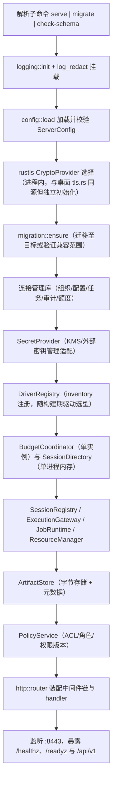
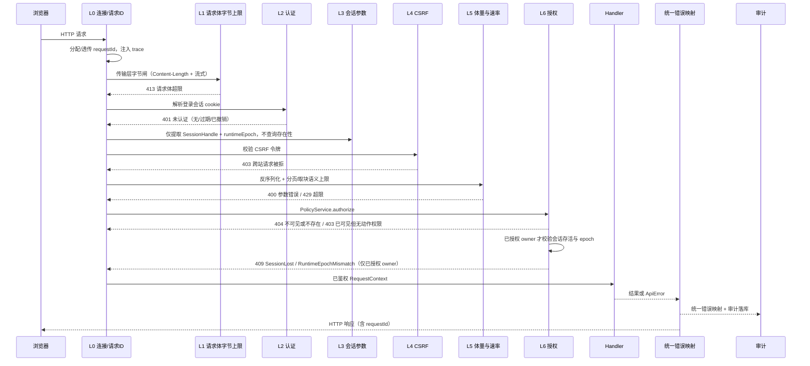
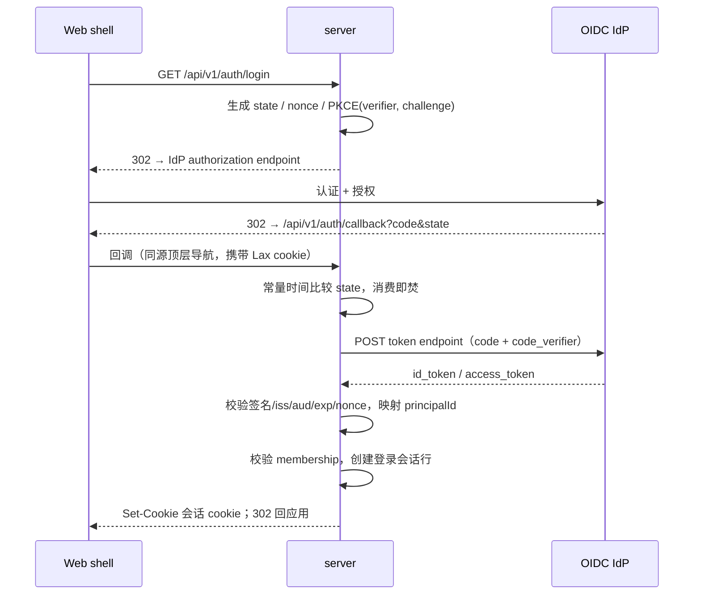
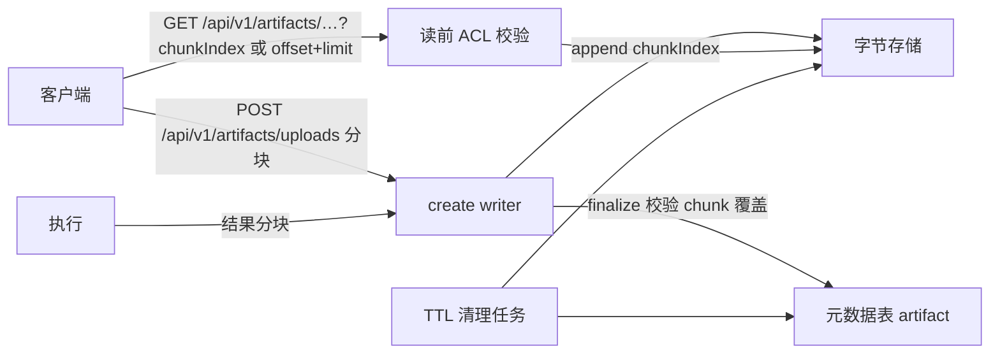
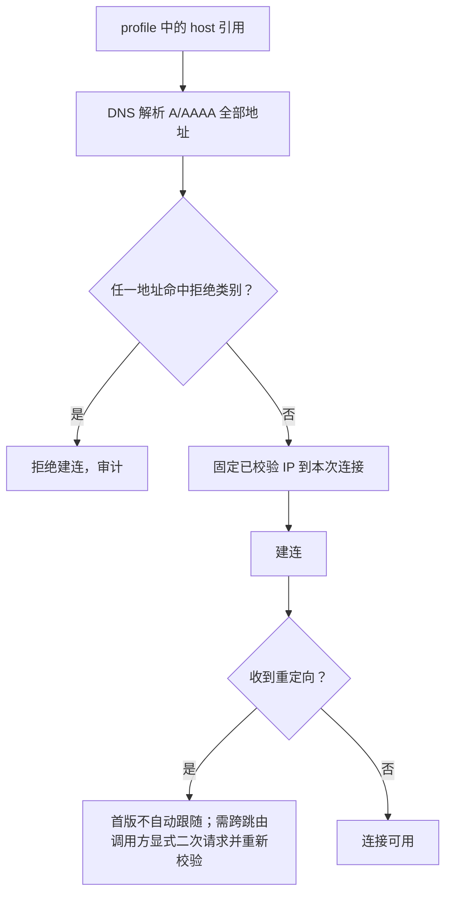
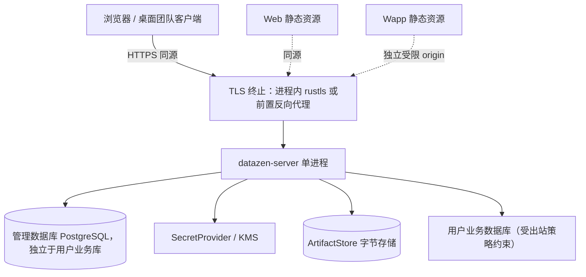

# DataZen 团队 Web 服务：Server Host、认证授权与安全设计

> 状态：P7 团队 Web 服务仍是目标设计，`server/` 团队服务 host、认证授权与 PostgreSQL adapters 尚未实现。`packages/platform-api`、`packages/runtime`、`packages/backend-client` 等共享契约已存在；桌面 P5 Data Transfer 已接入本机 AppDb `DesktopJobHost`，但它不是团队服务仓储，也不提供多用户或多 worker 语义。本文以下定义服务端目标，不表示这些服务端能力已落地。
> 读者：负责《分阶段开发计划》P7 的实现者。本文定义**怎么组、怎么鉴权、怎么限流、怎么映射错误**；连接 DTO 与错误码表以[连接与会话管理](connection-management.md)为权威，管理库表结构以[持久化模型](persistence-model.md)为权威，出现时一律以链接为准。
> 配套：[系统概要设计](system-overview.md)（分层、领域对象、v1 HTTP 路由表、安全总纲）、[连接与会话管理](connection-management.md)（DTO、错误表、幂等、CM-01～74）、[持久化模型](persistence-model.md)（管理库表结构与迁移策略）、[共享应用边界与端口](shared-boundaries-and-ports.md)（端口签名与装配差异）、[P0 runtime fake 夹具](fake-runtime-fixtures.md)（transport-neutral fake 资源、故障/竞态注入与 CM-60 基准 harness）、[分阶段开发计划 §11 P7](../../development/platform-development-plan.md#11-p7单实例团队-web-服务)（阶段交付与退出门槛）。

---

## 1. 本文解决的问题与不变量

[系统概要设计 §6.3](system-overview.md#63-首版-http-映射) 给出的是 v1 路由表与状态码概要，[§10](system-overview.md#10-安全和环境差异) 给出的是五段安全总纲；二者都未回答「一个请求依次经过哪些判定」「撤销权限后正在跑的 SQL 会怎样」「SSE 断线回放到哪里为止」。本文把这些判定落成可实施的中间件链、数据模型与运行规则。以下不变量全程适用（编号是本文局部命名空间 `INV-S1`～`INV-S8`；共享契约的唯一命名空间是[连接 §3](connection-management.md#3-不可破坏的不变量) 的 `INV-01`～`INV-12`，其中 `INV-S1` 与 `INV-01` 同一口径）：

| 编号 | 不变量 | 本文落点 |
| --- | --- | --- |
| INV-S1 | 身份只来自适配器构造的 `RequestContext`，请求体中的 `organizationId`/`principalId`/角色标记永不生效 | [§6.5](#65-前端角色标记禁令) |
| INV-S2 | 权限与登录态在长连接上持续复核，不能只在握手鉴权一次 | [§8.4](#84-权限复核与登录过期) |
| INV-S3 | 无法区分「无权限」与「不存在」的资源一律 404 | [§7](#7-不可见资源的统一-404) |
| INV-S4 | 权限撤销后，排队请求不执行；已执行的操作按**实际取消结果**记录，不假设回滚 | [§6.3](#63-撤销传播) |
| INV-S5 | SSE 断开只解除订阅，不直接取消正在执行的 SQL | [§8.5](#85-断开与取消的边界) |
| INV-S6 | 服务端响应不回传数据库凭据、runtime 句柄与可解密材料 | [§10.2](#102-secretprovider) |
| INV-S7 | `ApiError.code`（请求被拒绝）与 `ExecutionErrorCode`（执行终态）是两个命名空间 | [§9.4](#94-apierrorcode-与-executionerrorcode) |
| INV-S8 | `server` crate 的依赖闭包不含 Tauri crate 与 UI runtime | [§2.2](#22-cargo-依赖方向与禁止闭包) |

---

## 2. `server` crate 形态与 composition root

### 2.1 目标目录与模块树

`server` 是 Cargo workspace 的新成员（crate 名 `datazen-server`，目录 `server/`，两者目前都不存在），与 `src-tauri` 平级、互不依赖。目标结构：

```text
server/
├── Cargo.toml
├── migrations/                    展开/收缩 SQL，按 version 单调应用（版本表见持久化模型 §3.9）
└── src/
    ├── main.rs                    进程入口：子命令解析 → bootstrap（对齐 src-tauri/src/main.rs 的 headless 形态）
    ├── bootstrap.rs               唯一 composition root；migration.rs 是 migrate / check-schema 子命令入口
    ├── config.rs / logging.rs     ServerConfig 校验（不回显凭据）、tracing 与 log_redact 接入
    ├── http/
    │   ├── router.rs              v1 路由表（与 system-overview §6.3 一一对应）
    │   ├── middleware/            request_id / auth / session / csrf / limit / authorize / error / audit
    │   ├── extract.rs             路径/查询/JSON 提取，统一 InvalidArgument
    │   ├── response.rs            ApiError → HTTP 状态码
    │   ├── sse.rs                 事件流、心跳、回放
    │   └── handlers/              auth.rs profile.rs session.rs execution.rs job.rs artifact.rs event.rs health.rs
    ├── auth/                      oidc.rs（发现/JWKS/token 交换）、session.rs（登录会话表）、claims.rs（id_token 校验）
    ├── policy/                    rbac.rs、acl.rs、version.rs（权限版本与失效广播）、delegation.rs（delegationId）
    ├── csrf.rs / ratelimit.rs     CSRF 校验与令牌桶限流
    ├── network_policy.rs          出站地址校验
    ├── adapters/                  服务端 ports 实现，见 §10
    └── tests/                     身份/权限/CSRF/SSE/Artifact 集成测试
```

沿用现有仓库的模块纪律：单文件不超过 800 行、生产路径不出现裸 `unwrap()`/`expect()`、错误类型以 `thiserror` 分层、观测统一走 `tracing`。现有 `src-tauri/src/commands/error.rs` 的 `CommandError` 是 **IPC 层**错误，server 侧对应物是 `ApiError`，两者不共用类型（见 [§9](#9-请求限制与错误映射)）。

### 2.2 Cargo 依赖方向与禁止闭包

`server` 允许的依赖方向：

```text
server ──→ packages/application, packages/runtime
      ├──→ packages/platform-api（SessionDirectory / BudgetCoordinator 等 ports）
      ├──→ packages/driver-api、packages/ai-api；异构三件套经 packages/runtime 暴露的 port 访问宿主内 src-tauri/src/{schema_diff,data_sync,data_transfer}
      └──→ HTTP 框架、tokio、管理库客户端、序列化

application/runtime ──→ platform-api / driver-api；driver ──→ driver-api
```

`server` **禁止**出现在依赖闭包中的一切：任何 `tauri*` crate（含 `tauri-plugin-*`）、`wry`/`tao`、桌面 host crate `datazen`（`src-tauri` 的 package 名）、任何前端 UI runtime。

这条约束由 CI 执行，而非靠评审自觉：

```bash
# 依赖闭包检查：命中任一禁用 crate 即失败
cargo tree -p datazen-server --edges normal,build -e normal,build,no-dev --prefix none \
  | awk -F'"' '{print $2}' | sort -u > /tmp/server-deps.txt
node scripts/check-server-deps.mjs /tmp/server-deps.txt   # 目标脚本，随 server crate 一并新增

# 独立构建：不开 Tauri 相关 feature 也能通过
cargo build -p datazen-server --release && cargo test -p datazen-server
```

`scripts/check-module-layers.mjs`（`pnpm test:layers`）与 `scripts/check-driver-import-boundaries.mjs`（`pnpm test:boundaries`）是仓库已有的边界检查，server 的依赖闭包检查脚本与它们并列新增到 CI，不塞进这两个脚本的既有职责。管理库 DDL 见 [持久化模型](persistence-model.md)。

### 2.3 组装顺序

`bootstrap.rs` 是唯一的组装点，任何模块都不得在其之外隐式构造全局单例：



失败策略是 **fail-closed**：任一步失败即拒绝启动，错误可诊断但不泄密；`tracing` 与凭据脱敏复用 `src-tauri/src/log_redact.rs` 的口径（默认不打印密码、令牌、原始数据库错误与用户绝对路径）。

### 2.4 进程模式

沿用 `src-tauri/src/main.rs` 的「一个二进制、按参数选择模式」形态，`server` 首版提供三个子命令：

| 子命令 | 用途 | 是否监听端口 |
| --- | --- | --- |
| `serve` | 正常服务：HTTP + Job 轮询 + 执行 worker，全部在同一进程 | 是 |
| `migrate` | 只跑 expand/contract 迁移后退出 | 否 |
| `check-schema` | 只读校验当前 schema 版本与代码期望是否一致 | 否 |

首版**单实例**：一个进程同时承担 API、admin service 与 execution worker。进程退出即失去全部内存态 `SessionDirectory` 与会话回执；这是 P7 明确接受的限制，也是 P9 引入多 worker 的起点。

---

## 3. 请求中间件链

### 3.1 进入顺序



真实顺序是：连接接入 → 请求 ID → 路由匹配（L7，图上并入 handler 节点）→ 中间件链（字节上限 L1 → 认证 → 会话参数 → CSRF → 限流与体量 L5）→ handler → 错误映射 → 审计。一个实现约束：**字节上限的物理拦截是 L1，发生在 L2 之前**。认证层不消费请求体，但未认证请求的 body 仍会占内存；因此 `RequestBodyLimitLayer` 装在认证层外侧、对所有路由生效（这就是图中 L1 的 413 来源），L5 只负责反序列化后的语义上限（分页、取块）。

### 3.2 逐层职责与失败行为

| 层 | 职责 | 失败行为 | 状态码 |
| --- | --- | --- | --- |
| L0 连接/请求 ID | 分配 `requestId`（下游凭此定位审计与日志），注入 trace | 头缺失则生成；不回显用户提供的任意值 | — |
| L1 请求体字节上限 | 传输层 `Content-Length` 与流式字节双闸 | 直接中断响应，不进入业务逻辑 | 413 / 400 |
| L2 认证 | P7 解析 cookie；P8 增加 §4.6 native 凭据互斥入口；查会话行并校验到期/撤销 | `ApiError`（脱敏，不说明会话是否存在） | 401 |
| L3 会话参数 | 仅提取句柄与 epoch，不访问目录或报告资源存在性 | 格式错误由 L5 处理；存活/epoch 校验在 L6 可见性判断后 | — |
| L4 CSRF | 校验令牌与登录会话绑定 | 审计单独记录，响应体不新增字段 | 403 |
| L5 体量与速率 | 反序列化、分页/取块上限、令牌桶限流 | 参数语义错误 / 超限 | 400 / 429 |
| L6 授权 | 先按组织/owner 判断可见性，再授权动作；已授权 owner 最后检查存活与 epoch | 不可见与不存在同为 404；已授权 owner 的 Lost/epoch 冲突才为 409 | 404 / 403 / 409 |
| L7 路由 | 匹配到 handler，未匹配路径 | 统一 404，不区分「路径不存在」与「方法不允许」 | 404 |
| E 错误映射 | 任何层抛出的 `ApiError` → HTTP，见 [§9.2](#92-apierror--http-映射表) | 保证响应体形状恒定 | 见 §9.2 |
| A 审计 | 记录组织、应用用户、数据库执行身份、目标、执行结果与配置版本 | 审计写失败不吞掉业务响应，但触发告警指标 | — |

### 3.3 早期拒绝的适用范围

| 路由类 | 最小到达层 | 说明 |
| --- | --- | --- |
| `/healthz`、`/readyz` | L0 | 不做认证；不泄露版本、依赖组件与配置细节 |
| `/api/v1/auth/*`（login/callback/logout；**本文新增路由**，概要 §6.3 未列） | L0→L2 部分豁免 | login/callback 自身依赖 state 校验，见 [§4](#4-认证oidc) |
| `/api/v1/submission-tokens` | L2 | 需要登录；令牌有效期直接取[连接 §13.1](connection-management.md#131-幂等键期限与响应分类) 的权威值「运行时会话操作还绑定 owner `runtimeEpoch`，默认有效期 24 小时，不含秘密」，本文不另立数值；`createProfile` 令牌不绑定会话。注意 §13.1 里有**两个不同的 24 小时**：**令牌默认有效期 24 小时**约束的是令牌 `expiresAt`；**完整记录至少保留至 `expiresAt + 24 小时`**约束的是幂等**记录**的 `retained_until`（[§10.4](#104-幂等回执存储) 与 [persistence-model §3.5](persistence-model.md#35-idempotency_records)）。前者决定令牌何时失效、后者决定回执记录还能查多久，二者起点相同但不是同一件事，不可互相替代 |
| 以 `{id}` 寻址的所有路由 | L2→L6 | 不可见统一 404，见 [§7](#7-不可见资源的统一-404) |
| 集合类路由（`GET /api/v1/connections`、`GET /api/v1/jobs`） | L2→L6 | 只返回该 principal 可见集合；组织级动作权限不足才 403 |
| `GET /api/v1/events/{streamId}` | L2→L6→SSE | 特殊：需要 `Origin` 校验替代 CSRF 头，见 [§8.1](#81-端点与握手鉴权) |
| 静态资源与 Wapp 资源 | L0 | 由反向规则分发到独立 origin，见 [§15](#15-wapp--ep--theme-在-web-上的边界) |

---

## 4. 认证（OIDC）

### 4.1 登录流程

采用授权码 + PKCE（`S256`），首版 OIDC 只支持这一种交互流；P8 native 的交接仍复用此流，见 §4.6。本节所有时长（state 事务有效期、时钟偏移容差、登录会话寿命、cookie 生命周期）都是**首版建议值，来自部署配置**，不是协议常量。



### 4.2 state / nonce / PKCE 校验

| 校验项 | 规则 | 失败结果 |
| --- | --- | --- |
| `state` | 服务端生成的 128-bit 以上随机值，单次消费，TTL 10 分钟，与浏览器 cookie 常量时间比较 | 400，审计记录，不重放 |
| `nonce` | 写入 `id_token` 校验；重放的 `id_token` 因此不可用 | 401 |
| PKCE | `code_challenge = BASE64URL(SHA256(verifier))`，`code_challenge_method=S256`；禁用 `plain` | 400 |
| `iss` / `aud` / `exp` / `iat` | 严格等值/区间校验，允许 60 秒时钟偏移 | 401 |
| 签名 | 依 IdP `jwks_uri` 拉取 JWKS 并按 `kid` 缓存轮换；未知 `kid` 触发一次刷新 | 401 |
| `azp` | 多 audience 时必须等值于本服务 client id | 401 |
| membership | 外部 subject 必须映射到本组织内已启用的 membership，否则拒绝登录（不在登录时隐式开户） | 403 |

`id_token` 中的稳定主体标识（`sub`）只在服务端用于映射 `principalId`；对外一律使用 `principalId`，不转发 IdP 原始标识。

### 4.3 服务端登录会话

登录会话是**服务端行**，不是自包含令牌，因此登出、撤销与权限变更可以立即生效。首版落在管理库：表 `login_sessions`，DDL / CHECK / 索引 / 保留策略以 [持久化模型 §3.10 认证与授权表](persistence-model.md#310-认证与授权表) 为权威，本节只给字段语义（不重复 DDL）：

| 字段 | 语义 |
| --- | --- |
| `session_id` | ≥128-bit 随机、不透明、不可从 `principalId` 推导 |
| `organization_id` / `principal_id` | 会话绑定的组织与主体 |
| `auth_time` | IdP 认证时刻，用于判断敏感操作是否需要重新认证 |
| `issued_at` / `absolute_expires_at` | 绝对寿命（默认 24 小时） |
| `idle_expires_at` | 空闲寿命（默认 8 小时），每次入站请求顺延 |
| `reauth_required` | 敏感操作前的重新认证标记 |
| `revoked_at` / `revoke_reason` | 撤销时刻与原因（`logout` / `permission_revoked` / `admin` / `credential_rotated`） |
| `permission_version` | 建立会话时的组织权限版本快照，供撤销传播比对 |
| `client_binding` | 浏览器实例指纹（UA 摘要 + 客户端实例标识），异常时要求重新登录 |
| `token_epoch` | 登出/改密时自增，令 `ts_epoch` 之前签发的短期令牌立即失效 |

会话行**不保存** access_token 的可重放副本；需要调用 IdP 后端接口时按需重新交换。

### 4.4 Cookie 属性

所有会话相关 cookie 使用 `__Host-` 前缀（强制 `Secure`、无 `Domain`、`Path=/`），由同源 HTTPS 部署保证成立：

| Cookie | `HttpOnly` | `SameSite` | 生命周期 | 用途 |
| --- | --- | --- | --- | --- |
| `__Host-dz_session` | 是 | `Lax` | 与会话行同步 | 登录会话标识；`Lax` 是为了让 IdP 顶层导航回调能带上 cookie |
| `__Host-dz_oidc_state` | 是 | `Lax` | 10 分钟 | 登录事务 state，单次消费后立即删除 |
| `__Host-dz_csrf` | 否（前端需读取以放入请求头） | `Strict` | 与会话同步 | CSRF 令牌的公开部分，见 [§5](#5-csrf) |

`__Host-` 前缀的作用是阻断子域向父域种 cookie 的注入路径：任何来自子域的 `Set-Cookie: dz_session=...` 都会被浏览器丢弃。`SameSite=Lax` + `__Host-` 组合后，跨站 POST 表单与 iframe 都不会携带会话 cookie。

会话过期时：清空上述 cookie → 401 + `requestId`；Web shell 跳转登录页并保留原路由；重登录成功后回到原页面。**不自动重放**任何原请求（含写操作），由用户确认后重新提交（与 [连接与会话管理 §13.1](connection-management.md#131-幂等键期限与响应分类) 的幂等令牌过期规则一致）。

### 4.5 登出与会话撤销

| 触发 | 动作 |
| --- | --- |
| 用户登出 | 标记 `revoked_at`（reason=`logout`）、自增 `token_epoch`、删除全部 cookie；若 IdP 支持 RP-initiated logout 则同步发起，否则仅本地失效 |
| 管理员禁用账号/成员 | 同样标记撤销并自增 `token_epoch`；**所有**该 principal 的会话行一并失效 |
| 密码/凭据轮换 | 撤销相关 membership 的会话，重置 `reauth_required` |
| 风险信号（客户端指纹突变、速率异常） | 撤销该会话行，不影响同 principal 的其他客户端之外的登录 |

撤销语义保证：撤销后**下一个入站请求**必定 401；已在进行的长连接按 [§8.4](#84-权限复核与登录过期) 关闭，不需要等待 cookie 自然过期。

---

### 4.6 P8 桌面团队认证与传输（目标设计）

桌面首版使用系统浏览器登录与一次性交接，native HTTP adapter 持有团队服务自己的不透明登录凭据；不把浏览器 cookie、IdP token 或数据库秘密复制到普通 profile。以下路由在 P8 新增，不是现有 API：

1. native adapter 生成 verifier、state 和只绑定 loopback 的临时回调，向 `POST /api/v1/auth/desktop/start` 提交 S256 challenge、state、clientInstanceId 与回调地址。服务只允许 `http://127.0.0.1:<port>/固定路径`，拒绝非 loopback 与任意跳转地址；事务有效期 5 分钟（部署可调）；start 限流并校验参数，不要求尚未获得的登录凭据。
2. 系统浏览器打开返回的服务端 HTTPS 登录地址，复用 §4.1 的 OIDC 校验；成功后将一次性交接 code 与 state 送到登记的 loopback 回调。URL 中不携带登录凭据；code 只存摘要、绑定 challenge/backend origin/client，60 秒过期（部署可调），exchange 成功时原子消费一次。事务暂存内存，服务重启时失效并重新登录。
3. native adapter 校验本地 state，向 `POST /api/v1/auth/desktop/exchange` 提交 code/verifier；服务再次检查 membership，创建独立 `auth_mode=native` 登录会话，返回 sessionId 与高熵随机 secret。凭据以 `sessionId.secret` 不透明值放入 `Authorization: Bearer` 使用，服务仅存 secret 的 HMAC 摘要及 keyVersion，拒绝重复 exchange；tokenEpoch 变化时同事务撤销 native 会话或轮换 secret 摘要，旧 secret 不再有效。
4. native adapter 将 secret 存系统钥匙串，按 backend HTTPS origin、组织、principal 分区；renderer、Wapp、普通连接 profile 和日志均不接收 secret。HTTP 与 fetch SSE 使用同一 adapter，禁止重定向到其他 origin 时继续携带 Authorization，TLS 校验失败不得回退。
5. L2 对 cookie/native 模式互斥校验；同时提供两种凭据即拒绝。native 请求只接受 native 会话，校验摘要、client binding、membership、撤销/空闲/绝对到期与 tokenEpoch；缺失 Origin 不能作为 native 认证。桌面 start/exchange 以 state/challenge/verifier 保护且豁免登录会话/CSRF 前置要求，浏览器 OIDC 回调仍校验自身 state；浏览器跨域 CORS 不开放 Authorization；cookie 修改操作仍校验 CSRF，native 模式以不可被浏览器自动附带的凭据认证。native SSE 每次重连重新认证，不伪造浏览器 Origin。
6. native 到期重新执行登录，不以后台 SSE 保活延长 idle；登出经现有 logout 撤销本 native 会话并清理钥匙串，组织撤权同时终止订阅、拒绝排队执行。重新登录先读取旧 execution/Job，未知写入不自动重投。

P8 BackendClient 绑定 `(backendId, clientGeneration)`。切换/移除 backend、登出时停止旧订阅并增加 generation；请求回执与事件投影校验两者，迟到消息不得写入新 backend 的 store。取消订阅不等于取消服务端 Job。握手校验 API major 相等、必需 minor/能力存在；不满足时禁用相应写操作并解释原因，不静默调用本地 driver。Community/Pro 能力由服务端握手公布，客户端 EP 授权不能替代服务端能力。

P8 验收包括：错误 state/verifier、过期或重放 code、恶意回调地址、exchange 前服务重启、证书错误、跨 origin 重定向、HTTP/SSE 同身份、登出/撤权后的重连、双 backend 同名 ID 与迟到事件隔离；浏览器与桌面同用例结果一致。

## 5. CSRF

### 5.1 方案选择

采用**会话绑定的签名双提交令牌**（session-bound signed double-submit），而不是纯双提交，也不是纯服务端令牌表：

- 纯双提交（cookie 值 == header 值）在子域可读 cookie 时防不住注入；`__Host-` 前缀把这一类风险压到接近零，但没有消除。
- 纯服务端令牌表每个写请求要多一次存储查找；会话绑定把这部分成本并入 L2 已加载的会话行。

令牌结构：`base64url(random) || "." || base64url(HMAC(secret, login_session_id || ":" || random))`，同时写入 `__Host-dz_csrf` cookie 与响应体/前端缓存。校验三件事：

1. `random` 与 header 提交值常量时间相等；
2. HMAC 在**当前请求解析出的登录会话 id**下验证通过（换会话即失效）；
3. 令牌所属会话行未被撤销。

### 5.2 适用范围

| 方法/路由 | 需要 CSRF 令牌 | 说明 |
| --- | --- | --- |
| `GET` / `HEAD` 安全读取 | 否 | 但仍受认证与授权约束 |
| cookie 认证的 `POST` / `PUT` / `PATCH` / `DELETE` | 是 | 含 `POST /cancel`、配置写入、artifact 上传、权限变更 |
| `GET /api/v1/events/{streamId}`（SSE） | 否 | 浏览器 `EventSource` 无法设置自定义头；改用 Origin/同源证明或显式 CSRF 校验 + cookie `SameSite` + `__Host-`，见 [§8.1](#81-端点与握手鉴权) |
| `GET /api/v1/auth/callback`（本文新增路由） | 否 | 自身以 `state` 校验防登录 CSRF |
| P8 native 已认证 API（含 fetch SSE） | 不使用 cookie CSRF | §4.6 校验 native 会话凭据；不接受 cookie 降级 |
| P8 desktop start/exchange | 否 | 限流、state/challenge/verifier 与一次性 code 校验，不是一般 API 豁免 |

### 5.3 失败行为

CSRF 校验失败：HTTP 403，`ApiError.code` 取 `PermissionDenied`（沿用 [连接与会话管理 §13](connection-management.md#13-错误重试和事件) 的权威表，**不新增** code 以免与 `ExecutionErrorCode` 命名空间混用），`retryDisposition` 为 `never`；审计记录 `csrf_rejected` 并带上 `requestId`、来源 `Origin` 与路由。响应体不新增区分字段——对攻击者而言 CSRF 失败与普通无权本就不可区分。

前端凡发起非安全方法一律经统一 `BackendClient` 封装注入令牌，禁止在业务代码里手写 `fetch` 绕过。

---

## 6. 授权模型

### 6.1 角色与资源 ACL

授权是两层：组织内**角色**给出基线，资源**ACL** 给出逐资源覆盖；显式 deny 优先于一切 grant。

```text
organization
 ├── membership(principalId → roleId)          角色基线
 └── resource(connection | job | artifact | ...)
      └── acl(subjectType, subjectId → permissions, deny?)
```

| 主体维度 | 取值 | 说明 |
| --- | --- | --- |
| `subjectType` | `user` / `serviceAccount` / `delegated` | 服务身份与委托身份有独立 ACL 记录 |
| 权限 | `read` / `execute` / `write` / `cancel` / `download` / `subscribe` / `admin` | 逐 action 判定，不做「全权限」通配 |
| 资源类型 | `connection` / `session` / `execution` / `job` / `artifact` / `stream` | 会话与执行按 owner 继承，不单独授权 |

首版内置固定角色（**不可由管理员自定义**）：`orgAdmin`、`orgMember`、`connectionOwner`、`connectionViewer`、`jobOperator`、`auditor`；首版不做策略语言，因此也不建 `roles` 表，6 个取值由 `memberships.role_id` 的 CHECK 表达。这些授权数据落在管理库的 `memberships` / `acl_entries` / `permission_versions`，表结构与保留策略以 [持久化模型 §3.10 认证与授权表](persistence-model.md#310-认证与授权表) 为权威。

求值顺序（任一步终止）：

1. **组织边界**：`resource.organizationId != request.organizationId` → `NotVisible`（→ 404）；
2. **显式 deny**：存在 `deny` 条目命中 (subject, action) → `Denied`；
3. **资源 ACL grant**：存在 grant 覆盖该 action → `Allowed`；
4. **角色基线**：角色在该 `resourceType` 上允许该 action → `Allowed`；
5. 否则 → `Denied`（resourceId 寻址路由映射为 404，见 [§7](#7-不可见资源的统一-404)）。

共享账号的特别规则：连接使用共享数据库账号时，应用层 ACL **不能**替代数据库侧账号/角色权限；ACL 只决定「谁可以发起」，最终可读范围由数据库账号决定（对齐 [系统概要设计 §10](system-overview.md#10-安全和环境差异)）。

### 6.2 权限版本与 `policyIsolationKey`

组织持有一个单调递增的 `permission_version`（成员关系、角色、ACL、委托任一变更即自增）。客户端与前端**不持有** `policyIsolationKey`；它由服务端派生（`policyRef_revision` / `permissionVersion` 两个分量分别对应 [持久化模型 §3.3](persistence-model.md#33-connections) 的 `policy_ref_revision` 列与 [§3.10](persistence-model.md#310-认证与授权表) 的 `permission_version` 列，`readOnlyRestriction` 取自同节的 `connections.read_only`）：

```text
policyIsolationKey = HMAC(server_secret, organizationId
                                        | principalId
                                        | policyRef_revision
                                        | permissionVersion
                                        | readOnlyRestriction)
```

它的用途是**隔离**而非**授权**：

- 元数据缓存与结果缓存的分区键（缓存条目不跨不同 `policyIsolationKey` 复用，见 [连接与会话管理 §9.6](connection-management.md#96-poolkey版本与缓存的生产者)）；
- 连接池 `PoolKey` 的分区维度之一——`connectionId`/`configRevision`/`credentialRevision` 由 `PoolKey` **单独承载**，不重复塞进本键；池隔离由执行身份与权限范围决定，不按显示用户名；
- SSE 订阅在连接建立时固定的授权快照，权限版本变化时用于判定是否需要重新授权。

任何客户端读到的 `policyIsolationKey` 只能作为**请求的一部分**回传用于一致性检查；服务端收到后一律重新求值，收到与当前派生值不一致的值时按「客户端状态过期」处理（刷新视图，不拒绝写操作本身，除非该 action 要求严格 CAS）。

### 6.3 撤销传播

实际 grant/deny/membership 变更与组织 `permission_version` 递增在同一管理库事务提交；仅增加版本不构成撤权。提交后发布失效通知；发布失败由持久版本重读补偿，派发/读取仍核验权威版本。传播按对象类型分层：

| 对象 | 传播动作 | 断言 |
| --- | --- | --- |
| 排队中的执行/Job | 派发前比对入队时快照的 `permissionVersion`；不匹配则拒绝，不申请预算、不调 driver | CM-39：禁用后新/排队请求不执行 |
| 已运行且支持精确取消 | 发 `cancelExecution`，按 `CancelReceipt.disposition` 记录 `requested`/`unsupported`/`alreadyFinished` | CM-59：running Job 按策略取消 |
| 已运行且不支持取消 | **不假设回滚**，登记「因权限撤销不可取消」，等自然终态 | INV-S4 |
| 外部数据库已提交 | 不改写终态，审计记录真实 `effectOutcome` | INV-S4；对应 [连接与会话管理 §13.1](connection-management.md#131-幂等键期限与响应分类) 的 `effectOutcome` 正交规则 |
| SSE 订阅 | 下一个心跳复核点关闭输出 | [§8.4](#84-权限复核与登录过期) |
| Wapp 桥接订阅 | 关闭桥接通道并要求重新握手 | [§15](#15-wapp--ep--theme-在-web-上的边界) |

传播时延上界：`max(一个心跳周期, 下一个入站请求)`。权限版本缓存在进程内，TTL ≤ 1 秒（首版建议值，来自部署配置）；撤销入口在同一进程内同步广播，因此单实例形态下撤销对所有连接同时生效。

### 6.4 委托身份（`delegationId`）

AI、MCP client、Workflow 服务身份不直接拥有组织权限，而是持有一个受限的 `delegationId`：

| 字段 | 语义 |
| --- | --- |
| `delegationId` | 随机不透明标识，不是可自增/可猜测的整数 |
| `delegator_principal_id` | 委托来源主体（审计必须能定位到人） |
| `subject` | 实际执行身份：受限于 `delegator` 的一个编辑器会话或一个目标资源 |
| `actions` / `resourceType` / `resourceId` | 允许的动作与资源范围 |
| `expires_at` / `max_uses` | 默认 30 分钟（首版建议值，来自部署配置）、最少使用次数约束 |
| `parent_delegation_id` | 支持链式委托，但每一环都收窄权限，不允许放大 |

签发路径：用户在 UI 显式授权「把当前 editor session 授权给 AI」→ 应用服务签发 `delegationId` → 写入执行主体。校验路径：每次 MCP/Wapp/AI 调用都重新校验（scope、有效期、父链、成员关系），**不缓存判定结果**。CM-53 的断言由这条链路保证：未授权拒绝，授权后在同队列可见，客户端断开只清理自己的资源。

上述短期 delegation 用于交互工具/共享 session，不是长期调度凭据。调度以 memberships 登记的 service principal 与 ACL 作为授权权威，持久定义保存批准者、目标/action 范围、有效期与撤销版本；每次 occurrence 新建受限执行上下文，不能复用 30 分钟的 editor grant 或用户登录 cookie。定义修改、撤销和服务身份停用后派发拒绝。完整规则见 [消费者设计 §6](consumer-adapters.md#6-dashboardmonitor-与调度身份)。

### 6.5 前端角色标记禁令

请求体中出现 `role`、`isAdmin`、`canExecute`、`permissions`、`organizationId`、`principalId` 任何一项时：

- **认证层**已从会话行解析出真实身份，body 里的同名字段**一律忽略**，不参与任何求值；
- 出现「客户端声明与服务端身份冲突」的字段时记审计事件 `identity_field_ignored`（脱敏记录字段名，不记录值）；
- 任何以 body 身份字段参与求值的代码路径视为架构缺陷，由 CI 的适配一致性检查（同一用例 IPC 与 HTTP 行为一致）暴露。

这条对应 CM-06：拒绝把 owner 指向他人 editor/job 的请求，不创建任何会话。

---

## 7. 不可见资源的统一 404

「无权限」与「不存在」在响应上不可区分，是防 ID 枚举的基本要求。

### 7.1 判定与映射

`PolicyService` 的求值结果有三个：`Allowed`、`Denied`、`NotVisible`。映射规则：

| 结果 | 路由形态 | HTTP | `ApiError.code` | message |
| --- | --- | --- | --- | --- |
| `NotVisible` | 任意 | 404 | `NotFound` | 固定文案，不含资源名、类型、归属、大小、时间戳 |
| `Denied` | 以 `{id}` 寻址 | 404 | `NotFound` | 同上（与 `NotVisible` 完全一致） |
| `Denied` | 组织级动作（如无 `orgAdmin` 却被请求组织级变更） | 403 | `PermissionDenied` | 固定文案 |
| 资源确实不存在 | 任意 | 404 | `NotFound` | 同上 |

补充约束：

- 错误响应的 `requestId` 是随机值，不编码资源存在性；不返回 `ETag`、`Last-Modified` 或任何资源元数据。
- 审计表记录**真实**原因（`not_visible` / `denied` / `absent`）供管理员排查，对外表达统一；过期或已删除的 artifact 同样返回 404（不返回 410），避免用状态码区分「曾经存在过」。这里有一处**有意的降级**：端口层区分 `PortError::ArtifactExpired` 与 `PortError::NotFound`（[共享边界 §4.6](shared-boundaries-and-ports.md#46-结果与事件端口)），本层（server host）出于防 ID 枚举把两者统一映射为 404 + `NotFound`，**不返回 410**；契约本身不变，降级只发生在这个映射点上。

### 7.2 适用的路由

全部以标识符寻址的路由：`GET/PATCH /api/v1/connections/{id}`、`POST /api/v1/sessions/{id}/attach`、`POST /api/v1/sessions/{id}/detach`、`GET /api/v1/sessions/{id}`、`POST /api/v1/sessions/{id}/executions`、`PUT /api/v1/sessions/{id}/context`、`POST /api/v1/sessions/{id}/close`、`GET /api/v1/executions/{id}`、`POST /api/v1/executions/{id}/cancel`、`GET /api/v1/jobs/{id}`、`POST /api/v1/jobs/{id}/cancel`、`GET /api/v1/artifacts/{id}`、`GET /api/v1/events/{streamId}`。路径与方法与概要 [§6.3](system-overview.md#63-首版-http-映射) 的 v1 路由表逐条对齐；该表**没有任何 `DELETE` 路由**，因此 v1 不定义删除操作（配置停用走 `PATCH ... enabled=false`）。集合类路由（`GET /api/v1/connections`、`POST /api/v1/connections`、`POST /api/v1/submission-tokens`、`POST /api/v1/sessions`、`POST /api/v1/executions`、`POST /api/v1/artifacts/uploads`、`GET /api/v1/jobs`、`POST /api/v1/jobs`）路径里没有资源 id，不适用本节规则，按 [§3.3](#33-早期拒绝的适用范围) 的集合类口径处理。

CM-05 的断言即由本节保证：跨组织读取、执行、关闭、取消、订阅、下载全部拒绝，且不能观察资源存在性或数据，不能触发 driver 的 cancel/execute。

---

## 8. SSE 实现

### 8.1 端点与握手鉴权

`GET /api/v1/events/{streamId}`，单向状态通知；取消走独立 HTTP 路径（不使用 WebSocket）。

浏览器 `EventSource` 无法设置自定义请求头，因此该端点的鉴权由三部分替代 CSRF 头：

1. `__Host-dz_session` cookie（`Secure` + `HttpOnly` + `SameSite=Lax` + `__Host-` 前缀）；
2. `Origin` 存在时必须等值于配置的 UI origin；同源 GET 不保证带此头。缺失时要求 `Sec-Fetch-Site: same-origin`；两者都缺失的浏览器请求拒绝，客户端改用携带登录会话绑定 CSRF 头的 fetch 流。`cross-site`/`same-site` 和 `Origin: null` 均不豁免，代理不得伪造同源证明；
3. L6 授权：`streamId` 解析出的 owner 与资源集合重新求值。

携带会话绑定 CSRF 头的 fetch 流在 L4 通过校验后，可不依赖 Origin 缺失时的 Fetch Metadata 证明；Origin 存在且错误仍拒绝。如需携带额外头（例如客户端实例标识），前端改用 `fetch` + `ReadableStream` 手动解析 `text/event-stream`。fetch 的 CSRF 校验及 native 客户端认证见 §4.6；不会因为缺失 Origin 就无条件放行。验收用真实浏览器覆盖原生 EventSource 的同源初连/重连、跨站请求和 fetch 流。

### 8.2 `Last-Event-ID` 回放

| 项 | 规则 |
| --- | --- |
| 续传参数 | 优先 `Last-Event-ID` 请求头（标准），其次 `?afterSequence=` 查询参数 |
| sequence 类型 | `Counter`（十进制字符串），前端不得 `Number()` 转换 |
| 回放范围 | 从 `lastEventId + 1` 起，到当前已发布的最大 sequence 为止，严格连续不跳号 |
| 缓冲区 | 每 stream 环形缓冲，容量 **首版建议值 1024 条**（来自部署配置）；它与 [连接 §7.7](connection-management.md#77-结果订阅与放弃消费) 的「每订阅投递队列 256 条 / 1 MiB」是不同对象，两者都要成立；进程重启后回放窗口清零 |
| 窗口过期 | `lastEventId` 早于最老保留 sequence → 不回放，发 `streamResetRequired` 事件，客户端用 `getSession`/`getExecution`/`getJob` 取快照重建 |
| 事件未覆盖 | 事件终态可从 repository 重建，因此「丢失窗口」只损失实时增量，不损失事实 |
| 慢消费者 | 消费者缓冲上限内未能跟上 → 先发 `streamResetRequired`，再关闭连接；**不做无限缓冲**（对应 [连接与会话管理 §7.7](connection-management.md#77-结果订阅与放弃消费) 的放弃消费政策） |

### 8.3 心跳与超时

- 每 15 秒发送 SSE 注释行（`: keepalive`，首版建议值，来自部署配置），不占用 sequence、不进回放缓冲；连续 3 个心跳周期无成功写出判定连接失效，释放订阅与缓冲；
- 服务端连接上限按 principal 计，超限按 L5 令牌桶返回 429 + `Retry-After`；
- 空闲超 `idle_expires_at` 的流主动关闭并附 `auth_required` 事件；
- **心跳不刷新登录空闲期**：`SessionDirectory::touch` 只更新**业务活动**时间，登录心跳不得刷新它（[共享边界 §4.5](shared-boundaries-and-ports.md#45-会话目录预算与令牌端口)）。这里涉及三个不同对象，不得混为一谈：`: keepalive` 是 SSE 传输层的注释行；[§8.2](#82-last-event-id-回放) 的 1024 条环形回放缓冲是每 stream 的事件缓冲；`idle_expires_at` 是**登录会话行**（§4.3）的空闲寿命，只由入站请求顺延。因此一个只挂 SSE、不再发其他请求的客户端会在登录空闲期到期后被关闭，这是有意的语义——保活必须发业务请求或重新登录。

### 8.4 权限复核与登录过期

握手鉴权**不是**唯一鉴权点。每个心跳周期在同一任务上复核三件事：

1. 登录会话行未撤销、未超过 `absolute_expires_at`、且未超过 `idle_expires_at`（心跳**不**刷新空闲期，见 [§8.3](#83-心跳与超时)）；
2. 组织 `permission_version` 未变化（变化则对 `streamId` 内的资源集合重新求值）；
3. 底层会话/job 归属未变（会话失效时对应流关闭）。

任一不满足：先发一条终态事件说明原因（`auth_required` / `permission_revoked` / `session_lost`），**然后关闭流**。客户端收到 `auth_required` 必须先 `close()` 掉 `EventSource` 再跳转登录，否则浏览器会自动重连形成登录风暴；服务端对此以 204 响应抑制自动重连（CM-56、CM-59 的 **W** 断言）。`W` 是上位泛称，阶段性落点按[开发计划 §17](../../development/platform-development-plan.md#17-补充契约的阶段归属) 判定：CM-59 落在该节 P7/P8 行的「CM-59 的 W1 断言」；CM-56 无独立表行，落在该节收尾段「P3/P4 必须完成 CM-54～56 的 runtime/前端部分；P7 完成单实例适配部分」，即其单实例（W1）适配部分随 P7 落地，H/F 部分在 P3/P4。

### 8.5 断开与取消的边界

**SSE 断开只解除订阅，不直接取消正在执行的 SQL。** 执行的生命周期由其自身状态机与预算/产物配额决定：

- 无订阅者的执行继续按计划运行，结果写入 ArtifactStore；
- 结果无人消费时按 [连接与管理 §7.7](connection-management.md#77-结果订阅与放弃消费) 的有界放弃消费政策超期取消；
- 只有 `cancelExecution` / `POST /api/v1/executions/{id}/cancel` 才是显式取消路径。

事件归档只写显式白名单投影，与 [连接与会话管理 §4.4](connection-management.md#44-可落盘来源与运行时绑定) 的持久化白名单保持一致；**永不进入**归档的字段包括 `dbSessionId`、`SessionHandle`、`RuntimeResultBinding`、attachmentToken、取消句柄、lease/游标、凭据与解密材料。

---

## 9. 请求限制与错误映射

### 9.1 请求限制

| 限制 | 首版取值（建议值，来自部署配置） | 触发行为 |
| --- | --- | --- |
| 请求体字节 | 8 MiB（L1 物理闸） | 413 |
| Artifact 上传单块 | 4 MiB（首版建议值，来自部署配置；严格小于 8 MiB 请求体上限，为 multipart 封装与请求头留出余量） | 单块超限由 L1 按 413 拒绝；组织产物配额超限 429 |
| `listJobs` 分页 | `limit` 默认 50、上限 200 + 游标 | 400 |
| `GET /api/v1/connections` | 按 [系统概要设计 §6.2](system-overview.md#62-backendclient-与领域客户端) 走**不分页**契约；组织内 profile 数量受组织配额约束 | 配额超限 429 |
| `GET /api/v1/artifacts/{id}?chunkIndex=n` | writing 期间需 `0 ≤ chunkIndex < publishedChunkCount`；终结后以冻结块数校验；`totalChunks: null` 不禁止读已发布块 | 400 |
| `GET /api/v1/artifacts/{id}?offset=&limit=` | `limit ∈ [1, 4 MiB]`，`offset` 越界报错 | 400 |
| 速率 | 按 principal + 路由类的令牌桶；令牌签发/开会话/提交执行/取消为严格档 | 429 + `Retry-After` |
| 并发 SSE | 按 principal 上限 | 429 |
| 字符串长度 | 路径、目标、SQL 原文有独立上限 | 400 |

限流与预算超限都是「请求未被接受」，因此**不会**产生执行记录，也不会进入 `ExecutionErrorCode`。

### 9.2 `ApiError` → HTTP 映射表

`ApiError` 形状由 [系统概要设计 §6.3](system-overview.md#63-首版-http-映射) 定义：`code`、脱敏 `message`、`requestId`、`retryDisposition`。本表把该节的分类展开成 server 侧逐条映射，是 server 侧 HTTP 映射的落地口径；分类本身仍以概要为准。

| HTTP | 条件 | `ApiError.code` | `retryDisposition` | 说明 |
| --- | --- | --- | --- | --- |
| 400 | 请求体/查询/路径反序列化失败、参数语义错误、目标缺失或冲突、块索引或取块越界 | `InvalidArgument` / `TargetRequired` / `TargetConflict` / `TargetUnsupported` | `never` | 修复参数后重发 |
| 401 | 缺失或无效 cookie/native 凭据、会话过期、会话撤销、OIDC 校验失败 | `Unauthenticated` | `never` | 跳转登录；不自动重放原请求 |
| 403 | 组织级动作权限不足；CSRF 失败；出站策略拒绝；SSE `Origin` 不匹配 | `PermissionDenied` | `never` | 统一脱敏文案 |
| 404 | 不可见资源、不存在资源、不可区分二者的情形 | `NotFound` | `never` | 见 [§7](#7-不可见资源的统一-404) |
| 410（本文**不产生**） | 端口层返回 `PortError::ArtifactExpired` 的过期/已删除 artifact | 统一映射为 `NotFound` | `never` | **不返回 410**：用状态码区分「曾经存在过」会破坏 [§7.1](#71-判定与映射) 的防 ID 枚举口径 |
| 409 | 幂等键过期、幂等指纹冲突、`configRevision` CAS 失败、`runtimeEpoch` 不匹配、上下文冲突、`SessionLost`/`SessionNotFound`、需要用户决策的事务错误 | `IdempotencyExpired` / `IdempotencyConflict` / `ConfigRevisionMismatch` / `RuntimeEpochMismatch` / `ContextConflict` / `SessionNotFound` / `SessionLost` / `TransactionResolutionRequired` | `never` | 重新读取状态后由用户决定（`ConfigRevisionMismatch` **已由 [连接 §13](connection-management.md#13-错误重试和事件) 正式登记**，触发列写的就是 `ProfileRepository::compare_and_set` 的 `expectedRevision` CAS 失败） |
| 413 | 请求体超过物理上限 | `PayloadTooLarge` | `never` | — |
| 429 | 预算、速率、逻辑会话额度、队列上限超限 | `QuotaExceeded` / `RateLimited` / `SessionQuotaExceeded` / `ResourceBusy` / `QueueFull` | `never` | 必须带 `Retry-After` |
| 503 | 暂时无可用执行节点、drain 中、管理库不可达、迁移未完成 | `ServiceUnavailable` | `never` | 退避重发时**必须复用同一 `idempotencyKey`** |

**`TargetConflict`（400）与 `ConfigRevisionMismatch`（409）是两个 code，本文不合并**：前者指**同一目标身份在请求内自相矛盾或与已登记状态冲突**（[连接 §13](connection-management.md#13-错误重试和事件) 把 `TargetConflict` 与 `TargetRequired` / `TargetUnsupported` 并列为「目标缺失/重复冲突/无法定位」），属**参数错误**，修好参数即可重发；后者指 `ProfileRepository::compare_and_set` 的 `expectedRevision` CAS 失败（[共享边界 §4.3](shared-boundaries-and-ports.md#43-持久化与授权端口) 的 `PortError::CasConflict`），请求本身合法，只是基于旧的 `configRevision`，属**并发状态冲突**，动作是重读最新版本后由用户决定。两者 `retryDisposition` 都是 `never`，但前端恢复路径不同（改参数 vs 刷新状态再提交）；合并会让「目标不合法」与「目标合法但版本旧」不可区分。该端口只承诺 `PortError::CasConflict`（[共享边界 §4.3](shared-boundaries-and-ports.md#43-持久化与授权端口) 已声明「它落到哪个 `ApiError.code` 由 server host 决定」）：`TargetConflict` 只指命名空间目标冲突（[连接 §13](connection-management.md#13-错误重试和事件) 已列），`configRevision` CAS 失败在本层映射为 409 `ConfigRevisionMismatch`（该 code 已由 §13 正式登记，触发列即这次 CAS 失败）。

两处本文补充：① 概要 [§6.3](system-overview.md#63-首版-http-映射) 只列举 400/401/403/404/409/429/503，本表的 413、[§9.3](#93-状态码约定成功侧) 的 201/202/200（302 与 204 分别在 [§4.1](#41-登录流程) 与 [§8.4](#84-权限复核与登录过期)，不属 §9.3 与本表），以及 503 的「drain 中、管理库不可达、迁移未完成」都属于既有分类的自然展开，不新增状态码类别；② `Unauthenticated`、`NotFound`、`PayloadTooLarge`、`QuotaExceeded`、`RateLimited`、`ServiceUnavailable`、`ConfigRevisionMismatch` 这 7 个 code **已由 [连接 §13](connection-management.md#13-错误重试和事件) 正式登记**（§13 正文原已声明 `RequestError` 范围含「未认证」与「暂无可用 worker」，登记行即按该范围落地）。本表只是它们在 HTTP 层的**落地映射**，不新增也不改写 code 的语义；其余 code 仍以 §13 表为准。

§13 这 7 行的触发与 UI 动作在 HTTP 层的落点：`Unauthenticated`（未认证）→ 401 跳登录、不自动重放原请求；`NotFound`（不可见或不存在、二者不可区分）→ 404，不据此推断资源存在性；`PayloadTooLarge`（请求体超物理上限）→ 413，缩减请求；`QuotaExceeded`（组织/用户/数据库额度超限）→ 429 带 `Retry-After`，等待或申请配额；`RateLimited`（令牌桶限流）→ 429 按 `Retry-After` 退避；`ServiceUnavailable`（暂无可用 worker / drain / 管理库不可达 / 迁移未完成）→ 503，退避后重发且**复用同一 `idempotencyKey`**；`ConfigRevisionMismatch`（`configRevision` CAS 失败）→ 409，重读最新 `configRevision` 后由用户决定、不自动覆盖（此前以 `PlanStale` 近似，现已不需要）。逐条权威触发与 UI 动作见 [连接 §13](connection-management.md#13-错误重试和事件)。

`retryDisposition` 的三条取值的权威表述见 [系统概要设计 §6.3](system-overview.md#63-首版-http-映射)。补充一条实施口径：`never` 表示「**不得在未修改请求的前提下自动重发**」；503 的退避重发是「经显式 `Retry-After` 等待后的受控重发」，且必须复用原 `idempotencyKey`，与 `checkExecution` 语义不同——后者表示**已经被接受**、结果未知、需要先 `getExecution` 核验。

### 9.3 状态码约定（成功侧）

| 场景 | 状态码 | 响应体 |
| --- | --- | --- |
| 创建连接配置 | 201 | `ProfileView` |
| 打开编辑器会话（懒建，不建连） | 201 | `OpenSessionReceipt`（含 `attachmentToken`） |
| 签发幂等提交令牌 | 201 | `SubmissionToken` |
| **异步接受**执行/Job/取消/启动任务 | **202** | 稳定 ID（`executionId` / `jobId`）或 `CancelReceipt`；凡是结果需另行查询的请求一律 202 + 稳定 ID，客户端不得把 202 读作成功执行 |
| SSE 订阅 | 200 + `text/event-stream` | 事件流 |
| 上传产物块 | 201（首块）/ 200（后续块） | chunk 确认 |

### 9.4 `ApiError.code` 与 `ExecutionErrorCode`

这两个是**两个命名空间**，任何位置都不得混用：

| 维度 | `ApiError.code` | `ExecutionErrorCode` |
| --- | --- | --- |
| 表达什么 | 请求**被拒绝** | 执行**已到达终态且失败** |
| 何时出现 | HTTP 响应体 | `ExecutionView.errorCode`、执行事件 |
| HTTP 关系 | 与状态码一一映射 | 所在 HTTP 响应通常是 **200** |
| 权威定义 | 本文 §9.2 + [连接与会话管理 §13](connection-management.md#13-错误重试和事件) | [连接与会话管理 §4](connection-management.md#4-dto-与字段定义) 的版本化枚举 |

派发后的执行终态失败**只**由 `ExecutionState='failed'` + `ExecutionErrorCode` + 事件表达，不产生 `ApiError`，也不出现在请求错误表里。已建立执行记录后由宿主二次校验拒绝的记 `hostRejected`；尚未建立记录时直接返回 `ApiError`。CM-72 的 W1 断言要求前端对两者的序列化大小写与枚举字面值完全一致（`cancelled`/`rolledBack`/`partiallyApplied` 等一律小写），CI 的 DTO 漂移检查负责守这条线。

`effectOutcome` 与 `errorCode` 正交：超时不等于回滚。权限撤销导致的处置同样遵守这条（[§6.3](#63-撤销传播)）。

---

## 10. 服务端仓储与 ports 实现

### 10.1 实现矩阵

[系统概要设计 §6.4](system-overview.md#64-repositories-与环境-ports) 给出 ports 语义，本表给出 server 侧的首版落地与与桌面实现的差异：

| port | server 首版实现 | 存储 | 与桌面/现状的差异 |
| --- | --- | --- | --- |
| `ProfileRepository` | PostgreSQL，按 `organization_id` 限定查询，`expectedRevision` CAS | 管理库 | 桌面现为 `src-tauri/src/store/connections.rs` 的本地库；服务端多组织隔离且无本地用户边界 |
| `JobRepository` | PostgreSQL，claim/renew 用条件更新 + 租约 | 管理库 | 桌面 P5 Data Transfer 已经 `AppDb` SQLite 持久化 Job / receipt / checkpoint / 结果；Schema Diff、Data Sync 与服务端 `JobRepository` 尚未接入。桌面重启只把旧 Job 置为 NotExecuted 或 PendingVerification，不重放 handler |
| `Audit` | 追加写表，应用角色无 UPDATE/DELETE 授权 | 管理库 | 桌面只写本地日志；服务端审计是安全资产 |
| `ArtifactStore` | 字节存储 + 元数据表 | 对象存储/受控目录 + 管理库 | 桌面走 `src-tauri/src/commands/file.rs` 的本地路径与扩展名白名单；服务端不接受路径（见 §11） |
| `SecretProvider` | 服务端密钥管理适配 | KMS/外部密钥服务 | 桌面 `src-tauri/src/store/key_store.rs` + `platform_vault.rs` 的 OS 钥匙串路径在服务端**不适用**（无用户钥匙串） |
| `SessionDirectory` | **单进程内存** | 内存 | 禁止落盘/快照/追加日志；多实例归 P9 |
| `BudgetCoordinator` | **单实例**实现 | 内存 + 组织/用户/数据库额度取自管理库 | 多 worker 全局预算归 P9 |
| `SubmissionTokenIssuer` | 签名密钥由配置/KMS 提供 | 不落库 | 密钥保留期 ≥ 已发令牌全部过期时间；未知 `keyVersion` 一律拒绝 |
| `NetworkProvider` | 出站策略适配（§12） | 配置 | 桌面允许用户配置任意地址；服务端受策略约束 |
| `EventSink` | SSE 通道 + 每 stream 环形缓冲 | 内存 | 终态可从 repository 重建，故不持久化事件体 |

### 10.2 `SecretProvider`

| 规则 | 内容 |
| --- | --- |
| 身份解析 | 按 `connectionId` + `credentialRevision` 解析执行身份，返回短期执行材料——`SecretProvider` 出材料 + `IdentityResolver` 出执行身份（[共享边界 §4.3](shared-boundaries-and-ports.md#43-持久化与授权端口)；`PolicyService` 是同职责端口层名称，不含身份解析） |
| 不可外泄 | 密码、token、TLS 私钥、可解密材料**不进入**任何 API 响应；`ProfileView.publicOptions` 只含可见且非敏感字段 |
| 轮换 | `rotate` 按 `expected` 递增 `credentialRevision`（版本 CAS），`read_versioned` 支持按指定历史版本回读且不改变当前版本；旧 idle 资源不再发放，新资源用新材料，已建立会话不被悄悄改配置（CM-38） |
| 池隔离 | 共享账号下按执行身份与权限范围分池，不按显示用户名 |
| 审计 | 凭据轮换、失败解析、跨组织尝试均落审计，但不落秘密本身 |

日志与审计的脱敏口径对齐 `src-tauri/src/log_redact.rs`：默认不打印密码、令牌、原始数据库错误与用户绝对路径。

### 10.3 `SessionDirectory` 与 `BudgetCoordinator`（单实例）

`SessionDirectory` 内存实现必须提供：register/get、owner `runtimeEpoch` CAS、**候选替换的原子发布**、invalidate。CM-68 的 W1 断言在单实例下即成立：候选替换提交前处于 `prepared` 且不可被路由命中，提交是一次原子操作，其后丢失响应返回同键同回执（见 [连接与管理 §12](connection-management.md#12-web多实例权限与结果)）。

`BudgetCoordinator` 首版为单实例实现：组织/用户/数据库三级额度 + 控制连接/cluster/隐藏连接统计，失败核销保证额度不重复发放。它与 `SessionDirectory` 一样**不落盘**——进程重启后额度归零，但旧物理连接已随进程终止，这是单实例形态的自洽前提（多实例的保守回收归 P9）。

### 10.4 幂等回执存储

| 回执类型 | 存储 | 保留 | 丢失后行为 |
| --- | --- | --- | --- |
| 执行 / Job 接受记录 | 管理库持久化：请求摘要指纹、`executionId`/`jobId`、稳定目标与 owner、状态、receipt 的 durable 投影（**不含**原请求里的 `SessionHandle`） | 完整记录至少保留至 `expiresAt + 24 小时`（[连接 §13.1](connection-management.md#131-幂等键期限与响应分类) 权威值） | 未过期同指纹返回同 receipt；不同指纹 `IdempotencyConflict`；记录已删除则返回 `IdempotencyExpired` |
| `openSession` / 上下文替换的完整指纹与 `attachmentToken` | **仅进程内存** | 至令牌过期或 runtime 终止 | 令牌绑定 `runtimeEpoch`；owner 丢失返回 `SessionLost`，**不在新 owner 当作首次请求重建** |
| `close` tombstone | 仅内存（[连接 §13.1](connection-management.md#131-幂等键期限与响应分类) 默认 24 小时） | 24 小时 | 返回终态或 `SessionLost`，不恢复资源 |
| 令牌签名密钥 | 配置/KMS | ≥ 已发令牌全部过期时间 | 未知 `keyVersion` 一律拒绝 |

接受记录必须在 SQL/Job 派发**之前**提交；进程重启后的非终态进入核验/`OutcomeUnknown`，不自动再执行（[连接 §13.1](connection-management.md#131-幂等键期限与响应分类) 的幂等期限规则）；记录已删除后过期签名令牌仍被拒绝（CM-70）。

---

## 11. `ArtifactStore` 服务端实现



| 主题 | 规则 |
| --- | --- |
| 写入 | 查询结果经 `create writer` → 顺序 `append_chunk` → finalize；发布后的块不可覆盖。上传单独登记 index/摘要，可乱序接收但同 index 不同字节拒绝，全部校验后才发布 |
| 流式未收齐 | `totalChunks: null` 表示仍在写入；可按 index 读取已发布块，或按 offset+limit 读取已发布连续前缀；append 持久化后才发 resultChunk，不承诺未来完整性 |
| 读取 | 每次请求**重新授权**（继承 execution 来源授权 + 显式 grant）；跨组织一律不可见 |
| 取块 | `metadata=1`、`chunkIndex` 与 `offset`+`limit` 三者互斥；元数据返回已发布块/字节数与生命周期，越界报 400，不泄露存储布局；finalize/abort、截断导出确认和恢复清理遵循 [共享边界 §4.6](shared-boundaries-and-ports.md#46-结果与事件端口) |
| TTL | `expires_at` 到期由清理任务删字节并置元数据终态；读已过期产物在端口层是 `ArtifactExpired`，到 HTTP 层**有意**统一为 404 + `NotFound`（不返回 410），理由见 [§7.1](#71-判定与映射) |
| ACL 变更 | 组织/连接 ACL 收紧后，旧 artifact 立即不可读；不需要也不能靠「产物已生成」豁免授权 |
| 共享语义 | 共享 SQL 文件**不授予**结果读取权；结果默认私有 |
| 路径 | **不接受任何服务器绝对路径**；导出/下载只用 `artifactId`；备份产物由 Job 生成后进 ArtifactStore |

受控上传（`POST /api/v1/artifacts/uploads`）的额外约束：扩展名白名单（对齐 `src-tauri/src/commands/file.rs` 的 `ALLOWED_EXTENSIONS` 口径）、组织产物配额、路径遍历防护；上传内容按不可信数据处理，不自动解压执行。

---

## 12. 出站网络策略

`NetworkProvider` 在**每次实际建连前**执行解析与校验，不信任请求体中的任何地址：



| 规则 | 内容 |
| --- | --- |
| 解析后校验 | 拒绝环回（除显式放行的执行节点本机）、link-local、云元数据地址、未授权私网段、节点自身管理地址 |
| DNS rebinding | 校验通过后**固定已校验 IP**用于本次连接，连接期间不再重新解析 |
| 重定向 | 首版禁用自动跟随；跨跳由显式二次请求触发完整校验 |
| 隧道目标 | SSH 隧道（[`src-tauri/src/ssh_tunnel.rs`](../../../src-tauri/src/ssh_tunnel.rs) 的 `SshTunnel`）与代理隧道（`src-tauri/src/tunnel/` 的 `HttpProxyTunnel`、`WebSocketTunnel`）的最终目标走同一校验；隧道端点本身是管理员配置的 `networkRouteRef`，不接受请求体提供 |
| `localhost` 的含义 | `localhost` 指**执行节点自身**。这是明确约定而非绕过：私网可达性通过把执行节点部署在可达网络解决，而不是靠 SSRF 洞。是否允许字面 `localhost` 由组织级 `egressPolicy.loopback` 决定，默认 `deny` |
| 工具与证书路径 | TLS 证书、私钥、备份/dump 工具二进制路径改为**配置引用或 artifact 引用**；不接受请求体路径；规范化后必须落在允许根目录内，拒绝符号链接逃逸 |
| 失败表达 | 一律 `ApiError.code = PermissionDenied` + 审计事件，不回显被拒地址的内部结构 |

---

## 13. Schema migration 运行方式

表结构、列、索引与版本策略以 [持久化模型](persistence-model.md) 为准，本文只定义**运行方式**。

| 项 | 规则 |
| --- | --- |
| 迁移文件 | `server/migrations/` 下按 `version` 单调编号的 SQL，随二进制内嵌（版本表 `schema_migration_history` 见 [持久化模型 §3.9](persistence-model.md#39-schema_migration_history)） |
| 触发 | 启动时在 `serve` 之前自动执行；也可显式 `migrate` / 只读 `check-schema` |
| 事务性 | 普通迁移 DDL 与历史登记在同一事务内提交；concurrently 文件走持久化模型 §5 的事务外核验/恢复协议 |
| 失败策略 | 普通迁移失败整体回滚，DDL 与历史一起提交可见；迁移失败、已知 checksum 不符或 schema 超出二进制支持范围时拒绝启动。高于 migrationHead 但在支持范围内的兼容 schema 允许旧镜像运行，禁止降级写；事务外迁移只在核验成功后补历史（见 [持久化模型 §5](persistence-model.md#5-schema-版本与迁移运行器)） |
| expand/contract | expand（加表/加可空列/加索引）在同一次发布完成，旧代码仍可运行；contract（删旧列/删表）必须等旧镜像下线且跨过一次发布周期，禁止先删后加 |
| 不涉及 | 不迁移、不触碰任何用户业务数据库；只管服务端管理库 |
| 与运行时兼容 | 迁移在接收流量前完成，因此不存在「运行中代码遇到缺失列」的中间态；需要不停机的长 DDL 属后续议题，首版要求运维窗口 |

回退边界：schema 回退通过回退镜像 + 向后兼容 schema 实现；**已经发生的外部数据库写入不能通过回退镜像撤销**。

---

## 14. 部署形态

配置、初始化、探针、升级回退、一致性备份与灾难恢复的完整操作流程见 [团队服务运维设计](../../development/team-service-operations.md)。P9 的多节点拓扑与限制见 [协调协议](multi-worker-coordination.md)。

首版是**单进程模块化单体**：HTTP listener、admin service 与 execution worker 同处一进程，因此 CM-40（关闭浏览器/窗口后 Job 继续）无需额外的后台进程分离即可成立——Job 生命周期不挂在任何 UI 连接上。



| 项 | 首版决定 |
| --- | --- |
| 管理数据库 | **PostgreSQL**（[概要 §6.4](system-overview.md#64-repositories-与环境-ports) 已给结论：管理组织、配置版本、任务、审计和额度，不与用户业务数据库混用），独立实例/独立库 |
| TLS | 进程内 rustls 或前置代理终止；**同源 HTTPS**，浏览器只看到一个 origin（Wapp 静态资源除外） |
| rustls 初始化 | 进程级 `CryptoProvider` 选择与 `src-tauri/src/tls.rs` 同源，但 server 独立初始化（不能依赖桌面 host 的入口） |
| 资源额度 | 组织/用户/数据库三级 + 控制与 cluster 资源统计，进程内会计 |
| 客户端一致性 | 同一用例经 IPC（桌面）与 HTTP（Web）运行，断言结果与错误语义一致（CI 门禁） |
| 不承诺 | 会话无损故障转移、跨服务器原子事务、浏览器代理数据库流量、驱动后端直迁 |

**本文不覆盖完整部署运维手册。** 发布门槛要求部署文档另行说明管理数据库、SecretProvider、网络可达性、备份、迁移、TLS 与资源额度，以及「管理员能恢复服务元数据，但**不声称**活动数据库会话可恢复」——那属于部署文档的职责范围，本节只给服务可运行所必需的形态。

---

## 15. Wapp / EP / Theme 在 Web 上的边界

### 15.1 Wapp iframe 与桥接

Web 场景下 Wapp iframe 使用**独立受限 origin**（与主应用不同源），因此桌面 `datazen://` 的部分假设不成立，必须显式收紧：

| 校验项 | 桌面（`datazen://`） | Web（独立受限 origin） |
| --- | --- | --- |
| iframe 沙箱 | 自定义 scheme + `ASSET_CSP`（`connect-src 'none'` 等，见 `src-tauri/src/wapps/protocol.rs`） | `sandbox="allow-scripts allow-forms allow-same-origin"`；独立 Wapp origin 必须与主应用不同源且不共享登录 cookie，禁止 top-navigation/popups/modals；CSP `connect-src 'none'`，`frame-ancestors` 仅列主应用精确 HTTPS origin |
| `event.source` | 必须是该 iframe 的 `contentWindow`（对齐 `src/lib/wappBridge.ts`） | 同上，且必须匹配已注册 iframe |
| `event.origin` | 不透明 origin，无法按名匹配 | **必须等值于配置中登记的 Wapp origin**，否则丢弃 |
| 一次性 nonce | 依赖 scheme 不可被外部页面引用 | 创建 iframe 时交换，握手后立即失效，重放被拒 |
| 消息 schema / 大小 | envelope + 权限声明 | 同上，另加大小上限与并发上限（对齐 `MAX_INFLIGHT_REQUESTS` 的思路） |
| `targetOrigin` | SDK 侧使用 `'*'`（不透明 origin 无法具名，见 `packages/wapp-sdk/src/bridge.ts` 的注释） | **必须使用精确 origin，禁止 `'*'`** |
| 权限 | manifest 声明，deny-by-default | 同左，另加服务端组织 ACL 复核 |

桥接的硬性约束（跨桌面与 Web 一致）：

- 只暴露 manifest 声明过的 Command 与 Artifact 操作，缺声明先 `E_PERMISSION`；
- **绝不传递** `dbSessionId`、`attachmentToken`、取消句柄或数据库凭据；
- 所有操作经当前 backend 的 `BackendClient`，父应用与服务端各自重新鉴权，Wapp 不能直连 driver 或 HTTP API；
- Web Wapp 与主应用不同源且登录 cookie 为主应用 host-only；SameSite 不能代替不同源校验。Wapp 域名不得代理登录/API，不能被部署配置成主应用同源；Wapp 不能自行调用任意服务端 URL；
- Wapp 卸载或撤权即刻关闭桥接订阅。Web 桥接验收必须在真实 iframe 中完成加载、nonce 握手与双向消息，并验证错误 origin/source、重放 nonce、重新导航与卸载后的消息被拒绝；不能仅用合成 message 对象证明浏览器可用。

### 15.2 EP 与 Theme

- **Web server 不加载桌面 native EP**，也不把 EP 包下发到浏览器执行；团队版若需要同等能力，必须走显式授权的服务端 API（§6.4 的 `delegationId` 路径）。
- **Theme 只分发静态资源**（manifest、`tokens.css`、编辑器/图表 JSON、图标），经 schema 校验后发布；Web CSP 禁止脚本执行；主题不能调用 backend、不能访问 secret。

---

## 16. 验收映射

### 16.1 P7 侧需提交的 Web 断言（这些用例的首次落地门槛见[连接 §17](connection-management.md#17-验收标准与证据)）

| 用例 | 本文小节 | 本文负责的断言要点 |
| --- | --- | --- |
| CM-05 跨用户/组织资源访问 | [§6](#6-授权模型)、[§7](#7-不可见资源的统一-404)、[§8](#8-sse-实现)、[§11](#11-artifactstore-服务端实现) | 读取/执行/关闭/取消/订阅/下载全部拒绝，不暴露存在性，不触发 driver |
| CM-06 前端伪造 owner | [§6.5](#65-前端角色标记禁令)、[§3](#3-请求中间件链) | body 身份字段无法覆盖 `RequestContext`，不创建会话 |
| CM-07 目标缺失与冲突 | [§9.2](#92-apierror--http-映射表) | 400 映射；目标规范化沿用 [连接与管理 §4.3](connection-management.md#43-命名空间规范化契约) |
| CM-38 配置修改与凭据轮换 | [§10.1](#101-实现矩阵)、[§6.2](#62-权限版本与-policyisolationkey) | CAS 冲突；新资源用新材料；旧 idle 不再发放；旧会话不被改配置 |
| CM-39 配置禁用/删除 | [§6.3](#63-撤销传播)、[§10.1](#101-实现矩阵) | 新/排队请求不执行；已运行操作按实际取消结果记录；历史可定位原配置版本 |
| CM-40 任务关闭窗口继续 | [§14](#14-部署形态)、[§8.2](#82-last-event-id-回放) | Job 不随连接释放；重订阅不重新创建 Job；权限仍检查 |
| CM-53 AI/MCP/Wapp 归属 | [§6.4](#64-委托身份delegationid)、[§15.1](#151-wapp-iframe-与桥接) | 授权后同队列可见；未授权拒绝；断开只清理自身资源 |
| CM-54 超时与幂等写 | [§10.4](#104-幂等回执存储)、[§9.2](#92-apierror--http-映射表) | 指纹冲突与过期的判定发生在服务端 |
| CM-55 重复/乱序/大 revision 事件 | [§8.2](#82-last-event-id-回放) | sequence 连续；`Counter` 不转 JS Number；超窗口发 `streamResetRequired` |
| CM-56 断网与事务 TTL | [§4.3](#43-服务端登录会话)、[§8.4](#84-权限复核与登录过期) | 登录空闲/绝对期在服务端裁定；SSE 定时复核 |
| CM-59 登出/权限撤销/CSRF（**阶段归属见[开发计划 §17](../../development/platform-development-plan.md#17-补充契约的阶段归属) 的 P7/P8 行「CM-59 的 W1 断言」**，故本节断言属 P7/P8 门槛范围） | [§5](#5-csrf)、[§4.5](#45-登出与会话撤销)、[§6.3](#63-撤销传播)、[§8.4](#84-权限复核与登录过期) | 跨站变更被拒；旧订阅关闭；排队不执行；运行中按实际结果记录 |
| CM-60 资源压力与 drain（单实例部分） | [§9.1](#91-请求限制)、[§10.3](#103-sessiondirectory-与-budgetcoordinator单实例)、[§14](#14-部署形态) | 总量/控制保留/逻辑会话/队列上限生效；性能门禁在单实例形态下测量。owner 路由、worker 分区、跨节点预算归 P9 |
| CM-63 的 **W1** 断言 | [§10.4](#104-幂等回执存储) | 会话回执仅内存、绑定 `runtimeEpoch`、owner 丢失不重建 |
| CM-68 的 **W1** 断言 | [§10.3](#103-sessiondirectory-与-budgetcoordinator单实例) | 候选替换 `prepared` 不可路由；提交原子；丢响应返回同结果 |
| CM-70 的 **W1** 断言 | [§9.2](#92-apierror--http-映射表)、[§10.4](#104-幂等回执存储) | 过期令牌 409；保留 ≥24h；删除后仍拒绝 |
| CM-72 的 **W1** 断言 | [§9.4](#94-apierrorcode-与-executionerrorcode) | 两个错误命名空间不混用；序列化大小写一致 |
| （无编号断言）浏览器无需数据库凭据 | [§10.2](#102-secretprovider)、[§4.1](#41-登录流程) | 登录只经 OIDC；profile 列表只返 `publicOptions` |
| （无编号断言）组织隔离、CSRF、产物与事件越权全部拒绝 | [§6](#6-授权模型)、[§5](#5-csrf)、[§11](#11-artifactstore-服务端实现)、[§8](#8-sse-实现) | 本文四个核心小节共同覆盖 |

### 16.2 CI 门禁

| 门禁 | 落点 |
| --- | --- |
| server 依赖闭包无 Tauri/UI runtime + 可独立构建 | [§2.2](#22-cargo-依赖方向与禁止闭包) |
| application/runtime 无 Tauri/server/UI 依赖 | 依赖同一条检查（正向） |
| DTO 与 API schema 生成漂移 | 覆盖 §9.4 的枚举字面值一致性 |
| IPC/HTTP 适配一致性（同一用例同语义） | 覆盖 §6.5 的身份字段不可覆盖 |
| Web 身份/权限/CSRF/SSE/Artifact 集成 | 覆盖 [§4](#4-认证oidc)、[§5](#5-csrf)、[§6](#6-授权模型)、[§7](#7-不可见资源的统一-404)、[§8](#8-sse-实现)、[§11](#11-artifactstore-服务端实现) |
| runtime fake 故障/竞态/预算 | 覆盖 §10.3；多 worker 分区断言归 P9 |

---

## 17. 与既有设计的关系

- 本文是 [系统概要设计 §6.3、§9.1、§10](system-overview.md#63-首版-http-映射) 的实施级展开，不改变其中的路由表、状态码与安全总纲；如有冲突以概要设计为准。
- DTO、服务接口、错误码表、幂等与会话规则以 [连接与会话管理](connection-management.md) 为权威，本文只描述它们在 HTTP 宿主上的落地方式。
- 管理库表结构以 [持久化模型](persistence-model.md) 为权威；本文的 [§10](#10-服务端仓储与-ports-实现) 与 [§13](#13-schema-migration-运行方式) 只描述运行行为。本文 [§4.3](#43-服务端登录会话) 的登录会话行与 [§6.1](#6-授权模型) 的成员关系 / ACL / 权限版本已由该文档 [§3.10 认证与授权表](persistence-model.md#310-认证与授权表) 登记为 `login_sessions` / `memberships` / `acl_entries` / `permission_versions`（固定角色用 CHECK 表达，不建 `roles` 表）。
- 阶段交付与退出门槛以 [平台开发计划 §11](../../development/platform-development-plan.md#11-p7单实例团队-web-服务) 为准；P9 的多 worker 与全局预算不在本文范围。
- 现有 `src-tauri` 的 store/keyring/file 能力是**桌面**实现，服务端不复用其存储形态（见 [§10.1](#101-实现矩阵)），但沿用其错误分类、日志脱敏与安全约定（`CommandError`、`log_redact`、路径遍历防护、扩展名白名单）。
- 现有 Wapp 桥接在 `datazen://` 不透明 origin 下必须使用 `'*'` target origin；Web 场景 origin 已知，因此本文**收紧**为精确 origin，这是有意的差异而非不一致（[§15.1](#151-wapp-iframe-与桥接)）。

## 18. 本文不覆盖什么

- **完整部署运维手册**：备份、恢复演练、监控告警、容量规划、滚动升级与故障处置流程。发布门槛要求部署文档另行覆盖；本文 [§14](#14-部署形态) 只给服务可运行所必需的形态。
- **P9 的多实例形态**：多 API 实例会话路由（CM-57）、worker 分区与失租接管（CM-58）、CM-60 的 WN 部分、全局预算分配与保守回收。
- **持久化表结构**：列、索引、约束与版本演进细节在 [持久化模型](persistence-model.md)。
- **连接与执行语义本身**：会话连续性、切库、事务、来源标注、结果完整性等由 [连接与会话管理](connection-management.md) 定义。
- **前端交付**：Web shell 的页面/面板替换、文件选择与剪贴板实现属于 P7 前端交付，本文不描述组件结构；桌面团队客户端（P8）的认证、backend 生命周期与传输契约见 §4.6；具体前端组件结构不在本文范围，跨 backend 迁移首版拒绝。
- **治理细则**：角色自定义、策略语言、多因素认证、组织层级、配额计费模型。
- **已实现事实**：本文所有模块路径与类型名均为目标命名，落地后按仓库纪律改写为事实并更新索引。
