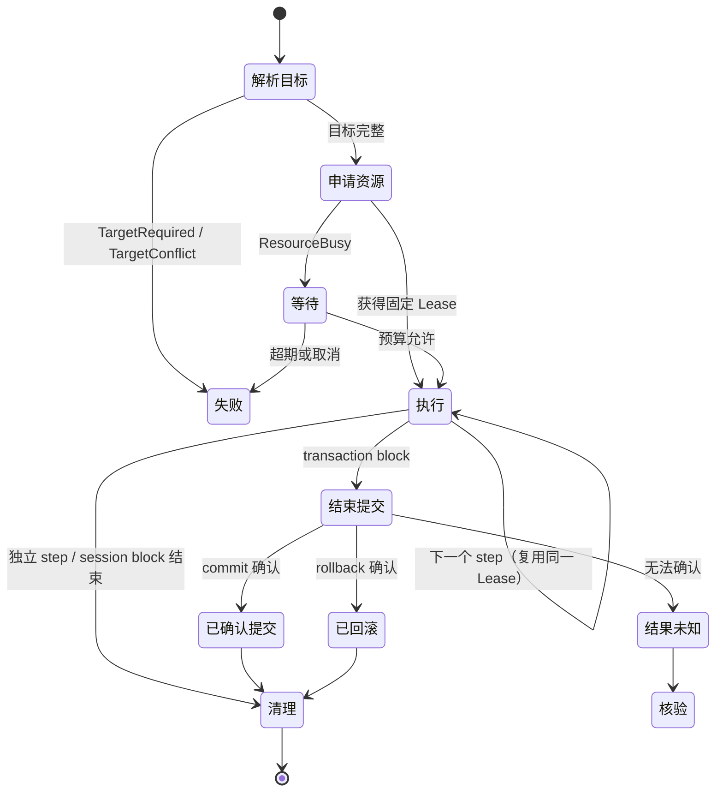

# DataZen Workflow 资源模型详细设计（step / session block / transaction block）

> 状态：**目标设计，尚未实现**。基线：2026-09-30，`8592b0fe1`。
> 本文描述的 step / session block / transaction block 三种执行单元、目标继承链、Job 归属与版本兼容边界，在当前代码中**均不存在**；现状见第 2 节，落地顺序见 [开发计划 §10](../../development/platform-development-plan.md#10-p6workflowaimcpwapp-与辅助任务)。
> **本文是破坏性模型变更，旧 Workflow 定义的行为会变化，迁移路径见第 10.6 节。**
> 配套文档：[系统概要](system-overview.md#4-模块职责与边界)（§4 Workflow Runtime、§6.4 repositories、§7.3）、[连接管理详细设计](connection-management.md#91-默认资源政策)（§9.1 资源政策、§9.5 资源类别、§11 Workflow 语义、§16.5 验收用例）。
> 已实现部分见 [Workflow 架构](../backend/workflow.md) 与 [Workflow 使用指南](../../features/workflow-guide.zh-CN.md)。

---

## 1. 目标与范围

### 1.1 为什么需要独立成篇

[连接管理 §11](connection-management.md#11-workflow--ai--mcp--wapp) 给 Workflow 的资源语义只有 3 段散文（第 4 段是 AI/MCP/Wapp 边界），[系统概要 §7.3](system-overview.md#73-三件套与-workflow) 讲 Workflow 只有 1 句。本文把这些意图展开到可直接编码的粒度：三种执行单元的判定规则、目标解析算法、Job 归属、重试范围、计划预校验和版本兼容。

这是平台改造中**唯一破坏已发布功能**的部分：Workflow 引擎已经上线（GUI、Tauri IPC、MCP、调度器、Dashboard 五个入口共用），YAML 定义已经存在用户文件、注册表内建样例和 Dashboard 引用，而三种资源范围此前并不存在。因此本文同时给出现状事实（第 2 节）和破坏性迁移路径（第 10 节）。

### 1.2 覆盖范围

| 覆盖 | 不覆盖 |
| --- | --- |
| 三种执行单元的模型、YAML、校验与运行时行为 | QueryPanel / TablePanel 的会话与预算（见[连接管理 §9](connection-management.md#9-连接池预算与清理)） |
| Workflow 目标的四级继承与冲突处理 | 三件套 Job 的阶段资源语义（见[连接管理 §10](connection-management.md#10-三件套与-job-实现细则)） |
| Workflow 执行是否包裹 Job、OwnerRef 与资源释放时机 | AI / MCP / Wapp 自身的授权与协议细节 |
| 并行分支资源划分、重试范围、Checkpoint 边界 | 驱动方言差异与命令实现 |
| transaction block 的计划预校验与 `UnsupportedPlan` | 事务隔离级别选型与锁策略 |
| 定义版本解析与旧定义兼容 | Workflow 步骤类型的通用语法（见[使用指南](../../features/workflow-guide.zh-CN.md)） |

### 1.3 术语

沿用既有文档，不重新定义 DTO：`connectionId`（持久化连接配置 id）、`dbSessionId`（运行时数据库会话 id，内存态，永不落盘）、`ExecutionTarget`、`SessionHandle`、`OwnerRef`、`ResourceLease`、`Job`、`Checkpoint`、`UnsupportedPlan`。类型与字段形状见[连接管理 §4](connection-management.md#4-dto-与字段定义)，各对象职责与归属见[连接管理 §1](connection-management.md#1-开发前先理解的六个对象)，本文只引用不复述。

- **block**：一个声明了资源范围与生命周期的执行单元容器，可包含多个 step。
- **step**：block 内的最小可重试、可观测执行节点。
- **资源范围（resource scope）**：一个 block 在其生命周期内允许持有的物理资源形态：每次初始化的短操作、跨 step 保持的固定 session、或 runtime 托管的事务。

---

## 2. 现状事实（以 2026-09-30 `8592b0fe1` 代码为准）

本节全部结论来自实际读过的代码。凡未能在代码中验证的，写为「待 P0 验证」并汇总在[第 12 节](#12-待-p0-验证清单)。

### 2.1 模块结构

`src-tauri/src/workflow/` 实际有 14 个源文件。`mod.rs` 只声明 9 个模块：8 个 `pub mod` 加 1 个 `pub(crate) mod migration`（`migration` 不是公开模块）；`conditions.rs`、`context.rs`、`data_step.rs`、`executor.rs` 更是通过 [`workflows.rs`](../../../src-tauri/src/workflow/workflows.rs) 的 `#[path]` 声明为私有子模块，不出现在 `mod.rs` 中。`[已实现的 Workflow 架构](../backend/workflow.md)` 的文件清单（10 项）缺 `data_step.rs`、`error.rs`、`migration.rs`、`scheduler.rs`，且把 `#[path]` 子模块当成平铺模块描述。

`data_step.rs`（749 行）**不涉及任何数据库资源**，内容是 `merge` / `transform` 的行集合并与表达式求值（`run_merge`、`run_transform`、`evaluate_expression`）。`context.rs` 负责变量与模板上下文，`conditions.rs` 负责条件比较。

### 2.2 定义模型

[`model.rs`](../../../src-tauri/src/workflow/model.rs) 的 `WorkflowDefinition` 为扁平结构：顶层 `connection`（默认连接，可为 `{{var}}` 模板）与 `database`（默认库）被 step 继承；**没有任何 block 层级字段**。`WorkflowStep` 用 `#[serde(tag = "type")]` 区分 `query` / `command` / `ai` / `condition` / `foreach` / `migration` / `merge` / `transform`。

| 观察 | 证据 |
| --- | --- |
| `query` step 有顶层 `database` 字段 | `WorkflowStep::Query { id, sql, connection, database, timeout_secs, on_error }` |
| `command` step **没有**顶层 `database` 字段 | `WorkflowStep::Command { id, command, connection, input, timeout_secs, on_error }`，库名只能写在 `input.database` |
| `ai` step **没有** `connection` / `database` 字段 | AI 步骤当前不接触目标资源 |
| `version: Option<String>` 存在 | `WorkflowDefinition.version` |
| 三个内建 YAML 均未写 `version` | [`src-tauri/resources/builtin-workflows/`](../../../src-tauri/resources/builtin-workflows) 下的 `hello-query.yaml`、`cross-db-sample.yaml`、`ai-summarize.yaml` |

### 2.3 版本字段的现状（重要）

`version` 字段在**全仓库范围内只被写入，从未被读取**：

- 没有任何按版本分派的解析代码（无 `match version`、无 `CURRENT_VERSION` 比较，三个内建 YAML 也未设置该字段）；
- 生产代码写入点只有 `src-tauri/src/dashboard/create.rs:64` 的 `version: None` 字面量；其余 11 处全在测试代码内（`workflow/registry.rs:260`、`workflow/executor.rs:901/938/972`、`workflow/scheduler.rs:231`、`workflow/migration.rs:892`、`commands/dashboard.rs:461`、`commands/ai/integration_tests.rs:356/906/1039/1085`），其中仅 `integration_tests.rs:356` 写 `Some("1")`，同样无人读取。

对比：仓库中其他"定义版本"确有实现——`schema_diff/profile.rs:44-47` 的 `CURRENT_VERSION` 并在遇到未知版本时报 "unsupported ... version"；`data_sync::SyncProfile`、`data_transfer::profile.rs` 同样有 `CURRENT_VERSION`；`store/favorites/migrate.rs` 有 `MIGRATION_VERSION`。Workflow 是这些带 `CURRENT_VERSION` 校验的定义中唯一未校验的一个；另需注意 `store/settings.rs:15` 的 `OnboardingState.version` 同样只写不读（生产路径只读 `completed`）。

### 2.4 目标解析与资源获取

[`executor.rs:124`](../../../src-tauri/src/workflow/executor.rs)：

```rust
let workflow_connection = workflow.connection.as_deref().or(connection_id);
let workflow_database = workflow.database.as_deref();
```

`connection_id` 是**调用方传入的运行时参数**，由 IPC / MCP / 调度器决定，是 P6 要消除的隐式目标来源。当前优先级因此只有两级：step 显式 → (workflow 默认 → 调用方 connectionId)。

query 分支（[executor.rs:444-489](../../../src-tauri/src/workflow/executor.rs)）：

1. `step_database = step.database`（可为 `{{var}}`，先做模板解析）；
2. `inherited_database = workflow_database`；
3. `resolved_database = step_database.or(inherited_database)`；
4. 仅当 `resolved_database.is_none()` 且 `database_is_required(connection_database, driver_has_multi_database)` 时报 `MissingDatabase`；该判定只对多库驱动生效，PostgreSQL 驱动在 `resolve_connect_database` 中硬编码 `"postgres"`。

command 分支（[command_runtime.rs`](../../../src-tauri/src/workflow/command_runtime.rs)）：

1. `resolve_connection_id(step, workflow_connection)` → `step.effective_connection(workflow_connection)`，缺失报 `MissingConnection { step_id }`；
2. `inject_inherited_database(input, workflow_database)`：显式非空 `input.database` 优先，空白串按未设置处理，trim，非对象则空操作；
3. `connection_manager.resolve_session_for_connection(connection_id)` 返回 `(runtime_id, driver, handle)`；该方法内部按 **`session_owner_map` 里 owner == 配置 id** 查找已有会话，找不到则 `connect(connection_id)` 新建（`resolve_session_for_connection` 见 [sessions.rs:92-103](../../../src-tauri/src/services/connection_manager/sessions.rs)，owner 查找与新建在同文件 `get_or_connect_session`，[sessions.rs:8-37](../../../src-tauri/src/services/connection_manager/sessions.rs)）；
4. 在 `driver.command_definitions()` 中查 id，未找到报 `UnsupportedCommand`，`metadata.workflow == false` 报 `CommandNotInWorkflow`；
5. `validate_command_input` + 按 `permission_mode` 的 `check_command_access`；id 为 `"query"` / `"execute"` 时再过 `sql_guard::check_sql` 与 `mcp::permission::check_sql_allowed`；
6. `inject_sql_target_fields(&mut input, database, schema)` 后 `driver.execute_command`。

`command_runtime.rs:115-119` 的注释明确记录了目标定位策略：**不再做 session 切库**，目标随 command input 下传，由支持 `qualify_sql_target` 的驱动就地改写未限定关系名；当前 6 个 SQL 驱动（clickhouse、sqlite、duckdb、mysql、postgres、sqlserver）均已实现该方法，mongodb 虽声明 `has_multi_database` 但不走 SQL 路径。

### 2.5 调度、历史与 Job

| 观察 | 证据 |
| --- | --- |
| 调度器不包裹 Job | `scheduler.rs:176` 直接调用 `commands::workflow_execute_impl(state, id, json!({}), None)`，连接参数恒为 `None` |
| 调度器无资源会计 | `WorkflowScheduler` 只有 `app_handle` / `paused` / `last_run` / `in_flight` / `cancel_token`，无预算与阶段字段；间隔下限 30 秒、默认 3600 秒，进程启动首次观察只上膛不触发 |
| Dashboard 同样不传连接 | `dashboard/execute.rs:222` 传 `None` |
| MCP 入口显式可选 | `mcp/tools.rs` 的 `run_workflow` 接受 `connection_id: Option<String>`，只读模式下 `run_workflow` 被 `READ_ONLY_BLOCKED_TOOLS` 拦截 |
| 历史按可见性写入 | `commands/workflow.rs`：`visibility == DashboardHidden` 不写历史；变量经 `migration::sanitize_variables` 脱敏 |
| 全链路**没有平台 Job 概念** | Workflow 执行不产生 jobId、不进 `JobRepository`、没有阶段资源与检查点；连 `migration` step 也把三件套请求的 `job_id` 传 `None`（[migration.rs:509](../../../src-tauri/src/workflow/migration.rs)） |

### 2.6 错误与事务

`error.rs` 的 `WorkflowError` 共 13 个变体，IPC 边界仍用 `into_ipc_string()` **把错误拍平成字符串**：没有结构化 `ExecutionErrorCode`，没有 `UnsupportedPlan`、`TargetRequired`、`OutcomeUnknown` 等目标化错误码。全仓库 grep 不到 `UnsupportedPlan` 在 Workflow 路径上的产生点。

事务：Workflow 执行路径**完全不管理事务**。`services/transaction.rs` 的 `TransactionScope` 目前唯一的生产消费者是 `schema_diff/deploy.rs`。`migration.rs`（三件套 step 执行器，**不是定义版本迁移机制**）内部用 `RuntimeSession { db_session_id, database, schema }` 表达自己的端点会话并在结束时 `release`，同样不暴露给 Workflow block 语义。

### 2.7 现状与目标的差距小结

| 维度 | 现状（已验证） | 目标（第 3–10 节） |
| --- | --- | --- |
| 执行单元 | 只有 step，扁平 | 独立 step / session block / transaction block |
| 目标来源 | 3 处：step、workflow 默认、调用方 connectionId | 4 级：step 显式 → block → workflow 默认 → profile 初始目标 |
| 资源持有 | 每次 command 独立 `resolve_session_for_connection` | block 声明范围，session/transaction block 跨 step 固定 Lease |
| 事务 | 无 | runtime 控制 begin/commit/rollback，含计划预校验 |
| 归属 | 无 | 本文提议的 Job 包裹 + `OwnerRef { kind: 'workflowBlock' }`（[§5.1](#51-workflow-执行是否包裹-job)，待 P3 定案） |
| 版本 | 字段存在，从不读取 | 按版本分派解析，未知版本拒绝 |
| 错误 | 字符串 | 版本化 `ExecutionErrorCode` + `effectOutcome` |
| Checkpoint | 无 | 稳定目标、版本、映射指纹、已确认提交边界 |

### 2.8 一处已确认的身份错配

GUI 的 AI 侧栏把**运行时会话 id 当作 `connectionId` 传给 Workflow**：[`components/ai/WorkflowPanel.tsx:104`](../../../src/components/ai/WorkflowPanel.tsx) 在 `handleExecute`（L99-107）里执行时传 `connectionId: dbSessionId`，而 `dbSessionId` 来自 `activeConnections[conn.id]?.dbSessionId`（连接窗口的运行时会话标识）。后端 `resolve_session_for_connection` 按 owner **配置 id** 查表，按[命名规范](../../../AGENTS.md) 这是被禁止的双模混用。同一页面的独立 Workflow 窗口（[`WorkflowPage.tsx:417`](../../../src/windows/workflow/WorkflowPage.tsx)）则完全不传该参数。

这正是第 9 节"AI/MCP/Wapp 与 Workflow 边界"要清理的入口耦合，实际失败表现列入[第 12 节](#12-待-p0-验证清单)。

---

## 3. 目标资源模型：三种执行单元

### 3.1 定义

| 执行单元 | 资源范围 | 生命周期 | 原子性承诺 | 状态跨 step |
| --- | --- | --- | --- | --- |
| **独立 step** | 每次执行独立初始化的短操作资源 | 单个 step | 无 | 不保留 |
| **session block** | 一条跨 step 连续的固定 Lease | block 首个 step 开始 → 最后一个 step 结束 | 无 | 保留（临时对象、会话变量、已确认上下文） |
| **transaction block** | 一条固定 Lease + runtime 托管事务 | begin → commit/rollback 确认 | 提交边界由 runtime 保证 | 保留，且在提交前对外不可见 |

三种单元共享同一套约束：资源 owner 明确（[第 5 节](#5-session--lease--budget-集成)）、target 操作不改变任何其他 session 的默认库或事务（[INV-05](connection-management.md#3-不可破坏的不变量)）、实际上下文由 driver 确认而非 SQL 文本推断（[INV-04](connection-management.md#3-不可破坏的不变量)）。

### 3.2 独立 step

每次执行独立初始化资源，步骤内的 `USE` / `SET search_path` 等会话状态**只在该 step 内有效**，不泄漏到后续 step，也不在步骤之间保留临时对象。独立 step 用顶层 `steps:`（v2 保留的 v1 扁平容器，见 [§8.1](#81-顶层) 与 [§10.2](#102-按版本分派解析)），无需 block 包裹。

```yaml
version: "2"
id: independent-steps
name: 独立 step 默认语义
steps:
  # step1 自己的资源上切库；只在本 step 内生效
  - type: query
    id: probe
    connection: "{{conn}}"
    database: "reporting"
    sql: "SELECT current_database() AS db, count(*) AS n FROM orders"

  # 未指定目标 → 回到 workflow 默认目标，不继承 step1 的 reporting
  - type: query
    id: aggregate
    sql: "SELECT count(*) AS total FROM orders"

  # 显式目标优先于 workflow 默认目标
  - type: query
    id: archive
    connection: "{{archive_conn}}"
    sql: "SELECT count(*) AS archived FROM orders"
```

这与 [CM-50](connection-management.md#165-三件套与-workflow) 的断言一一对应：step1 用自己的资源 `USE B`，step2 用 A，step3 用 C，step1 状态不泄漏，资源全部清理。**旧定义在目标 runtime 下的默认语义就是独立 step**（[第 10.4 节](#104-旧定义在目标-runtime-下的默认语义)）。

### 3.3 session block

block 内所有 step 在**同一条物理资源**上串行执行，状态跨 step 保留；块结束才释放。并行分支各自获得独立资源（[第 6 节](#6-并行分支与重试)），**同一 session block 永不并行执行**——同一 blockId 在同一 Workflow run 内同时只能有一个执行实例。

```yaml
version: "2"
id: session-block-demo
name: 临时对象跨 step 可见
blocks:
  - type: sessionBlock
    id: staging
    connection: "{{conn}}"
    database: "analytics"
    steps:
      - type: command
        id: create_temp
        command: "create_temp_table"
        input: { name: "matched_orders" }

      - type: command
        id: fill_temp
        command: "insert_rows"
        input:
          source: "steps.fetch.result"

      # 与 create_temp 同一物理资源：临时表可见
      - type: query
        id: verify_temp
        sql: "SELECT count(*) AS n FROM matched_orders"

      - type: query
        id: force_reconnect
        # 声明了需要重连的 database 变更，静态校验直接拒绝
        database: "analytics_archive"
        sql: "SELECT 1"
```

规则：

1. block 首个 step 触发资源获取，其后所有 step 复用同一 Lease，满足 [INV-02](connection-management.md#3-不可破坏的不变量)（driver 不得内部换连接）。
2. 同一 session 的普通执行串行（[INV-03](connection-management.md#3-不可破坏的不变量)）；取消走独立控制路径。
3. block 内的 step 不得声明 `database` 变更到需要**重连**的库（如 PostgreSQL 换库需新连接）。声明了则静态校验拒绝，运行期只能通过 driver 声明的**不需重连**的上下文切换（如 MySQL `USE`），且切换后必须由 driver 确认实际上下文（[INV-04](connection-management.md#3-不可破坏的不变量)）。
4. block 结束无条件释放：走[§9.4 归池前检查](connection-management.md#94-归池前检查)，失败不归池。
5. session block **可以**执行原生任意 SQL，但**不提供** runtime 管理的整块原子性（[第 7 节](#7-transaction-block-计划预校验)）。

### 3.4 transaction block

runtime 控制 begin / commit / rollback，步骤在事务内执行且**不得破坏提交边界**。

```yaml
version: "2"
id: transfer-block
name: 受控 DML 事务块
blocks:
  - type: transactionBlock
    id: apply
    connection: "{{conn}}"
    database: "orders"
    steps:
      - type: command
        id: debit
        command: "order_debit"
        input: { order_id: "{{order_id}}", amount: "{{amount}}" }

      - type: command
        id: credit
        command: "order_credit"
        input: { order_id: "{{order_id}}", amount: "{{amount}}" }

      - type: query
        id: assert_balance
        sql: "SELECT balance FROM ledger WHERE order_id = '{{order_id}}'"
```

规则：

1. **开始前**由 driver 校验整份计划能否保证提交边界（[第 7 节](#7-transaction-block-计划预校验)），不能证明则整块拒绝，返回 `UnsupportedPlan`，**不执行任何语句**。
2. 事务开启时若实际事务状态为 `unknown`（[§6.1 Session 状态机](connection-management.md#61-session-状态机)），拒绝开始，返回 `TransactionResolutionRequired`。
3. 任一 step 失败 → runtime 执行 rollback 并记录 `effectOutcome`；只有**已证实回滚**才允许重试整块（[第 6.2 节](#62-重试范围)）。
4. commit 发出后若结果无法确认 → `effectOutcome = unknown`，`errorCode` 取**实际成因**（`protocolError` / `timeout`），**不自动重试**（[INV-12](connection-management.md#3-不可破坏的不变量)）。
5. 需要重连的 database 变更**不得**进入已开启的 transaction block；静态校验拒绝，运行期也不提供中途换库。
6. 事务句柄按 [§6.5 会话级资源句柄登记](connection-management.md#65-会话级资源句柄登记) 在终态前登记到 session actor；归池前必须为空。

### 3.5 对照

| 维度 | 独立 step | session block | transaction block |
| --- | --- | --- | --- |
| 资源获取时机 | 每次 step | block 首 step | block 首 step |
| 资源释放时机 | step 结束 | block 结束 | commit/rollback 确认后 |
| step 间状态 | 不保留 | 保留 | 保留，提交前对外不可见 |
| 并行 | 允许 | 同一 block 不允许 | 同一 block 不允许 |
| 原子性 | 无 | 无 | 提交边界由 runtime 保证 |
| 可含任意 SQL | 是 | 是 | 受限（需可证明） |
| 默认 checkpoint 恢复 | 不适用 | **不允许从中间恢复** | 先核验；仅满足 §6.2 重试证明时整块重跑 |
| 目标冲突行为 | 各自解析 | 同一 block 内必须一致 | 同一 block 内必须一致 |

---

## 4. 目标继承与覆盖优先级

### 4.1 四级链

```
step 显式目标  >  block target  >  workflow 默认目标  >  profile 初始目标
```

这是[连接管理 §11](connection-management.md#11-workflow--ai--mcp--wapp)第一句的展开。四级的定义：

| 级别 | 来源 | 适用范围 | 备注 |
| --- | --- | --- | --- |
| L1 step 显式目标 | step 的 `connection` / `database` / `input.database` | 单个 step | 最高优先级；必须是**完整**目标（connectionId + 命名空间），不允许只给 connectionId 让下游猜库 |
| L2 block target | block 的 `connection` / `database` | 整个 block | 独立 step 模式下等价于 workflow 默认 |
| L3 workflow 默认目标 | 顶层 `connection` / `database` | 全部 step | 保留旧定义的既有字段 |
| L4 profile 初始目标 | `ConnectionProfile` 绑定的初始 database | 全部 step | 不可被调用方参数覆盖 |

**调用方参数不在链内。** GUI 当前连接、MCP `connection_id`、Dashboard 当前库都不再参与解析，这是 P6 的核心目的（[开发计划 §10](../../development/platform-development-plan.md#10-p6workflowaimcpwapp-与辅助任务) "消除 GUI 外入口的隐式目标和共享状态"）。旧链中 `workflow.connection.or(caller_connection_id)` 的回退分支在 v2 中删除；需要"跟随当前连接"的语义改为在 block 或 step 上**显式**写一个绑定当前编辑器 session 的引用（[第 9 节](#9-ai--mcp--wapp-与后台入口的边界)）。

### 4.2 解析算法

对每个需要资源的数据 step，按序执行：

```text
resolveTarget(step, block, workflow, profile) -> ExecutionTarget | error

1. 展开模板并规范化 step、block、workflow 的目标声明；重复声明不一致 → TargetConflict。
2. 按 L1 → L2 → L3 选择最高优先级的已声明目标；只有该级完全未声明才可回退。
3. 选中的显式目标缺 connectionId 或操作必需命名空间 → TargetRequired；
   不拼接另一连接的 database，不因不完整而换用低优先级连接。
4. L1～L3 均未声明时，读取本次定义已绑定 profile 的 initialTarget；
   未绑定 profile 或初始目标不完整 → TargetRequired，不使用调用方当前连接。
5. 对 t 校验 namespaceShape、操作级 targetRequirements、权限与配置版本。
6. session/transaction block 中，将 t 与 block 声明目标及已持有资源绑定比较；
   connectionId 不同或命名空间变化不被 block/driver 允许 → TargetConflict。
7. 所有校验通过才返回 t；独立 step 走 executeAtTarget，block 内走原资源。
```

`normalize` 的规则：模板 `{{var}}` 先在 step 开始前解析成字面量；空串与纯空白按**未设置**处理（与现状 `inject_inherited_database` 一致）；`connection` 必须是 `connectionId`，不接受 `dbSessionId`（[命名规范](../../../AGENTS.md)）；多库驱动下 `database` 缺失即 `TargetRequired`，不允许静默使用会话当前库。

### 4.3 冲突处理

| 情形 | 处理 | 错误码 |
| --- | --- | --- |
| step 显式目标与 block 目标指向不同 connectionId，block 是 session/transaction | 静态校验在执行前拒绝整块 | `TargetConflict` |
| 同一 block 内两个 step 目标不同，但差异只在命名空间 | 静态拒绝；跨库不是 session block 的能力 | `TargetConflict` |
| 需要切库但该库要求新连接 | 静态拒绝（`connection-management §8` 的 driver 契约） | `TargetUnsupported` |
| 解析结果缺必需 database | 运行时按实际驱动能力判定 | `TargetRequired` |
| 目标资源不可用 / 队列满 | 不创建额外连接，可取消等待 | `ResourceBusy` / `QueueFull` |
| 并行分支写同一对象 | 允许，但提交冲突按乐观锁判定，不静默覆盖 | `TargetConflictRows` |

### 4.4 禁止项

- 禁止为了定位目标而改写任意 SQL 的所有关系名；受控对象由 driver 渲染限定名，任意 SQL 用真实会话目标（[连接管理 §8](connection-management.md#8-multidb-与用户-sql)）。
- 禁止用 `connectionId` 兜底查已有会话再失败回落新建（[INV-08](connection-management.md#3-不可破坏的不变量) 的透明重建禁令）。
- 禁止把 `dbSessionId` 写入 Workflow 定义、Job 记录或 Checkpoint。
- 禁止用 SQL 文本推断实际上下文来更新 `observedContext`。

---

## 5. Session / Lease / Budget 集成

### 5.1 Workflow 执行是否包裹 Job

**本文提议：包裹（待 P3 定案）**，不是既有契约。既有契约只把 Job 明确分给三件套与导出阶段：[§9.1](connection-management.md#91-默认资源政策) 给 Workflow 的资源策略是"step/block 声明范围"，[§9.5](connection-management.md#95-资源类别与调度) 的 `job` 预算类别只分给"迁移/导出阶段"，[§11](connection-management.md#11-workflow--ai--mcp--wapp) 与 CM-50～52 都没有 Workflow 产生 Job 的断言（CM-40 的前置是**迁移 Job**，属 P5）；唯一相容的既有钩子是 [§4](connection-management.md#4-dto-与字段定义) 的 `OwnerRef` 变体 `workflowBlock { jobId, blockId }` 与 [§17](connection-management.md#17-验收标准与证据) 的"Job owner 断言"。本文提议的理由是三条硬要求都只能由 Job 满足：

1. **窗口无关**（[INV-12](connection-management.md#3-不可破坏的不变量) / CM-40）：关闭 Workflow 窗口或桌面标签不能释放资源；
2. **提交未知不自动重试**需要可持久化的执行记录与 `effectOutcome`（既有契约中对应 [§4.4 `DurableExecutionRecord`](connection-management.md#44-可落盘来源与运行时绑定)，不必是 Job）；
3. **Checkpoints** 记录稳定目标、版本、映射指纹与已确认提交边界，需要落盘的 [§4.2 `JobCheckpoint`](connection-management.md#42-内部记录)。

现状是全链路无 Job（[§2.5](#25-调度历史与-job)）。若 P3 采纳：block 是 Job 的阶段载体，阶段资源按 [§9.5 job 类](connection-management.md#95-资源类别与调度) 申请；GUI 前台交互式运行仍可见进度，但**资源归属**是 Job 而不是窗口。若不采纳，第 5 章其余结论按"block 资源的 owner 载体待定"降级，重试与 checkpoint 语义不变。

### 5.2 OwnerRef

block 的资源 owner 使用[连接管理 §4](connection-management.md#4-dto-与字段定义) 已定义的 `OwnerRef` 变体，不新增：

```typescript
{ kind: 'workflowBlock'; jobId: Id; blockId: Id }
```

| 场景 | owner |
| --- | --- |
| Workflow block 的 session / transaction Lease | `workflowBlock { jobId, blockId }` |
| 独立 step 的短操作 Lease | 该 step 所属 block 的 `workflowBlock`（是否归 Job 见 [§5.1](#51-workflow-执行是否包裹-job)，不用 `clientSession`） |
| MCP 显式 session | `clientSession { clientInstanceId, purpose }`，TTL 配额控制 |
| Wapp session | 实例或 Job |

约束：请求方不能声称任意 job owner；后端确认 Job 存在、属于调用主体且处于可执行状态（[§4 补充说明](connection-management.md#4-dto-与字段定义)）。Job 不使用交互 attachment TTL（[§6.4](connection-management.md#64-attachment-与超期处理)）。

### 5.3 资源获取与释放



| 时点 | 动作 |
| --- | --- |
| block 首个数据 step 前 | 一次性预留该 block 需要的全部端点许可（多端时要么全成功要么全释放，不持半边无限等待，[连接管理 §9.5](connection-management.md#95-资源类别与调度)） |
| transaction block 开始前 | 先做计划预校验（[第 7 节](#7-transaction-block-计划预校验)），通过后才申请资源 |
| block 结束 | 事务终结、句柄清空、结果消费完成 → 走归池前检查 → 归池或关闭 |
| Job 终态 | 无论完成/失败/取消都走 cleanup；预算只释放一次（[INV-10](connection-management.md#3-不可破坏的不变量)） |
| 进程关闭 | 停止派发；未完成 Job 进入核验 / `OutcomeUnknown`，不自动再执行 |

### 5.4 失败与清理

- 事务回滚失败 → `RollbackFailed`，隔离资源、报告真实 `effectOutcome`，不归池（[INV-06](connection-management.md#3-不可破坏的不变量)）。
- 资源健康未确认 → 关闭而非归池；driver 返回 `Clean` 不构成宿主检查通过的证据。
- 取消：走独立控制路径，不排在待取消查询之后（[INV-03](connection-management.md#3-不可破坏的不变量)）。取消只回滚未提交范围，**已提交批次保留**。
- `cancelled` 只表示取消请求已送达驱动，不构成"写入已回滚"的证据（[§13 effectOutcome 规则](connection-management.md#13-错误重试和事件)）。

---

## 6. 并行分支与重试

### 6.1 分支资源划分

- 每个并行分支**各自申请资源**，不共享 Lease；分支内 block 内部仍保持"一个 block 一条资源"。
- 同一 session block 在同一 Workflow run 内不并行：静态校验发现同一 blockId 被并发引用时拒绝配置，运行期重复进入返回 `ResourceBusy`。
- 并行度受 [§9.5 队列与 Job 并发上限](connection-management.md#95-资源类别与调度) 约束：每类每服务排队上限 32、每用户 32、Job 最大并发阶段数默认 4，共享额度按加权轮转。
- 分支共享的是**只读变量上下文**，不是数据库资源；分支之间通过 `merge` / `transform` 汇聚结果（这两者当前是纯 Rust 计算，不接触资源，[§2.1](#21-模块结构)）。

### 6.2 重试范围

| 失败位置 | 重试范围 | 前提 |
| --- | --- | --- |
| 独立 step 执行失败 | 该 step | 幂等键未过期；命令为可重放语义 |
| session block 中途失败 | **默认不自动重试**；满足证明后才可从头重跑 | 资源已确认清理，且整块可安全重放、确认尚未产生副作用，或已证实所有副作用完整回滚；清理连接不撤销已提交写入 |
| transaction block 失败 | **整个 block，从头重跑** | **必须先证实已完整回滚** |
| commit 结果未知 | **不重试** | 返回 `OutcomeUnknown`，走人工/自动核验 |
| 计划预校验失败 | 不重试 | `UnsupportedPlan`，需修改定义 |

**任意 session block 默认不能从中间 checkpoint 恢复。** 原因：块内状态（临时表、会话变量、驱动内部准备状态、已确认的上下文变化）没有可重建的持久表示，按 [§6.5](connection-management.md#65-会话级资源句柄登记) 恢复流程也禁止重建句柄，只允许以新 `dbSessionId` 显式重建。需要"从某步继续"的场景必须拆成两个 block 或两个 Workflow run，并在前一个 block 的输出中传递稳定键。

P6 验收必须覆盖：第一步自动提交写入、第二步失败时不重复第一步；commit 未知不重试；完整回滚证明后允许重试；显式连接缺 database 时不落入 workflow 的另一连接；完整 step 目标也必须经过 block 冲突检查。重试使用新的执行记录并关联原失败记录，旧幂等键只用于查询原回执，不能用来启动第二次执行。

### 6.3 Checkpoint 边界

`job_checkpoints` 的表结构、字段与约束的**唯一权威**是 [persistence-model §3.6](persistence-model.md#36-jobs-与-job_checkpoints)（`stable_keys`、`committed_boundary`、`verification_evidence`、`mapping_fingerprint`、`recovery_policy` 与 `ck_ckpt_policy` 约束）；本文只规定**何时写检查点**，不重复定义字段。

写入时机：每个 block（Job 阶段）结束且结果已确认后写一次；跨端补偿、`merge` / `transform` 汇聚与 Job claim 转移前，先确保上一阶段的已确认边界已落盘；同一次运行的同一阶段重复写入时按 `checkpoint_version` 递增追加，不覆盖既有记录。

语义禁止项（不新增字段）：不得写入任何 live `dbSessionId` / `SessionHandle` / `ResourceLease` 句柄、未消费完的游标或结果缓冲，也不得把"应该已提交"这类推测结论当作已确认边界；跨重启的版本比对以 `jobs.plan` 冻结的 config / credential / capability 版本为准（[§7.2](#72-校验输入)），不塞进检查点。

Checkpoint 与目标 commit 之间存在崩溃窗口（CM-47）：恢复时必须查询目标记录确认提交，无证据时 `OutcomeUnknown`，**不按旧 offset 重跑**。

### 6.4 跨端原子性与补偿

跨端事务（源与目标分属不同连接 / 不同服务）**不承诺原子性**。跨端 workflow 一律按幂等 + 补偿处理：

1. 每个写入步骤携带稳定幂等键（目标侧记录 batchId / 业务唯一键）；
2. 已确认提交写入 Checkpoint；
3. 中断后先核验目标实际生效范围，再决定重放、跳过或补偿；
4. 补偿动作本身也是 workflow，必须可重复执行且不依赖运行时状态。

---

## 7. transaction block 计划预校验

### 7.1 原则

**先证明，后执行。** transaction block 在执行任何语句之前，由 driver 校验整份计划是否能保证提交边界。校验失败是**执行前拒绝**，不是运行到一半失败。

### 7.2 校验输入

| 输入 | 说明 |
| --- | --- |
| 块内全部写步骤的语句/Command 形状 | 受控 DML Command 的 id + 参数 schema；任意 SQL 的原文 |
| 目标 connectionId 的 config / credential / capability 版本 | 冻结版本，变化则重校验 |
| 目标 database / schema 的完整命名空间 | 提交边界的作用域 |
| 驱动的方言能力声明 | 哪些语句属于隐式提交、哪些需要新连接 |
| 块的读写范围 | 读步骤只影响快照语义，不影响边界证明 |

### 7.3 校验输出

```typescript
type PlanVerdict =
  | { ok: true; commitBoundary: 'singleTransaction'; transactionScope: string }
  | { ok: false; reason: 'UnsupportedPlan'; offendingSteps: string[]; detail: string }
  | { ok: false; reason: 'CapabilityUnsupported'; detail: string };
```

- `ok: true` 才允许申请资源并 `begin`。
- `offendingSteps` 用于 UI 逐条高亮。CM-52 的断言只要求"不支持计划在执行前被拒绝"，不强制 stepId 定位；精确定位是本文为可用性追加的要求。

### 7.4 判定规则

1. **受控 DML Command 优先**：Command 定义显式声明 `transactionSafe: true` 且参数 schema 不接受原始 SQL 时，直接判定可保证边界。
2. **任意 SQL**：必须由**方言解析器**证明不含下列行为才判为安全：
   - 用户显式 `COMMIT` / `ROLLBACK` / `END` / `BEGIN`；
   - 修改 `autocommit` / `SET autocommit = 0`；
   - DDL 或其他隐式提交语句（MySQL 多种 DDL 隐式提交，见[连接管理 §10.2](connection-management.md#102-schema-diff)）；
   - 过程 / 函数 / 触发器内部可能提交的路径，或驱动无法解析的动态 SQL。
3. 任一项无法证明 → `UnsupportedPlan`。
4. driver 缺少方言解析能力 → `CapabilityUnsupported`，**不允许降级为"看起来安全"**。

### 7.5 为什么不能用关键词正则

**明确禁止只用关键词正则宣称安全。** 原因是这类判定在工程上不可靠：

| 失败模式 | 例子 |
| --- | --- |
| 漏判破坏边界的语句 | `COMMIT` 写在字符串字面量/注释里被误删；`CALL` 内部提交、存储过程、`SAVEPOINT` 释放、DDL 触发的隐式提交未被关键词覆盖 |
| 误判破坏安全性的语句 | 字符串 `'COMMIT'`、列名 `commit_time`、`insert into commits(...)` 被误判为危险 |
| 语义随方言变化 | 同一条语句在不同驱动/版本下语义不同；PostgreSQL 的 `VACUUM`、SQL Server 的 DDL 事务表现各异 |
| 掩盖真实边界 | 通过"删掉 COMMIT"制造出用户没预期的语义变更 |

因此 `sql_guard::check_sql`（现状用于 read-only / safe-mode 的语句过滤）**不构成**提交边界证明，不能被复用于本判定。它解决的是"能不能执行"，本节解决的是"能不能保证整块原子性"。

### 7.6 拒绝路径

```text
静态解析/能力检查
  → UnsupportedPlan / CapabilityUnsupported
  → 不申请资源、不执行任何语句
  → Job 记录 offendingSteps（Job 包裹本身是[本文提议](#51-workflow-执行是否包裹-job)，待 P3 定案）
  → `ApiError.code = UnsupportedPlan`，`effectOutcome = notStarted`（预检在派发前，不产生 `ExecutionErrorCode`）
  → UI 定位到具体 step 并给出可操作原因
  → 该结果不进入自动重试
```

对比允许的 session block：它**不要求**上述证明（[§3.3](#33-session-block)），因为它不承诺整块原子性；代价是失败后可能存在已提交或未知副作用，必须先核验；不能把整块重跑当作恢复方式。

---

## 8. 目标 YAML 结构

### 8.1 顶层

```yaml
version: "2"                # 必填；缺失按 version 1 解析（见第 10 节）
id: order-sync
name: 订单同步
description: 拉取订单并落入目标库
variables:
  - { name: conn, type: connection, required: true }
  - { name: order_id, type: string, required: true }
steps: []                   # v1 保留；v2 允许与 blocks 二选一或并存
blocks: []                  # v2 新增
timeout_secs: 300
error_handling: { strategy: abort }
```

### 8.2 block 字段

| 字段 | 适用 block | 说明 |
| --- | --- | --- |
| `id` | 全部 | run 内唯一，出现在 `OwnerRef.blockId` 与检查点中 |
| `type` | 全部 | `sessionBlock` / `transactionBlock` |
| `connection` / `database` | 全部 | block 目标（L2） |
| `parallel` | `sessionBlock` | 默认 `false`；同一 block 并行配置直接拒绝 |
| `steps` | 全部 | 子步骤，可嵌套 `condition` / `foreach`；块内 step 的输出用 `blocks.<blockId>.steps.<stepId>.result` 寻址，不扁平化到顶层 `steps` |
| `retry` | `transactionBlock` | 默认 `block: 0`；只有已证实回滚才允许 |

### 8.3 完整示例

```yaml
version: "2"
id: order-sync
name: 订单同步
variables:
  - { name: conn, type: connection, required: true }
  - { name: order_id, type: string, required: true }
  - { name: amount, type: number, required: true }

steps:
  # 独立 step：每次独立初始化
  - type: query
    id: fetch_order
    connection: "{{conn}}"
    database: "orders_live"
    sql: "SELECT * FROM orders WHERE order_id = '{{order_id}}'"

blocks:
  # session block：跨 step 保留状态，串行
  - type: sessionBlock
    id: staging
    connection: "{{conn}}"
    database: "orders_live"
    steps:
      - type: command
        id: create_stage
        command: "create_temp_table"
        input: { name: "order_batch" }
      - type: command
        id: load_stage
        command: "insert_rows"
        input: { source: "steps.fetch_order.result" }
      - type: query
        id: check_stage
        sql: "SELECT count(*) AS n FROM order_batch"

  # transaction block：runtime 控制提交边界
  - type: transactionBlock
    id: apply
    connection: "{{conn}}"
    database: "orders"
    retry: { block: 1 }
    steps:
      - type: command
        id: debit
        command: "order_debit"
        input: { order_id: "{{order_id}}", amount: "{{amount}}" }
      - type: command
        id: credit
        command: "order_credit"
        input: { order_id: "{{order_id}}", amount: "{{amount}}" }

output:
  format: markdown
  template: "订单 {{order_id}} 同步完成：{{blocks.staging.steps.check_stage.result}}"
```

---

## 9. AI / MCP / Wapp 与后台入口的边界

本节把[连接管理 §11](connection-management.md#11-workflow--ai--mcp--wapp) 的第二段落到 Workflow 侧。

### 9.1 AI

| 场景 | 行为 |
| --- | --- |
| 默认 | AI 对数据库的操作是**独立目标操作**：每次按完整 `ExecutionTarget` 执行，不共享会话，不假设当前库 |
| 用户显式授权当前编辑器 session | 进入**同一队列**（session actor）并共享真实状态：能看到同一 session 内已提交的临时对象，遵从同一串行规则 |
| 授权撤销 / 附件过期 | 回到独立目标操作；已建立的会话按 [§6.4](connection-management.md#64-attachment-与超期处理) 关闭 |
| AI 生成 Workflow YAML | 生成的定义必须显式写 `version` 与目标；不得依赖调用方隐式传入的连接 |

对应 CM-53：未授权时读取编辑器临时对象必须失败，授权后同队列可见。

### 9.2 MCP

- 显式 session 归**客户端/身份**所有（`clientSession`），受 TTL 配额控制；客户端断开只清理自己的资源（CM-53 断言）。
- 不向 MCP 客户端暴露凭据或运行时句柄。
- `run_workflow` 的 `connection_id` 参数在 v2 中不再是"隐式默认目标"：要么显式绑定某个 profile 初始目标，要么要求 MCP 客户端先建立自己的 session。调度类运行使用**服务身份**，不依赖用户登录态。

### 9.3 Wapp

Wapp session 归**实例或 Job**。Wapp 通过受限的 `execute_driver_command` 通道取数，宿主判定它不是 editor；它既不能加入用户的编辑器 session，也不能声称 `workflowBlock` owner。Wapp 触发的 Workflow 运行以该 Wapp 实例身份发起 Job（Job 包裹本身是[本文提议](#51-workflow-执行是否包裹-job)，待 P3 定案）。

### 9.4 后台调度与 Dashboard

- 调度器使用**服务身份 + 委托权限**执行，目标是 Workflow 定义里显式声明的连接（或 profile 初始目标），**不依赖 GUI 当前库，也不依赖用户登录态**。
- Dashboard 组件同样不传隐式连接；`DashboardHidden` 工作流当前不写历史（[§2.5](#25-调度历史与-job)），目标模型下改为写入执行记录、由可见性决定 UI 投影，而不是决定是否落盘。
- 所有辅助任务（导出、备份、恢复）共享同一预算，不污染编辑器资源（[开发计划 §10](../../development/platform-development-plan.md#10-p6workflowaimcpwapp-与辅助任务)）。

---

## 10. 版本与兼容边界

### 10.1 破坏性变更清单

| 变更 | 影响面 |
| --- | --- |
| 移除 `workflow.connection.or(caller_connection_id)` 回退 | 依赖 GUI/MCP 隐式连接的 Workflow 会开始失败 |
| 引入 block 层与资源范围 | 旧定义解析为独立 step，行为等价但资源获取路径改变 |
| Workflow 运行产生 Job（[本文提议](#51-workflow-执行是否包裹-job)，待 P3 定案） | 历史记录、取消、重试、清理的归属改变 |
| 错误从字符串改为版本化 code | 前端错误展示、i18n 文案需同步 |
| GUI 不再注入 `dbSessionId` 冒充 `connectionId` | AI 侧栏执行路径改变（[§2.8](#28-一处已确认的身份错配)） |

### 10.2 按版本分派解析

目标：定义版本驱动解析，**新 block 格式绝不交给旧 executor**。

```text
parseWorkflowDefinition(yaml) -> ParsedDefinition
  1. 反序列化为通用信封 { version?: string, ... }  // 不含类型约束
  2. v = version 缺失 → "1"（默认）；否则必须匹配 ^\d+$
  3. switch v:
       "1" → parseV1()  // 扁平 steps，等价于 blocks: [全部独立 step]
       "2" → parseV2()  // 启用 block 解析、目标四级链、Job 包裹
       _   → UnsupportedDefinitionVersion（拒绝执行，不猜测；解析层拒绝属请求拒绝，对外映射为 `ApiError.code = InvalidArgument`，见 §10.3）
  4. 解析产物为统一的 ExecutableWorkflow { version, targets, blocks }
```

仓库内已有可参照的版本化实现（[§2.3](#23-版本字段的现状重要)）：`schema_diff/profile.rs`、`data_sync::SyncProfile`、`data_transfer/profile.rs` 的 `CURRENT_VERSION` + 未知版本拒绝。

### 10.3 未知版本

- 缺 `version` → 按 v1 解析，**不报错**（存量 YAML 大量缺失该字段）。
- 版本号非整数 → 校验期拒绝（`InvalidArgument`），不进入执行。
- 合法但高于 runtime 支持的最高版本 → 拒绝执行并提示升级，**绝不按低版本猜测解析**。这与[连接管理 §13](connection-management.md#13-错误重试和事件) 的 SubmissionToken "未知 keyVersion 一律拒绝"一致。
- 同一个 `WorkflowDefinition` 不会同时交给两套 executor：分派发生在解析层，执行层只认 `ExecutableWorkflow`。

### 10.4 旧定义在目标 runtime 下的默认语义

v1 定义的映射规则是机械的、无歧义的：

| v1 写法 | v2 等价 |
| --- | --- |
| `steps: [...]` | 全部包进隐式独立 step 序列，每步一个短操作资源 |
| 顶层 `connection` / `database` | workflow 默认目标（L3） |
| step `connection` / `database` / `input.database` | step 显式目标（L1） |
| 依赖调用方 `connectionId` 的未声明连接 | **不再回退** → `TargetRequired` |
| `error_handling` / `on_error` 策略 | 语义不变（[使用指南 §10](../../features/workflow-guide.zh-CN.md#10-超时与错误处理)） |
| `schedule` | 语义不变，只是改由服务身份执行 |

因此"旧定义按版本解析，默认独立 step 语义"是[开发计划 §10](../../development/platform-development-plan.md#10-p6workflowaimcpwapp-与辅助任务) 回退方案与本文的共同前提。

### 10.5 用户可感知差异与提示

| 场景 | 现象 | 提示 |
| --- | --- | --- |
| 旧 Workflow 依赖 GUI 当前连接 | 执行失败 | 提示"缺少显式目标，请声明 `connection` 或 `connection` 变量"，并列出受影响 stepId |
| 旧 Workflow 依赖 MCP 传入的 `connection_id` | 该参数不再回退 | Tool schema 标注 `connection_id` 已弃用，改用变量或显式 session |
| 使用 `sessionBlock` | 多 step 共享会话，块内 `USE` 生效、块间不生效 | 步骤面板显示块分组与资源持有者 |
| 使用 `transactionBlock` 但步骤不可证明边界 | 执行前拒绝，**无任何写入** | 定位到具体 step，建议改用受控 DML Command 或改用 session block |
| 事务失败 | 整块回滚；已证实回滚才可能整块重试 | 结果面板显示 `effectOutcome`，未知提交不显示"已回滚" |
| 旧 `version` 缺失 | 正常执行，按独立 step | 结果摘要标注"v1 兼容模式" |

### 10.6 迁移路径

1. **先加解析层**：引入 `version` 分派与 `ExecutableWorkflow`，v1 → 独立 step 映射，纯函数、有单测；此时执行器行为不变。
2. **再开新执行路径**：block 资源调度、Job 包裹、计划预校验作为新执行器；`version: "1"` 仍走旧执行器，`version: "2"` 走新执行器。**新 block 格式不交旧 executor**（静态拒绝：`ExecutorFor(version)` 查不到即报错）。
3. **再切断隐式目标**：移除 `workflow.connection.or(caller_connection_id)`，GUI / MCP / Dashboard 入口停止注入隐式连接；此步是唯一会打断存量工作流的行为变更，必须在前两步完成并发出迁移提示后进行。
4. **再改错误契约**：结构化 `ExecutionErrorCode` + `effectOutcome`，前端与 i18n 同步。
5. **回退策略**：保留 v1 解析与旧执行器；回退时新 block 格式被拒绝执行而不是错误执行，存量 v1 定义继续按独立 step 运行。

---

## 11. 验收映射

### 11.1 P6 退出门槛

| 用例（[连接管理 §16.5](connection-management.md#165-三件套与-workflow) / [§16.7](connection-management.md#167-补充契约与边界用例)） | 断言 | 对应本文 |
| --- | --- | --- |
| [CM-50 Workflow 独立 step](connection-management.md#165-三件套与-workflow) | step2 用 A、step3 用 C、step1 状态不泄漏、资源全部清理 | [§3.2](#32-独立-step)、[§4.1](#41-四级链) |
| [CM-51 Workflow session block](connection-management.md#165-三件套与-workflow) | 同资源连续、并行配置被拒绝、另一 block 独立、block 结束关闭 | [§3.3](#33-session-block)、[§6.1](#61-分支资源划分)、[§5.3](#53-资源获取与释放) |
| [CM-52 Workflow transaction block](connection-management.md#165-三件套与-workflow) | 不支持计划执行前被拒、合法失败完整回滚、重试整个块、未知提交不自动重试 | [§7](#7-transaction-block-计划预校验)、[§6.2](#62-重试范围)、[§5.4](#54-失败与清理) |
| [CM-53 AI/MCP/Wapp 归属](connection-management.md#165-三件套与-workflow) | 授权后同队列可见、未授权拒绝、断开只清理自己资源 | [§9](#9-ai--mcp--wapp-与后台入口的边界) |
| [CM-73 空闲淘汰与活动事务句柄连续旅程 / CM-74 会话级句柄登记与释放顺序（§16.7）](connection-management.md#167-补充契约与边界用例) | 活动事务不得被静默淘汰后同 ID 重建 | [§5.4](#54-失败与清理)、[§3.4](#34-transaction-block) |
| [CM-65 类别保留与无饥饿（§16.7）](connection-management.md#167-补充契约与边界用例) | 类保留不被侵占、控制可用、持续队列按 4:2:1 获派发、用户轮转无饥饿、队列取消无许可泄漏；层 H，H 断言属 P3、任务断言属 P5/P6（[开发计划 §17](../../development/platform-development-plan.md#17-补充契约的阶段归属)） | [§6.1](#61-分支资源划分)、[§5.3](#53-资源获取与释放) |
| [CM-67 PoolKey 版本和多 database（§16.7）](connection-management.md#167-补充契约与边界用例) | 按 database/policy 分 key、总 socket 不越预算、旧 idle 停发并关闭、旧缓存不能回填；层 H/D，D 断言属 P2、H 断言属 P3、任务断言属 P5/P6（[开发计划 §17](../../development/platform-development-plan.md#17-补充契约的阶段归属)） | [§4.2](#42-解析算法)、[§5.3](#53-资源获取与释放) |
| [CM-40 任务关闭窗口继续](connection-management.md#165-三件套与-workflow) | 窗口关闭不 release 资源（前置是**迁移 Job**，属 P5） | [§5.1](#51-workflow-执行是否包裹-job)（本文提议） |

### 11.2 默认目标契约回归

[开发计划 §10](../../development/platform-development-plan.md#10-p6workflowaimcpwapp-与辅助任务) 要求"原 Workflow 的 query / command 默认目标契约仍通过"。对应回归集：

| 回归项 | 断言 | 对应本文 |
| --- | --- | --- |
| R1 继承链等价 | v1 定义在 v2 runtime 下，`connection` / `database` 继承结果与现状一致 | [§10.4](#104-旧定义在目标-runtime-下的默认语义) |
| R2 显式覆盖 | step 显式目标覆盖 workflow 默认（[现状 `effective_connection`](../../../src-tauri/src/workflow/command_runtime.rs) 行为保持） | [§4.1](#41-四级链) |
| R3 `input.database` 优先级 | 显式非空 `input.database` 优先，空白按未设置 | [§4.2](#42-解析算法) |
| R4 多库缺 database | 仍报 `TargetRequired`（现为 `MissingDatabase`），仅多库驱动 | [§4.3](#43-冲突处理) |
| R5 缺连接 | 仍报缺失连接（现为 `MissingConnection`），且错误升级为结构化 code | [§4.2](#42-解析算法) |
| R6 使用指南样例 | [使用指南 §9.2](../../features/workflow-guide.zh-CN.md#92-跨库模式) 的跨库工作流（显式 `connection` 变量）保持可用 | [§10.5](#105-用户可感知差异与提示) |
| R7 内建样例 | 三个 `builtin-workflows/*.yaml` 保持可加载可执行 | [§10.6](#106-迁移路径) |
| R8 超时与错误策略 | 全局 300s、单步 30s、`abort`/`skip`/`fallback` 语义不变 | [§10.4](#104-旧定义在目标-runtime-下的默认语义) |
| R9 隐式目标断裂 | 依赖调用方 `connectionId` 的路径明确失败并给出提示 | [§10.5](#105-用户可感知差异与提示) |

### 11.3 需要新增的测试落点

| 测试 | 落点 |
| --- | --- |
| v1 → 独立 step 映射（纯函数） | `src-tauri/src/workflow/` 单元测试 |
| 目标四级链与冲突 | 同上，含 `TargetConflict` / `TargetRequired` 断言 |
| 计划预校验：受控 Command / 任意 SQL 拒绝 / 能力缺失 | 宿主单元 + 各驱动 crate `tests/` |
| block 资源获取、跨 step 状态保留、块结束释放 | 假驱动 fake resource（[连接管理 §15.1 基础夹具](connection-management.md#151-基础夹具)） |
| 已证实回滚才重试 / 未知提交不重试 | 故障注入 |
| Checkpoint 白名单与黑名单 | 序列化快照断言：不得出现 `dbSessionId` / lease 句柄 |

---

## 12. 待 P0 验证清单

以下事实未能在本次基线代码中确认，落地前必须先补验证或补测试：

1. **driver 是否暴露显式的 begin/commit/rollback Command 与计划接受接口**。第 7 节依赖"受控 DML Command 声明 `transactionSafe`"，需确认 `packages/driver-api` 的 `DriverCommandDefinition` 描述结构（现状只有 `id`/`name`/`description`/`input_schema`/`output_schema`/`permissions`/`metadata`，无事务相关字段）与各驱动实现的现状。
2. **各驱动的隐式提交清单**。MySQL 已知多种 DDL 隐式提交（[连接管理 §10.2](connection-management.md#102-schema-diff)）；PostgreSQL、SQL Server、SQLite 的对应行为需按驱动逐一核验。
3. **[§2.8 身份错配](#28-一处已确认的身份错配) 的实际失败表现**：`WorkflowPanel` 把 `dbSessionId` 作为 `connectionId` 传入时，`get_or_connect_session` 的 owner 匹配会失败并转入 `connect(connection_id)`；代码上该路径会落到 `establish_connection` 的 `ConnectionConfigNotFound`，但需在真实环境确认，是否存在其他恰好命中的路径。
4. **Dashboard 工作流组件的目标来源**：目前传 `None`，需确认目标 Design 中 dashboard 组件的目标是否应固化在 widget 定义里（本文未纳入）。
5. **Workflow runtime 与编辑器事务管理是否会在同一物理 session 上形成双事务控制**：现状 Workflow 不复用 `services/transaction.rs`（[§2.6](#26-错误与事务)），但目标模型要求事务由 Workflow runtime 托管，需确认二者不会各自持有同一物理 resource 的事务。
6. **调度器服务身份的凭据来源与委托权限模型**（[§9.4](#94-后台调度与-dashboard)），需与[连接管理 §10.1 公共处理](connection-management.md#101-公共处理) 中的服务身份 / 委托权限顺序对齐。
7. **`WorkflowStep::Ai` 无目标字段**是否需要扩展：AI 步骤若要在 session block 内读取块内临时对象，模型需增加目标引用，本文暂按"AI 步骤不参与块内资源"处理。

---

## 13. 与既有设计的关系

| 既有文档 | 关系 |
| --- | --- |
| [系统概要 §4 Workflow Runtime](system-overview.md#4-模块职责与边界) | 该行"目标继承、step/block、DAG、重试 / 不继承 GUI 当前数据库"是本文的模块级结论；本文不改写它，只给出实现粒度 |
| [系统概要 §6.4 JobRepository](system-overview.md#64-repositories-与环境-ports) | Job 落盘、claim/renew、检查点写入由 JobRepository 承担，字段权威见 [persistence-model §3.6](persistence-model.md#36-jobs-与-job_checkpoints)；Workflow 不自建持久化，本文只定[写入时机](#63-checkpoint-边界) |
| [连接管理 §9.1](connection-management.md#91-默认资源政策) / §9.5 / §11 | 这三节的既有契约只给 Workflow "step/block 声明范围"，`job` 预算类别只分给"迁移/导出阶段"，均未规定 Workflow 运行产生 Job；"每次 Workflow 运行产生一个 Job"是**本文提议**（[§5.1](#51-workflow-执行是否包裹-job)），待 P3 定案 |
| [系统概要 §7.3](system-overview.md#73-三件套与-workflow) | 该节 JobRuntime 两句对应本文[第 5 章](#5-session--lease--budget-集成)，Workflow 一句对应[第 3 章](#3-目标资源模型三种执行单元) |
| [连接管理 §11](connection-management.md#11-workflow--ai--mcp--wapp) | 散文级意图，本文是它的可编码展开；唯一超出既有契约的结论已在[§5.1](#51-workflow-执行是否包裹-job) 标为本文提议 |
| [连接管理 §4 DTO](connection-management.md#4-dto-与字段定义) | `ExecutionTarget` / `SessionHandle` / `OwnerRef` / `SessionHandleRef` 等**直接引用不改写** |
| [连接管理 §3 不变量](connection-management.md#3-不可破坏的不变量) | INV-02/03/04/05/12 是三种执行单元的硬约束来源 |
| [连接管理 §9 资源政策](connection-management.md#9-连接池预算与清理) | Workflow 行"step/block 声明范围"由本文兑现；预算与队列数值不在本文重复定义 |
| [连接管理 §16.5 / §16.7 用例](connection-management.md#165-三件套与-workflow) | CM-40/50～53（§16.5）与 CM-73/74（§16.7）是本文的验收出口，本文不修改其断言 |
| [开发计划 §10 P6](../../development/platform-development-plan.md#10-p6workflowaimcpwapp-与辅助任务) | 交付项与退出门槛逐条对应本文；回退方案在[第 10.6 节](#106-迁移路径) |
| [backend/workflow.md](../backend/workflow.md) | 已实现架构，描述现状；本文落地后应把 block/Job 相关结论改写为"已实现"并入该文档，并修正其文件清单缺 `data_step.rs` / `executor.rs` 的问题 |
| [features/workflow-guide.zh-CN.md](../../features/workflow-guide.zh-CN.md) | 用户可见基线；[§11.2](#112-默认目标契约回归) 的回归集以其中的样例为准 |

---

## 14. 本文不覆盖什么

- **不定义**三种执行单元的 UI 编辑器交互与提示文案，只约束运行时行为与用户可感知差异的类别。
- **不设计** Workflow 的 DAG / 条件 / 循环 / 变量模板语法，这些保持现状（见[使用指南](../../features/workflow-guide.zh-CN.md)）。
- **不规定**事务隔离级别、锁策略、死锁处理与重试退避参数。
- **不规定**驱动方言实现，只规定宿主对 driver 能力验证的输入输出（[第 7 章](#7-transaction-block-计划预校验)）。
- **不重复**连接管理文档中的 DTO、预算数值、队列上限、TTL 与幂等键期限，也不重复 [persistence-model §3.6](persistence-model.md#36-jobs-与-job_checkpoints) 的检查点表结构与字段语义。
- **不处理** Workflow 与三件套 profile 的复用关系、`migration` step 在 block 内的定位（[§12](#12-待-p0-验证清单) 第 1/5 条）。
- **不承诺** session block 的中间恢复能力，也不为跨端事务提供原子性。
- **不引入**新的进度、验收清单类文档；本文结论落地后应改写为"已实现"并入 [backend/workflow.md](../backend/workflow.md)。
