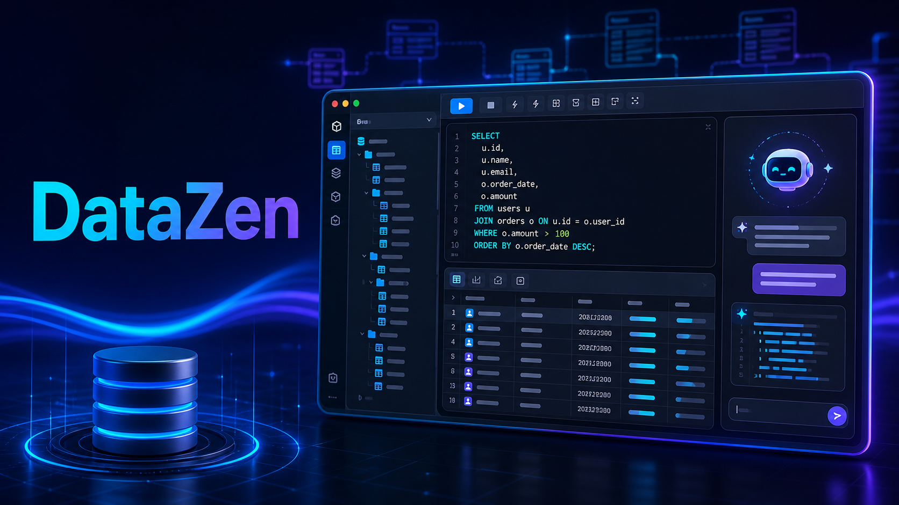
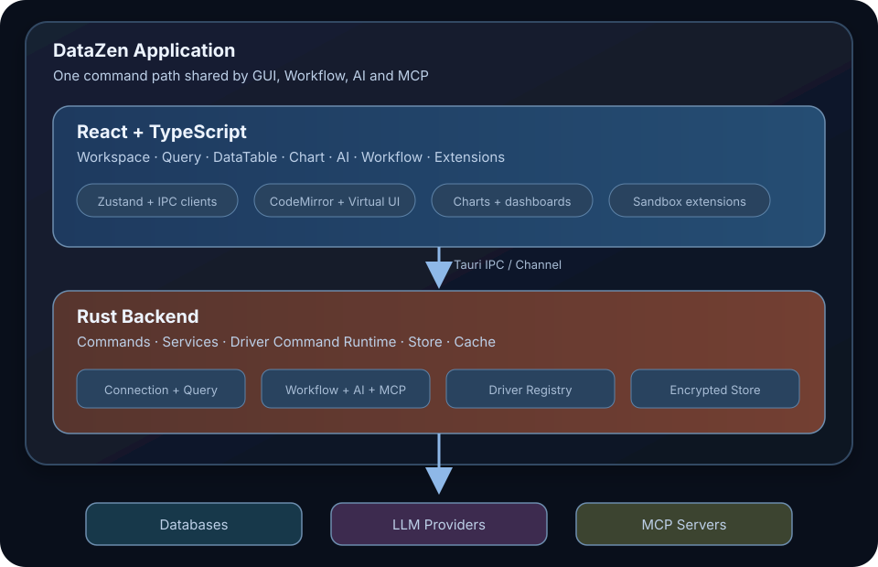
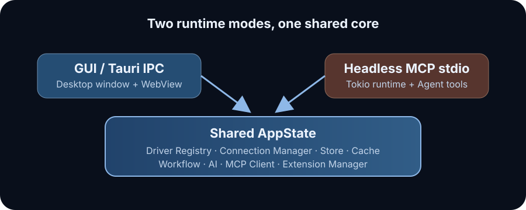

# DataZen 架构设计（一）：一个现代桌面数据库工具是如何构建的

> DataZen 架构设计系列第 1 篇。本文先建立全局视角：DataZen 为什么选择 Tauri、Rust 与 React，它怎样把数据库驱动、AI、Workflow 和 MCP 组织在同一套架构中，以及一条 SQL 从编辑器出发后究竟经历了什么。



数据库客户端看起来很像一种“已经被解决”的软件：左边放一棵数据库对象树，中间放一个 SQL 编辑器，下面再放一张结果表格。

但当我们真正开始构建 DataZen，问题很快就不再只是“如何执行一条 SQL”。

一个现代数据库工具需要同时处理关系型数据库、文档数据库、时序数据库和键值存储；需要面对不同数据库完全不同的分页、Schema、EXPLAIN 和管理能力；需要安全地保存连接凭据；需要在几十万行结果返回时保持界面可用；还要让 AI、自动化工作流和外部 Agent 在不复制业务逻辑的前提下使用同一套数据库能力。

因此，DataZen 从一开始面对的就不是一个页面设计问题，而是一个系统架构问题。

这篇文章是 DataZen 架构系列的起点。我们暂时不深入某个模块的实现，而是先回答三个问题：

1. DataZen 的系统边界在哪里？
2. 它的核心能力被拆成了哪些层？
3. 这些层如何协作完成一次真实的数据库操作？

## DataZen 是什么

DataZen 是一款面向开发者的开源 AI 数据库客户端，运行在 macOS、Windows 和 Linux 上。它基于 Tauri v2 构建：前端使用 React 18 与 TypeScript，后端使用 Rust。

除了常见的连接管理、Schema 浏览、SQL 编辑和数据查看，DataZen 还把几类通常分散在不同产品里的能力放进了同一个工作流：

- 自然语言生成 SQL、错误诊断和 EXPLAIN 分析；
- 查询结果图表化与运营看板；
- 使用 YAML 编排 Query、Command、AI、Condition 和 ForEach；
- Schema Diff、同族数据库的数据同步与异构数据迁移；
- MCP Server 与 MCP Client；
- 可独立扩展的数据库 Driver；
- 可安装的工作区页面和主题 Extension。

这些功能并不是简单地堆在一个桌面壳里。DataZen 的核心目标是：让不同入口复用同一套数据库能力，让具体数据库的差异留在驱动内部，让 UI 不需要随着每一种新数据库反复修改。

## 为什么选择 Tauri、Rust 和 React

桌面数据库工具有一个很典型的技术矛盾。

一方面，它需要成熟的界面生态。SQL 编辑器、虚拟滚动表格、图表、拖拽布局和复杂表单都更适合用 Web 技术构建。另一方面，它又需要长期持有数据库连接、管理连接池、处理流式数据、访问系统钥匙串，并对凭据和文件系统保持足够严格的安全边界。

DataZen 因此采用了清晰的前后端分工。

React 前端负责用户交互和信息呈现，包括工作区、SQL 编辑器、Schema 树、DataTable、图表、AI 对话、Workflow 编辑器以及各类配置界面。Zustand 用来组织不同业务域的前端状态，CodeMirror、React Virtual 和 Recharts 等库则分别承担编辑、虚拟化与可视化能力。

Rust 后端负责所有需要本地系统能力或资源安全的工作，包括数据库连接、查询执行、驱动调度、持久化、加密、日志、Workflow Runtime、AI Provider、MCP 以及运行时 Extension 管理。

Tauri IPC 是这两个世界之间的边界。前端不会持有数据库连接池，也不会直接加载数据库驱动；它只发送结构化命令。后端完成校验和执行后，再把结构化结果或流式事件返回给前端。

这种分工带来的价值不只是安装包更轻。更重要的是，界面层可以快速迭代，而连接、凭据和执行过程始终留在受控的 Rust 进程中。

## 一张图看懂 DataZen

从系统层次看，DataZen 可以简化成下面这张图：



这张图里最值得注意的并不是技术栈，而是位于中心位置的 Driver Command Runtime。

DataZen 没有让 Query 页面、Workflow 和 MCP 分别实现一套数据库调用逻辑。它们最终都会进入统一的 Command 执行路径，再由当前连接对应的 Driver 完成实际操作。

这使“从哪里发起操作”和“操作哪一种数据库”成为两个相互独立的维度。

## 从一次 SQL 查询看完整调用链

假设用户在 SQL 编辑器中输入：

```sql
SELECT id, name, email
FROM users
ORDER BY id DESC;
```

点击执行后，DataZen 内部大致会发生下面这些事情。

### 第一步：前端形成 Command 请求

SQL 编辑器并不调用某个 PostgreSQL 或 MySQL 专属接口。前端会构造一个通用请求：

```text
dbSessionId: 当前运行时数据库会话
command:     query_stream
database:    当前面板选中的数据库
schema:      当前 Schema（如果适用）
input:       { sql: "..." }
```

这里的 `dbSessionId` 指向一个已经建立的运行时会话，而不是保存在磁盘上的连接配置。连接配置使用 `connectionId` 标识，运行时会话使用 `dbSessionId` 标识。两者分开后，持久化配置和内存资源就有了明确的生命周期边界。

### 第二步：Tauri IPC 进入 Rust Commands 层

前端通过 Tauri 调用 `execute_driver_command_stream`。对于流式查询，它还会创建一个 Channel，用来持续接收开始、列信息、行批次、完成或失败等事件。

Commands 层是后端的入口层，负责：

- 解析和校验 IPC 参数；
- 根据设置应用查询结果行数限制；
- 固定本次操作使用的 database 和 schema；
- 检查 Command 的访问级别与输入 Schema；
- 将内部错误转换为统一的 `CommandError`；
- 记录必要的执行历史和脱敏日志。

Commands 层不应该实现某种数据库的具体语法。它解决的是“如何安全、一致地接受一次调用”。

### 第三步：找到会话与 Driver

`ConnectionManager` 根据 `dbSessionId` 找到当前会话对应的连接句柄和数据库 Driver。

连接句柄保留在 Rust 进程中，前端只能看到一个不透明的会话 ID。这避免了 UI 状态与底层连接池直接耦合，也让后端可以统一处理连接复用、断开和资源清理。

`DriverRegistry` 则负责从当前构建中找到对应的 Driver。DataZen 的 Driver 在编译期被选择并链接进应用，通过 `inventory` 注册工厂，在第一次使用时按需实例化。发行版因此不必携带所有数据库引擎，也不依赖不稳定的 Rust 动态库 ABI。

### 第四步：进入 Driver Command Runtime

运行时先从 Driver 提供的 Command Definition 中找到 `query_stream`，检查它是否允许在当前场景下执行，并使用定义中的输入 Schema 校验参数。

随后才会调用 Driver 的 `execute_command` 或流式执行接口。

这一步是 DataZen 可扩展性的关键。对上层来说，查询、执行 SQL、浏览 Redis Key、创建数据库、读取对象 DDL 都可以表现为 Command。上层只需要理解命令定义和 JSON 输入输出，不需要写出类似下面的分支：

```text
if postgres ...
else if mysql ...
else if redis ...
```

不同数据库的能力差异被保留在 Driver 内部，并通过能力元数据和 Command Definition 向上暴露。

### 第五步：结果以事件流返回

Driver 执行查询后，结果不会等到所有行都聚合成一个巨大对象才返回。流式路径会把结果拆成多个事件和行批次，经 Tauri Channel 持续发送到前端。

前端收到事件后逐步更新查询状态和结果集，DataTable 再通过虚拟滚动只渲染视口附近的行。

因此，一条查询的完整路径可以概括为：

```text
SQL Editor
    ↓
query_stream Command
    ↓
Tauri IPC + Channel
    ↓
Commands 层：校验、限流、错误与历史
    ↓
ConnectionManager：解析运行时会话
    ↓
Driver Command Runtime：发现并校验命令
    ↓
Database Driver
    ↓
Database
    ↓
流式事件 → DataTable / Chart
```

后面的文章会分别拆解这条链路中的连接生命周期、Driver API、Command Runtime 和前端性能设计。

## 后端不是一个“大而全”的 Rust 模块

为了避免所有能力都堆进 Tauri Command，DataZen 后端按职责进行了分层。

### Commands：协议入口

Commands 接受来自前端的 IPC 调用，完成参数校验、日志记录、错误映射和权限检查。它类似一个应用内部的 API 层。

### Services：资源与业务能力

Services 提供可被多个入口复用的核心能力，例如：

- `ConnectionManager` 管理连接与运行时会话；
- `QueryExecutor` 处理表格数据分页、筛选和排序；
- `DbTools` 为 AI、MCP 等调用者提供更高层的数据库工具。

### Drivers：数据库差异的边界

Driver 负责真正理解某种数据库，包括连接方式、标识符引用、分页能力、Schema 目录、EXPLAIN、流式查询和专属 Command。

宿主尽量不通过数据库类型判断行为。只要差异来自数据库本身，它就应该由 Driver 或 Driver 元数据表达。

### Store 与 Cache：本地状态

DataZen 使用本地持久化保存连接、设置、历史、Workflow 和看板等数据。数据库凭据和 AI 配置使用 AES-256-GCM 加密，主密钥优先保存在系统钥匙串中。

SchemaCache 则减少重复的元数据查询，并为 Schema 树、数据浏览和 AI 上下文构建提供共享缓存。

### Workflow、AI 与 MCP：不同入口，共享核心

Workflow 不直接拼接某个数据库驱动的调用，而是执行 Command；MCP 工具复用数据库服务和 Workflow Runtime；AI 的 Schema 上下文也来自连接管理和缓存层。

这些模块的共同原则是：它们可以组合数据库能力，但不重新实现数据库能力。

## 同一个核心，两种运行模式

DataZen 有两种启动方式。

正常启动时，它创建 Tauri 应用、桌面窗口、系统插件以及前端 WebView，用户通过图形界面使用数据库能力。

使用 `--mcp-stdio` 启动时，它不会创建窗口，而是建立 Tokio Runtime，以无头 MCP Server 的形式运行。外部 Agent 可以通过 stdio 调用 DataZen 暴露的数据库工具和 Workflow。



两种模式都会构建同一套核心 `AppState`，其中包含 Driver Registry、Connection Manager、Store、Schema Cache、Workflow、AI、MCP Client 和 Extension Manager 等共享服务。

这不是为了展示“两种启动方式”本身，而是为了保证 DataZen 的数据库能力不被绑定在某个按钮或页面里。GUI 是入口，MCP 也是入口；核心执行逻辑只保留一份。

## 两种扩展机制，各自解决不同问题

DataZen 同时存在数据库 Driver 和运行时 Extension，二者有意保持不同。

数据库 Driver 需要建立真实连接、持有连接池并执行数据库协议，因此在构建阶段被编译进 Rust 应用。Driver 可以来自 monorepo，也可以来自独立 Git 仓库，由 Driver Registry 在构建时选择。

运行时 Extension 则面向工作区页面和主题。它通过 Manifest 声明贡献，通过沙箱 iframe 运行，并使用受控的 `postMessage` 桥调用宿主能力。Extension 默认没有数据库访问权限，只有在 Manifest 声明相应权限后，才能通过桥调用 Driver Command。

简单来说：

- Driver 扩展“DataZen 能连接和操作什么”；
- Extension 扩展“用户如何在 DataZen 中组织和呈现能力”。

这两种机制长期并存，避免为了追求一个抽象上的“统一插件系统”，反而模糊了系统权限和执行边界。

## 架构中的几条重要原则

回看整个系统，可以看到几条贯穿 DataZen 的设计原则。

第一，数据库差异下沉。只要差异来自具体数据库，就优先放进 Driver，而不是让宿主和 UI 判断 Driver ID。

第二，入口与能力分离。GUI、Workflow、AI 和 MCP 是不同入口，但它们共享连接、Command 和执行服务。

第三，持久化身份与运行时资源分离。`connectionId` 表示可以保存和引用的连接配置，`dbSessionId` 表示只存在于内存中的数据库会话。

第四，能力通过定义被发现。前端和 Workflow 根据 Driver Command Definition 生成选择器和输入界面，而不是预先知道所有数据库命令。

第五，敏感资源留在后端。连接池、数据库密码、AI Key 和文件系统访问由 Rust 管理，前端只通过有限的 IPC 接口使用它们。

这些原则未必让最初的代码量最少，但它们决定了 DataZen 能否在增加数据库、自动化和 AI 能力之后仍然保持清晰的边界。

## 结语

DataZen 表面上是一款桌面数据库客户端，内部却更接近一个以数据库 Driver 为底座、以 Command 为统一能力模型、同时服务 GUI 与 Agent 的本地数据工作台。

React 提供高效的交互界面，Rust 管理连接、执行和安全边界，Tauri IPC 把两者连接起来；Driver 隔离数据库差异，Workflow、AI 和 MCP 则在同一套核心能力之上组合出新的使用方式。

理解这张全景图之后，我们才能继续讨论更具体的问题：前端与 Rust 后端的边界应该画在哪里？IPC 层如何保持稳定？流式查询和错误处理又是怎样落地的？

下一篇，我们将从这条边界开始，完整拆解 DataZen 的 Tauri 前后端通信架构。

---

本文对应的项目资料：

- [DataZen 架构总览](../architecture/README.md)
- [IPC 命令层](../architecture/backend/commands.md)
- [数据库驱动层](../architecture/backend/drivers.md)
- [服务层](../architecture/backend/services.md)
- [MCP 模块](../architecture/backend/mcp.md)
