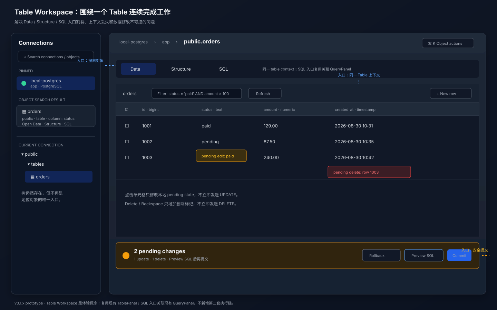

# DataZen v0.1.x Desktop 实施方案

> **状态**：Draft
> **目标版本**：v0.1.x
> **关联 PRD**：[desktop-v0.1x-prd.zh-CN.md](../features/desktop-v0.1x-prd.zh-CN.md)
> **实施目标**：把当前 Desktop 的开发者核心路径做稳定、做顺手，并为 v0.2.0 Web 平台化保留清晰的 Core 边界。

## 1. 实施范围

本文将 v0.1.x PRD 和 main 分支 UI review 拆成可并行执行的工程任务，覆盖：

- 连接列表和连接配置体验。
- 数据库对象搜索和从对象生成 SQL。
- Table Panel 导航和 DataTable 数据编辑安全性。
- Filter、分页和上下文选择器。
- SQL 执行状态、错误快捷动作和 AI 诊断入口。
- Result Workspace 的 Table/Chart 统一承载。
- Core 执行契约、SQLite 持久化稳定性和回归测试。

本文不包含 v0.2.0 Web 的 users、workspace、RBAC、Web SQL Audit、后台 Worker 或企业席位授权。

## 2. 当前代码基线

实施任务以当前代码为起点，不按理想架构重新设计已有功能。

### 2.1 已有能力

- `ConnectionNavigatorTree` 已有连接搜索、Group、Pinned 和虚拟列表能力。
- `UnifiedSchemaTree` 已支持部分对象搜索和列命中提示，但搜索主要依附于树和当前连接。
- `DataTable` 已有编辑单元格、行选择、删除入口、FilterEditor、分页、导出和 Context Menu。
- `tableDataStore` 已有 `draftFilters`、`appliedFilters`、分页状态和批量更新/删除流程。
- `QueryPanel` 已有多语句结果、Table/Chart 切换、Query History、EXPLAIN 和流式查询状态。
- `QueryErrorPanel` 已有错误复制和 Diagnose 入口。
- `ChartView`、`ChartToolbar` 和 `postQueryView` 已经具备结果可视化基础。
- Rust `data` command 已通过事务执行行更新和行删除。

### 2.2 主要问题不是“没有功能”

v0.1.x 优先处理以下结构性问题：

- 同一操作需要在多个页面、窗口或右键菜单中寻找。
- 状态在组件之间分散，用户看不到 pending changes 和执行过程。
- 现有能力的默认操作过于危险，例如 Delete/Backspace 直接触发删除。
- 当前功能接口偏向“立即执行”，不支持 Preview → Commit/Rollback 的安全闭环。
- 组件能力已经存在，但没有统一的 Table Panel 上下文、Result Workspace 承载和对象定位入口。

## 3. 实施原则

### 3.1 先稳定状态模型，再做 UI 拼装

先确定以下状态和事件，再由页面组件组合：

- `ConnectionLocatorResult`：连接匹配、最近使用和收藏排序结果。
- `ObjectSearchResult`：连接、数据库、schema、对象类型、对象名和可执行动作。
- `PendingRowChange` / `PendingChangeSet`：行身份、原值、修改值、删除标记和冲突状态。
- `FilterExpression`：解析后的结构化条件，不直接把用户输入拼接为 SQL。
- `QueryExecutionViewModel`：execution phase、cancel capability、cancel request state、duration、rows、affected rows、error 和 terminal state。

### 3.2 Core 不增加 Desktop 以外的身份概念

v0.1.x 不把用户、workspace、来源、审计或许可证传入 Core。Core 只负责：

- 数据库 Session 和 Driver Command。
- SQL prepare/execute、结果流、取消和超时。
- Workflow、AI、Dashboard 等可复用运行时。

Desktop 的 Query History、Safe Mode 和本地 UI 状态由 Desktop Application 层处理。

### 3.3 不让文本过滤绕过结构化参数

快速过滤输入必须先解析为 `FilterCondition` 或等价结构，再交给现有数据库查询参数化流程。解析失败只展示错误，不执行原始文本。

### 3.4 不在并行开发阶段争抢集成文件

以下文件是集成热点，只由 Integration 轨道最终修改：

- `src/windows/connection/ConnectionPage.tsx`
- `src/windows/connection/ContentView.tsx`
- `src/windows/connection/QueryPanel.tsx`
- `src/windows/connection/PanelContentRenderer.tsx`
- `src/windows/connection/contentViewHelpers.ts`
- `src/components/DataTable/DataTable.tsx`
- `src/types/index.ts`
- `src/locales/en.ts`
- `src/locales/zh-CN.ts`
- `src/stores/panelStore.ts`
- 共享的 `src/commands/__tests__/pathIpcWiring.test.ts`

并行轨道通过新组件、新纯函数、新 Store action 或已约定的 props 接口交付，由 Integration 统一接线。

## 4. 技术设计

### 4.1 `TableWorkspaceView` 的实际含义与实现决策

`TableWorkspaceView` 原本是为了描述一个用户体验目标，并不是当前代码中已经存在、也不是必须新增的业务对象。当前 main 已经有这套机制的主体：

- `src/stores/panelStore.ts` 中的 `TablePanel` 保存连接、数据库、schema、table 和 `subTab`。
- `src/windows/connection/PanelContentRenderer.tsx` 根据 `subTab` 渲染 Data、Structure、Indexes、Foreign Keys 和 DDL。
- `src/windows/connection/contentViewHelpers.ts` 负责子标签定义和上下文路径。

它要解决的不是“再造一个 Workspace 数据模型”，而是三个具体问题：

1. 用户从对象树、全局搜索或 SQL 结果进入同一张表时，始终保留 `connectionId`、`dbSessionId`、database、schema 和 table identity。
2. Data、Structure、DDL 等操作在同一个 Table Panel 内切换，避免每个入口打开一个互不关联的页面。
3. 从表生成 SQL 时，继续使用现有 QueryPanel/SQL Editor，但把完整表上下文带过去，避免新建 SQL Tab 后丢失 database/schema。

因此 v0.1.x 的明确决策是：

- 不新增 `TableWorkspaceView` 业务实体，也不新增一套独立 workspace store。
- 继续使用现有 `TablePanel + SubTabId + PanelContentRenderer`；不为“Workspace”复制一套 DataTable、StructureView 或 SQL 执行逻辑。
- 复用现有 Table 子标签承载 Data、Structure、Indexes、Foreign Keys、DDL。
- 增加统一的 `TableContext` 和 `QueryOpenContext` 构造函数。所有“SELECT/INSERT/UPDATE/DDL/Open SQL”动作都通过它创建 QueryPanel，携带同一连接和对象上下文。
- v0.1.x 不在 TablePanel 内嵌第二个 SQL 编辑器。若产品后续仍要求视觉上出现 SQL 子标签，必须复用 QueryPanel 的编辑器和执行 surface，而不是另写执行链；这不是本版本的独立新领域模型。

原型图表达的是“逻辑上的统一工作区”和用户操作闭环，具体实现对应现有 `TablePanel` 和关联的 QueryPanel：



建议的最小上下文类型如下：

```ts
type TableContext = {
  connectionId: string;
  dbSessionId: string;
  databaseType: DatabaseType;
  database?: string;
  schema?: string;
  tableName: string;
};

type QueryOpenContext = TableContext & {
  source: 'table-action' | 'object-search' | 'ai-action';
  initialSql?: string;
  focus?: 'editor' | 'result';
};
```

打开/复用规则：以 `connectionId + database + schema + tableName` 作为 TablePanel 的逻辑定位键；`dbSessionId` 只用于当前运行时执行，不落盘、不作为业务归属键。打开 SQL 时沿用现有 QueryPanel 创建流程，禁止在 `ContentView` 或组件内拼接数据库方言。

### 4.2 Table Panel 的状态和调用链

统一上下文的接线固定为以下调用链：

```text
Navigator / GlobalObjectSearch / DataTable action
  → buildTableContext(...)
  → openTablePanel(context, initialSubTab)
  → TablePanel.subTab
  → PanelContentRenderer
       ├─ data       → TableView → tableDataStore
       ├─ structure  → StructureView
       ├─ indexes    → IndexesView
       ├─ foreignKeys→ ForeignKeysView
       └─ ddl        → DDLView

Table action: SELECT / INSERT / UPDATE / DDL
  → buildQueryOpenContext(context, sql)
  → existing QueryPanel creation / focus
  → QueryPanel + queryExecActions
```

具体约束：

- `TablePanel` 是唯一的表导航状态载体；不要在 `ContentView`、`TableView` 和搜索组件各自保存一份 table context。
- `PanelContentRenderer` 只负责按 panel 类型和 `subTab` 编排渲染；打开 panel、构造 SQL 的规则放在 action/helper 中。
- 当前 SQL Editor 的 database/schema selector 仍是最终执行上下文；`QueryOpenContext` 只负责初始化它，不覆盖用户之后的主动选择。
- 连接断开或 `dbSessionId` 失效时，Panel 保留 `connectionId` 和对象定位信息，执行操作显示重连提示，不伪造结果。

### 4.3 Pending Change Plan：预览和提交使用同一份计划

数据编辑的核心不是增加一个“确认弹窗”，而是让 Preview 和 Commit 共享确定的变更计划。

```ts
type PendingRowChange = {
  rowIdentity: Record<string, Value | null>;
  originalValues: Record<string, Value | null>;
  currentValues: Record<string, Value | null>;
  changedColumns: string[];
  deleteMarked: boolean;
};

type RowChangePlan = {
  planId: string;
  fingerprint: string;
  table: TableContext;
  updates: PlannedStatement[];
  deletes: PlannedStatement[];
  warnings: ChangeWarning[];
};
```

实现顺序固定为：

1. `DataTable` 只产生 `stageCellChange` 和 `stageRowDelete` 事件，不直接调用 commit command。
2. `tableDataStore` 根据当前页快照和主键构造 `PendingChangeSet`。没有主键的表禁止提交 UPDATE/DELETE，只允许查看和导出。
3. `previewPendingChanges` 调用新增的 Rust Preview command。Preview 使用与 Commit 相同的 driver SQL builder、排序规则和参数编码，只返回 `RowChangePlan`，不打开事务、不执行 SQL。
4. 用户确认后，`commitPendingChanges` 提交 `planId + fingerprint + immutable changes`。后端校验 fingerprint 与当前输入一致，再在一个事务中执行 updates/deletes。
5. 后端返回每条 statement 的执行结果、affected rows 和最终执行错误；成功后 Store 清空对应 pending changes 并刷新当前页，失败保留 pending changes。

`PlannedStatement` 同时保存用于执行的参数和用于界面预览的 SQL 摘要。若某驱动最终使用 prepared statement，界面展示“SQL 模板 + 参数摘要”，不能把展示文本误称为数据库收到的完整 wire SQL；v0.1.x 不引入 SQL Audit。

SQL builder 的公共契约放在 driver-api；具体引用符号、占位符和方言测试放在对应 driver crate，Host 不按数据库类型复制 UPDATE/DELETE SQL。

### 4.4 Filter、分页和请求竞态

Filter 的执行链固定为：

```text
raw input
  → parseFilterExpression
  → FilterExpression / FilterCondition
  → tableDataStore.setDraft / apply
  → request generation + page=0
  → query command with bound values
  → ignore response when generation is stale
```

第一版 parser 只支持列名、有限 operator、字面量和 `AND/OR` 的受控子集；禁止把整段文本直接拼到 SQL。每次 filter、table、pageSize 变化都递增 `requestGeneration`，返回结果携带 generation，不等于当前 generation 的响应直接丢弃。Filter 改变时 page 重置为 0，避免旧页码造成“无数据”错觉。

简单单条件使用短 debounce 后直接生效；高级组合条件保留显式 Apply。这样不改变现有 `draftFilters/appliedFilters` 数据模型，只增加 parser 和请求失效规则。

### 4.5 QueryExecutionViewModel：按驱动能力处理取消

取消必须针对“本次执行”而不是整个数据库会话。由于旧版 `cancel_query(handle)` 无法表达执行身份，v0.1.x 扩展 driver-api，新增精确的 execution-handle 协议；前端仍只消费 capability，不按 driver type 写分支。

后端数据结构：

```rust
struct DriverCapabilities {
    supports_cancel_query: bool,
    supports_query_execution_cancel: bool,
    supports_explain: bool,
    supports_streaming_results: bool,
}
```

具体实现：

1. `DatabaseDriverFactory` 增加 `supports_query_execution_cancel()`，`DatabaseDriver` 增加以下生命周期方法：

   ```rust
   prepare_query_execution(handle, execution_id)
   query_stream_with_execution(handle, execution_id, sql, limit, on_event)
   cancel_query_with_execution(handle, execution_id)
   cleanup_query_execution(handle, execution_id)
   ```

   `execution_id` 是 Host 生成的 opaque `QueryExecutionId`，不能由前端伪造成 session id。旧 `cancel_query(handle)` 保留给兼容实现，但 Host 的新取消路径不得回退到它。
2. Host 在启动流式查询前先 prepare 并登记 `execution_id → dbSessionId`，然后发送 `ExecutionStarted` 事件；取消 IPC 必须同时携带 `dbSessionId` 和 `executionId`，校验归属、能力和执行生命周期，结束时无论成功/失败/取消都 cleanup。
3. PostgreSQL 使用目标查询连接的 `pg_backend_pid()`，通过独立控制连接执行 `pg_cancel_backend(pid)`；MySQL 使用目标查询连接的 `CONNECTION_ID()`，通过独立控制连接执行 `KILL QUERY thread_id`。目标连接、控制连接和执行注册表必须在同一 execution 生命周期内保持有效，防止连接复用造成误取消。
4. 原生 PostgreSQL、MySQL 和 MariaDB 宣称支持精确取消；MariaDB 复用 MySQL 的 `CONNECTION_ID()` + 独立控制连接 `KILL QUERY` 路径。所有兼容驱动只有在实际委托父驱动的同一目标绑定/控制逻辑时，才继承父驱动的 capability。SQLite 仍需独立的 `sqlite3_interrupt` 协议；旧插件或未声明 capability 的驱动保持不支持/未知。事务连接同样支持取消当前语句，但取消后的事务状态遵循数据库语义：PostgreSQL 语句取消后事务可能进入 aborted 状态，必须回滚后才能继续。
5. `DriverRegistry` 在加载 factory 和 concrete driver 时登记 capability；不修改每个 driver 的 UI 分支。`get_connection_info` 或等价 session info IPC 返回 `capabilities`。前端 `ConnectionEntry` 保存它，未获取到时为 `unknown`，不能默认当作支持。
6. `src/lib/queryExecutionViewModel.ts` 把现有 `QueryExecState` 映射成以下状态：

```ts
type QueryPhase =
  | 'idle'
  | 'running'
  | 'cancel_requested'
  | 'succeeded'
  | 'failed'
  | 'cancelled'
  | 'outcome_unknown';

type CancelCapability = 'supported' | 'unsupported' | 'unknown';

type QueryExecutionViewModel = {
  phase: QueryPhase;
  cancelCapability: CancelCapability;
  cancelState: 'available' | 'requested' | 'unavailable' | 'failed';
  elapsedMs?: number;
  rowCount?: number;
  affectedRows?: number;
  error?: string;
};
```

7. Execute 附近的 Cancel 按 capability 渲染：`supported` 为可点击；`unsupported` 显示禁用态和“当前驱动不支持取消”；`unknown` 在能力确认前禁用。取消按钮不凭 UI 点击直接把 `running` 改成 `false`。
8. 点击取消后先进入 `cancel_requested`。只有查询流/command 明确返回取消终态，才转为 `cancelled`；取消 command 返回错误时保留 `running` 或转 `outcome_unknown`，并提示用户查询是否仍在数据库执行。
9. Rust `cancel_query_impl` 在 capability 为 false/unknown 时返回结构化 `Unsupported`，不调用 driver 的旧 session-wide cancel stub。即使 capability 为 true，但 driver 返回错误，也必须按失败处理，不能伪造“已取消”。
10. 关闭 QueryPanel 时只对 `supported` 且 `running` 且拥有 `executionId` 的查询发 cancel；不支持取消的查询只清理 UI panel，并提示后台查询可能仍在数据库侧运行。不得因为关闭面板而写入“Cancelled”。
11. 流式和非流式查询都复用同一状态机；查询完成、取消、错误和连接断开由 query promise/stream 终态驱动，不能由按钮事件驱动。

这样即使新增 driver capability，UI 也只消费 capability，不需要为每个 driver 增加条件分支。

### 4.6 Result Workspace 和错误快捷动作

当前 `QueryPanel` 已有多语句结果和 Table/Chart 切换，因此 v0.1.x 的实现是提取承载组件，不重写查询结果模型：

- `StatementResult`、active statement index、`resultViewMode`、`chartConfig` 和 row detail index 继续由现有 `queryExec` 状态维护。
- `ResultWorkspace` 只接收结果和 view state，渲染现有 TableView/ChartView；切换不得重新执行 SQL。
- 多 statement 仍按 statement index 切换，不能把不同结果合并成一个不透明数组。
- `QueryErrorPanel` 接收 `onCopy`、`onExplain`、`onFixSql`、`onRetry` 四个 callback；Fix SQL 只更新编辑器草稿，Retry 复用原 SQL/参数并受当前上下文校验。
- `QueryExecutionStatus` 只读 `QueryExecutionViewModel`，不直接调用 command；所有副作用仍由 `panelStore/queryExecActions` 发起。

### 4.7 持久化和 Core 边界

v0.1.x 只做 Desktop 现有本地持久化的稳定性修复：继续复用当前加密连接配置、Query History 和 Store 机制，不把 Web 的 users/workspace/audit/seat 概念下沉到 Core。SQLite 作为 Desktop 本地持久化实现；未来 Web 的 MySQL/PostgreSQL 适配通过抽象 repository 接口完成，但不在本版本实现 Web repository。

Core 的执行返回值需要包含实际执行阶段可获得的 SQL/statement 信息、参数摘要、affected rows、duration 和 error；是否写 Query History、是否未来写 SQL Audit，由上层 Application 决定。v0.1.x 不把 Audit 写入 Core，也不要求 Desktop 默认开启审计。

### 4.8 并行轨道的固定交付协议

为了让不同实现者产出接近，下面的接口名、责任边界和最终接线点作为 v0.1.x 的实施约束。实现者可以调整内部文件，但不能改变这些跨轨道语义。

**A 连接发现：** 输出 `rankConnections(connections, query, usageState): ConnectionLocatorResult[]`。排序为命中等级 → pinned → `lastConnectedAt` → group/name；不得在连接组件里重新实现排序。

**B 对象搜索和 SQL 入口：** 输出 `searchSchemaObjects(index, query, filters): ObjectSearchResult[]`、`buildTableContext(panelOrObject)`、`buildQueryOpenContext(tableContext, action)` 和 `buildTableSqlAction(tableContext, action)`。B 不直接修改 `ContentView`，I 只接这些 helper，不接 B 的内部搜索状态。

**C 数据编辑：** Store 对外只暴露 `stageCellChange`、`stageRowDelete`、`discardPendingChanges`、`previewPendingChanges`、`commitPendingChanges`。Rust IPC 固定为“Preview 纯函数式生成 plan”和“Commit 接受 immutable plan/fingerprint”两类操作；C 不改变 `DataTable` 的共享 UI 接线。

**D Filter：** 输出 `parseFilterExpression(input, columns): ParseResult<FilterExpression>` 和 `filterExpressionToConditions(expression)`。D 不输出可直接执行的 SQL 字符串；tableDataStore 只接收结构化条件和 bound values。

**E Query 状态：** 输出 `toQueryExecutionViewModel(execState, capabilities)`、`getCancelActionState(viewModel)` 和状态转换 reducer。E 不在按钮组件内调用 IPC；`panelStore/queryExecActions` 是唯一副作用入口，I 负责把它们接入现有 QueryPanel。

**F Result Workspace：** 输出无副作用的 `ResultWorkspace({ result, view, chartConfig, onViewChange, onChartConfigChange, onRowDetail })`。F 不改变 `queryExec` 的数据结构，不重新执行 query，不修改 QueryPanel。

**G AI Actions：** 输出 `buildQueryDiagnosisContext`、`buildFixSqlAction`、`buildRetryAction`。Fix SQL 只返回 draft，Retry 复用原 SQL/参数；G 不新增自动 Workflow 生成，也不直接执行数据库命令。

**I 页面集成：** 只负责把上述接口接入现有页面和共享文件，处理焦点、键盘、i18n、Test ID 和 loading/error/empty 状态。I 不在页面里补写 A-G 的领域规则；如果某个接口不足，先回到对应轨道补齐。

**R 回归：** 以用户旅程为准验证，不以 Store 内部实现为准。驱动方言、cancel capability 和 SQL builder 的专属测试必须放在对应 driver crate；Host 只验证公共契约和用户可观察行为。

## 5. 总体依赖图

```text
S0 交互契约 / 类型 / i18n / Test ID
 ├── A 连接列表与连接表单
 ├── B 对象全局搜索与 Table SQL 入口
 ├── C 数据编辑暂存与安全提交
 ├── D Filter / Pagination / Context Menu 组件
 ├── E SQL 执行状态 / Error Actions / Context Selector
 ├── F Result Workspace 组件
 ├── G AI 快捷动作适配器
 └── Q 测试用例设计与基线验证
          │
          ▼
I 共享页面集成：ConnectionPage / ContentView / QueryPanel / DataTable
          │
          ▼
R 全量回归、E2E、性能与发布验收
```

S0 完成后，A/B/C/D/E/F/G/Q 可以并行。I 是串行集成阶段；R 必须在全部轨道合并后执行。

## 6. 子任务拆分

### S0：交互契约与集成边界

**目标**：为并行轨道冻结最小公共接口，避免多个代理分别发明状态模型。

**依赖**：无。必须先完成。

**任务：**

1. 记录当前 DataTable、QueryPanel、ConnectionNavigatorTree 的现有 props 和 Store action，标记保留、废弃和新增接口。
2. 定义 `PendingChangeSet`、`RowIdentity`、`FilterExpression`、`ObjectSearchResult` 和 `QueryExecutionViewModel` 的最小字段。
3. 冻结 Table Panel 决策：复用现有 `TablePanel + SubTabId + PanelContentRenderer`；本版本不新增 `TableWorkspaceView` 类型，不在 TablePanel 内复制 SQL Editor。SQL 通过 `QueryOpenContext` 打开/聚焦现有 QueryPanel。
4. 定义 Result Workspace 的接口：输入一个 `StatementResult`，输出 Table/Chart View、当前 View、Chart 配置和行回看动作。
5. 预留新增 i18n key 和 `data-testid` 命名，禁止各轨道在共享 locale 文件中临时造 key。
6. 明确 `Cmd/Ctrl + Enter` 在 Table 编辑区表示提交 pending changes，在 SQL Editor 仍保持执行 SQL 的既有语义，避免两个上下文混淆。

**建议落点：**

- 新增领域类型优先放入 `src/types/desktopV01.ts` 或对应领域文件；只有跨领域 DTO 才进入 `src/types/index.ts`。
- 新增纯函数优先放入 `src/lib/desktopV01/` 或现有领域目录。
- locale 和 Test ID 由 S0 统一登记，后续各轨道只使用已登记 key。

**完成标准：**

- 并行轨道可以只依赖契约，不需要修改 `ConnectionPage.tsx`、`ContentView.tsx`、`QueryPanel.tsx` 或 `DataTable.tsx`。
- `pnpm exec tsc --noEmit` 通过。
- 契约类型有最小序列化/状态转换测试。

### A：连接发现与连接表单

**目标**：降低连接多时的定位成本和首次创建连接成本。

**依赖**：S0。可与 B/C/D/E/F/G 并行。

**主要落点：**

- `src/stores/connectionStore.ts`
- `src/windows/connection/ConnectionNavigatorTree.tsx`
- `src/windows/connection/navigator/NavigatorToolbar.tsx`
- `src/windows/connection/navigator/buildFlatRows.ts`
- `src/components/connection/ConnectionFormBody.tsx`
- `src/components/connection/ConnectionAdvancedSettings.tsx`
- `src/components/connection/NewConnectionDialog.tsx`
- 对应 `src/windows/connection/__tests__/`、`src/components/connection/__tests__/`

**任务：**

1. 将连接匹配字段统一为名称、host、database、database type，并保留当前对 Schema/对象命中的能力。
2. 设计稳定排序：搜索命中优先，其次 Pinned，再按最近使用时间，最后按 Group/名称排序。
3. 复用已有 `lastConnectedAt` 和 `pinned` 字段；若字段不足，新增最小本地持久化字段，不引入新的用户模型。
4. 搜索时显示匹配原因或上下文，例如“名称命中”“数据库命中”“表名命中”，避免用户不知道为什么连接出现在结果中。
5. 无搜索时保留 Pinned、Recent、Group 的视觉层级；搜索时不要重复渲染同一连接。
6. 连接表单默认只显示 Basic 字段；Advanced 和 SSH 分开折叠，Object Filter、SSL、Read Only 等放入合适的低频层。
7. 编辑已有连接时保持字段值、密码写入策略、驱动插件字段和现有剪贴板导入行为不变。

**验收标准：**

- 连接列表可以通过名称、host、database 或类型快速定位。
- 最近使用和收藏连接不会被普通 Group 排序淹没。
- 首次创建连接只需面对必要字段，Advanced/SSH 不会挤压 Basic 表单。
- 排序和表单折叠状态有单测；新增 Host UI 路径登记 E2E。

**禁止触碰：** `ContentView.tsx` 和 `ConnectionPage.tsx` 的导航接线留给 I。

### B：对象全局搜索与从 Table 生成 SQL

**目标**：让 database object search 成为一级入口，并缩短“找到表 → 开始工作”的路径。

**依赖**：S0。可与 A/C/D/E/F/G 并行。

**主要落点：**

- `src/lib/schemaObjectSearch.ts`
- `src/stores/schemaStore.ts`
- 新增 `src/components/schema/GlobalObjectSearch.tsx` 或等价领域组件
- 新增 `src/lib/tableSqlActions.ts`
- 新增对应 `src/components/schema/__tests__/`、`src/lib/__tests__/`
- Driver quoting/能力复用现有 `src/lib/databaseTypes.ts`、`src/lib/sqlDialects/`

**任务：**

1. 建立对象搜索结果模型，至少支持 `table`、`column`、`view`、`function`，结果带 connection、database、schema 和对象名。
2. 搜索范围覆盖当前已连接且已加载的 Schema；未连接或未加载对象必须显示可理解的状态，不伪造搜索结果。
3. 支持从连接导航区或全局快捷入口打开搜索；结果按对象类型、连接、database/schema 分组。
4. 点击结果可以直接打开现有 TablePanel；column 命中要定位到所属 table，并高亮列。
5. 从 table/object 结果提供 `Open Data / SELECT / INSERT / UPDATE / DDL` 动作。
6. SQL 生成只使用 Driver/SQL dialect 的 identifier quoting，不在 Host 内按数据库类型复制方言分支。
7. 生成 SQL 后进入当前 SQL Tab，携带 connection、database、schema 上下文。

**验收标准：**

- 用户无需展开多层树即可搜索并打开目标 table/view/function。
- table 结果可以直接进入 Data、Structure 或 SQL 入口。
- 生成 SQL 在不同驱动上使用正确引用规则，且没有凭据或未授权执行。
- 纯搜索、分组、对象类型筛选、SQL 生成各有单测。

**禁止触碰：** `ConnectionPage.tsx`、`ContentView.tsx` 的最终打开动作由 I 接入。

### C：数据编辑暂存与删除安全

**目标**：将 DataTable 从“单元格立即提交”改成“修改 → 暂存 → Preview SQL → Commit/Rollback”。

**依赖**：S0。可与 A/B/D/E/F/G 并行；C 与 D 不得同时修改 `DataTable.tsx`。

**主要落点：**

- `src/stores/tableDataStore.ts`
- `src/commands/database.ts`
- `src-tauri/src/commands/data.rs`
- `src-tauri/src/services/query_executor.rs`
- 新增 `src/lib/tableChanges.ts` 或对应领域模块
- `src/stores/__tests__/tableDataStore.test.ts`
- Rust `data` command/service 单测

**任务：**

1. 用稳定的行身份表示 pending change：优先使用主键列；没有主键时禁止提交 UPDATE/DELETE，并解释原因。
2. 将 `updateCell` 的直接执行路径改造成 `stageCellChange`，保留原值、当前值、目标行和字段级 dirty 状态。
3. 将 Delete/Backspace 和 Context Menu 删除改造成 `stageRowDelete`，只增加删除标记，不访问数据库。
4. 提供 `discardPendingChanges`、`previewPendingChanges`、`commitPendingChanges` 和 `rollbackPendingChanges`。
5. 增加后端 Preview command，返回结构化 change plan、SQL 模板、bind 参数摘要、影响对象和 warnings；Preview 不执行 SQL。
6. Commit 使用已确认的 change plan 或等价不可变输入，防止 Preview 与 Commit 之间重新生成不同 SQL。
7. 保留现有 Rust 事务行为：批量更新/删除要么完整提交，要么回滚；已有 session transaction 时加入现有事务。
8. `Cmd/Ctrl + Enter` 触发提交确认；存在 DELETE 时必须显示删除行数和主键摘要。
9. Commit 成功后刷新当前页和 total rows；失败时保留 pending changes，允许修正或 Rollback。

**验收标准：**

- 普通编辑不会直接调用 `commit_row_updates`。
- Delete/Backspace 不会直接调用 `commit_row_deletes`。
- Pending changes 数量、更新/删除分类和 dirty 行在 UI 可见。
- Preview SQL 与实际 Commit 使用同一 change plan 语义。
- 无主键表不会静默执行不安全 UPDATE/DELETE。
- Rust 事务、Preview 不执行、提交失败保留 pending changes 均有测试。

**并行边界：** C 负责 Store/command/domain；`DataTable.tsx` 的键盘、工具栏和 Dialog 接线由 I 完成。

### D：Filter、Pagination 与 Context Menu 组件

**目标**：让过滤更接近数据库客户端，同时避免过滤和分页造成状态错觉。

**依赖**：S0。可与 A/B/C/E/F/G 并行。

**主要落点：**

- `src/components/FilterEditor.tsx`
- `src/components/FilterBar.tsx`
- `src/components/DataTable/Pagination.tsx`
- 新增 `src/lib/filterExpression.ts`
- 新增 `src/lib/__tests__/filterExpression.test.ts`
- 现有 Filter/DataTable 组件测试；不修改 `DataTable.tsx`

**任务：**

1. 支持常用过滤表达式解析，例如 `status = 'paid' AND amount > 100`。
2. 第一版只支持可安全映射到现有 FilterCondition 的有限语法；不支持任意 SQL、子查询和函数调用。
3. 解析结果必须是结构化条件和逻辑树，值通过参数传递，不产生可直接执行的 SQL 文本。
4. 简单单条件和简单 AND 条件输入后直接生效，可采用短 debounce；高级 OR/嵌套组合继续使用 Apply。
5. 保留 Column/Operator/Value 编辑器作为高级和可视化入口，而不是删除现有能力。
6. Filter Apply、Remove、Clear、输入解析失败和 loading 状态要有一致的反馈。
7. Pagination 的 page/pageSize/totalRows 与 filter state 变化必须遵循：过滤条件改变 → page 重置为 0 → 取消或忽略旧请求 → 只展示新查询结果。
8. 统一 Context Menu 分层：一级保留 Copy、Edit、Filter、Export、Delete Mark；JSON、INSERT、UPDATE、CSV、NULL 和批量操作进入二级菜单。

**验收标准：**

- 简单过滤不需要额外 Apply；高级过滤仍可显式 Apply。
- 过滤后不会停留在过期页码。
- 解析失败不会发送查询请求。
- Context Menu 一级入口数量和层级明显收敛。
- parser、分页重置、旧请求忽略和菜单分层有测试。

**并行边界：** D 只提供 parser、Filter 组件和 Pagination 组件契约；Store/DataTable 接线由 I 完成。

### E：SQL 执行状态、错误动作与上下文选择器

**目标**：把数据库客户端最重要的执行反馈贴近 Execute，并缩短错误修复路径。

**依赖**：S0。可与 A/B/C/D/F/G 并行。

**主要落点：**

- 新增 `src/components/query/QueryExecutionStatus.tsx`
- `src/components/query/QueryErrorPanel.tsx`
- `src/components/query/QueryContextSelectors.tsx`
- 新增 `src/lib/queryExecutionViewModel.ts`
- `src/stores/panelStore.ts` 的 query execution action（由 I 接线）
- `src/stores/queryExecActions.ts`
- `src/stores/activeConnectionStore.ts`
- `src/commands/connection.ts`
- `src-tauri/src/commands/connection.rs`
- `src-tauri/src/commands/query.rs`
- `src-tauri/src/db/registry.rs`
- `src/components/query/__tests__/`
- 不修改 `QueryPanel.tsx`，最终接线由 I 完成

**任务：**

1. 扩展 driver-api 的精确 execution-handle 取消协议和协议版本；在 `DriverRegistry` 同时登记 legacy capability 与 `supports_query_execution_cancel`，Host 取消路径只使用后者。
2. 扩展 connection info IPC 返回 `capabilities`，由 `ConnectionEntry` 保存；连接能力尚未获取时标记 `unknown`，不能把缺省值当成支持取消。
3. 将当前 Query/Panel execution 状态映射为稳定的展示模型：`idle / running / cancel_requested / succeeded / failed / cancelled / outcome_unknown`，取消能力单独使用 `supported / unsupported / unknown`。
4. `cancelQuery` 点击处理必须先写入 `cancel_requested`，调用 command 后等待查询 promise/stream 的实际终态；禁止无论 command 是否成功都直接写入 `running: false, error: 'Cancelled'`。
5. `cancel_query_impl` 校验 `dbSessionId + executionId` 的归属和生命周期；在精确 capability 为 `false/unknown` 时返回结构化 `Unsupported`，不调用旧 session-wide driver stub；driver 返回错误时由前端展示取消失败或结果未知。
6. PostgreSQL/MySQL driver 为每次执行保存目标 PID/thread ID，并使用独立控制连接执行取消；执行结束、错误和取消都清理注册表。事务连接走同一精确目标绑定路径；MariaDB 复用 MySQL 实现，兼容 driver 通过 `ReuseDriver` 转发并继承父驱动 capability，不能声明比父驱动更强的能力。
7. 关闭 QueryPanel 时仅对 `supported + running + executionId` 的查询发起 cancel；`unsupported/unknown` 只清理 UI 或提示查询可能仍在数据库侧运行，不伪造 Cancelled。
7. Execute 附近显示 Running、Cancel、耗时、rows、affected rows、statement index 和 Error 摘要；Cancel 在 unsupported 时显示禁用态和原因。
8. QueryExecutionStatus 不重复发起查询，也不直接调用 command；所有副作用由 `panelStore/queryExecActions` 发起。
9. QueryErrorPanel 增加 `Copy Error / Explain / Fix SQL / Retry` 回调接口；没有可用上下文时按能力隐藏或禁用。
10. Context Selector 将 database/catalog/schema 层级压缩成 breadcrumb/context selector，保留 path hierarchy 和多数据库驱动能力。
11. 执行成功、失败、取消和流式结果时，状态切换必须明确且不被底部 StatusBar 单独承载。

**验收标准：**

- 支持取消的驱动：执行中用户能在 Execute 附近发起取消，界面先显示 Cancelling，只有查询终态确认后才显示 Cancelled。
- 不支持取消的驱动：Cancel 不可点击，并明确显示“当前驱动不支持取消”；不会调用 driver cancel stub。
- 取消 command 失败时不会把仍在执行的查询标记为 Cancelled。
- 完成后用户能在同一位置看到耗时、结果行数或错误。
- 错误面板可以直接 Copy、Explain、Fix SQL、Retry。
- 不同 context path 下不会丢失当前 database/schema 选择。
- capability 映射、状态转换、取消失败/不支持、关闭面板和错误按钮可用性有单测。

### F：Table Panel 上下文与 Result Workspace

**目标**：统一对象、表和查询结果的工作区承载，减少页面割裂。

**依赖**：S0；Result Workspace 依赖稳定的 Result/Chart 类型，可与 A/B/C/D/E/G 并行开发组件，但在 I 阶段接入。

**主要落点：**

- 新增 `src/windows/connection/result-workspace/`
- `src/stores/panelStore.ts`（由 I 统一修改 `SubTabId`/TablePanel 接线，F 不直接改）
- `src/windows/connection/PanelContentRenderer.tsx`（由 I 统一接线）
- `src/windows/connection/contentViewHelpers.ts`（由 I 统一接线）
- `src/components/chart/` 只做必要的 API 适配，不进行高级图表重构
- `src/lib/chart/` 保留现有 inference/transform/export 语义
- 新增 workspace 组件测试
- 不修改 `ContentView.tsx`、`QueryPanel.tsx`，最终接线由 I 完成

**任务：**

1. 不创建新的 Table Workspace shell；由 I 基于现有 `TablePanel.subTab` 和 `PanelContentRenderer` 统一 Data/Structure/Indexes/ForeignKeys/DDL 的标题、上下文路径和入口动作。
2. 新增 `buildTableContext`、`buildQueryOpenContext` 和 `openTableSql` 领域 helper，保证对象树、全局搜索、右键菜单和 AI action 使用同一套上下文构造规则。
3. SQL 入口复用现有 QueryPanel/SQL Editor，支持创建或聚焦 QueryPanel，并预填正确的 database/schema/table；不得在 TablePanel 内新增第二条 SQL 执行链。
4. Table Panel 切换不得丢失 connectionId、dbSessionId、database、schema 和 table identity。
5. 创建 Result Workspace shell，输入 `StatementResult` 和 query execution context。
6. Result Workspace 统一承载 Table View 和 Chart View，当前已有 Table/Chart 切换迁移到该组件。
7. 保留现有 ChartView 的推荐、配置、导出和数据点回看能力；基础 Table/Chart 切换为 v0.1.x 目标，高级分析画布留 P2。
8. 多 statement 结果仍按 statement index 切换，不把不同结果合并成一个不透明结果集。

**验收标准：**

- 用户可以在同一 Table Panel 内完成 Data → Structure → DDL 等对象操作；从任一 table action 打开 SQL 时，QueryPanel 保留完整连接/database/schema/table 上下文。
- 查询结果打开后无需寻找额外菜单即可切换 Table/Chart。
- Table/Chart 切换不丢失当前 result、chart config 和行详情定位。
- Context builder、SQL open action 和 Result Workspace 可脱离页面单测，避免所有逻辑重新堆回 ContentView/QueryPanel。

### G：AI 快捷动作适配

**目标**：复用现有 AI 能力缩短 SQL 错误处理路径，但不在 v0.1.x 引入自动 Workflow 生成。

**依赖**：S0；需要与 E 约定 Error Action callback，与 QueryPanel 的最终接线由 I 完成。

**主要落点：**

- 新增 `src/lib/aiQueryActions.ts` 或 `src/components/ai/queryActions.ts`
- `src/components/ai/DiagnosisPanel.tsx`
- `src/components/ai/Nl2SqlPanel.tsx`
- AI 相关单测
- 不修改 `QueryErrorPanel.tsx` 和 `QueryPanel.tsx`

**任务：**

1. 将 Explain、Fix SQL、Retry 所需的输入统一为 SQL、error message、databaseType、database/schema、Schema context 和当前 connection context。
2. Explain 复用现有 Diagnosis/AI 流程；Fix SQL 必须返回编辑器草稿，不默认直接执行。
3. Retry 只能重试当前 SQL 和绑定参数；如果上下文发生变化，先提示用户。
4. Fix SQL 应提供 Apply to Editor，并保留原 SQL 以便比较和撤销。
5. AI Prompt 不包含凭据、AI Key 或不必要的大量结果集。
6. 明确 `AskQuestion → 自动生成完整 Workflow` 不属于本轨道，留给 v0.2.0。

**验收标准：**

- 从错误面板触发 Explain/Fix SQL 不需要用户重新打开 AI 面板。
- AI 修复结果进入编辑器草稿，不绕过 Safe Mode 和用户确认。
- Retry、Fix SQL、Explain 的上下文构建和失败状态有测试。

### Q：测试设计与基线验证

**目标**：与编码轨道并行建立验收用例，不把测试推迟到最后才发现接口不适合。

**依赖**：S0；可与 A/B/C/D/E/F/G 并行。Q 只测和登记，不修复编码问题。

**任务：**

1. 对每条轨道建立单测、组件测试、Store 测试和 E2E 用例清单。
2. 为 P0 用户旅程登记：连接搜索、对象搜索、Table Panel 上下文、pending changes、删除确认、Filter 分页、Query 执行状态和错误快捷动作。
3. 基线运行现有 `npx vitest run`、`cargo test -p datazen --lib`，记录与本版本无关的既有失败。
4. 设计驱动矩阵：SQLite、PostgreSQL、MySQL 的公共流程由 Host 契约覆盖；驱动专属方言测试放到对应 driver crate。
5. E2E 重点验证用户可观察行为，不绑定内部 Store 实现。

**输出：**

- 每条轨道自己的测试清单和遗留问题。
- `e2e/contract/` 或现有 Host E2E 中需要新增的 journey 登记。
- 【本机可执行】与【留待 R 回归】的边界说明。

### I：页面集成与状态收敛

**目标**：把并行轨道交付的组件和状态接入现有 Desktop 页面，只做编排，不新增领域逻辑。

**依赖**：S0、A、B、C、D、E、F、G 的组件/API 交付。必须串行执行。

**唯一修改热点：**

- `src/windows/connection/ConnectionPage.tsx`
- `src/windows/connection/ContentView.tsx`
- `src/windows/connection/PanelContentRenderer.tsx`
- `src/windows/connection/contentViewHelpers.ts`
- `src/windows/connection/QueryPanel.tsx`
- `src/components/DataTable/DataTable.tsx`
- `src/types/index.ts`
- `src/locales/en.ts`
- `src/locales/zh-CN.ts`
- `src/stores/panelStore.ts`
- 必要的共享 command wiring tests

**任务：**

1. 将连接搜索、Recent/Pinned 排序和全局对象搜索接入导航入口。
2. 将对象搜索结果接入现有 `selectTableRef`、panel open 和 SQL Tab 创建动作。
3. 不新增 Table Workspace 业务对象；基于现有 `TablePanel.subTab`、`PanelContentRenderer` 和 `contentViewHelpers` 统一 Table Panel 导航，并接入 `buildTableContext/buildQueryOpenContext/openTableSql`。
4. 将 pending changes 接入 DataTable 的编辑、删除键、工具栏和确认 Dialog。
5. 将 Filter parser、FilterEditor、Pagination 和 tableDataStore 的请求失效策略接线。
6. 将 QueryExecutionStatus、Error Actions、Context Selector 接入 QueryPanel；按 connection capability 渲染 Cancel，不改变 command 层执行顺序。
7. 将 Result Workspace 接入 QueryPanel，迁移现有 Table/Chart toggle 和 chart config 状态。
8. 将 AI actions 接入 QueryErrorPanel 的 Explain/Fix SQL/Retry 回调。
9. 补齐 i18n、Test ID、焦点管理、键盘快捷键和无数据/错误/加载状态。

**集成验收：**

- `ConnectionPage`、`ContentView`、`QueryPanel` 没有重复实现领域规则。
- Table View 和 Query Result View 的状态不会互相覆盖。
- pending changes、Filter、分页和查询刷新不会产生旧请求覆盖新结果。
- `Cmd/Ctrl + Enter` 在 SQL Editor 和 Table 编辑上下文中的行为明确。
- `pnpm exec tsc --noEmit`、定向 Vitest 和 Rust 单测通过。

### R：全量回归与发布验收

**目标**：在所有轨道合并后验证完整 Desktop 基线。

**依赖**：I 完成。

**任务：**

1. 运行 `pnpm test:unit` 和 `cargo test -p datazen --lib`。
2. 运行受影响驱动的 `cargo test -p datazen-driver-<id>` 和 `pnpm test:unit:drivers`。
3. 按 E2E 约定构建并运行 Host UI E2E；新增页面交互必须有对应 journey。
4. 对大结果集、慢查询、取消、连接断开、过滤快速切换和提交失败进行回归。
5. 对 SQLite migration、Query History 脱敏、凭据存储和 Safe Mode 进行安全回归。
6. 核对 v0.1.x 非目标没有被实现阶段意外引入：Web Auth、workspace、Web Audit、企业席位和企业版 Desktop。

**发布门槛：**

- P0 核心用户路径全部通过。
- Delete/Backspace 不会绕过 pending changes 直接执行 DELETE。
- Preview/Commit/Rollback 状态可解释，失败不会丢失待提交修改。
- 过滤变化不会展示过期页码结果。
- 查询状态和错误动作不依赖隐藏的底部 StatusBar。
- 无新增高优先级回归 Bug；已知问题有明确降级方案和记录。

## 7. 并行波次与建议顺序

### Wave 0：契约冻结

- `S0` 交互契约、类型、i18n、Test ID。

### Wave 1：并行编码

- `A` 连接发现与表单。
- `B` 对象搜索与生成 SQL。
- `C` 数据编辑暂存和后端 change plan。
- `D` Filter、Pagination、Context Menu 组件。
- `E` 执行状态、Error Actions、Context Selector。
- `F` Table/Result Workspace 组件。
- `G` AI 快捷动作。
- `Q` 测试设计和基线验证。

### Wave 2：集成

- `I` 统一修改共享页面、DataTable 和 locale。
- 先接入 P0，再接入 P1；每接入一条轨道运行 TypeScript、定向 Vitest 和对应 Rust 测试。

### Wave 3：发布回归

- `R` 全量测试、E2E、性能、安全和发布门槛。

## 8. 文件冲突与合并策略

### 7.1 允许并行修改的区域

- A 主要修改 connection navigator/form 文件。
- B 主要新增 object search 和 SQL action 文件。
- C 主要修改 table data Store、database command 和 Rust data command。
- D 主要修改 Filter/Pagination 组件和纯 parser。
- E 主要新增 query view model/status 组件并修改 QueryErrorPanel/ContextSelectors。
- F 主要新增 workspace 组件目录。
- G 主要修改 AI action/domain 文件。

### 7.2 必须串行的区域

- `DataTable.tsx`：C/D 的交付都由 I 统一接入。
- `QueryPanel.tsx`：E/F/G 的交付都由 I 统一接入。
- `ContentView.tsx`、`PanelContentRenderer.tsx`、`contentViewHelpers.ts`：B/F/C 的页面接线由 I 统一处理。
- `panelStore.ts`：TablePanel 子标签、QueryExecutionViewModel 和取消状态的最终收敛由 I 处理。
- locale、共享类型和共享 IPC wiring tests：由 S0 先登记、I 最终落地。

### 7.3 合并后检查

每条轨道合并后：

1. 重读受影响的共享接口。
2. 运行 `pnpm exec tsc --noEmit`。
3. 运行该轨道定向 Vitest/Rust 测试。
4. 检查是否意外修改 Core 的身份、workspace、Audit 或 Web 代码。

## 9. 子代理执行约定

如果实际使用子代理并行开发，遵循项目现有 `subagent-dev-playbook.md`：

- 每条编码轨道使用独立 worktree 和分支。
- 每条轨道只修改自己的文件边界，并提交代码、单测和进度记录。
- 测试代理必须是独立的新实例，只验证、不修复。
- `ConnectionPage.tsx`、`ContentView.tsx`、`QueryPanel.tsx` 和 `DataTable.tsx` 不允许多个轨道同时修改。
- 不在 worktree 中运行 `pnpm install`；并行 Cargo 使用独立 `CARGO_TARGET_DIR`。
- E2E 可以在功能轨道登记，但完整构建和执行放到 R 阶段。
- codegen 文件和未跟踪规格文档不纳入功能轨道提交，除非任务明确要求。

每条编码轨道返回：

- commit hash。
- 修改文件清单。
- 定向单测结果。
- 待集成接口和已知限制。
- 未解决问题和是否需要修复轨道。

## 10. v0.1.x 版本切分

### v0.1.0

- S0 契约完成。
- A/B 的连接和对象定位基础能力完成。
- C 的 pending changes、Preview、Commit/Rollback 和删除安全完成。
- D 的快速过滤、分页重置和 Context Menu 分层完成。
- E 的执行状态、错误快捷动作、上下文压缩完成。
- I 完成 P0 集成并通过核心 E2E。

### v0.1.1

- 修复 v0.1.0 用户反馈中的高频交互问题。
- 优化搜索排序、Table Panel 导航、结果表格和 Query History。
- 补齐大结果集、取消、断线、过滤竞态和迁移问题。

### v0.1.2+

- F 的基础 Result Workspace Table/Chart View。
- G 的 AI SQL Explain/Fix/Retry 体验增强。
- 测试数据复制和常用准备动作模板。
- 根据真实反馈评估 Saved Query、高级图表和本地企业审计。

## 11. 最终实施判断

v0.1.x 不以“增加最多功能”为成功标准，而以以下闭环为成功标准：

```text
快速找到连接/对象
  → 在 Table Panel 中操作，必要时带上下文打开 QueryPanel
  → 安全地暂存和提交数据修改
  → 清楚地看到 SQL 执行状态和错误
  → 通过 AI 快捷修复并重新验证
```

只要这个开发者主流程稳定，v0.2.0 才有必要把相同的 Core 能力接入 Web Application Service、workspace、SQL Audit 和后台 Worker。
