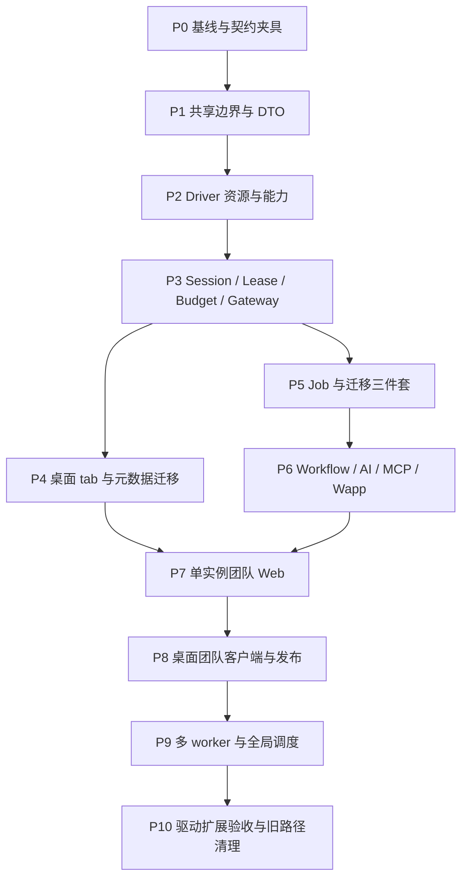

# 连接管理重构与桌面 / Web 多形态开发计划

> 状态：待执行计划；基线：2026-09-30，`8592b0fe1`。本文按用户明确要求入库，不记录每日进度。
> 设计依据：[系统概要](../architecture/platform/system-overview.md)、[连接管理详细设计](../architecture/platform/connection-management.md)。

## 1. 交付目标与实施原则

最终交付桌面本地、浏览器团队、桌面团队三种方式，共享 Rust 业务内核和 React 产品。连接管理对用户、会话、物理资源和任务分别建模；新增已有能力的 driver 不要求修改宿主业务流程。

先验证资源语义，再迁移 consumer，再增加团队入口和多实例。初期采用模块化单体；远程 agent、独立 driver runner、跨 backend 迁移是独立后续版本，不阻塞首版。

代码变更按阶段拆为可验收的小 PR。每个 PR 包含实现、相关测试和已落地事实文档；不创建进度台账、Bug List 或新方案副本。本计划是阶段顺序与交付门槛，完成的阶段应改为实施事实或合并到开发流程，不无限保留历史方案。

不能把后端重构、Driver API 协议迁移、所有 UI 和 Web 服务一次性切换。旧路径只做有截止点的窄兼容；同一 consumer 同一请求只使用一种资源管理器。

## 2. 阶段依赖



P4 与 P5 代码边界独立后可以分别推进，但必须共享已稳定的 P3 契约；图表示依赖，不要求自动启用多个代理。没有用户明确授权时不派发其他聊天任务。

## 3. 每个阶段的统一完成定义

1. 所需 API、DTO、错误和生命周期都有实现，不能只交接口骨架。
2. 详细设计对应测试编号通过；Unsupported 能力有拒绝断言。
3. 生产路径不新增裸 unwrap/expect；测试文件通过 typecheck，无 any 绕过。
4. driver 方言实现及测试在 driver 目录；host 无数据库名称分支。
5. 新协议兼容声明真实，所有参与构建的 path/Git driver 已迁移或明确禁用对应新能力。
6. 不读取 `.env` / `.env.test`，不提交凭据、生成文件或外部子仓库内容。
7. 当前架构文档同步描述已经实现的部分；未实现功能仍标记目标设计。
8. 评审看到清楚的启用条件、关闭/失败行为和回退边界。

## 4. P0：现状基线与契约测试夹具

**目的**：在移动代码前识别逻辑 session、pool handle、transaction handle 的真实语义，建立可比较的行为基线。

输入为当前 ConnectionManager、Driver API、Query/Table consumer、三件套和 Workflow。重点代码链接见详细设计第 2 节。

交付：

- 清点各 consumer 的连接创建、复用、关闭、取消和配置目标路径；结论放进代码测试与当前服务文档，不写调查台账。
- 建立 transport-neutral fake resource，支持 resourceId、owner、命令 journal、屏障、fake clock 和每阶段失败注入。
- 在 driver 目录建立真实固定会话/事务/目标/清理契约测试；确认不能保证的能力。
- 确定测试环境注入方式，检查启动器不读取受保护 env 文件。
- 记录现有 DTO 与持久化格式兼容范围；旧 session ID 不作为迁移数据。
- 用 CM-73 复现并留存“空闲淘汰关闭物理连接、同 ID 重连、事务 map 未清理”的基线；测试作为 P3 强制回归门槛。

负责边界：runtime 负责人定义 fake 契约，driver 维护者验证真实协议，前端负责人验证 tab 行为。

退出门槛：CM-01、04、07 的基线测试，以及 CM-73 对当前事务句柄生命周期的可复现证据；真实 driver CM-08～19 的能力验证能区分已支持和缺失。已知失败作为本轮后续阶段要修复的测试，不能删除断言。

回退：仅增加夹具和测试；不改变生产执行路径。

## 5. P1：抽取共享应用边界和前端传输契约

**目的**：业务可在没有 Tauri 的测试进程中调用。

交付：

- 创建并注册拟新增 application/runtime/platform-api/backend-client 包，明确依赖方向。
- 定义 RequestContext、ID newtype、CanonicalTarget、namespaceShape/操作级 targetRequirements、会话、执行、Job、Artifact DTO 和 ApiError。
- 分开 DurableExecutionRecord 与实时 runtimeBinding，定义能力快照、CancelReceipt 和签名幂等令牌 port；所有持久化路径排除运行时句柄。
- 定义 repositories、SecretProvider、NetworkProvider、ArtifactStore、EventSink ports。
- Tauri adapter 组装本地身份，调用应用服务；保留现有 IPC 外观的窄适配。
- BackendClient 和 PlatformServices 注入，迁移 SDK 中 invoke/Channel，存量调用用薄再导出过渡。
- 加入依赖护栏：core 不引用 Tauri/HTTP，driver 不引用 host，前端领域不直接绑定平台传输。
- 加入 CI 架构检查：对 server crate 的 normal/build 依赖闭包验证不含 Tauri crate 和 UI runtime，并验证 server 独立构建；依赖检查失败即阻断合并。

退出门槛：CM-01、03～07，DTO 往返与内核无 Tauri 编译、CI 依赖图检查通过；旧桌面基本连接/查询流程保持可用。

回退：Tauri adapter 可仍调用原用例实现，但不得把新 owner 和权限语义伪映射为旧共享 session。新 frontend bridge 在未注入时明确报错。

## 6. P2：Driver 固定资源与可选能力契约

**目的**：把“执行在同一真实资源上”变成可测试保证。

交付：

- opaque resource、ResourceProvider、固定执行、状态观察、reset、close 和精确 cancel 契约。
- namespace/session/transaction/snapshot/data/backup 可选能力注册与运行时能力降低机制。
- 所有实际建连的预算 port，包括 driver pool、集群节点和控制资源。
- 现有 Command 和迁移接口保持领域语义；资源获得方式通过 adapter 演进。
- 先迁移具有真实会话与事务的代表 driver，再迁移其余参与构建驱动；不支持能力明确拒绝。
- 修改公共契约时核对 crate SemVer、PROTOCOL_VERSION 和 minimum compatible；同步 path/Git driver、factory、ReuseDriver、生成选型路径。

退出门槛：D 层 CM-07～19、22～26、30、45、48；不同 driver 不共享实现库类型；新增能力缺失不会 no-op 成功。

回退：过渡 adapter 可以支持旧 driver 的独立受控 Command，但不能开放未证明的 statefulSession。协议升级与驱动发布是原子兼容门槛，不允许用下调最低版本掩盖 breaking change。

## 7. P3：统一 Session / Lease / Budget / ExecutionGateway

**目的**：建立桌面与 server 都能用的资源运行时。

交付：

- SessionRegistry actor、状态机、owner/runtimeEpoch/contextRevision、独立 attachment 与内部 resourceBindingId。
- ResourceManager lease、pool、cleanup/quarantine、隧道引用。
- 多维单机预算、control/interactive/metadata/job 保留与公平队列、逻辑 session/已连接编辑器额度、真实物理资源计数。
- attachment 令牌与 TTL 最早期限裁决；无消费者有界产物、discard/drain、取消与协议恢复；PoolKey 版本生产者与缓存失效。
- 单进程 SessionDirectory、候选替换提交屏障、过期令牌拒绝与 Clean 双重检查。
- ExecutionGateway：授权、目标校验、schema、幂等 receipt、状态、来源、事件。
- 独立取消路径，取消和关闭先等待执行/协议结束；所有失败阶段 cleanup。
- 显式 session 失效和新 session 恢复；禁止原 ID 透明重连。
- 指标：物理资源数、lease state、预算等待、执行队列、取消耗时、cleanup 失败、Unknown outcome。

退出门槛：H 层 CM-02～07、20～32、37～39、54～56、60 单机部分及 CM-61～73 的 H 断言；CM-73 必须转绿，证明事务状态、物理资源和 session ID 同步失效。race 测试使用 barrier/fake clock，不靠任意 sleep 猜顺序。

回退：新 runtime 仅给已迁移 consumer 使用；不同时维护一条资源的旧 refs 和新 lease。服务暂停/重启前关闭新 session，不能将活事务移回旧 manager。

## 8. P4：桌面 QueryPanel、TablePanel、元数据迁移

**目的**：先在现有产品中完成连接正确性，不等待 Web。

交付：

- QueryPanel 每编辑器独立懒 session，复制 tab 不复制 runtime ID。
- 删除执行前从 SQL 推测已生效上下文的行为，保留补全与浏览推测。
- 下拉切库支持确认、revision 冲突、两阶段替换和事务处理。
- TablePanel 使用明确对象 target；ChangeSet 保存时短事务，手工事务显式开关。
- 元数据批量与缓存按身份/配置/目标隔离；临时对象绑定原 runtime handle。
- 旧结果 provenance、读写映射与临时结果失效规则。
- 关闭 tab、断线、错误后的继续操作和用户提示；开发只新增/修改 en.ts。

退出门槛：CM-08～18、21、33～39、55～56、61～64、72 的 F 断言；Host 通用 WDIO + driver 专属旅程；桌面 Community 与 Pro consumer 兼容验证。

回退：切换以 consumer 为单位，启用前 session 全部重新建立；不能在活动事务中切 feature path。存在数据写入未知时先核验，回退 UI 不等于数据库回滚。

## 9. P5：JobRuntime 与数据迁移三件套

**目的**：连接资源脱离 UI，任务结果真实反映提交边界。

交付：

- JobRepository、JobHandler 注册、资源阶段、进度、取消和结果。
- 持久化接受后返回 jobId，窗口只订阅；任务中心可重新附着。
- 将 `src-tauri/src/schema_diff`、`data_sync`、`data_transfer` 中与 Tauri 无关的领域实现按依赖分阶段抽取到概要 §4.1 的领域包；Tauri commands、窗口、文件选择保留在 adapter。不得把当前目录位置误当成最终共享边界。
- Schema Diff 比较/审阅/应用阶段分开、目标指纹复验、DDL 原子性按计划判断。
- Data Sync 同族/结构/PK 门闸、快照范围、review 释放、冲突检测与批次事务。
- Data Transfer 有界数据管道、IR、源一致性、目标批次记录与检查点核验。
- endpoint 重叠识别、源目标多端预算申请、防 AB/BA 死锁。
- 明确 successful/failed/cancelled 与 effectOutcome，保留部分提交和未知信息。

退出门槛：CM-31、40～49、54；Job 执行期 UI unmount 不调用资源 release；已提交/未提交/未知边界通过真实数据库断言。

回退：新 Job 暂停派发，已有任务到安全边界后结束；计划/检查点格式升级使用版本，新旧引擎不能接管不兼容计划。已经写入的任务只按核验与补偿处理。

## 10. P6：Workflow、AI、MCP、Wapp 与辅助任务

**目的**：消除 GUI 外入口的隐式目标和共享状态。

交付：

- Workflow 独立 step、session block、transaction block 的模型、校验和执行。
- 明确 connection/namespace 继承、并行分支资源、重试范围、checkpoint 边界。
- AI 默认独立操作，显式授权当前 editor session 时同队列。
- MCP client/session owner 与 TTL，Wapp 实例和任务归属。
- Dashboard/Monitor 独立资源；导出、备份、恢复归 Job/Artifact；原生工具由环境 port 管理。
- 服务身份/委托权限用于调度，所有入口走 ExecutionGateway。

退出门槛：CM-50～53；辅助任务共享预算、不污染编辑器；原 Workflow 的 query/command 默认目标契约仍通过。

回退：旧 Workflow 定义按版本解析，默认独立 step 语义；新 block 格式不交旧 executor。后台任务取消与运行状态通过 Job 查证，不用 GUI 关闭推断。

## 11. P7：单实例团队 Web 服务

**目的**：先交付可部署、可授权的统一团队入口。

交付：

- server host，无 Tauri 依赖，初期同进程管理与执行。
- OIDC、membership、服务端登录会话、RBAC/资源 ACL、CSRF、同源 HTTPS 部署。
- ProfileRepository/JobRepository/Audit/ArtifactStore 的服务端实现和 schema migration。
- secretRef/轮换、个人/团队执行身份、出站网络政策。
- 概要设计 v1 HTTP API，幂等提交、SSE 重订阅、分页/大小限制、受控上传下载。
- React Web shell：窗口替换为页面/面板，文件和剪贴板使用 Web 平台实现。
- 配额、任务中心、结果 TTL、配置版本 CAS、权限撤销传播。
- API schema/client 生成或契约一致性门禁，桌面 IPC 与 HTTP 同用例测试。

退出门槛：CM-05～07、38～40、53～56、59、60 单实例部分及 CM-63、68、70、72 的 W1 断言；浏览器无需数据库凭据；组织隔离、CSRF、产物与事件越权全部拒绝。

发布门槛：部署文档明确管理数据库、SecretProvider、网络可达性、备份、迁移、TLS 和资源额度；管理员能恢复服务元数据，活动数据库会话不声称可恢复。

回退：保留上一版本镜像和向后兼容 schema；数据库 schema 采用 expand/contract，不先删字段。drain 活任务后回退；发生外部数据库写入不能通过回退镜像撤销。

## 12. P8：桌面团队客户端与首版发布

**目的**：同一客户端可选择本地或团队 backend，避免句柄和凭据混用。

交付：

- backendId、连接来源、版本握手与 per-backend client。
- 桌面登录团队服务、HTTPS/SSE 生命周期；团队 session 不经本地 Driver 执行。
- 本地 profile/session 与团队 profile/session 独立索引；服务退出不删除本地配置。
- API major/minor 兼容提示；不兼容阻止写操作，不能默默降级。
- 第一版同 backend 迁移限制，选择跨 backend endpoint 明确拒绝。
- Community/Pro 桌面及团队发行 capability 清单；高级扩展仍经原有 EP 契约。
- 发布前 en.ts source key 检查与翻译补齐、功能使用和部署文档。

退出门槛：桌面离线本地可用；桌面/浏览器团队同用例一致；本地 ID 发往团队服务拒绝；团队秘密不存入本地普通 profile；CM-55/56 与 backend 隔离旅程通过。

回退：移除远程 backend 绑定前显式关闭/保留远程任务；本地状态不受影响。不能把 remote SQL 转为本地执行来“降级”。

## 13. P9：多 worker、网络分区与全局预算

**目的**：扩容不破坏会话连续性和总连接上限。

交付：

- RuntimeRouter、SessionDirectory、owner worker epoch、认证内部调用。
- worker 能力/版本/网络区域匹配，固定 session 路由，替代 session 新 ID。
- 总预算节点分配/许可机制，idle/控制/cluster 资源统计与分区保守回收。
- Job claim/renew/fencing、失租停止派发、接管前目标核验。
- worker drain、滚动升级、任务恢复和元数据/权限事件失效。
- 压力、故障注入、协调器失联、worker 暂停后恢复测试。

退出门槛：CM-57～60 的 WN 部分、CM-68/71 多 worker 断言；关闭 sticky 后仍正确；worker 故障不伪恢复事务；旧 worker 隔离未证明前不复用额度；提交未知不盲目接管。

回退：停止新任务/会话路由并 drain 至单 worker；不迁移 live session。多实例元数据可保留，但执行 owner 必须明确，不能把目录清空后继续使用旧 ID。

## 14. P10：扩展性验收、旧路径删除与稳定化

**目的**：验证架构目标，而不只验证代表驱动能工作。

交付：

- 选择一个实现既有能力的新增/适配 driver，限定改动在 driver 包、注册选型、schema/UI/文案和 driver 测试。
- 运行通用 contract × driver 矩阵，确认 unsupported 路径明确拒绝。
- 删除 consumer 的旧共享 session/reconnect/双执行路径，删除 SDK 重复实现。
- 更新 Driver 公共协议、独立驱动指南和已实现架构；本三份文档逐节转为事实/流程。
- 采集 fake runtime 基准、真实典型负载和资源计数，按实测调整默认预算，不承诺跨环境 SQL 延迟。

退出门槛：详细设计 CM-01～73 全部适用门槛，新增 driver 不改宿主数据库分支；未能执行的真实环境验证明确列入发布限制，不能称全部通过。

回退：只回退新增驱动选型/包；已删除旧路径不为了兼容缺失能力重新引入。公共契约确有新语义需求时走版本化演进。

## 15. 验证命令与 CI 规划

### 15.1 当前已有命令

以下命令已核对 `package.json`/workspace；执行测试前确认其启动链不读取受保护 env 文件。

```bash
pnpm typecheck
pnpm test:unit
pnpm test:unit:drivers
pnpm test:layers
pnpm test:boundaries
cargo test -p datazen --lib
cargo test -p datazen-driver-api
cargo test -p datazen-driver-postgres
pnpm tauri:build:webdriver
pnpm e2e:skip-build
pnpm e2e:contract:matrix
```

WDIO 必须使用已注入 driver 的构建；三件套可运行 app 已生成而仅 DMG 失败时继续功能验证。driver 专属 E2E 不放 Host。新 runtime/application/server crate 创建后，其 package 名和测试命令同步写入 CI；不把未创建命令列为现有脚本。

### 15.2 新增 CI 门禁

- application/runtime 无 Tauri/server/UI 依赖构建。
- Driver API 无实现类型泄漏，driver 不 import host。
- DTO 与 API schema 的生成漂移检查。
- runtime fake 故障/竞态/预算测试。
- IPC/HTTP 适配一致性测试。
- Web 身份/权限/CSRF/SSE/Artifact 集成。
- 真实 driver 契约矩阵（各 driver 内部测试）。
- 多 worker 分区/drain/接管测试。
- 本地 Community、Pro、Web 与桌面 remote 的核心旅程。

## 16. 工作拆分和交接

每阶段可按“公共契约 → runtime → driver → consumer → 验证”拆 PR；有依赖的实现基于已合并契约，不自行复制 DTO。公共能力变更由 API/runtime 负责人评审，driver 维护者评审真实协议，应用负责人评审用户下一步流程，团队权限由 server 安全负责人评审。

实习生先完成 fake/runtime 中不含凭据的类型、会计、actor 和状态投影任务，再在维护者指导下实现 driver 协议与真实数据写入路径。工作交接必须包含测试编号、执行命令、实际结果、未验证能力和回退边界；不需要新增交接文件，写入 PR 与正式代码文档。

不承诺未经估算的日期。P0/P1 完成后根据 driver 缺口、消费者数量和团队规模估算后续工期；任何阶段不能因赶进度跳过会话、权限或提交未知的验收门槛。

## 17. 补充契约的阶段归属

| 阶段 | 必须交付的补充契约 | 验收范围 |
| --- | --- | --- |
| P0/P1 | DTO、持久化白名单、目标规范化、错误/回执、能力快照、令牌 port | CM-61/62/72 的类型与 schema 断言 |
| P2 | namespaceShape、targetRequirements、规范化资源 key、driver 清理与协议 drain | CM-62/64/67/69 的 D 断言 |
| P3 | attachment、结果放弃、类别调度、逻辑配额、PoolKey/cache、替换发布、幂等过期、内存目录与事务失效回收 | CM-61～73 的 H 断言，CM-60 基准 harness |
| P4 | 恢复结果只读/写回、TTL 与切库错误投影、关闭结果视图行为 | CM-61～64/72 的 F 断言 |
| P5/P6 | 能力快照计划核验、Job 多端预算、独立消费者政策 | CM-40～53 与 CM-65/67 的任务断言 |
| P7/P8 | 单实例认证重附着、HTTP 回执与持久化投影、签名令牌和 SSE | CM-63/68/70/72 的 W1 断言 |
| P9 | 原子 owner 登记、碰撞/失效、跨节点替换发布、分区和全局预算 | CM-57/58/60/68/71 的 WN 断言 |

测试标签代表执行层，不代表整条用例只属于某阶段。P3/P4 必须完成 CM-54～56 的 runtime/前端部分；P7 完成单实例适配部分；只有 owner 路由、worker 分区及跨节点预算推迟到 P9。P10 逐层汇总全部 73 条适用用例，不能把未执行的 D/WN 断言计为已通过。
