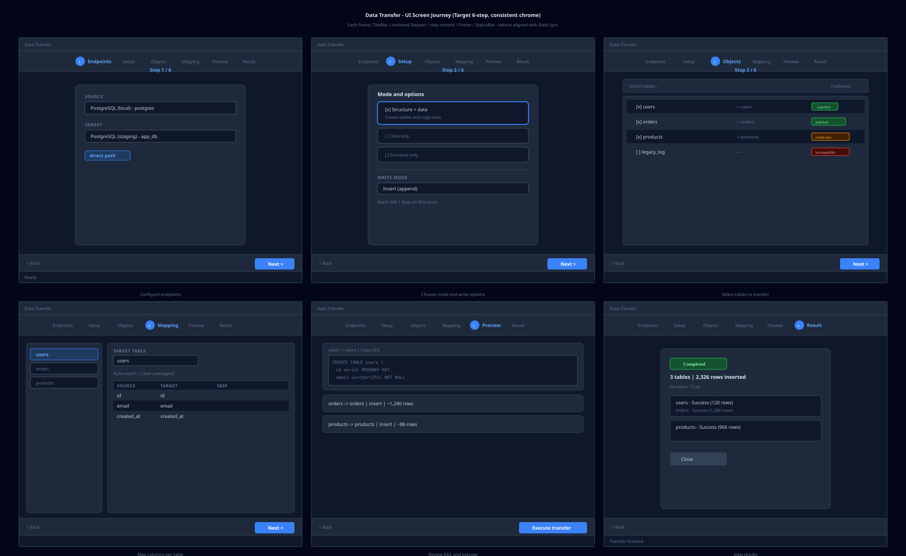
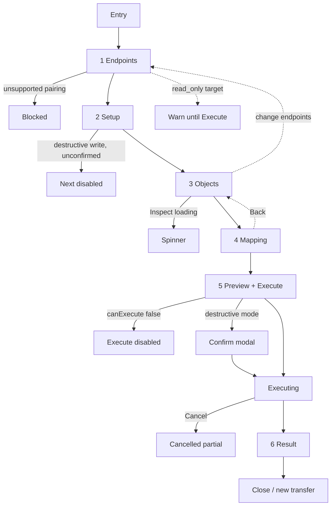
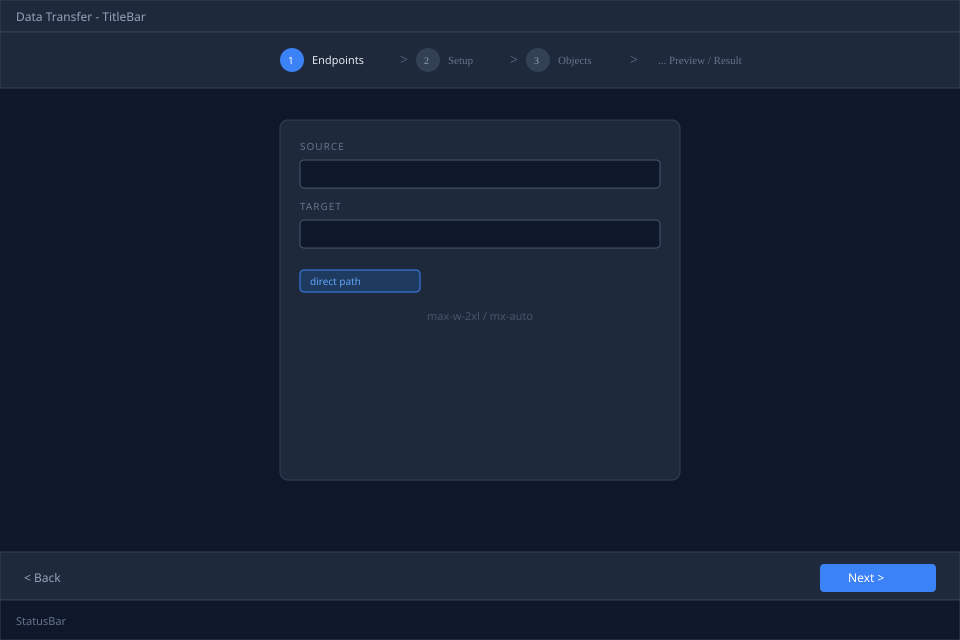
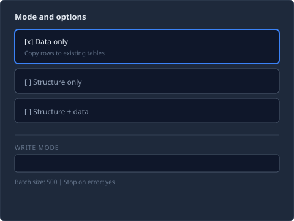
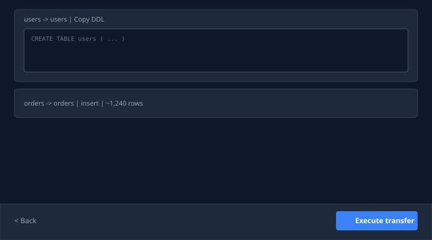
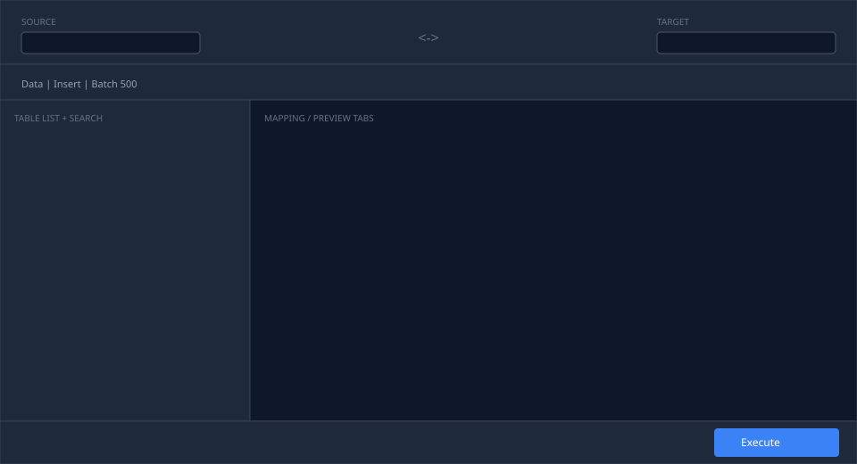

# Data Transfer UI 重构需求（设计规格）

> **状态**：待实施（当前代码保持 8 步向导，不做提前重构）  
> **关联**：[PRD](./data-transfer-prd.zh-CN.md) · [用户手册](./data-transfer-guide.zh-CN.md) · **参照 UI**：[Data Sync 窗口](../architecture/windows.md)（`DataSyncWindow`）

---

## 1. 问题陈述（当前 V1 UI）

用户反馈与内部评审一致，当前 `DataTransferWindow` 存在：

| 问题 | 表现 |
|------|------|
| **配色不统一** | 使用 `bg-bg`、`border-border` 等 token，主应用与 Data Sync 使用 `bg-surface`、`border-edge`、`bg-surface-alt` |
| **布局偏左上** | 内容区 `p-4` 全宽左对齐，窄步骤（Mode / Options / Execute）大量留白 |
| **步骤过碎** | 8 步线性向导，其中 Mode、Options、Execute 单页内容极少 |
| **步骤指示弱** | 顶部纯文字 `1. Source / Target  2. Mode …`，无进度感、不可点击 |
| **与 Sync 割裂** | Sync 为顶栏端点 + 主从布局 + 底栏 Execute；Transfer 仍是独立风格 |

---

## 2. 设计目标

1. **视觉同源**：与 Data Sync / 主连接页使用同一套 surface、edge、accent token。
2. **减少无效步骤**：8 步 → **6 步**（或单页工作台，见 §4 方案）。
3. **内容居中**：配置类步骤使用 `max-w-*` + `mx-auto` 卡片，数据密集步骤使用 `max-w-6xl` 居中宽栏。
4. **操作路径缩短**：Preview 与 Execute 合并；破坏性写入在 Execute 前统一确认 Dialog。
5. **可测试性不变**：保留现有 `data-testid` 语义（可新增，不删除 E2E 依赖项）。

---

## 3. 设计 Token（必须对齐）

| 用途 | ❌ 当前 Transfer | ✅ 目标（与 Sync 一致） |
|------|------------------|-------------------------|
| 窗口背景 | `bg-bg` | `bg-surface` |
| 分隔线 | `border-border` | `border-edge` |
| 卡片/面板 | 无 / 裸边框 | `bg-surface-alt`、`rounded-lg`、`border-edge` |
| 次要文字 | `text-fg-muted` | 保持 |
| 强调 | `text-accent` | 保持 |
| 顶栏/底栏 | 细线 + 小 padding | `px-6 py-3~4`，与 `EndpointsBar` / `ExecuteBar` 一致 |

**禁止**在新 UI 中引入 Transfer 专属色；异构路径 badge 复用 Sync pairing 样式。

---

## 4. 信息架构方案

### 方案 A（推荐，渐进式）：改进型 6 步向导

合并步骤，保留向导心智，改动面小于 Sync 单页。

| 新步骤 | 合并自 | 内容 |
|--------|--------|------|
| **1. Endpoints** | endpoints | 源/目标连接 + database；路径 badge |
| **2. Setup** | mode + options | 传输模式 + 写入选项 + batch/stopOnError |
| **3. Objects** | objects | 表列表（增强：搜索、status 图标、行数） |
| **4. Mapping** | mapping | 现有 `TransferMappingStep` |
| **5. Preview** | preview + execute | DDL / write plan + **底栏 Execute** |
| **6. Result** | result | 结果汇总 |

**移除独立 Execute 步**：Execute 按钮固定在 Preview 底栏（与 Sync `ExecuteBar` 一致）。

### 方案 B（长期）：Sync 式单页工作台

```
┌─ EndpointsBar（常驻）────────────────────────────────────┐
├─ OptionsBar（mode + write mode + batch）─────────────────┤
├─ 左：TableListPanel │ 右：Mapping / Preview tab ────────┤
└─ ExecuteBar（Compare/Inspect 改为 Load Tables + Execute）┘
```

方案 B 复用 `data-sync/` 组件模式，工作量大，建议在 A 稳定后再做。

**本规格以下 wireframe 按方案 A 绘制。**

---

## 5. 布局规格

### 5.1 整体结构

```
┌ TitleBar ────────────────────────────────────────────────┐
├ Stepper（水平居中，max-w-4xl mx-auto）────────────────────┤
├ Content（flex-1 overflow-auto）──────────────────────────┤
│     ┌─ 内容容器 mx-auto ─────────────────────────────┐   │
│     │  窄步骤: max-w-2xl  │  宽步骤: max-w-6xl      │   │
│     └────────────────────────────────────────────────┘   │
├ Footer Nav（border-t border-edge px-6 py-3）─────────────┤
└ StatusBar ───────────────────────────────────────────────┘
```

- **窄步骤**（Endpoints、Setup）：单卡居中，最小高度 `min-h-[280px]`，垂直居中或 `py-8`。
- **宽步骤**（Objects、Mapping、Preview、Result）：`w-full max-w-6xl mx-auto px-6`。

### 5.2 Stepper 组件

- 水平 **居中**（`justify-center`），非左对齐。
- 每步：圆形序号 + 短标签；当前步 `bg-accent text-white`；已完成 `bg-accent/20 text-accent`；未到 `bg-surface-raised text-fg-muted`。
- 步骤间 `ChevronRight` 或细线连接。
- 保留 `data-testid="data-transfer-step-{id}"`。
- **V1 可不点击跳转**；V1.1 可允许回跳已完成步骤。

### 5.3 Footer

- 左：`Back`（ghost）
- 右：`Next`（非 Preview）或 `Execute transfer`（Preview 步，主色）
- Preview 执行中：同排显示 `Cancel`
- 与 Sync `ExecuteBar` 同高、同 padding。

---

## 6. 各步骤 UI 要求

### 6.1 Endpoints（居中卡片）

- 两列 grid（md+），标签样式对齐 Sync：`text-[11px] font-semibold uppercase tracking-wider text-fg-muted`。
- 中央或下方显示 pairing path badge（direct / ir / unsupported）。
- read_only 警告用 `text-warning` 条带，非裸文本。

### 6.2 Setup（Mode + Options 合并）

- 单卡 **max-w-2xl mx-auto**，内部分两区：
  - **传输模式**：三选一 radio **卡片**（非裸 radio list），每卡含标题 + 一行说明。
  - **写入选项**：Write mode Select、破坏性确认、batch size、stop on error。
- 破坏性确认未勾选时，Footer Next 禁用。

### 6.3 Objects

- 全宽表格列表，`border-edge rounded-lg`。
- 列：checkbox | 源表 | → 目标表 | status 徽章 | 行数（若有）。
- 顶栏：搜索框 +「全选 / 仅兼容表」。
- Status 人类可读（非裸 `MATCHED`），颜色：success / warning / danger。

### 6.4 Mapping

- 保持左表列表 + 右 `ColumnMappingEditor`。
- 子组件 `border-border` 全部改为 `border-edge`。

### 6.5 Preview + Execute

- DDL 块：`border-edge`，编辑器区 `bg-surface-alt`。
- 底部固定 **Execute**（不在下一步进入空 Execute 页）。
- `blockReason` 用 alert 条（`bg-warning/10 border-warning`）。
- 破坏性 write mode：Execute 前 **Modal 确认**（列出将 TRUNCATE/DROP 的表）。

### 6.6 Result

- 居中卡片汇总：总行数、耗时（待后端）、partial/cancelled 徽章。
- 每表一行，失败可展开错误 + 复制。

---

## 7. 完整 User Journey（UI 截图 Storyboard）



**主交付物（UI 截图式，逐步一致 chrome）：** [wireframe-user-journey-screens.svg](./data-transfer-ui/wireframe-user-journey-screens.svg)

6 帧窗口 mockup，每帧统一包含：

- TitleBar（`Data Transfer`）
- **居中 Stepper**（当前步高亮 accent）
- 步骤内容区（窄步居中卡片 `max-w-2xl`；宽步 `max-w-6xl`）
- Footer（Back / Next 或 Execute transfer）
- StatusBar

| 帧 | 步骤 | 屏幕内容 | 独立 SVG |
|----|------|----------|----------|
| 1 | Endpoints | 源/目标连接 + database + path badge | [screen-01-endpoints.svg](./data-transfer-ui/screen-01-endpoints.svg) |
| 2 | Setup | Mode 卡片 + Write mode + batch/stopOnError | [screen-02-setup.svg](./data-transfer-ui/screen-02-setup.svg) |
| 3 | Objects | 搜索栏 + 表列表 + status 徽章 | [screen-03-objects.svg](./data-transfer-ui/screen-03-objects.svg) |
| 4 | Mapping | 左表列表 + 右 Column Mapping Editor | [screen-04-mapping.svg](./data-transfer-ui/screen-04-mapping.svg) |
| 5 | Preview | DDL 块 + write plans；Footer **Execute transfer** | [screen-05-preview.svg](./data-transfer-ui/screen-05-preview.svg) |
| 6 | Result | 汇总 + 每表结果 + Close | [screen-06-result.svg](./data-transfer-ui/screen-06-result.svg) |

> 流程图（门闸/异常路径）见 [wireframe-user-journey.svg](./data-transfer-ui/wireframe-user-journey.svg)；本 Storyboard 仅展示**主路径 UI 外观**。

### 7.0 入口

| 入口 | 行为（当前 V1） | 目标（V1.1） |
|------|-----------------|--------------|
| Tools → Data Transfer | 打开空向导 | 同左 |
| 连接树右键 → Data Transfer | 打开空向导 | **预填 Source**（connection + database + 可选表） |

### 7.0.1 主路径（目标 6 步）



### 7.0.2 门闸与阻断

| 检查点 | 条件 | UI 行为 |
|--------|------|---------|
| Pairing | SQL↔Redis、unsupported type | 目标禁用 + reason |
| Endpoints | target `read_only` | 警告条；Execute 禁用 |
| Setup | truncate/drop write mode | 须勾选破坏性确认；否则 Next 禁用 |
| Objects | 未选表 | Next 禁用 |
| Preview | `preview.canExecute === false` | 显示 blockReason；Execute 禁用 |
| Execute | 同连接同库同表自覆盖 | 阻断 + 错误 Dialog |
| Execute | 破坏性写入 | Execute 前 Modal 二次确认 |

### 7.0.3 异常与恢复

- **端点变更**：清空 tables/preview，Objects 重新 Inspect
- **Inspect / Preview 失败**：Dialog + 复制；Objects inline Retry（目标）
- **执行 Cancel**：partial + cancelled 徽章
- **stopOnError**：首错停止 vs 继续（partial result）

### 7.0.4 V1（8 步）vs 目标（6 步）

| V1 现状 | 目标态 |
|---------|--------|
| Mode、Options 独立 | 合并 Setup |
| 空 Execute 页 | Preview 底栏 Execute |
| 无进度面板 | Progress Modal（P0） |
| 右键不预填 | 预填 Source（P0） |

---

## 8. Wireframe（SVG）

独立 SVG 文件位于 `docs/features/data-transfer-ui/`：

| 文件 | 说明 |
|------|------|
| [wireframe-overall.svg](./data-transfer-ui/wireframe-overall.svg) | 方案 A 整体框架（6 步向导） |
| [wireframe-setup.svg](./data-transfer-ui/wireframe-setup.svg) | Setup 步（Mode + Options 合并） |
| [wireframe-preview-execute.svg](./data-transfer-ui/wireframe-preview-execute.svg) | Preview 步 + 底栏 Execute |
| [wireframe-single-page.svg](./data-transfer-ui/wireframe-single-page.svg) | 方案 B 单页工作台（长期） |
| [wireframe-user-journey-screens.svg](./data-transfer-ui/wireframe-user-journey-screens.svg) | **UI 截图 Storyboard（6 步主路径）** |
| [wireframe-user-journey.svg](./data-transfer-ui/wireframe-user-journey.svg) | 流程图（门闸 / 异常路径） |

### 8.1 整体框架（方案 A）



### 8.2 Setup 步（Mode + Options 合并，居中）



### 8.3 Preview 步（含底栏 Execute）



### 8.4 方案 B 单页工作台（长期参考）



---

## 9. 交互与状态

| 交互 | 要求 |
|------|------|
| Next 禁用 | 与现逻辑一致；Setup 破坏性未确认禁用 |
| Loading | 步骤内居中 spinner + 文案（Inspect / Preview） |
| 端点变更 | 清空 tables/preview，Toast「需重新加载表列表」 |
| Execute | Preview 底栏；执行中 Progress Modal（P0 backlog） |
| 错误 | 保留 Dialog + 复制；Objects 步增加 inline retry |

---

## 10. 验收标准（UI）

- [ ] 无 `bg-bg` / `border-border` 残留（Transfer 目录内 grep 为零）
- [ ] Endpoints / Setup 内容区在 1280×820 下视觉居中，左右留白对称
- [ ] 步骤数 ≤ 6；无独立 Execute 空白页
- [ ] Stepper 水平居中，当前步可识别
- [ ] 现有 Vitest / E2E 更新或通过（`data-transfer-step-setup` 等 id 迁移有清单）
- [ ] 与 Data Sync 并排截图对比，无明显「两套产品」感

---

## 11. 实施顺序建议

1. **Token 替换**（纯 CSS，无步骤变更）— 半天  
2. **布局 + Stepper 居中** — 1 天  
3. **合并 Setup + Preview/Execute** — 1–2 天  
4. **Objects 列表增强** — 1 天  
5. **Execute 确认 Dialog + Progress** — 2 天  
6. （可选）方案 B 单页 — 独立里程碑  

---

## 12. 相关文件（实施时）

| 文件 | 改动 |
|------|------|
| `src/windows/data-transfer/DataTransferWindow.tsx` | 主布局、步骤合并、Footer |
| `src/windows/data-transfer/TransferMappingStep.tsx` | token |
| `src/windows/data-transfer/ColumnMappingEditor.tsx` | token |
| `src/locales/en.ts` / `zh-CN.ts` | `transfer.step.setup` 等 |
| `e2e/specs/data-transfer-window.ts` | 步骤 id 迁移 |
| `docs/features/data-transfer-guide.zh-CN.md` | 步骤说明同步 |
