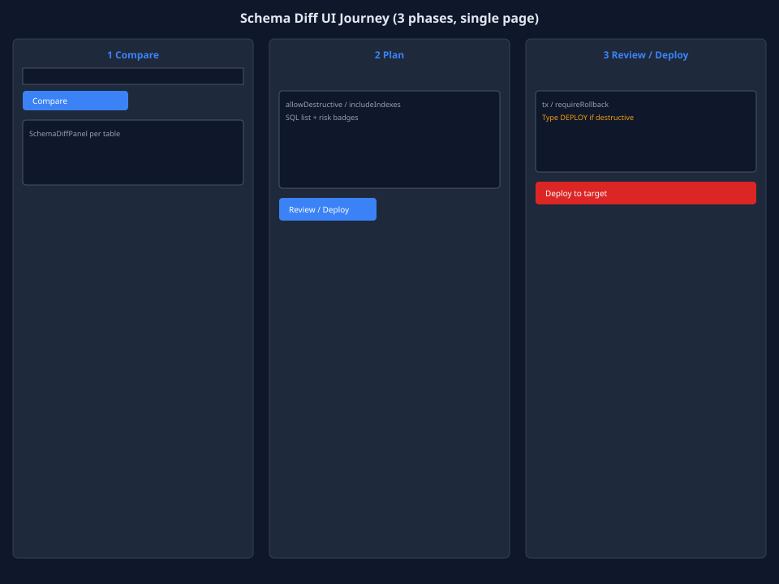
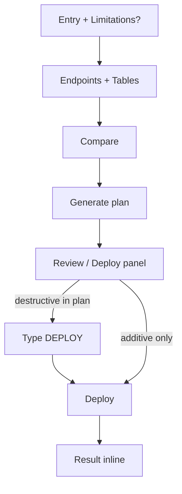

# Schema Diff UI 重构需求（设计规格）

> **状态**：待实施（当前代码保持单页三阶段滚动，不做提前大重构）  
> **关联**：[UI 审查报告](./schema-diff-ui-review.zh-CN.md) · [用户手册](./schema-diff-guide.zh-CN.md) · [Deploy 速览](./schema-diff-deploy.md) · **参照 UI**：[Data Transfer 重构](./data-transfer-ui-redesign.zh-CN.md) · [Data Sync 窗口](../architecture/windows.md)

---

## 1. 问题陈述（当前 UI）

| 问题 | 表现 |
|------|------|
| **配色不统一** | 窗口根节点 `bg-canvas`；Transfer/Sync 已统一 `bg-surface` |
| **端点区简陋** | 仅连接 Select，无 database/schema、无 swap（Sync/Transfer 均有或规划中） |
| **步骤指示弱** | 纯文字面包屑 `Compare → Plan → Review`，无圆形 stepper |
| **操作条分散** | Compare / Generate / Copy / Export 混排，无分区 |
| **Deploy 按钮不一致** | `SchemaDiffDeployPanel` 使用原生 `<button>`，非 `Button` 组件 |
| **与迁移工具割裂** | 限制弹窗 WIP 已对齐 Transfer；整体布局仍像独立工具 |
| **帮助链接漂移** | BookOpen 落到文档 Sync 章节 |

**不改为问题（保留）：**

- 单页滚动 + 三阶段（对比 DDL 计划需并排阅读，不适合 Transfer 式分页）
- `DEPLOY` token 确认（比 Execute Modal 更适合逐条审 SQL）

---

## 2. 设计目标

1. **视觉同源**：与 Data Sync / Data Transfer 使用同一套 surface、edge、accent token。
2. **结构保持单页**：**不**改为 6 步向导；增强 stepper 外观与 EndpointsBar。
3. **内容居中**：端点区与空态使用 `max-w-4xl mx-auto`；diff/plan 列表 `max-w-6xl`。
4. **端点能力补齐**：连接 + 目标库 + schema（PG/MySQL）；可选 Source↔Target swap。
5. **安全 UX 不变**：`allowDestructive` + `DEPLOY` token + rollback 完整性 gate 保留。
6. **可测试性**：保留并扩展 `data-testid`（E2E 已覆盖 SD-*）。

---

## 3. 设计 Token（必须对齐）

| 用途 | ❌ 当前 Schema Diff | ✅ 目标（与 Transfer/Sync 一致） |
|------|---------------------|----------------------------------|
| 窗口背景 | `bg-canvas` | `bg-surface` |
| 分隔线 | 部分已 `border-edge` | 全部 `border-edge` |
| 卡片/面板 | `bg-surface` 混用 | `bg-surface-alt` + `rounded-lg` |
| 端点标签 | `text-fg-secondary` | `text-[11px] font-semibold uppercase tracking-wider text-fg-muted` |
| 主操作 | 原生 button（Deploy） | `Button variant="primary|danger"` |
| Stepper | 文字 `→` | 圆形序号 + Chevron（3 步，非 6 步） |

---

## 4. 信息架构方案

### 方案 A（推荐）：对齐式单页三阶段

**保持 Compare → Plan → Review/Deploy 心智**，仅升级 chrome 与端点区。

```
┌ TitleBar（Schema Diff + Help）─────────────────────────────┐
├ Stepper（3 步，居中 max-w-4xl）Compare · Plan · Review ────┤
├ EndpointsBar（sticky 或首屏卡片，max-w-4xl mx-auto）───────┤
│   Source conn + db + schema │ Target conn + db + schema │ ⇄ │
├ Tables + ActionBar（max-w-6xl）────────────────────────────┤
├ Scroll Content ────────────────────────────────────────────┤
│   · Diff cards (SchemaDiffPanel)                             │
│   · Plan card (SchemaDiffPlanPanel)                          │
│   · Deploy card (SchemaDiffDeployPanel, step=review)         │
└ StatusBar ───────────────────────────────────────────────────┘
```

| 阶段 | 用户目标 | UI 区块 |
|------|----------|---------|
| **Compare** | 看列/索引差异 | Diff 卡片列表 |
| **Plan** | 审阅 SQL + 选项 | Plan 面板 + 语句 risk badge |
| **Review / Deploy** | 确认并执行 | Deploy 面板 + 结果 |

**与 Transfer 对齐点：** EndpointsBar 样式、Stepper 视觉、Limitations 弹窗、surface token。  
**与 Transfer 不同点：** 无 Footer Next/Back；阶段由内容展开驱动（生成计划 → 点 Review → Deploy）。

### 方案 B（长期）：Sync 式双栏

```
EndpointsBar（常驻）
├ 左：表列表 + diff 摘要
└ 右：Plan SQL 编辑器 tab + Deploy 抽屉
```

工作量大；建议在方案 A 稳定、E2E 全绿后再评估。

**本规格 wireframe 按方案 A 绘制。**

---

## 5. 布局规格

### 5.1 整体结构

```
┌ TitleBar ────────────────────────────────────────────────┐
├ Stepper（水平居中，3 步）──────────────────────────────────┤
├ EndpointsBar（max-w-4xl mx-auto，md:grid-cols-2）──────────┤
├ Tables + Actions（max-w-6xl mx-auto）──────────────────────┤
├ Content scroll（flex-1 overflow-auto px-6 py-4）──────────┤
│     Diff cards / Plan / Deploy（stacked, gap-4）           │
└ StatusBar ───────────────────────────────────────────────┘
```

- 无固定 Footer（Deploy 在 Deploy 卡片内，非底栏 Execute）。
- Limitations 弹窗：首次打开，pattern 同 Transfer。

### 5.2 Stepper（3 步）

- 水平居中；步骤：**Compare** · **Plan** · **Review**
- 当前步 `bg-accent text-white` 圆标；已完成 `bg-accent/20`；未到 `bg-surface-raised`
- 保留语义 id：`data-testid="schema-diff-step-{compare|plan|review}"`
- V1 **不可点击跳转**；滚动到对应区块时可高亮（V1.1）

### 5.3 EndpointsBar（新增/增强）

对齐 Sync `EndpointsBar` / Transfer Endpoints 步：

| 字段 | Source | Target |
|------|--------|--------|
| 连接 | Select | Select |
| Database | Select（dedicated session 拉库列表） | Select |
| Schema | Select（若驱动支持） | Select（可选，默认同 source） |
| Swap | 中央 ⇄ 按钮交换源/目标 | |

- 不能选同一连接（沿用 `sync.cannotSame`）
- 跨方言时显示 path hint（`schemaDiff.crossDialectNote` 已有）

### 5.4 ActionBar

分组排列，避免一行过长：

| 组 | 按钮 |
|----|------|
| 主路径 | **Compare** (primary) · **Generate plan** (secondary) |
| 复制 | Copy summary · Copy SQL（有 plan 时显示） |
| 配置 | Export config · Import config |

---

## 6. 各阶段 UI 要求

### 6.1 Compare

- 表名 textarea：`font-mono`，placeholder 支持 `schema.table` 限定
- 空态：未对比时居中提示「选择端点并填写表名后 Compare」
- Diff 卡片：`border-edge rounded-lg bg-surface-alt`；表名 `font-mono`
- 复用 `SchemaDiffPanel`；变更列继续用 `sync.colChanged`

### 6.2 Plan

- 选项区：`allowDestructive`（warning 色）、`includeIndexes`
- 「重新生成计划」为 ghost/link 样式
- 语句列表：每条 SQL monospace + risk badge（additive / destructive / rewrite）
- 跨方言 note：`text-fg-muted` 条带
- 底部 **Review / Deploy** → `setStep('review')` 并滚动到 Deploy 区

### 6.3 Review / Deploy

- 目标摘要卡：`bg-surface-alt`
- 事务 checkbox：PG/SQLite 可勾选；MySQL 禁用 + hint
- `requireRollback` + 不完整 rollback 列表
- 含 destructive/rewrite：**输入 `DEPLOY`**（保留 token，**不**改为 Transfer Execute Modal）
- Deploy：`Button variant="danger"`，`data-testid="schema-diff-deploy"`
- 结果：status + executedCount + errors 列表

### 6.4 Limitations 弹窗

- 已实现 WIP；实施后确保与 Transfer 相同 Dialog chrome
- localStorage：`datazen:schema-diff-limitations-dismissed`

---

## 7. User Journey（Storyboard）



| 帧 | 阶段 | 屏幕内容 |
|----|------|----------|
| 1 | Compare | EndpointsBar + 表名 + Compare + Diff 卡片 |
| 2 | Plan | Plan 选项 + SQL 列表 + Review/Deploy 按钮 |
| 3 | Review | Deploy 选项 + DEPLOY 输入 + Deploy 结果 |

### 7.1 主路径



### 7.2 门闸与阻断

| 检查点 | 条件 | UI |
|--------|------|-----|
| Endpoints | 同源同连接 | 错误 inline |
| Compare | 无表名 | Compare 禁用 |
| Plan | 无表 | Generate 禁用 |
| Plan | 空 plan | emptyPlan 文案 |
| Deploy | requireRollback 且 incomplete | Deploy 禁用 |
| Deploy | destructive 且 confirm ≠ DEPLOY | Deploy 禁用 |
| Deploy | 0 statements | Deploy 禁用 |

---

## 8. Wireframe（SVG）

| 文件 | 说明 |
|------|------|
| [wireframe-overall.svg](./schema-diff-ui/wireframe-overall.svg) | 单页整体框架 |
| [wireframe-user-journey-screens.svg](./schema-diff-ui/wireframe-user-journey-screens.svg) | 三阶段 Storyboard |


---

## 9. 与 Data Transfer 对齐矩阵

| 项 | Transfer（已实施） | Schema Diff 目标 |
|----|-------------------|------------------|
| 步骤数 | 6 步 wizard | **3 阶段单页**（不改） |
| bg-surface | ✅ | 待改 |
| Stepper 视觉 | 圆形 6 步 | 圆形 **3** 步 |
| Endpoints | 连接 + database | 连接 + database + **schema** |
| Limitations 弹窗 | ✅ | ✅（WIP 已合） |
| 破坏性确认 | Execute Modal | **DEPLOY token**（保留） |
| E2E suite | `e2e:data-transfer` | `e2e:schema-diff` ✅ |

---

## 10. 验收标准（UI）

- [ ] 根节点无 `bg-canvas`；Schema Diff 目录内 token 与 Transfer 一致
- [ ] Stepper 三步骤水平居中、当前步可识别
- [ ] EndpointsBar 含 database（+ schema P1）
- [ ] Deploy 使用 `Button`，destructive 时用 `variant="danger"`
- [ ] 现有 SD-* E2E 全通过；新增 testid 有对应用例
- [ ] 与 Transfer 窗口并排截图，无明显两套产品感
- [ ] 帮助链接指向 Schema Diff 专章（非 `#sync`）

---

## 11. 实施顺序建议

| 阶段 | 内容 | 估时 |
|------|------|------|
| 1 | Token 替换（`bg-surface`、Deploy Button） | 0.5d |
| 2 | Stepper 组件化（3 步） | 0.5d |
| 3 | EndpointsBar（database Select） | 1d |
| 4 | ActionBar 分组 + 空态 | 0.5d |
| 5 | Schema Select + swap（P1） | 1–2d |
| 6 | 文档/help 链接 + i18n-sync | 0.5d |

**不建议**纳入本里程碑：改为 6 步 wizard、Deploy Execute Modal、Sync 式双栏（方案 B）。

---

## 12. 相关文件（实施时）

| 文件 | 改动 |
|------|------|
| `src/windows/schema-diff/SchemaDiffWindow.tsx` | 布局、EndpointsBar、Stepper、token |
| `src/windows/schema-diff/SchemaDiffPlanPanel.tsx` | token、testid |
| `src/windows/schema-diff/SchemaDiffDeployPanel.tsx` | Button 组件 |
| `src/lib/windowManager.ts` / `docsUrls.ts` | 帮助 deep link |
| `src/locales/en.ts` / `zh-CN.ts` | endpoints/schema 文案 |
| `e2e/specs/schema-diff-*.ts` | EndpointsBar 交互 |
| `docs/features/schema-diff-guide.zh-CN.md` | JSON v2、端点说明 |

---

## 13. 与审查报告的关系

- [schema-diff-ui-review.zh-CN.md](./schema-diff-ui-review.zh-CN.md) — **现状**与差距分析  
- **本文档** — **目标态**规格与 wireframe，供实施与 subagent 轨道拆分
