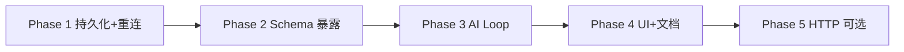

# MCP Client → AI Chat 集成实现计划

> **For agentic workers:** 实现本计划时 REQUIRED SUB-SKILL: `superpowers:subagent-driven-development`（推荐）或 `superpowers:executing-plans`。任务使用 checkbox（`- [ ]`）跟踪进度。

**Goal:** 将 DataZen 内置 MCP Client（连接外部 MCP Server）完整接入 AI Chat 工具调用链路，使 Settings 中配置的外部 MCP 工具可被 LLM 在对话中自动发现、调用，并持久化配置、应用重启后自动重连。

**Architecture:** 在现有 `McpClientManager`（stdio 子进程）与 `run_streaming_tool_loop`（AI tool loop）之间增加命名空间化的工具注册与路由层；配置写入 `AppSettings` 持久化，启动时 auto-reconnect；UI 层分离「已保存配置」与「运行时连接态」。HTTP transport 作为后续 Phase，不在 MVP 范围。

**Tech Stack:** Tauri v2 / Rust (`rmcp` 2.2) / React 18 / Zustand / `packages/ai-api` ToolDefinition 协议

**文档日期:** 2026-08-27  
**探索来源:** [MCP Client 集成探索 subagent](dc367b97-2cd1-4ca2-bb2a-bc21118d6a00)

---

## Global Constraints

- Host 测试写在 `src-tauri/`、`src/**/__tests__/`、`e2e/specs/`；驱动专属测试禁止放入 Host
- 新增/变更 Host Settings UI 必须同步更新 `e2e/specs/settings.ts`
- i18n 开发期仅修改 `src/locales/en.ts` 与可选 `src/locales/zh-CN.ts`
- 错误统一走 `CommandError` + `CmdExt`
- 不硬编码驱动类型；MCP Client 与 MCP Server 架构边界保持清晰（见 `docs/architecture/backend/mcp.md`）
- PR 合并前：`pnpm test:unit` + `cargo test -p datazen --lib`

---

## 1. 背景与现状

### 1.1 产品承诺 vs 实现差距

| 来源 | 声明 |
|------|------|
| `README.md` | DataZen AI Chat 可连接外部 MCP Server 扩展能力 |
| `docs/architecture/backend/ai.md` | `ai_chat` 支持 MCP 工具调用 |
| **实际** | 仅 `ask_questions` + 5 个内置 DB tools；MCP Client IPC/UI 存在但未接入 AI |

### 1.2 MCP Server vs MCP Client

| 维度 | MCP Server（出站） | MCP Client（入站） |
|------|-------------------|-------------------|
| 方向 | DataZen 暴露 DB 给 Cursor/Codex | DataZen 连接 filesystem/browser 等外部 MCP |
| 核心代码 | `src-tauri/src/mcp/server.rs` | `src-tauri/src/mcp/client.rs` |
| Settings | `McpSettingsSection.tsx` | `McpClientSection.tsx` |
| 持久化 | `AppSettings.mcp_*` 已有 | **无** |
| AI 关系 | 外部 Agent 直连 DB | **目标：内置 AI Chat 间接调用外部 tools** |

### 1.3 已有实现清单

```
Settings UI (McpClientSection)
    → aiStore (connectMcpServer / callMcpTool / …)
    → src/commands/ai.ts (mcpClient* IPC)
    → src-tauri/src/commands/mcp.rs
    → McpClientManager (stdio only, 内存态)
    → 外部 MCP 子进程
```

**已实现：** connect / disconnect / list / list tools / call_tool（手动 IPC）  
**未实现：** 持久化、启动重连、schema 暴露、AI loop 路由、Chat UI 反馈

### 1.4 关键代码锚点

| 文件 | 符号 | 作用 |
|------|------|------|
| `src-tauri/src/commands/ai.rs:794` | `db_tool_definitions()` | 内置 DB 工具定义（模板） |
| `src-tauri/src/commands/ai.rs:861` | `is_db_tool()` | DB 工具名白名单 |
| `src-tauri/src/commands/ai.rs:872` | `execute_db_tool()` | DB 工具执行 |
| `src-tauri/src/commands/ai.rs:924` | `run_streaming_tool_loop()` | **AI 工具循环（主修改点）** |
| `src-tauri/src/commands/ai.rs:1268` | `ai_chat_impl` tools 组装 | 当前仅 ask_questions + db_tools |
| `src-tauri/src/mcp/client.rs:50` | `McpClientManager` | Client 连接管理 |
| `src-tauri/src/store/settings.rs:42` | `AppSettings` | 无 mcp_client 字段 |

### 1.5 当前 Tool Loop 缺陷（必须修复）

`run_streaming_tool_loop` 逻辑：

1. 收集模型返回的 `tool_calls`
2. 过滤 `is_db_tool(name)` → `db_tools`
3. **若 `db_tools` 为空**：emit done chunk（含 `ask_questions` 等）→ **结束**
4. **若 `db_tools` 非空**：执行 DB tools；**非 DB tool** 写入 `"Pending: waiting for user response."`

**问题：** 若模型同轮调用 DB tool + MCP tool，MCP tool 不会执行，只得到 placeholder。集成 MCP 时必须重构为统一的 tool 分类与并行执行模型。

---

## 2. 目标与非目标

### 2.1 MVP 目标

- [ ] 外部 MCP Server 配置持久化到 `settings.json`
- [ ] 应用启动时对 `enabled` 配置 auto-reconnect（非阻塞，失败可重试）
- [ ] AI Chat（含 `workflow_generate` scenario）注册外部 MCP tools
- [ ] Tool loop 正确路由并执行 MCP tool calls
- [ ] Settings UI：saved configs 管理 + 工具列表预览 + env 编辑
- [ ] Rust 集成测试 + Settings E2E 更新
- [ ] 对齐 `docs/architecture/backend/ai.md` 文档表述

### 2.2 非目标（本计划外）

- HTTP/SSE MCP Client transport（Phase 5 预留）
- NL2SQL / Workflow executor 步骤接入 MCP tools
- MCP Client 权限模型（类比 MCP Server 三档 permission）— MVP 仅全局 enable/disable per server
- Chat 内手动触发 `callMcpTool` 的独立 UI
- 多用户 / 远程部署场景

---

## 3. 设计决策

### 3.1 Tool 命名空间

外部 MCP tool 在 LLM 侧使用 namespaced 名称，避免与 DB tools / `ask_questions` 冲突：

```
mcp/{serverId}/{toolName}
```

示例：`mcp/filesystem/read_file`

**路由解析：**

```rust
enum ToolKind {
    AskQuestions,
    Db(String),           // tool name
    Mcp { server_id: String, tool_name: String },
    Unknown,
}

fn classify_tool(name: &str) -> ToolKind { ... }
```

**约束：**

- `serverId` 只允许 `[a-zA-Z0-9_-]`（与 Settings 表单校验一致）
- `McpToolInfo` 扩展 `qualifiedName: String` 供前端展示

### 3.2 配置持久化

在 `AppSettings` 新增：

```rust
#[serde(default)]
pub mcp_client_servers: Vec<McpServerConfig>,
```

- 与 runtime `McpClientManager` 分离：settings 存「意图」，manager 存「连接态」
- `McpServerConfig.enabled` 参与启动 auto-connect
- 前端 `Settings` 类型同步（`src/types/index.ts` + `settingsStore`）

**不加密：** MCP Client config 不含密钥级数据；`env` 中 API key 与用户自担（与现有 Server 配置一致）。

### 3.3 Tool Schema 暴露

扩展 IPC 返回类型：

```rust
pub struct McpToolInfo {
    pub server_id: String,
    pub server_name: String,
    pub tool_name: String,
    pub qualified_name: String,      // mcp/{serverId}/{toolName}
    pub description: Option<String>,
    pub input_schema: serde_json::Value,
}
```

新增 Host 函数：

```rust
fn mcp_tool_definitions(state: &AppState) -> Vec<ToolDefinition>
```

从 `McpClientManager` 缓存的 `rmcp::model::Tool` 转换；无连接 server 时返回空 vec。

### 3.4 Tool Loop 重构

**新终止条件：**

```
terminal_tools = tool_calls where kind == AskQuestions
executable_tools = tool_calls where kind == Db | Mcp

if executable_tools.is_empty() && !terminal_tools.is_empty():
    emit done with all tool_calls → break  // ask_questions 路径
if executable_tools.is_empty() && tool_calls.is_empty():
    emit done → break                      // 纯文本回复
else:
    execute all executable_tools (DB + MCP in sequence or join)
    push tool results → continue loop
```

**MCP 执行：**

```rust
async fn execute_mcp_tool(
    state: &AppState,
    server_id: &str,
    tool_name: &str,
    arguments: &str,
) -> String
```

- 解析 JSON args → `mcp_client_manager.call_tool()`
- 错误格式：`MCP tool error ({qualified_name}): {msg}`（便于 LLM 自我修正）
- 超时：沿用 Client 层 30s；可选在 loop 层记录 tracing

### 3.5 AI Chat Tools 组装

`ai_chat_impl` 修改：

```rust
let mut all_tools = vec![ask_questions_tool];
if attach_db_tools {
    all_tools.extend(db_tool_definitions());
}
if provider.supports_tools() {
    all_tools.extend(mcp_tool_definitions(&state));
}
```

**Token 预算：** MVP 不截断；若 tools 过多导致 provider 报错，Phase 4 加 per-server `enabledForAi` 或 global tool limit。

### 3.6 Prompt 补充

可选在 `src-tauri/resources/prompts/en/chat.txt` 增加简短说明：

- 外部 MCP tools 以 `mcp/` 前缀命名
- 优先使用 DB tools 查 schema；filesystem 等 MCP tools 用于非 DB 任务

---

## 4. 分阶段任务

### Phase 1：配置持久化与启动重连

**Files:**

- Modify: `src-tauri/src/store/settings.rs` — `AppSettings.mcp_client_servers`
- Modify: `src/types/index.ts` — 前端 Settings 类型
- Modify: `src/stores/settingsStore.ts` — 如有 default 合并逻辑
- Modify: `src-tauri/src/commands/mcp.rs` — save/load configs IPC（或复用 settings save）
- Modify: `src-tauri/src/lib.rs` — 启动 hook auto-connect
- Modify: `src/windows/settings/McpClientSection.tsx` — saved configs CRUD
- Modify: `src/stores/aiStore.ts` — save config + connect 分离
- Test: `src-tauri/src/store/tests.rs` — settings 反序列化默认值
- Test: `src/windows/settings/__tests__/SettingsContent.test.tsx`

- [ ] **Task 1.1:** `AppSettings` 增加 `mcp_client_servers: Vec<McpServerConfig>`，`Default` 为空 vec
- [ ] **Task 1.2:** 前端 Settings 类型与 store 同步；`updateSettings` 可保存 MCP Client 配置列表
- [ ] **Task 1.3:** `McpClientSection` 重构为两区：**已保存配置**（add/edit/delete/toggle enabled）+ **运行时状态**（connected / toolsCount / error）
- [ ] **Task 1.4:** Connect 按钮：save config → `mcp_client_connect`；Disconnect 仅断 runtime，不删 config
- [ ] **Task 1.5:** `lib.rs` setup：读取 `mcp_client_servers`，对 `enabled == true` 项 spawn 非阻塞 connect；失败写 log，不阻塞启动
- [ ] **Task 1.6:** 退出时已有 `disconnect_all()`；确认 save 后 reconnect 行为（改 config 时 disconnect + reconnect）

**验收：**

- 重启应用后 enabled 的 MCP Server 自动连接
- disabled 的不连接
- Settings E2E：`e2e/specs/settings.ts` 覆盖 add/save 流程

---

### Phase 2：Tool Schema 暴露

**Files:**

- Modify: `src-tauri/src/mcp/client.rs` — `McpToolInfo` 扩展 + `qualified_name()` helper
- Modify: `src-tauri/src/commands/mcp.rs` — `mcp_client_tools` 返回 schema
- Modify: `src/types/index.ts` — `McpToolInfo` 前端类型
- Modify: `src/windows/settings/McpClientSection.tsx` — 展示 tools 列表（name + description）
- Test: `src-tauri/src/mcp/client.rs` unit tests

- [ ] **Task 2.1:** `McpToolInfo` 增加 `qualified_name`、`input_schema`
- [ ] **Task 2.2:** `all_tools()` 填充 schema（从 `Tool.input_schema`）
- [ ] **Task 2.3:** Settings UI 连接成功后展示 tool 列表（折叠面板）
- [ ] **Task 2.4:** 新增 `mcp_tool_definitions(state) -> Vec<ToolDefinition>` in `commands/ai.rs`（或 `mcp/` 模块）

**验收：**

- `mcp_client_tools` IPC 返回完整 schema
- Settings 可见每个外部 tool 的名称与描述

---

### Phase 3：AI Tool Loop 集成（核心）

**Files:**

- Modify: `src-tauri/src/commands/ai.rs` — classify/execute/refactor loop
- Modify: `src-tauri/resources/prompts/en/chat.txt`（+ 可选 `zh-CN` 对应资源若存在）
- Test: `src-tauri/src/commands/ai_integration_tests.rs`
- Test: 新增 `src-tauri/src/commands/ai_mcp_tools_tests.rs`（可选拆分）

- [ ] **Task 3.1:** 实现 `classify_tool(name) -> ToolKind`
- [ ] **Task 3.2:** 实现 `execute_mcp_tool(state, server_id, tool_name, args) -> String`
- [ ] **Task 3.3:** 重构 `run_streaming_tool_loop` — 统一 executable vs terminal 分类
- [ ] **Task 3.4:** `ai_chat_impl` 合并 `mcp_tool_definitions`（`supports_tools()` gate）
- [ ] **Task 3.5:** 确认 `workflow_generate` scenario 走同一 loop（已共享 `ai_chat_impl`）
- [ ] **Task 3.6:** 集成测试 — mock provider 返回 MCP tool call → 验证 routing（需 test double MCP server 或 mock manager）

**Mock MCP Server 测试方案：**

使用最小 stdio echo server（或 `npx @modelcontextprotocol/server-everything` 若 CI 允许）：

```rust
// ai_integration_tests.rs
#[tokio::test]
async fn ai_chat_executes_mcp_tool_when_connected() {
    // 1. connect mock MCP server via McpClientManager
    // 2. wiremock provider returns tool_call: mcp/test_srv/echo
    // 3. assert loop executes and result contains echo output
}
```

**验收：**

- 连接外部 MCP 后，AI Chat 请求中 tools 列表含 `mcp/*` 项
- 模型调用 MCP tool 时得到真实结果，非 "Pending"
- DB tool + MCP tool 同轮均可执行
- `ask_questions` 行为不变

---

### Phase 4：UI 与体验 polish

**Files:**

- Modify: `src/windows/settings/McpClientSection.tsx` — env 编辑、per-server error badge
- Modify: `src/components/ai/AiChatPanel.tsx`（可选）— tool 执行状态
- Modify: `src/locales/en.ts`, `src/locales/zh-CN.ts`
- Modify: `e2e/specs/settings.ts`

- [ ] **Task 4.1:** Settings 表单增加 env key-value 编辑（复用现有 settings UI 模式）
- [ ] **Task 4.2:** 连接失败显示 server 级 error + retry 按钮
- [ ] **Task 4.3:**（可选）Chat 流式阶段显示 "Calling mcp/…" 系统消息
- [ ] **Task 4.4:** i18n 新增 keys：`mcpClient.savedConfigs`, `mcpClient.toolList`, `mcpClient.reconnect`, `mcpClient.connectFailed` 等

**验收：**

- E2E 覆盖 MCP Client section 完整 add-env-connect 路径
- Vitest Settings 单测通过

---

### Phase 5：HTTP Transport（后续，不在 MVP）

**前提调研：**

- `rmcp 2.2.0` client HTTP feature 名称（当前 Cargo.toml 仅有 `transport-streamable-http-server`）
- Tauri CSP / 本地 loopback 策略

**改动概要：**

- `McpServerConfig` 增加 `url`, `headers`
- `McpClientManager::connect()` 分支 stdio | http
- UI transport 选择器
- Codex/Cursor 式 remote server 可复用同一 config 结构

---

## 5. 文件变更矩阵

| 文件 | Phase | 变更类型 |
|------|-------|----------|
| `src-tauri/src/store/settings.rs` | 1 | 新增字段 |
| `src-tauri/src/mcp/client.rs` | 2, 5 | 扩展类型 / HTTP |
| `src-tauri/src/commands/mcp.rs` | 1, 2 | IPC + schema |
| `src-tauri/src/commands/ai.rs` | 2, 3 | definitions + loop |
| `src-tauri/src/lib.rs` | 1 | startup reconnect |
| `src/types/index.ts` | 1, 2 | 类型 |
| `src/stores/aiStore.ts` | 1 | save/connect 分离 |
| `src/stores/settingsStore.ts` | 1 | defaults |
| `src/windows/settings/McpClientSection.tsx` | 1, 2, 4 | UI |
| `src/components/ai/AiChatPanel.tsx` | 4 | 可选 tool 状态 |
| `src/locales/en.ts` | 4 | i18n |
| `src/locales/zh-CN.ts` | 4 | i18n |
| `docs/architecture/backend/ai.md` | 4 | 对齐文档 |
| `docs/architecture/backend/mcp.md` | 4 | Client AI 集成小节 |
| `e2e/specs/settings.ts` | 1, 4 | E2E |
| `src-tauri/src/commands/ai_integration_tests.rs` | 3 | 集成测试 |

---

## 6. 测试计划

### 6.1 Rust 单元测试

| 测试 | 文件 | 内容 |
|------|------|------|
| `classify_tool` 各分支 | `ai.rs` 或 `ai_mcp_tools_tests.rs` | db / mcp / ask / unknown |
| `mcp_tool_definitions` 空/非空 | 同上 | 无连接 → 空 vec |
| settings 默认值 | `store/tests.rs` | `mcp_client_servers` default [] |
| McpToolInfo schema 序列化 | `mcp/client.rs` | camelCase 字段 |

### 6.2 Rust 集成测试

| 测试 | 内容 |
|------|------|
| `ai_chat_mcp_tool_roundtrip` | mock provider + mock MCP → 执行成功 |
| `ai_chat_mcp_and_db_same_round` | 同轮 DB + MCP 均执行 |
| `ai_chat_ask_questions_unchanged` | 回归 ask_questions 终止路径 |

### 6.3 前端单测

| 测试 | 内容 |
|------|------|
| `aiStore.test.ts` | save config、connect、load tools with schema |
| `SettingsContent.test.tsx` | saved configs CRUD、env 表单 |

### 6.4 E2E

`e2e/specs/settings.ts`：

- 导航到 MCP Client section
- 添加 server config（command + args）
- 验证列表出现（不要求真实 MCP 进程连接成功，可 mock 或使用固定 test server）

### 6.5 手工验证清单

- [ ] 连接 `@modelcontextprotocol/server-filesystem`，Chat 中让 AI 读文件
- [ ] 重启应用，enabled server 自动重连
- [ ] 断开 network MCP，Chat 调用返回可读错误
- [ ] Provider 不支持 tools 时不注册 MCP tools

---

## 7. 风险与缓解

| 风险 | 严重度 | 缓解 |
|------|--------|------|
| Tool 名冲突 | 高 | 强制 `mcp/{serverId}/{toolName}` 前缀 |
| 混合 tool call 轮次 bug | 高 | Phase 3 重构 loop + 集成测试 |
| 启动变慢（多 MCP 子进程） | 中 | 非阻塞 connect；并行 spawn |
| Token 超限（tools 过多） | 中 | Phase 4 加 per-server AI enable |
| MCP 输出非 text | 中 | MVP 仅 text；日志 warn 其他 content type |
| 安全（任意 MCP tool） | 中 | MVP：用户显式 add server；文档警示 |
| 文档/product 不一致 | 低 | Phase 4 更新 architecture docs |

---

## 8. 实施顺序与依赖



**建议 PR 拆分：**

1. PR-1: Phase 1（持久化 + Settings UI）— 可独立合并
2. PR-2: Phase 2 + Phase 3（AI 集成）— 核心功能
3. PR-3: Phase 4（polish + E2E + docs）

---

## 9. 执行入口

计划完成后，执行选项：

1. **Subagent-Driven（推荐）** — 每个 Phase/Task 派独立 subagent，任务间 review
2. **Inline Execution** — 单会话按 checkbox 顺序实现，Phase 边界 checkpoint

**Worktree：** 多功能开发可使用 `scripts/new-feature-worktree.sh mcp-client-ai` 隔离分支。

---

## 10. 附录：相关 IPC 命令索引

| 命令 | 方向 | 现有/新增 |
|------|------|-----------|
| `mcp_client_connect` | Client | 现有 |
| `mcp_client_disconnect` | Client | 现有 |
| `mcp_client_list` | Client | 现有 |
| `mcp_client_tools` | Client | 扩展 schema |
| `mcp_client_call_tool` | Client | 现有；AI loop 内部也会调用 |
| `mcp_client_save_configs` | Client | **新增（或 merge settings）** |
| `ai_chat` | AI | 修改 tools 组装 |

---

## 11. 附录：类型草案

### Rust — `McpServerConfig`（已有，Persisted）

```rust
// src-tauri/src/mcp/client.rs
pub struct McpServerConfig {
    pub id: String,
    pub name: String,
    pub transport: String,       // MVP: "stdio"
    pub command: Option<String>,
    pub args: Vec<String>,
    pub env: HashMap<String, String>,
    pub enabled: bool,
}
```

### TypeScript — Settings 扩展

```typescript
// src/types/index.ts — AppSettings 或 Settings 接口
mcpClientServers?: McpServerConfig[];
```

### Tool Qualified Name 示例

| serverId | toolName | qualified_name |
|----------|----------|----------------|
| `filesystem` | `read_file` | `mcp/filesystem/read_file` |
| `browser` | `navigate` | `mcp/browser/navigate` |
