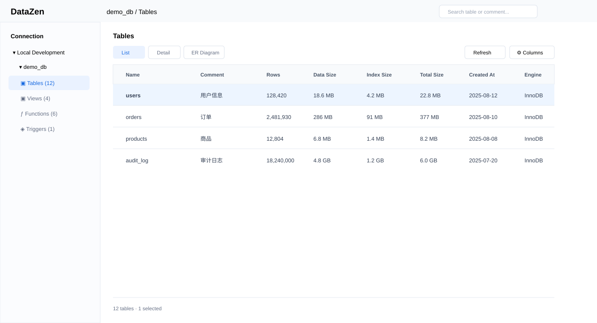
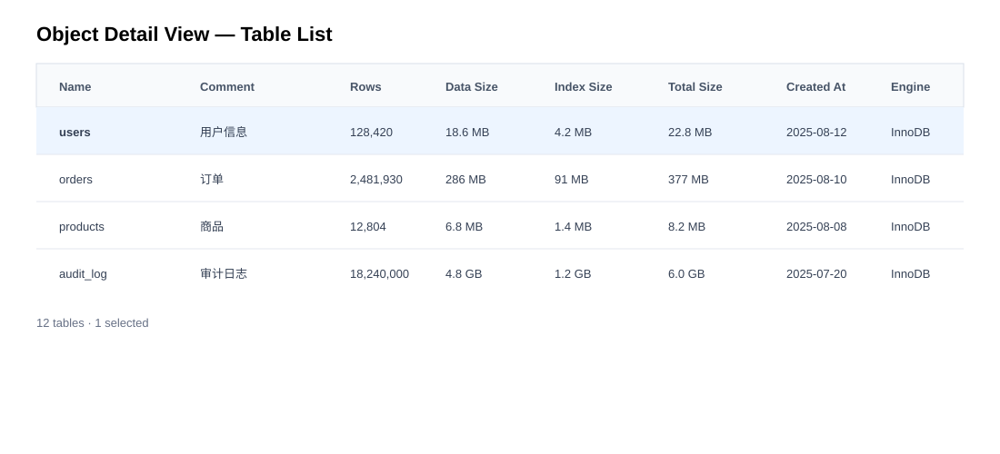
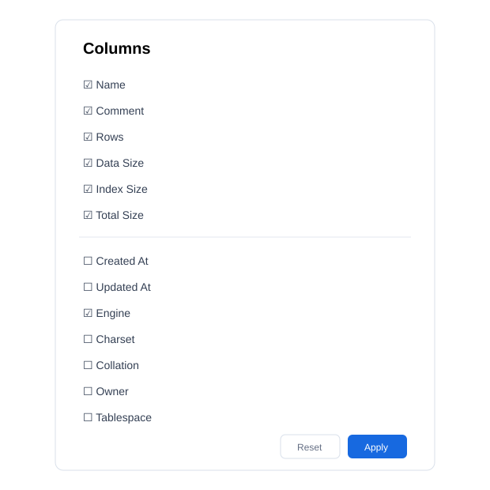

# Object Detail View

## 1. 概述
为数据库对象提供「列表 / 详情 / ER 图」三种查看方式。本 PRD 聚焦 Object Detail View：以二维表格集中展示对象名称、注释、行数、数据大小、索引大小、总大小、创建时间、更新时间、存储引擎等信息，并支持自定义列。

## 2. 用户与场景
- DBA：数据库资产盘点、容量检查、对象排查。
- 开发：快速确认表规模、注释、更新时间。
- 测试：确认测试库对象及数据规模。

核心场景：查看 Database 下全部对象；按名称/注释搜索；按行数、大小、时间排序；自定义字段；选中对象查看右侧详情；从清单直接打开表、查看数据、编辑结构、生成 SQL、导出。

## 3. 信息架构
- List：传统对象列表。
- Detail：二维对象清单，本 PRD。
- ER Diagram：对象关系图。

### 默认字段
| 字段 | 默认 | 说明 |
|---|---|---|
| Name | ✓ | 对象名称 |
| Comment | ✓ | 对象注释 |
| Rows | ✓ | 行数 |
| Data Size | ✓ | 数据大小 |
| Index Size | ✓ | 索引大小 |
| Total Size | ✓ | 总大小 |
| Created At | - | 创建时间 |
| Updated At | - | 更新时间 |
| Engine | ✓ | 存储引擎 |
| Charset | - | 字符集 |
| Collation | - | 排序规则 |
| Owner | - | 所有者 |
| Tablespace | - | 表空间 |

不同数据库根据驱动能力返回可用字段；不可获取的字段不显示为空列。

## 4. 原型
### 4.1 完整页面

布局：

    ┌─────────────────────────────────────────────────────────────────────┐
    │ demo_db / Tables                         Search       Columns       │
    ├──────────┬──────────┬─────────┬─────────┬─────────┬────────────────┤
    │ Name     │ Comment  │ Rows    │ Data    │ Index   │ Total Size     │
    ├──────────┼──────────┼─────────┼─────────┼─────────┼────────────────┤
    │ users    │ 用户信息 │ 128,420 │ 18.6 MB │ 4.2 MB  │ 22.8 MB        │
    │ orders   │ 订单     │ 2.48 M  │ 286 MB  │ 91 MB   │ 377 MB         │
    │ products │ 商品     │ 12,804  │ 6.8 MB  │ 1.4 MB  │ 8.2 MB         │
    │ audit_log│ 审计日志 │ 18.2 M  │ 4.8 GB  │ 1.2 GB  │ 6.0 GB         │
    └──────────┴──────────┴─────────┴─────────┴─────────┴────────────────┘

### 4.2 对象清单核心表格

### 4.3 列设置

列设置：显示/隐藏、恢复默认、即时生效、按对象类型保存、拖拽调整列顺序；不支持的数据库字段不出现在候选列表。

## 5. 交互
### 搜索
- 支持对象名称和对象注释。
- 实时过滤当前对象列表。

### 排序
可排序：Name、Rows、Data Size、Index Size、Total Size、Created At、Updated At。
点击表头依次为升序、降序、恢复默认顺序。

### 选择
- 单击：选中对象并刷新右侧详情。
- Cmd/Ctrl + 单击：多选。
- Shift + 单击：范围选择。
- 双击：打开对象默认操作。
- 右键：对象 Context Menu。

### 批量操作
多选后支持导出、生成 SQL、刷新、删除；删除需要二次确认。

### 列宽
- 拖动表头分隔线调整列宽。
- 双击自动适配。
- 最小列宽 80px。
- Name 列优先保证完整可读。

## 6. 右侧详情面板
选中单个对象后展示：
- 基本信息：Comment、Rows、Data Size、Index Size、Total Size、Engine、Charset、Collation、Created At、Updated At。
- Tabs：基本信息、索引、分区、DDL。
- 快速操作：打开表、查看数据、编辑表结构、生成 SQL、导出、刷新。

## 7. 数据获取
Detail View 只负责展示和交互，元数据由数据库驱动 / Core 能力提供。

统一对象元数据模型建议：

    interface DatabaseObjectSummary {
      name: string
      comment?: string
      rowCount?: number
      dataSize?: number
      indexSize?: number
      totalSize?: number
      createdAt?: string
      updatedAt?: string
      engine?: string
      charset?: string
      collation?: string
      owner?: string
      tablespace?: string
    }

数值字段保存原始数值，UI 自动格式化 B / KB / MB / GB / TB；行数使用千分位。

## 8. 状态
- Loading：Skeleton。
- Empty：显示「暂无表」。
- Error：显示「加载对象信息失败」并提供「重试」。
- Partial Metadata：对象继续展示，不可用字段显示 `—`。

## 9. 性能要求
- 首屏优先展示对象名称。
- 元数据查询不得阻塞整个对象树。
- 大量对象支持分页或虚拟列表。
- 排序优先在 Core 查询层完成，无法下推时使用客户端排序。
- 刷新只重新获取当前对象类型。

## 10. 验收标准
- [ ] Table 节点可以切换到 Detail View。
- [ ] 默认显示 Name、Comment、Rows、Data Size、Index Size、Total Size、Engine。
- [ ] 支持搜索 Name / Comment。
- [ ] 支持主要数值和时间字段排序。
- [ ] 支持自定义列显示/隐藏。
- [ ] 支持拖拽调整列顺序和调整列宽。
- [ ] 单击对象可以刷新右侧详情。
- [ ] 右侧详情包含基本信息、索引、分区、DDL。
- [ ] 对象清单支持右键菜单和多选批量操作。
- [ ] 不同数据库只展示驱动实际支持的字段。
- [ ] 元数据获取失败时有明确错误状态。
- [ ] 大对象数量场景下列表滚动流畅。

## 11. 非目标
- 新增数据库对象编辑能力。
- 新增 Schema Diff。
- 新增 Data Sync。
- 新增 ER Diagram 编辑能力。
- 自动分析数据库性能问题。

## 12. 原型文件
- [object-detail-screen.svg](./object-detail-screen.svg)：完整页面原型。
- [object-detail-list.svg](./object-detail-list.svg)：对象清单核心表格原型。
- [object-detail-columns.svg](./object-detail-columns.svg)：列设置原型。