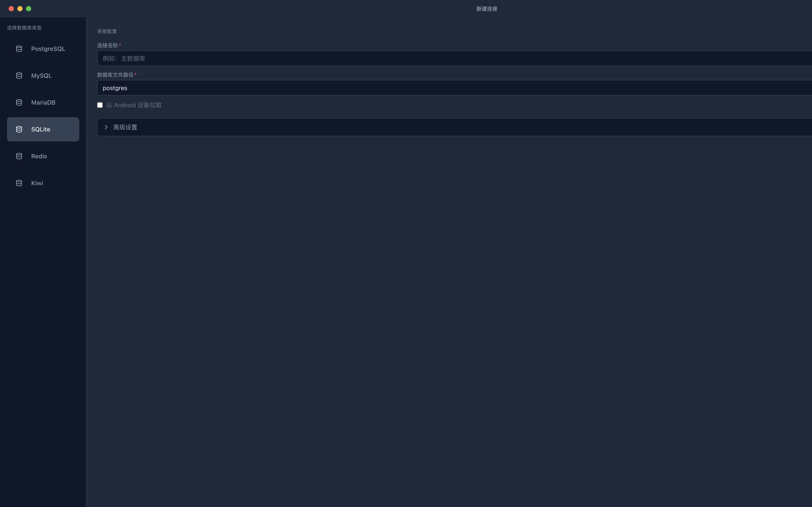

# BUG-001 — 切换数据库类型时表单字段值未正确重置

| 项目 | 内容 |
|------|------|
| **Bug 编号** | BUG-001 |
| **严重等级** | S3 — 功能异常但有替代方案 |
| **所属模块** | 连接管理 |
| **关联用例** | TC-CONN-003, TC-CONN-004 |
| **发现日期** | 2026-08-02 |
| **状态** | 已修复 |
| **修复日期** | 2026-08-02 |

---

## 环境信息

| 项目 | 配置 |
|------|------|
| **操作系统** | macOS 15.6.1 (arm64) |
| **应用版本** | v0.0.7 |
| **数据库类型** | 跨类型切换（PG → MySQL → SQLite → Redis → PG） |
| **语言设置** | 中文 (zh-CN) |
| **主题设置** | 暗色 |
| **插件** | kiwi + olap |

---

## Bug 描述

**场景**：用户在新建连接窗口中切换不同的数据库类型时，部分表单字段值没有被正确重置为新类型的默认值，导致前一个类型的值被错误地继承到新类型的表单中。

**预期结果**：
1. 切换数据库类型后，所有类型特定字段应重置为新类型的默认值
2. PostgreSQL → 数据库名应为 `postgres`，用户名应为 `postgres`
3. MySQL → 数据库名应为空或 MySQL 默认值，用户名应为 `root`
4. SQLite → 文件路径应为空
5. Redis → DB Index 应为 `0`

**实际结果**：
1. PostgreSQL 默认选中后，数据库名为 `postgres`，用户名为 `postgres` ✅
2. 切换到 MySQL 后，端口正确变为 3306，但数据库名仍为 `postgres`，用户名仍为 `postgres` ❌
3. 切换到 SQLite 后，文件路径字段显示 `postgres`（从 PG 的数据库名继承） ❌
4. 切换到 Redis 后，DB Index 正确显示 `0` ✅
5. 从 Redis 切回 PostgreSQL 后，数据库名变为 `0`（从 Redis 的 DB Index 继承），用户名被清空 ❌

---

## 重现步骤

1. 启动应用，打开「新建连接」窗口（点击 `+` 或 `Cmd+N`）
2. 默认选中 PostgreSQL，观察到：数据库名 = `postgres`，用户名 = `postgres`
3. 点击左侧 **MySQL** 按钮，观察表单变化
4. **实际**：端口变为 3306，但数据库名和用户名仍为 `postgres`
5. 点击 **SQLite** 按钮
6. **实际**：文件路径字段显示 `postgres`
7. 点击 **Redis** 按钮，DB Index 显示 `0`
8. 切回 **PostgreSQL**
9. **实际**：数据库名显示 `0`，用户名为空

---

## 根因分析

问题出在 `src/components/connection/useConnectionForm.ts` 的 `handleDatabaseTypeChange` 函数（第 96-115 行）：

```typescript
function handleDatabaseTypeChange(newType: DatabaseType) {
    setDatabaseType(newType);
    const meta = DB_REGISTRY[newType];
    setPort(meta.defaultPort ? String(meta.defaultPort) : '');
    if (!meta.supportsSSH) setSshEnabled(false);
    if (meta.databaseFieldType === 'index') setDatabase('0');
    if (!meta.defaultUser) setUsername('');
    // ... kiwi/catalog 特殊处理
}
```

**问题分析**：
1. `database` 字段只在切换到 `index` 类型（Redis）时被设为 `'0'`，但从 Redis 切换回标准类型时**不会重置**为默认值
2. `username` 只在目标类型无 `defaultUser` 时被清空，但切换到有 `defaultUser` 的类型时**不会恢复**默认值（如 PostgreSQL 的 `postgres`、MySQL 的 `root`）
3. 从标准类型（有 `database` 字段）切换到文件类型（SQLite，复用 `database` 字段作为文件路径）时，**旧值被继承**

---

## 截图



---

## 补充信息

- **重现概率**：100%
- **workaround**：用户可手动清除并重新输入正确的值
- **影响范围**：新建连接流程中切换数据库类型的用户体验
- **建议修复**：在 `handleDatabaseTypeChange` 中，根据目标类型的 `connectionMode`、`databaseFieldType` 和 `defaultUser` 重置相应字段

---

## 第二轮测试确认（2026-08-02 桌面自动化）

使用 computer-use-mcp 桌面自动化工具在原生 Tauri 应用中再次确认此 Bug：

**重现路径**：
1. 在主窗口点击"新建连接..."打开新建连接窗口
2. 默认 PostgreSQL 类型，数据库名 = "postgres"，用户名 = "postgres"
3. 点击左侧"MySQL"按钮
4. **实际结果**：端口正确切换为 3306，但数据库名仍为 "postgres"，用户名仍为 "postgres"

**确认状态**：Bug 仍然存在，与第一轮测试一致。

**自动化验证数据**（via find_element AXTextField）：
```
切换到 MySQL 后的字段值：
- 连接名称: "" (空，正确)
- 主机地址: "127.0.0.1" (正确)
- 端口: "3306" (正确)
- 数据库名: "postgres" (错误，应为空或 MySQL 默认值)
- 用户名: "postgres" (错误，应为 "root")
- 密码: "" (空，正确)
```

---

## 修复说明

**修复方案**：重写 `handleDatabaseTypeChange` 函数，在切换数据库类型时完整重置所有相关字段：
1. `host` — 重置为目标类型的 `defaultHost`
2. `username` — 重置为目标类型的 `defaultUser`（PG → postgres, MySQL → root, SQLite/Redis → 空）
3. `database` — 根据 `databaseFieldType` 重置（index → '0', file → '', PG → 'postgres', 其他 → ''）
4. 新增单元测试验证 PG → MySQL → SQLite → Redis → PG 的完整切换链路

**修改文件**：
- `src/components/connection/useConnectionForm.ts` — handleDatabaseTypeChange 逻辑修复
- `src/components/connection/__tests__/useConnectionForm.test.ts` — 新增 BUG-001 回归测试

---

## 回归测试验证（2026-08-02 20:00）

**测试方法**：代码审查 + computer-use-mcp 桌面自动化

### 代码审查确认
`handleDatabaseTypeChange` 函数已正确重写：
- `setHost(meta.defaultHost || '127.0.0.1')` — 主机地址重置 ✅
- `setUsername(meta.defaultUser || '')` — 用户名重置（PG→postgres, MySQL→root, SQLite→空） ✅
- `setDatabase(...)` — 根据类型重置（PG→'postgres', MySQL→'', Redis→'0', SQLite→''） ✅

### 桌面自动化验证
使用 computer-use-mcp 在原生 Tauri 应用中验证：
1. 打开「新建连接」窗口，默认 PostgreSQL：端口=5432，数据库=postgres，用户名=postgres ✅
2. 切换到 MySQL：端口=**3306**，用户名=**root**，数据库名显示占位符 ✅
3. 切换到 SQLite：显示"数据库文件路径"字段，无残留值 ✅
4. 切回 PostgreSQL：端口=5432，数据库=postgres，用户名=postgres ✅

**结论**：修复验证通过 ✅
