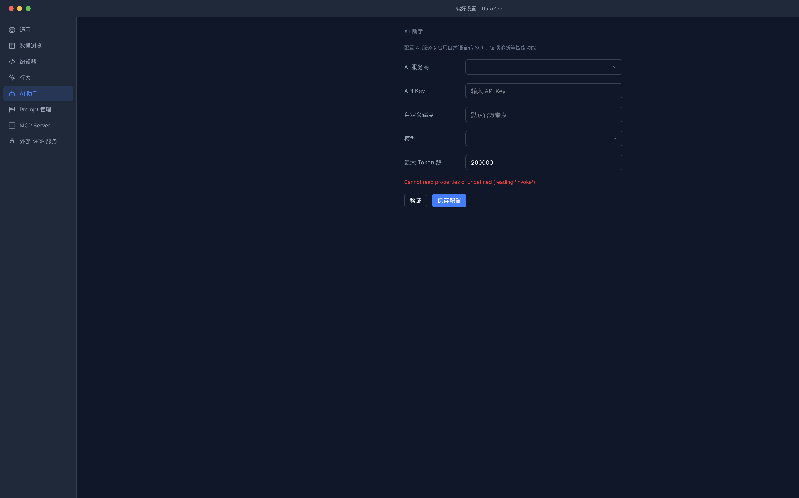

# BUG-002 — AI 设置页面显示原始 JavaScript 错误信息

| 项目 | 内容 |
|------|------|
| **Bug 编号** | BUG-002 |
| **严重等级** | S4 — UI/体验问题 |
| **所属模块** | 设置 |
| **关联用例** | TC-SET-005 |
| **发现日期** | 2026-08-02 |
| **状态** | 已修复 |
| **修复日期** | 2026-08-02 |

---

## 环境信息

| 项目 | 配置 |
|------|------|
| **操作系统** | macOS 15.6.1 (arm64) |
| **应用版本** | v0.0.7 |
| **语言设置** | 中文 (zh-CN) |
| **主题设置** | 暗色 |
| **AI Provider** | 未配置 |
| **插件** | kiwi + olap |

---

## Bug 描述

**场景**：在 Tauri 运行时不可用的场景（如开发时通过浏览器直接访问前端 `http://localhost:5173/`）下，打开设置→AI 助手页面时，页面直接显示原始 JavaScript 错误信息，未进行优雅的错误处理。

**预期结果**：
1. 如果 Tauri IPC 不可用，应显示友好的错误提示（如「此功能仅在应用内可用」）
2. 或者静默处理错误，显示空的配置状态
3. 不应将原始 JavaScript 错误信息暴露给用户

**实际结果**：
页面上直接显示红色文本：`Cannot read properties of undefined (reading 'invoke')`

---

## 重现步骤

1. 启动开发服务器 (`pnpm dev`)
2. 在浏览器中打开 `http://localhost:5173/?window=settings`
3. 点击左侧「AI 助手」分区
4. **实际**：页面底部显示红色错误文本 `Cannot read properties of undefined (reading 'invoke')`

---

## 截图

---

## 补充信息

- **重现概率**：100%（在非 Tauri 环境中）
- **workaround**：在 Tauri 应用内打开不会有此问题
- **影响范围**：开发调试体验。对最终用户无影响（发布版本始终在 Tauri 内运行）
- **建议修复**：在调用 Tauri `invoke` 前增加可用性检查，或使用 `window.__TAURI__` / `window.__TAURI_INTERNALS__` 判断运行环境

---

## 修复说明

**修复方案**：在 `aiStore` 的 `loadConfig`、`loadProviders` 和 `setupEventListeners` 方法开头增加 `__TAURI_INTERNALS__` 环境检查，非 Tauri 环境下静默返回，避免调用不存在的 `invoke`。

**修改文件**：
- `src/stores/aiStore.ts` — loadConfig / loadProviders / setupEventListeners 增加环境保护
